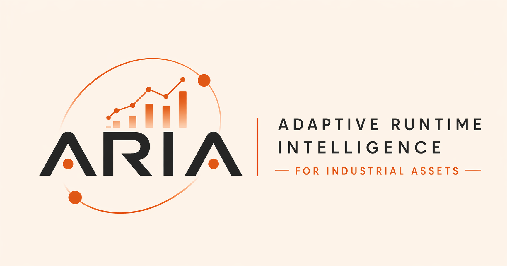
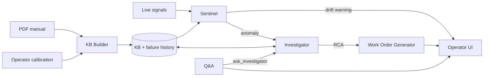
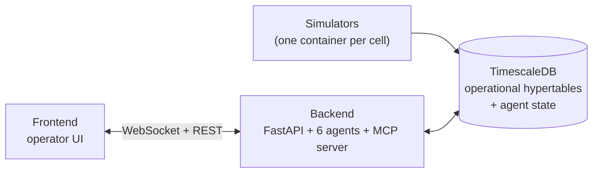

<br />

<div align="center">

[](https://github.com/zestones/ARIA/actions/workflows/ci.yml)
[](https://docs.docker.com/)
[](https://www.python.org/)
[](https://react.dev/)
[](https://www.timescale.com/)

</div>

> Predictive maintenance that configures itself. Upload a manufacturer's PDF, calibrate with the floor operator and ARIA watches the equipment from there — forecasting drift before it crosses a threshold, opening a work order the moment a real anomaly fires, running root-cause analysis with extended thinking, and answering operator questions in natural language. Generative-UI artifacts (charts, diagnostic cards, work orders) stream into the operator's chat as the agents work.

Built for the **"Build With Opus 4.7"** hackathon. Open source, MIT licensed.

---

## The problem ARIA solves

Configuring predictive maintenance takes 3–6 months and costs €50k–€500k per site. 95% of industrial plants can't afford it. The floor operator already knows when the machine will fail — they hear it. That knowledge never makes it into a system.

**ARIA is the bridge:** manual reader → operator-calibrated KB → multi-agent watcher → work order generator. Six months becomes ten minutes.

---

## What ARIA does



- **KB Builder** — reads the manufacturer PDF with Opus vision, calibrates thresholds with the operator through a short dialogue.
- **Sentinel** — breach detection loop; also runs forecast on signal tails and emits drift warnings before a breach occurs.
- **Investigator** — root-cause analysis with extended thinking + Python sandbox; reads and writes failure history.
- **Work Order Generator** — turns the RCA into actions, parts list, and intervention window.
- **Q&A** — natural-language operator chat; hands off to the Investigator when a deep diagnosis is needed.

---

## Quickstart

Three commands stand the entire stack up:

```bash
cp .env.example .env        # fill in ANTHROPIC_API_KEY and JWT_SECRET_KEY
make install                # one-time: backend venv + frontend node_modules (for IDE intellisense)
make up                     # docker compose: db + migrations + 4 simulators + backend + frontend
```

Open the operator UI:

| Service     | URL                                                      | Notes                   |
|-------------|----------------------------------------------------------|-------------------------|
| Frontend    | [http://localhost:5173](http://localhost:5173)           | hot module reload       |
| Backend API | [http://localhost:8000](http://localhost:8000)           | OpenAPI docs at `/docs` |
| Database    | `localhost:5432` (`aria` / `aria_dev_password` / `aria`) | TimescaleDB             |

Default seeded users — pick one to log in:

| Username   | Password      | Role     |
|------------|---------------|----------|
| `admin`    | `admin123`    | admin    |
| `operator` | `operator123` | operator |
| `viewer`   | `viewer123`   | viewer   |

Source is bind-mounted from the host into both backend and frontend containers — every edit reloads instantly without a rebuild.

> [!NOTE]
> The first `make up` builds the simulator, backend, and frontend images. Allow two to three minutes on a cold cache. Subsequent starts are seconds.

---

## How it runs



The simulators write `machine_status`, `production_event`, and `process_signal_data` rows into TimescaleDB at one-Hertz. The backend reads from the same database through a 14-tool MCP surface (the agents' only path to data) and pushes events to the frontend over a WebSocket bus.

Two simulator modes ship out of the box:

- **`SIMULATOR_MODE=realtime`** (default). Cells idle near nominal; drift is barely visible over a thirty-minute rehearsal. Demo endpoints inject scenario spikes on cue.
- **`SIMULATOR_MODE=demo`**. Compresses a seventy-two-hour failure scenario into roughly four minutes wall-clock. The Bottle Filler's bearing-wear vibration crosses the alert threshold on its own — useful for a hands-off rehearsal loop.

The full simulator engine and per-cell scenario walkthrough live in [docs/architecture/08-simulators.md](docs/architecture/08-simulators.md).

---

## Stack

**Backend.** FastAPI on Python 3.12, asyncpg, Pydantic, FastMCP. `black` + `flake8` + `pyright` enforce the contract.

**Database.** TimescaleDB (PostgreSQL with hypertables) for the operational time series. JSONB columns on the agent-facing tables, validated at every write through Pydantic mirrors.

**Agents.** Anthropic Python SDK against Claude Opus 4.7 (reasoning + PDF vision) and Sonnet (routine tool work). The Investigator runs on Claude Managed Agents with hosted MCP and a sandboxed Python container; everything else runs on the Messages API.

**Frontend.** React + TypeScript + Vite, Tailwind, TanStack Query. Biome for lint and format.

**Simulators.** Python with asyncpg. One container per monitored cell. Markov state machine plus composable signal behaviors — drift, noise, derived signals, fault triggers — driven entirely by per-scenario configuration.

**Infrastructure.** Docker Compose, GitHub Actions CI, optional Cloudflare tunnel for hosted-MCP exposure.

---

## Repository layout

```
ARIA/
├── backend/                FastAPI + agents + MCP server
│   ├── agents/             KB Builder, Sentinel, Forecast, Investigator, WO Generator, Q&A
│   ├── aria_mcp/           FastMCP server — 14 read tools + 1 write tool
│   ├── modules/            Bounded contexts (kb, work_order, signal, kpi, logbook, chat, sandbox, ...)
│   ├── core/               Cross-cutting: ws_manager, thresholds, security, database
│   ├── infrastructure/     SQL migrations + idempotent seeds
│   └── tests/              Unit + integration + e2e smoke
├── frontend/               React app — operator UI
├── simulator/              Standalone Python package — one image, four scenarios
├── docs/                   Architecture, audits, planning, demo, PRD
├── docker-compose.yaml
├── Makefile
└── README.md
```

---

## Documentation

> **[Full documentation index →](docs/README.md)**

### Getting started

- [Quickstart](#quickstart) — clone, run, log in.
- [Product framing (PRD)](docs/ARIA_PRD.md) — the problem, the rubric, the three-minute demo storyline.
- [Architecture overview](docs/architecture/README.md) — system diagram, milestone map, conventions.

### Understanding ARIA

- [Data layer](docs/architecture/01-data-layer.md) — agent-facing JSONB columns and Pydantic mirrors.
- [MCP server](docs/architecture/02-mcp-server.md) — the 14 tools the agents use to read the world.
- [KB Builder](docs/architecture/03-kb-builder.md) — PDF vision extraction and the four-question onboarding dialogue.
- [Sentinel and Investigator](docs/architecture/04-sentinel-investigator.md) — anomaly detection and root-cause analysis.
- [Work Order Generator and Q&A](docs/architecture/05-workorder-qa.md) — work order generation and the operator chat.
- [Forecast-watch](docs/architecture/06-forecast-watch.md) — predictive alerting and pattern enrichment.

### Architecture and reference

- [Managed Agents](docs/architecture/07-managed-agents.md) — hosted agent loop, hosted MCP, sandboxed Python container.
- [Simulators](docs/architecture/08-simulators.md) — Markov engine, signal stack, scenarios, demo vs realtime modes.
- [Operational data and KPIs](docs/architecture/09-kpi-and-telemetry.md) — hypertables and OEE / MTBF / MTTR / quality math.
- [Cross-cutting concerns](docs/architecture/cross-cutting.md) — WebSocket frame catalogue, auth, shared helpers.
- [Architecture decisions](docs/architecture/decisions.md) — the non-obvious choices and why they were made.

---

## Development

`make help` prints the full list. The handful you will actually reach for:

```bash
make up           # bring the full stack up (hot-reload on backend + frontend)
make deploy       # bring the full stack up with cloudflare tunnel for managed agents
make ps           # service status
make logs         # tail logs from every container
make down         # stop everything (including the tunnel if it is running)

make check        # all quality gates (CI parity): black + flake8 + pyright + biome + tsc
make format       # auto-format backend (black) + frontend (biome)
make backend.test # pytest unit suite
make e2e          # end-to-end backend smoke (requires the stack up)
make doctor       # detect dependency drift between manifests and running containers

make db.shell     # psql into the database
make db.reset     # drop volume and re-run migrations + seeds (destroys data — confirms first)
make db.seed      # re-apply the demo seeds idempotently
```

---

## Hosting the Investigator on Anthropic Managed Agents

The Investigator runs on [Claude Managed Agents](docs/architecture/07-managed-agents.md) with a sandboxed Python container for numerical diagnostics. Falls back to Messages API in under five minutes (`INVESTIGATOR_USE_MANAGED=false`).

**1. Generate a path secret.** Anthropic's `mcp_servers` config does not forward custom HTTP headers, so the URL itself is the bearer token.

```bash
echo "ARIA_MCP_PATH_SECRET=$(openssl rand -hex 32)" >> .env
```

**2. Expose `/mcp` via Cloudflare Tunnel.** Two flavours:

*Persistent tunnel (stable hostname).* Create the tunnel in the Cloudflare Zero Trust dashboard mapping a hostname to `http://backend:8000`, then:

```bash
echo "CF_TUNNEL_TOKEN=<token-from-dashboard>" >> .env
make up.tunnel
```

*Quick tunnel (ephemeral URL, no account needed).*

```bash
docker run --rm --network aria_aria cloudflare/cloudflared:latest \
  tunnel --url http://backend:8000
```

Either way, append the path secret to the tunnel URL — that becomes `ARIA_MCP_PUBLIC_URL`:

```bash
ARIA_MCP_PUBLIC_URL=https://<your-tunnel>.trycloudflare.com/mcp/<ARIA_MCP_PATH_SECRET>/
```

Verify with `curl $ARIA_MCP_PUBLIC_URL` — you should see an MCP protocol response, not a 404.

**3. Flip the flag and restart the backend.**

```bash
echo "INVESTIGATOR_USE_MANAGED=true" >> .env
make restart
```

Sentinel-triggered investigations now run on Managed Agents. Flip back to `false` and restart for a sub-five-minute rollback to the Messages API path — both paths share the same external contract.

## Behind the scenes

Curious how we planned and shipped ARIA in one week?
[→ See our project board and roadmap](https://github.com/users/zestones/projects/28)
