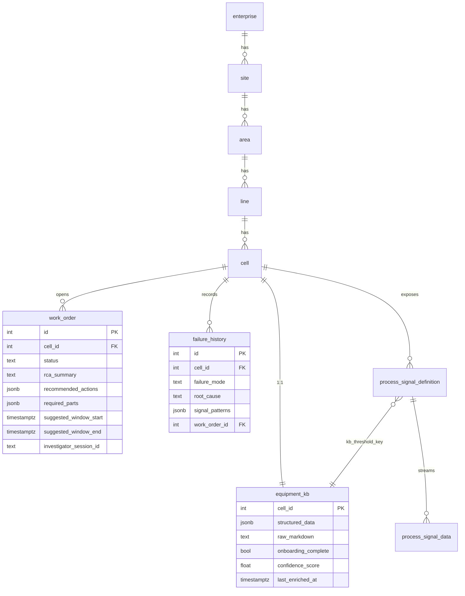
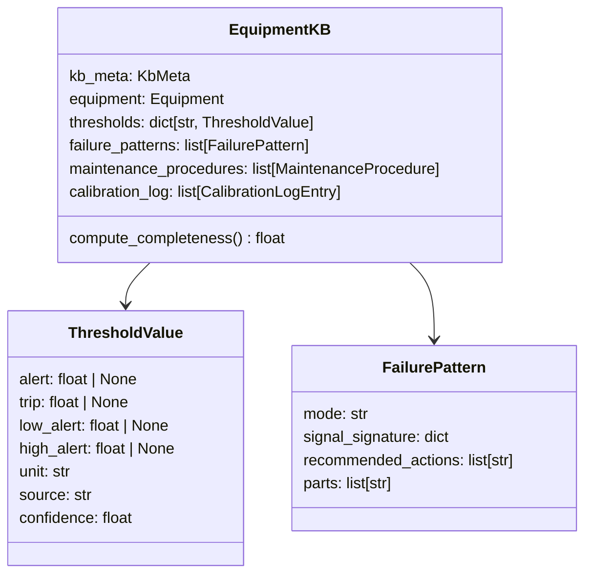
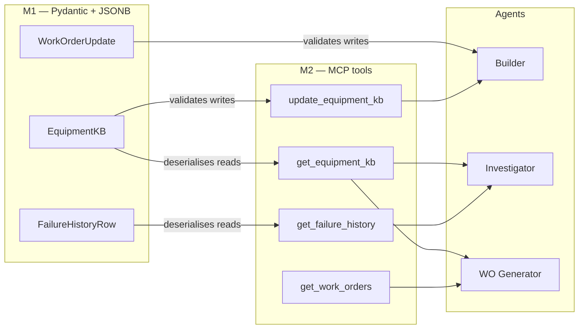

# M1 — Data Layer

> [!NOTE]
> The data layer is the foundation every other milestone depends on. M1 added migration 007, which extends `equipment_kb`, `work_order`, and `failure_history` with the JSONB columns the agents need, and ships the Pydantic schemas that mirror those columns. Migration 008 was added afterwards to enforce per-signal threshold-key integrity at write time.

> [!NOTE]
> This document covers the *agent-facing* tables — the JSONB columns the agents write through Pydantic schemas. The *operational* hypertables (`machine_status`, `production_event`, `process_signal_data`) plus the OEE / MTBF / MTTR / downtime / quality math built on top of them have a dedicated doc at [09-kpi-and-telemetry.md](./09-kpi-and-telemetry.md). The simulators that populate those hypertables are at [08-simulators.md](./08-simulators.md).

---

## Why M1 exists

ARIA's product promise is that the equipment knowledge base, the work order, and the failure history are *first-class structured data* — not free-text fields the agents have to parse out of markdown. M1's job was to give every downstream agent a typed, queryable home for the structured artifacts it produces.

Three columns carry the bulk of the agent-produced state:

- `equipment_kb.structured_data` — the full hybrid profile (manufacturer manual + operator-calibrated thresholds + failure patterns + maintenance procedures). Written by the KB Builder, read by every other agent.
- `work_order.recommended_actions` and `work_order.required_parts` — the structured output of the Work Order Generator that drives the printable Work Order Card.
- `failure_history.signal_patterns` — the per-signal signature of a past failure, used by the Investigator's "memory" scene to recognise recurring failure modes.

Everything in the rest of the system flows through these three columns.

---

## Schema overview



The hierarchy `enterprise → site → area → line → cell` is fixed and seeded. The cell is the unit of monitoring — all agent activity is keyed on `cell_id`.

---

## Migrations

Migrations are SQL files versioned by the `migrate` service in [docker-compose.yaml](../../docker-compose.yaml). The relevant ones for the agent stack:

| Migration                                       | What it adds                                                                                                                                   | Issue            |
|-------------------------------------------------|------------------------------------------------------------------------------------------------------------------------------------------------|------------------|
| `001_initial_schema.up.sql`                     | Hierarchy tables, `equipment_kb` (column-only profile, no JSONB), `work_order`, `failure_history`.                                             | M1               |
| `002_views.up.sql`                              | `current_process_signals` view used by `get_current_signals`.                                                                                  | M1               |
| `003_kpi_system.up.sql`                         | `fn_oee`, `fn_mtbf`, `fn_mttr`, `fn_status_durations` — TimescaleDB functions wrapped by the KPI MCP tools.                                    | M1               |
| `006_aria_seed_p02.up.sql`                      | Canonical P-02 (Grundfos centrifugal pump) seed used by every demo scenario.                                                                   | M1               |
| `007_aria_kb_workorder_extension.up.sql`        | `equipment_kb.structured_data`, `work_order.recommended_actions` / `required_parts` / `suggested_window_*`, `failure_history.signal_patterns`. | M1.1, M1.2, M1.3 |
| `008_kb_threshold_key.up.sql`                   | `process_signal_definition.kb_threshold_key` + the `_assert_thresholds_cover_signal_keys` integrity guard.                                     | #69              |
| `009_work_order_investigator_session_id.up.sql` | `work_order.investigator_session_id` for the Managed Agents persistence story.                                                                 | M5.5             |

> [!IMPORTANT]
> Migration 008 is the most consequential addition after the original M1 plan. It enforces that every signal flagged for monitoring has a corresponding entry in `equipment_kb.structured_data.thresholds` — preventing silent monitoring gaps where a signal is wired to the database but no threshold ever causes a breach. The KB Builder pre-stubs missing entries during PDF extraction to satisfy this guard. See [03-kb-builder.md](./03-kb-builder.md#the-threshold-key-guard).

---

## Pydantic mirrors of the JSONB columns

Each JSONB column has a Pydantic schema that owns its shape. The schemas are the contract LLMs see indirectly via tool descriptions and the contract Pydantic enforces on every write.

### `EquipmentKB` — the structured KB profile

[backend/modules/kb/kb_schema.py](../../backend/modules/kb/kb_schema.py)



Two threshold shapes are supported: single-sided (`alert` / `trip`) for vibration and temperature, and double-sided (`low_alert` / `high_alert`) for flow and pressure. The single source of truth for evaluating either shape against a measurement is [`core.thresholds.evaluate_threshold`](../../backend/core/thresholds.py) — see [04-sentinel-investigator.md](./04-sentinel-investigator.md#threshold-evaluation).

`compute_completeness()` produces the `confidence_score` shown in the UI. The weights (thresholds 0.50, failure_patterns 0.20, procedures 0.20, equipment 0.10) reward operator calibration over raw PDF extraction, which is what drives the demo's "0.40 to 0.85" confidence jump after onboarding.

### `WorkOrderCreate` / `WorkOrderUpdate` — work order writes

[backend/modules/work_order/schemas.py](../../backend/modules/work_order/schemas.py)

```python
Status = Literal["detected", "analyzed", "open", "in_progress", "completed", "cancelled"]
```

The status machine is intentionally short. The agent pipeline only ever writes:

- Sentinel: `detected` (on opening a new work order).
- Investigator: `analyzed` (after a successful `submit_rca`) or remains `detected` if the run timed out.
- Work Order Generator: `open` (after a successful `submit_work_order`) or remains `analyzed` on failure.

Operator transitions (`open → in_progress → completed` or `cancelled`) are out of agent scope and only happen through the REST router.

`recommended_actions` and `required_parts` are typed lists of structured rows. They are never free text — the Work Order Generator emits them through `submit_work_order`, which Pydantic-validates before the row is written.

### `FailureHistoryRow` — the memory store

[backend/modules/logbook/](../../backend/modules/logbook/) and the `failure_history` table.

`signal_patterns` carries the per-signal signature of a past failure (rms vibration trace, peak frequencies, pressure droop, etc.). The Investigator reads the recent rows for the affected cell at the start of every RCA so that recurring failure modes can be recognised quickly. This is what powers the "knowledge does not retire with the senior technician" pitch line.

---

## How M1 plugs into M2 and beyond



Every agent tool that touches one of the three JSONB columns goes through the corresponding Pydantic mirror. There is no path from an agent to the JSONB blob that bypasses the schema — that is what protects the system from LLM-generated data that "almost" matches the contract.

---

## Repository pattern

[backend/modules/kb/repository.py](../../backend/modules/kb/repository.py) — `KbRepository.upsert(payload)` is the canonical write path.

Two non-obvious behaviours are encoded inside the repository (not the MCP tool):

1. **Dynamic SQL.** The `upsert` builds its `UPDATE` clause from whatever fields the payload carries. This keeps the M2 `update_equipment_kb` tool small (it just forwards a dict) and lets the schema add new columns without touching the tool.
2. **The threshold-key guard.** Every `upsert` call invokes `_assert_thresholds_cover_signal_keys` before the SQL executes. A write that would orphan a `kb_threshold_key` is rejected with a `ValidationFailedError`.

This repository owns the integrity of the KB column set; the MCP tool is just an LLM-facing facade.

---

## P-02 canonical seed

The hackathon demo is built around a single canonical cell — `cell_id = 1`, P-02, a Grundfos CR 32-2 centrifugal pump. The seed in [006_aria_seed_p02.up.sql](../../backend/infrastructure/database/migrations/versions/006_aria_seed_p02.up.sql) and the supplemental KB seed in [backend/infrastructure/database/seeds/p02_kb.sql](../../backend/infrastructure/database/seeds/p02_kb.sql) populate:

- The hierarchy chain (enterprise → site → area → line → cell).
- Four signal definitions: `vibration_mm_s`, `bearing_temp_c`, `flow_l_min`, `pressure_bar`. Each has a `kb_threshold_key` that points back to `equipment_kb.structured_data.thresholds`.
- A complete `equipment_kb` row with all four thresholds and a couple of failure patterns.

`make db.seed.p02` re-applies the supplemental KB row idempotently, which is what to run after KB drift during local debugging.

---

## Audits and references

- [docs/audits/M2-mcp-server-audit.md §1](../audits/M2-mcp-server-audit.md) — pre-implementation review of the M2.5 KB tool against the M1 schema. Every "merge semantics" decision recorded there is now encoded in `KbRepository.upsert`.
- [docs/audits/M3-kb-builder-audit.md §7.2](../audits/M3-kb-builder-audit.md) — post-implementation cross-check confirming that `EquipmentKbUpsert` and `KbRepository.upsert` already supported `raw_markdown` and `onboarding_complete` so M3 did not need a schema migration.
- [docs/planning/M1-data-layer/issues.md](../planning/M1-data-layer/issues.md) — original issue plan.

---

## Where to next

- The MCP tools that make this data accessible to agents: [02-mcp-server.md](./02-mcp-server.md).
- The KB Builder agent that fills the structured columns: [03-kb-builder.md](./03-kb-builder.md).
- The Investigator agent that reads `failure_history` to recognise patterns: [04-sentinel-investigator.md](./04-sentinel-investigator.md).
- The simulators that write to the operational hypertables: [08-simulators.md](./08-simulators.md).
- The OEE / MTBF / MTTR / quality math computed from those hypertables: [09-kpi-and-telemetry.md](./09-kpi-and-telemetry.md).
