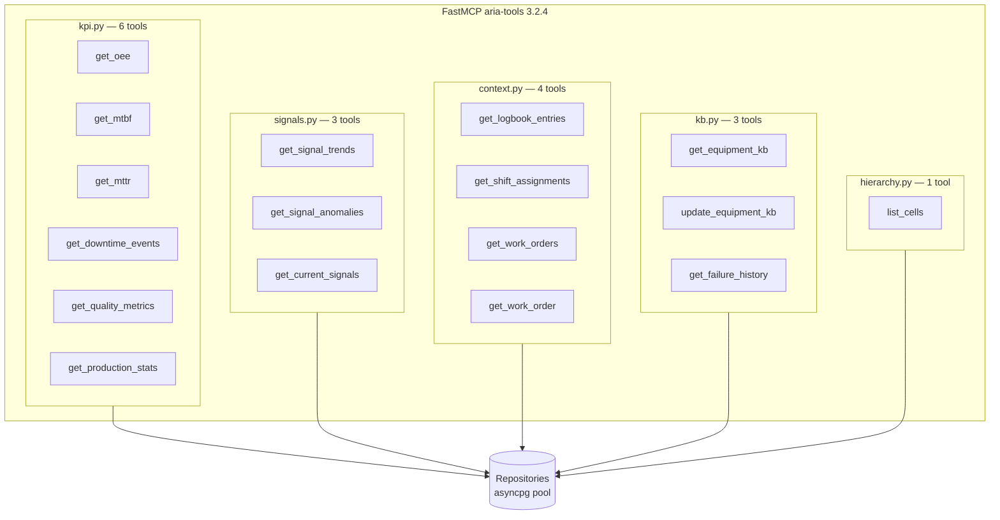
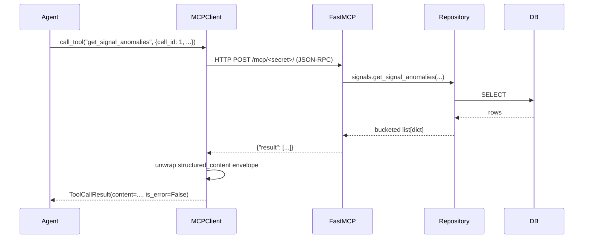

# M2 — MCP Server

> [!NOTE]
> M2 turns the data layer into an LLM-callable tool surface. A FastMCP instance mounted in-process exposes 16 read tools across KPI, signals, human context, KB, and hierarchy domains, plus one write tool (`update_equipment_kb`). The `MCPClient` singleton is the only path agents use to reach data — agents never touch `asyncpg` directly. A second tool family, the local `render_*` schemas, lets agents emit generative-UI artifacts without round-tripping through the database.

---

## Why M2 exists

The product needs five different agents (KB Builder, Sentinel, Investigator, Work Order Generator, Q&A) to read the same data through the same API. Hand-rolling a service layer for each agent would duplicate query logic and split error handling. Instead, M2 declares one tool catalogue, exposed both to the local `MCPClient` (in-process loopback for our own agents) and to external MCP clients such as Claude Desktop or hosted MCP through the public path-secret URL.

The same FastMCP instance also doubles as the integration surface for the hosted Managed Agents path — see [decisions.md](./decisions.md#two-paths-messages-api-vs-managed-agents).

---

## Tool catalogue



The full per-tool contract lives next to each tool decorator in [backend/aria_mcp/tools/](../../backend/aria_mcp/tools/). The most important contracts to know:

- `get_signal_anomalies` — the breach-detection tool. Aggregates consecutive breach samples into structured *breach windows* (one row per contiguous interval) instead of one row per sample. This matters because a single 3-hour query on four signals previously returned 38 000 rows; the windowing fix in [M5.5](../audits/M5.5-end-to-end-test-report.md#4-token-overflow-resolved--context-window-overflow) brought that down to ~28 windows. It is what made hosted MCP economically viable.
- `get_signal_trends` — bucketed time-series with a hard 500-row cap. When the cap fires the response includes `{"_truncated": true, "hint": "..."}` so the LLM knows it needs to narrow its window.
- `update_equipment_kb` — the only write tool. Forwards a JSON Merge Patch (RFC 7396 semantics) plus optional `raw_markdown` and `onboarding_complete` fields to `KbRepository.upsert`. All housekeeping (`calibration_log` append, `kb_meta.version` bump, `confidence_score` recompute, `last_enriched_at` touch) happens inside the repository, not in the tool.

> [!IMPORTANT]
> All read tools take `cell_id: int` (or accept it as a filter). Time windows are ISO 8601 strings with offsets — never naive datetimes. The contract is enforced at the tool boundary so naive timestamps cannot silently produce empty results against TimescaleDB's `timestamptz` columns.

---

## In-process mounting

[backend/main.py](../../backend/main.py) mounts the FastMCP ASGI sub-app at `/mcp/<path-secret>`:

```python
app.mount(f"/mcp/{settings.aria_mcp_path_secret}", mcp_http_app)
```

Two transports use the same mount:

1. **Local loopback** — the `MCPClient` singleton calls `http://localhost:8000/mcp/<secret>/` on every tool call. Round-trip is 5-15 ms. This is the path used by Sentinel, Investigator (Messages API), Work Order Generator, Q&A, and KB Builder.
2. **Public hosted MCP** — Anthropic's hosted Managed Agents harness calls the same mount through the Cloudflare tunnel at `https://aria-backend.vgtray.fr/mcp/<secret>/`. The path secret is the only auth — see [decisions.md](./decisions.md#path-secret-url-as-the-mcp-auth-mechanism).

The lifespan composition in [backend/main.py](../../backend/main.py) wraps `mcp_http_app.lifespan(...)` so FastMCP's startup hooks run before the Sentinel task is created. This ordering is load-bearing — Sentinel's first tick calls `get_signal_anomalies` and would 500 if the FastMCP sub-app were not yet hot.

---

## `MCPClient` — the agent-facing facade

[backend/aria_mcp/client.py](../../backend/aria_mcp/client.py)



Three properties of the client are non-obvious and intentional:

1. **Connection per call.** A persistent FastMCP session would hit a closure bug under asyncio. The client opens, calls, closes on every tool invocation. The 5-15 ms overhead is acceptable.
2. **Schema caching.** `get_tools_schema()` caches the MCP tool list in memory and converts it to Anthropic's `input_schema` format on first call. The conversion strips `additionalProperties` (which the Messages API tolerates but Managed Agents rejects).
3. **Envelope unwrapping.** FastMCP wraps `list[dict]` returns as `{"result": [...]}` in `structured_content`. The client recursively unwraps so callers get the native shape and can subscript `breach["signal_def_id"]` directly.

The client returns a `ToolCallResult(content, is_error)`. Agents always check `is_error` rather than relying on exceptions — this matches the Anthropic Messages API tool contract, where tool failures must be surfaced as `tool_result` blocks with `is_error=True` so the model can recover within the same turn.

---

## Generative-UI tools (`render_*`)

[backend/agents/ui_tools.py](../../backend/agents/ui_tools.py)

The `render_*` tools are *not* MCP tools. They are local tool schemas declared on each agent's `tools` array. They never hit a database. Their semantics are:

- The LLM emits a `tool_use` with `name="render_signal_chart"` and structured props.
- The agent's tool dispatcher matches on the `render_` prefix and broadcasts a `ui_render` frame on both the events bus and the chat WebSocket (when applicable).
- A literal string `"rendered"` is returned as the `tool_result` so the LLM's loop stays healthy.

The shipped bundle:

| Tool                       | Purpose                                                                                        |
|----------------------------|------------------------------------------------------------------------------------------------|
| `render_signal_chart`      | Multi-signal time-series overlay with anomaly markers.                                         |
| `render_diagnostic_card`   | Investigator's RCA summary card.                                                               |
| `render_pattern_match`     | "Recurring failure recognised" callout.                                                        |
| `render_work_order_card`   | Printable Work Order Card.                                                                     |
| `render_kb_progress`       | Onboarding progress indicator (5 phases).                                                      |
| `render_equipment_kb_card` | Inline-editable KB card after onboarding.                                                      |
| `render_alert_banner`      | Sentinel anomaly banner. Emitted directly via `ws_manager.broadcast` — not exposed to any LLM. |
| `render_bar_chart`         | Generic chart for KPI views.                                                                   |

`render_correlation_matrix` was intentionally dropped during the M2 audit because no MCP tool computes correlations — the LLM would synthesise plausible-looking but made-up numbers, which is fatal in a predictive-maintenance pitch. See [decisions.md](./decisions.md#dropping-render_correlation_matrix).

> [!NOTE]
> Each agent declares only the `render_*` subset it actually uses. The Investigator gets chart + diagnostic + pattern_match; the WO Generator gets work_order_card; Q&A gets chart + bar_chart. The schemas live in `agents/ui_tools.py` and are concatenated into the agent's `tools` array at startup.

---

## Threshold evaluation as a shared concern

`get_signal_anomalies` does not compute breaches itself. It loads the cell's KB, iterates the recent samples, and delegates each evaluation to [`core.thresholds.evaluate_threshold`](../../backend/core/thresholds.py). The same helper is used by Sentinel.

Two consequences matter:

1. The single-sided / double-sided distinction is invisible to callers. `vibration_mm_s` and `flow_l_min` use different threshold shapes; both report identically through `BreachResult`.
2. A null bound (no `alert`, no `trip`, no `low_alert`, no `high_alert`) returns `breached=False` automatically. This is what makes the KB Builder's "pre-stub missing entries with `alert: null`" pattern work without any special-case code in Sentinel.

See [04-sentinel-investigator.md](./04-sentinel-investigator.md#threshold-evaluation) for the full breach contract.

---

## Adding a new tool

To add a new MCP tool the standard path is:

1. Add a method to the appropriate repository in `backend/modules/<domain>/repository.py`. SQL lives here.
2. Add a `@mcp.tool()` function in the matching `backend/aria_mcp/tools/<domain>.py`. The function signature is the LLM contract — its parameters become the tool's `input_schema`, its return type becomes the response shape.
3. The docstring is shipped to the LLM as the tool description. Write it for an LLM, not a human: be precise about units, time formats, and the difference between "no data" and "error".
4. Register no enable flag — `from aria_mcp import tools as _tools` in `server.py` triggers all `@mcp.tool()` decorators on import.

For `render_*` tools the path is:

1. Add a schema dict to `backend/agents/ui_tools.py`.
2. Add it to the relevant `*_RENDER_TOOLS` list (`INVESTIGATOR_RENDER_TOOLS`, `QA_RENDER_TOOLS`, `WORK_ORDER_GEN_RENDER_TOOLS`).
3. Add a corresponding React component in `frontend/src/artifacts/` registered in the artifact registry.

---

## Audits and references

- [docs/audits/M2-mcp-server-audit.md](../audits/M2-mcp-server-audit.md) — full pre-implementation review with per-tool contracts and the seven gap fixes that landed before coding.
- [docs/planning/M2-mcp-server/issues.md](../planning/M2-mcp-server/issues.md) — original issue inventory (#8 to #16).

---

## Where to next

- The agents that consume these tools: [03-kb-builder.md](./03-kb-builder.md), [04-sentinel-investigator.md](./04-sentinel-investigator.md), [05-workorder-qa.md](./05-workorder-qa.md).
- The WebSocket fan-out used by the `render_*` dispatch: [cross-cutting.md](./cross-cutting.md#websocket-contracts).
