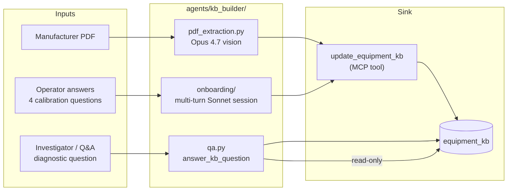
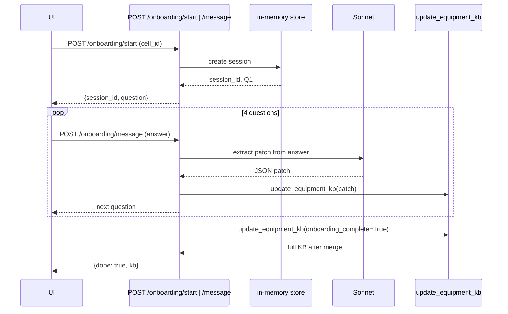

# M3 — KB Builder Agent

> [!NOTE]
> The KB Builder is the agent that gets a cell from "no profile" to "Sentinel can watch it". Two entry points: a PDF upload that uses Opus 4.7 vision to extract a structured KB JSON from the manufacturer manual, and a four-question onboarding session that lets the operator calibrate thresholds with their tacit knowledge. A third entry point — `answer_kb_question` — exposes the agent as a callable tool for the Investigator and the Q&A agent to consult during their own runs.

---

## Why M3 exists

ARIA's pitch is "from PDF manual to first prediction in minutes, with no data-science team". The KB Builder is the proof. Without it, every cell would need a human to author a JSON profile by hand — exactly the "months of configuration" pain the product replaces.

The agent is structured around three flows that share the same write path (`update_equipment_kb` MCP tool) and the same Pydantic schema (`EquipmentKB` from M1):



---

## Three flows, one write path

### 1. PDF extraction

[backend/agents/kb_builder/pdf_extraction.py](../../backend/agents/kb_builder/pdf_extraction.py)

The endpoint `POST /api/v1/kb/equipment/{cell_id}/upload` accepts a multipart PDF. The flow:

1. Read the PDF, base64-encode the bytes, send a single `messages.create` call to Opus with a `document` content block. Opus processes the PDF natively — no separate text extraction step.
2. Parse the response with `EquipmentKB.model_validate_json`. On Pydantic failure, retry once with the validation error appended as a system note.
3. **Pre-stub missing threshold keys.** Before calling `update_equipment_kb`, walk the cell's `process_signal_definition` rows for any `kb_threshold_key` not present in the extracted thresholds, and inject `{alert: null, source: "pending_calibration", confidence: 0.0}`. This satisfies migration 008's integrity guard without forcing Opus to invent thresholds it has no evidence for.
4. Call `update_equipment_kb` with the merged blob plus `raw_markdown` so the source markdown is persisted for later debugging or operator review.
5. Stream five `render_kb_progress` frames bracketing the LLM call so the UI shows visible progress through what is otherwise a single 15-40 second `await`.

> [!IMPORTANT]
> The pre-stub step is what unblocks the demo. Without it, any partial PDF (and Opus routinely misses one of the four P-02 thresholds, especially `flow_l_min` if only the maintenance section is uploaded) crashes the upload with a 500 from the threshold-key guard. With it, a missing threshold simply enters the system as "pending calibration" and Sentinel's evaluator returns `breached=False` for that signal until the operator fills it in. See [02-mcp-server.md](./02-mcp-server.md#threshold-evaluation-as-a-shared-concern).

### 2. Onboarding session

[backend/agents/kb_builder/onboarding/](../../backend/agents/kb_builder/onboarding/)

A four-question multi-turn session calibrated to the demo's most failure-prone signal (vibration). Implemented as an in-memory session store keyed by `session_id` plus a secondary index by `cell_id` (rejects concurrent sessions on the same cell with HTTP 409).



Each operator answer is converted to a JSON Merge Patch by Sonnet, validated against a narrow `OnboardingPatch` Pydantic model, then forwarded to `update_equipment_kb`. The final question's response also flips `onboarding_complete=True` atomically, so Sentinel starts watching the cell on its next 30-second tick.

> [!IMPORTANT]
> `onboarding_complete` is the gate Sentinel checks on every tick. Without the atomic flip, a freshly onboarded cell would never enter the watch list. The dual-source pattern (column on `equipment_kb` plus shadow inside `structured_data.kb_meta`) is intentional: the column is authoritative for backend queries, the shadow is for the LLM's convenience when it reads the KB blob.

### 3. `answer_kb_question` — the agent-as-tool path

[backend/agents/kb_builder/qa.py](../../backend/agents/kb_builder/qa.py)

A side-effect-free async function: takes `cell_id` and `question`, reads the KB, asks Sonnet to answer in a structured `{answer, source, confidence}` shape, returns the dict. No DB writes. No WebSocket broadcasts.

The `agent_handoff` / `agent_start` / `agent_end` frames are emitted by the *caller's* tool dispatcher (Investigator's `handoff.handle_ask_kb_builder`), not by this function. This separation means the same handler is reused unchanged whether the caller is the Messages-API Investigator, the Managed-Agents Investigator, or any future agent that needs to consult the KB.

The contract is: never raises. On any failure (KB missing, LLM parse error) the function returns `{"answer": "<degraded message>", "source": null, "confidence": 0.0}` so the calling agent's loop sees a normal `tool_result` and continues.

---

## The threshold-key guard

Migration 008 added `process_signal_definition.kb_threshold_key` and an integrity check enforced at every `KbRepository.upsert`:

```sql
-- Every signal flagged for monitoring must have a corresponding entry
-- in equipment_kb.structured_data.thresholds
SELECT psd.kb_threshold_key
FROM process_signal_definition psd
WHERE psd.cell_id = $1 AND psd.kb_threshold_key IS NOT NULL
```

The check fires inside the repository, not in the MCP tool — so any write path (REST PUT, MCP `update_equipment_kb`, direct repo call) is protected.

The guard is what forces the pre-stub step in PDF extraction (above). Without the pre-stub, the first upload of any cell with a partial extraction crashes. With it, missing thresholds become explicit pending entries.

The same pattern protects the cold-start onboarding case: if an operator runs onboarding on a cell with no PDF first, `/onboarding/start` either rejects with HTTP 409 (preferred for the demo) or applies the same pre-stub helper.

---

## Where the agent files live

| File                                                                                             | Purpose                                                                                        |
|--------------------------------------------------------------------------------------------------|------------------------------------------------------------------------------------------------|
| [backend/agents/kb_builder/__init__.py](../../backend/agents/kb_builder/__init__.py)             | Public surface — exports `extract_from_pdf`, `answer_kb_question`, onboarding service helpers. |
| [backend/agents/kb_builder/pdf_extraction.py](../../backend/agents/kb_builder/pdf_extraction.py) | Opus 4.7 vision call, response parsing, pre-stub helper, `update_equipment_kb` invocation.     |
| [backend/agents/kb_builder/qa.py](../../backend/agents/kb_builder/qa.py)                         | `answer_kb_question` — side-effect-free Sonnet Q&A over the KB.                                |
| [backend/agents/kb_builder/onboarding/](../../backend/agents/kb_builder/onboarding/)             | Session store, four-question script, patch-validation Pydantic model.                          |
| [backend/modules/kb/router.py](../../backend/modules/kb/router.py)                               | The HTTP surface: `POST /upload`, `POST /onboarding/start`, `POST /onboarding/message`.        |

---

## Audits and references

- [docs/audits/M3-kb-builder-audit.md](../audits/M3-kb-builder-audit.md) — pre- and post-implementation review. Section 7 ("Codebase cross-reference") is the post-implementation diff against the audit's recommendations and is the single best document for understanding why each KB Builder design choice exists.
- [docs/planning/M3-kb-builder/issues.md](../planning/M3-kb-builder/issues.md) — original issue inventory (#17 to #22).

---

## Where to next

- The Investigator that calls `answer_kb_question` via `ask_kb_builder`: [04-sentinel-investigator.md](./04-sentinel-investigator.md#agent-as-tool-handoffs).
- The MCP write tool that the KB Builder uses: [02-mcp-server.md](./02-mcp-server.md#tool-catalogue).
- The Pydantic schema that validates every write: [01-data-layer.md](./01-data-layer.md#equipmentkb--the-structured-kb-profile).
