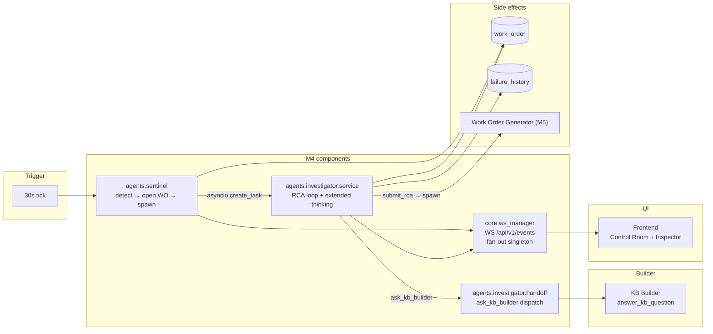
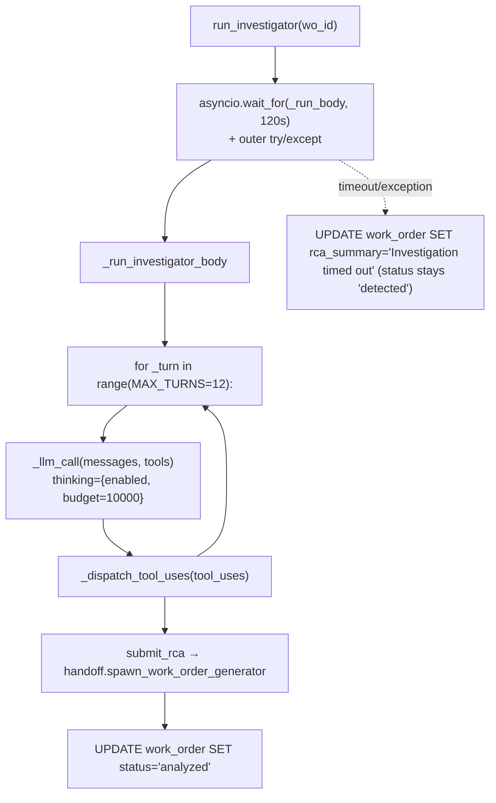

# M4 — Sentinel and Investigator

> [!NOTE]
> M4 is the critical path of the product. Sentinel is a 30-second loop that opens a work order on threshold breach. Investigator is a free agent loop with extended thinking enabled — it correlates signals, KPIs, logbook entries, shift assignments, and past failures to produce a structured root-cause analysis. Together they take the system from "a knowledge base with charts" to "an agentic predictive-maintenance platform". M4 also ships the WSManager broadcast singleton that every later milestone relies on.

---

## Topology



---

## Sentinel — the detection loop

[backend/agents/sentinel/service.py](../../backend/agents/sentinel/service.py)

> [!NOTE]
> Sentinel is a package (M9 split): [`backend/agents/sentinel/`](../../backend/agents/sentinel/) with `service.py` (this doc, the reactive loop) and `forecast.py` (predictive sibling — see [06-forecast-watch.md](./06-forecast-watch.md)). The package `__init__.py` re-exports `sentinel_loop` and `forecast_watch_loop` so `from agents.sentinel import ...` in [main.py](../../backend/main.py) is unchanged. Mirrors the layout of the other agent packages (`kb_builder/`, `investigator/`, `qa/`, `work_order_generator/`).

### Loop structure

- Tick interval: 30 seconds (`_TICK_SECONDS`).
- Lookback per tick: 5 minutes (`_WINDOW_MINUTES`).
- Per-cell debounce: 30 minutes (`_DEBOUNCE_MINUTES`) — prevents repeated work orders for the same continuous breach.
- Outer loop wraps every tick body in `try/except`. A single bad cell or transient DB error logs and returns; the loop keeps going.
- Started by the FastAPI lifespan in [backend/main.py](../../backend/main.py) **inside** the FastMCP sub-app's lifespan wrapper. This ordering matters because Sentinel's first tick calls `get_signal_anomalies` through the in-process loopback — FastMCP must already be hot.

### Detection contract

Sentinel does *not* read raw thresholds. It calls `get_signal_anomalies` (M2.3) which delegates to `core.thresholds.evaluate_threshold` for every sample. This means:

- Single-sided (`alert`/`trip`) and double-sided (`low_alert`/`high_alert`) shapes are treated identically.
- `null` bounds (the "pending_calibration" pre-stubs from KB Builder) return `breached=False` automatically — no special case in Sentinel.
- The `ToolCallResult.is_error` flag is checked. On error the cell is logged and skipped for that tick rather than crashing the loop.

### Cell selection

Only cells where `equipment_kb.onboarding_complete = TRUE` are watched. This is what couples M3 onboarding completion to M4 monitoring start — flipping `onboarding_complete=True` at the end of the four-question session is what brings a freshly onboarded cell into the watch list on the next tick.

A one-time startup log emits the watched / ignored split so the docker logs carry a stable fingerprint without spamming every 30 seconds.

### On breach

1. Insert a new `work_order` row with `status='detected'`, `cell_id`, the breached `signal_def_id`, and a one-line `detection_summary`.
2. Broadcast `anomaly_detected` on the events bus with `severity` and `direction` (both come from `BreachResult` — no recomputation in Sentinel).
3. Broadcast `ui_render` for the alert banner (the only consumer of `render_alert_banner`, which is never exposed to an LLM).
4. Spawn the Investigator: `asyncio.create_task(run_investigator(work_order_id))`. Sentinel does not await — the next tick fires in 30 seconds regardless of how long the Investigator takes.

---

## Investigator — the RCA agent

[backend/agents/investigator/service.py](../../backend/agents/investigator/service.py)

### Anatomy



### Safety nets

The audit flagged "no `max_turns`, no wall-clock timeout, no outer `try/except`" as the single biggest M4 risk. The shipped implementation closes all three:

- `MAX_TURNS = 12`. Empirically enough for a complete RCA loop on the P-02 scenario.
- `_TIMEOUT_SECONDS = 120.0` — an `asyncio.wait_for` wraps the body. Timeouts are recorded as `rca_summary = "Investigation timed out"` so the operator sees a visible degradation rather than a stuck `status='detected'`.
- Outer `try/except Exception` catches any agent-loop crash (LLM rate limit, DB glitch, JSON parse error). The work order is updated with a degraded RCA so the pipeline unsticks.

These three nets are the contract every long-running agent in ARIA follows. See [decisions.md](./decisions.md#safety-nets-on-every-agent-loop).

### Extended thinking

`_llm_call` wraps `anthropic.messages.stream(...)` with `thinking={"type": "enabled", "budget_tokens": 10000}` and `max_tokens=16384` (Anthropic requires `max_tokens > thinking.budget_tokens` with at least one block of headroom).

The streamed `thinking_delta` events are re-broadcast as `thinking_delta` frames on the events bus with `{agent: "investigator", content, turn_id}`. The frontend Agent Inspector renders the live reasoning trace.

> [!IMPORTANT]
> The signed `thinking` block must be preserved verbatim in the next turn's `messages.append({"role": "assistant", "content": ...})`. Dropping or reordering it returns `400 thinking block signature invalid`. The Investigator's loop reconstructs the assistant turn from `final_message.content` (which keeps the signed block intact) — this is the most important single line of code in the file. See [decisions.md](./decisions.md#extended-thinking--signed-block-preservation).

### Tool surface

The Investigator's `tools` array is concatenated at the start of every turn from three sources:

1. The full MCP tool catalogue from `MCPClient.get_tools_schema()` — all 14 read tools.
2. Local agent-only tools: `SUBMIT_RCA_TOOL`, `ASK_KB_BUILDER_TOOL`.
3. `INVESTIGATOR_RENDER_TOOLS` — `render_signal_chart`, `render_diagnostic_card`, `render_pattern_match`.

The dispatcher in `_dispatch_tool_uses` routes on the tool name:

- `submit_rca` → write the RCA to the work order, broadcast `rca_ready`, spawn the Work Order Generator.
- `render_*` → broadcast a `ui_render` frame.
- `ask_kb_builder` → call `handoff.handle_ask_kb_builder` (see below).
- Everything else → `mcp_client.call_tool(name, args)`.

### Memory — `failure_history` injection

At the start of every Investigator run, the recent `failure_history` rows for the affected cell are loaded via `get_failure_history` and injected into the system prompt as a "previously seen failure modes for this cell" block. This is what makes the recurring-failure recognition demo work: when the same vibration pattern that caused a bearing failure three months ago shows up again, the Investigator can call it out by name and propose the same fix.

The decision to put memory in the system prompt rather than as a tool call was deliberate — it costs zero turns and zero tool dispatch overhead, and the operator-visible trace ("I noticed this matches failure mode #4 from January") is a strong demo moment.

This is the mechanism behind the "permanently improving" promise: every `submit_rca` call writes a `failure_history` row via `KbRepository.create_failure`, which becomes available to the next Investigator run for the same cell. ARIA genuinely improves with each incident.

> [!NOTE]
> The `failure_history.signal_patterns` column (migration 007) is not populated by the current `create_failure` call — it only writes `failure_mode` and `root_cause`. Pattern matching therefore operates at the narrative level rather than the quantitative signal level. Populating `signal_patterns` with the breach windows from `submit_rca` would be the next precision improvement.

---

## Agent-as-tool handoffs

[backend/agents/investigator/handoff.py](../../backend/agents/investigator/handoff.py)

When the Investigator emits a `tool_use` for `ask_kb_builder`, the handler:

1. Generates a child `turn_id` (UUID hex).
2. Broadcasts `agent_handoff` on the events bus with `{from_agent, to_agent, reason, turn_id}` (underscored field names).
3. Broadcasts `agent_start` for the child agent on the events bus.
4. Calls `kb_builder.answer_kb_question(cell_id, question)` (synchronous async — the Investigator awaits the result).
5. Broadcasts `agent_end` on the events bus with the finish reason.
6. Returns the answer as the `tool_result` for the Investigator's loop.

> [!NOTE]
> The Q&A agent uses an analogous pattern with `ask_investigator` — see [05-workorder-qa.md](./05-workorder-qa.md#chat-side-handoff-mirroring). The two patterns are intentionally symmetric: parent agent owns the handoff broadcast, child agent's handler is side-effect free.

---

## Threshold evaluation

[backend/core/thresholds.py](../../backend/core/thresholds.py) — `evaluate_threshold(threshold, value) -> BreachResult`

The function unifies the two threshold shapes the KB supports. Precedence (highest severity first):

1. `trip` (single-sided high) — `severity="trip"`, `direction="high"`
2. `high_alert` (double-sided high) — `severity="alert"`, `direction="high"`
3. `alert` (single-sided high) — `severity="alert"`, `direction="high"`
4. `low_alert` (double-sided low) — `severity="alert"`, `direction="low"`

A non-breach returns all-null fields. A null bound is skipped, which is what makes "pending calibration" thresholds invisible to detection until the operator fills them in.

Both Sentinel and the MCP `get_signal_anomalies` tool route through this helper. Anything else that needs to evaluate a threshold (future agents, future REST endpoints) must use the same helper — direct `.alert` reads are forbidden because they silently miss double-sided shapes.

---

## WSManager — the broadcast singleton

[backend/core/ws_manager.py](../../backend/core/ws_manager.py)

A module-level singleton fan-out for `WS /api/v1/events`. Every agent imports `ws_manager` from here.

### Frame shape

```python
await ws_manager.broadcast("anomaly_detected", {"cell_id": 1, "signal_def_id": 4, ...})
```

Becomes `{"type": "anomaly_detected", "cell_id": 1, "signal_def_id": 4, "turn_id": "..."}` on every connected socket.

### `current_turn_id` ContextVar

```python
from core.ws_manager import current_turn_id
token = current_turn_id.set(uuid.uuid4().hex)
try:
    # ... agent loop ...
finally:
    current_turn_id.reset(token)
```

The orchestrator sets a `turn_id` once per agent run. Every `ws_manager.broadcast(...)` call inside that scope automatically picks it up — no agent has to thread the id through every helper. The ContextVar is propagated across `await` boundaries by asyncio.

### Failure semantics

- Sockets that fail (closed, network error) are silently dropped from the registry. The broadcast never raises to the caller.
- Payloads that fail to JSON-serialise are logged and the broadcast is skipped (the broadcast contract is best-effort, not transactional).
- The single `broadcast` is fanned out sequentially. With one operator on the demo this is fine; multi-tenant production would need Redis pub/sub.

The full event vocabulary lives in [cross-cutting.md](./cross-cutting.md#websocket-contracts).

---

## The full anomaly-to-RCA sequence

```mermaid
sequenceDiagram
    participant Loop as Sentinel loop
    participant MCP as get_signal_anomalies
    participant WS as ws_manager
    participant DB as work_order
    participant Inv as run_investigator
    participant LLM as Opus + thinking
    participant KB as ask_kb_builder
    participant WOG as Work Order Generator

    Loop->>MCP: get_signal_anomalies(cell_id, last 5 min)
    MCP-->>Loop: [BreachResult]
    Loop->>DB: INSERT work_order (status=detected)
    Loop->>WS: broadcast(anomaly_detected, {severity, direction, ...})
    Loop->>WS: broadcast(ui_render, alert_banner)
    Loop->>Inv: asyncio.create_task(run_investigator(wo_id))
    Loop-->>Loop: continue (does not await)

    Inv->>WS: broadcast(agent_start, {agent: investigator, turn_id})
    loop up to 12 turns
        Inv->>LLM: messages.stream(thinking enabled)
        LLM-->>Inv: thinking_delta * N + tool_use blocks
        loop per tool_use
            Inv->>WS: broadcast(thinking_delta, {chunk})
            Inv->>MCP: call_tool(name, args)
            MCP-->>Inv: tool_result
        end
        opt ask_kb_builder
            Inv->>WS: broadcast(agent_handoff)
            Inv->>WS: broadcast(agent_start, {agent: kb_builder, turn_id})
            Inv->>KB: answer_kb_question(cell_id, question)
            KB-->>Inv: {answer, source, confidence}
            Inv->>WS: broadcast(agent_end, {agent: kb_builder})
        end
        opt submit_rca
            Inv->>DB: UPDATE work_order SET status=analyzed, rca_summary
            Inv->>WS: broadcast(rca_ready, {wo_id, summary, confidence})
            Inv->>WOG: asyncio.create_task(run_work_order_generator(wo_id))
        end
    end
    Inv->>WS: broadcast(agent_end, {agent: investigator, finish_reason})
```

---

## Audits and references

- [docs/audits/M4-M5-sentinel-investigator-workorder-qa-audit.md](../audits/M4-M5-sentinel-investigator-workorder-qa-audit.md) — full pre-implementation review. Section 4 ("Missing guard-rails") is the source of the safety-net contract that every long-running agent now follows.
- [docs/audits/M4-M5-issue-context-pass.md](../audits/M4-M5-issue-context-pass.md) — issue-context cross-pass, including the `ask_kb_builder` handler shape.
- [docs/planning/M4-sentinel-investigator/issues.md](../planning/M4-sentinel-investigator/issues.md) — original issue inventory (#23 to #29).

---

## Where to next

- The Work Order Generator that the Investigator spawns: [05-workorder-qa.md](./05-workorder-qa.md#work-order-generator).
- The Q&A agent that calls back into the Investigator via `ask_investigator`: [05-workorder-qa.md](./05-workorder-qa.md#qa-operator-chat).
- The Managed Agents migration of the Investigator: [07-managed-agents.md](./07-managed-agents.md) and [decisions.md](./decisions.md#two-paths-messages-api-vs-managed-agents).
- The predictive sibling loop that forecasts breaches before Sentinel sees them: [06-forecast-watch.md](./06-forecast-watch.md).
- The full WebSocket frame catalogue: [cross-cutting.md](./cross-cutting.md#websocket-contracts).
