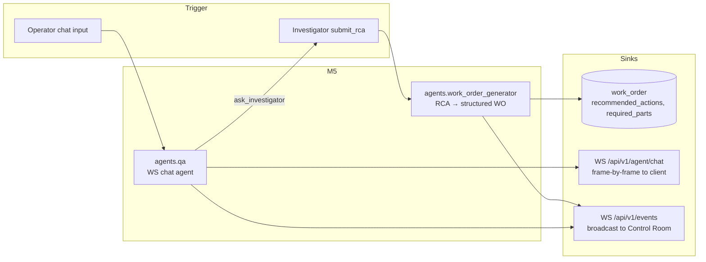

# M5 — Work Order Generator and Q&A

> [!NOTE]
> M5 closes the loop. The Work Order Generator turns the Investigator's RCA into a printable, structured work order with recommended actions and parts. The Q&A agent gives the operator a natural-language interface to the entire system through a streaming WebSocket. M5 also contains the Managed Agents migration of the Investigator (M5.5), which moves the long-running RCA loop onto Anthropic's hosted infrastructure while keeping interactive Q&A on the Messages API where token-granular streaming is native.

---

## Two agents, one transport pattern



---

## Work Order Generator

[backend/agents/work_order_generator/service.py](../../backend/agents/work_order_generator/service.py)

A short agent loop spawned by the Investigator immediately after `submit_rca` succeeds. The contract is "RCA in, structured work order out, in 1-2 turns".

### Loop bounds

- `MAX_TURNS = 6` — the loop typically terminates in 2 turns (`get_equipment_kb` then `submit_work_order`).
- `_TIMEOUT_SECONDS = 60.0` — half the Investigator's budget, because the loop is much shorter.
- Same outer `try/except` + `asyncio.wait_for` pattern as the Investigator. On timeout or crash, the work order stays at `status='analyzed'` with its existing `rca_summary` intact, and `work_order_ready` is *not* broadcast — the frontend keeps showing the RCA-only state and the operator can hit "Regenerate" to retry.

### Tool surface

- All 14 MCP read tools (the generator may need to look up KPIs or signal context).
- One local tool: `SUBMIT_WORK_ORDER_TOOL` — the only tool that writes.
- `WORK_ORDER_GEN_RENDER_TOOLS` — `render_work_order_card` for the printable card.

### `submit_work_order` shape

The tool input mirrors the `WorkOrderUpdate` Pydantic schema verbatim:

```
{
  work_order_id: int,
  recommended_actions: [{action, priority, est_duration_min}],
  required_parts: [{ref, qty, description?}],
  suggested_window_start: ISO8601,
  suggested_window_end: ISO8601,
  printable_summary: str
}
```

> [!IMPORTANT]
> The field name is `required_parts`, not `parts_required`. The audit caught this drift in the original issue body before any code shipped — the database column, the Pydantic field, and the tool schema all match. See [decisions.md](./decisions.md#contract-discipline-frontend-types-are-the-source-of-truth).

Extended thinking is *not* enabled here. The generator's job is structured output, not multi-step reasoning — Sonnet at standard mode is the right tool.

### Broadcast contract

On successful `submit_work_order`:

1. `UPDATE work_order SET status='open', recommended_actions=..., required_parts=..., ...`
2. Broadcast `work_order_ready` on the events bus with `{work_order_id}`.
3. Broadcast `ui_render` for `render_work_order_card` with the printable summary as props.
4. The frontend's artifact registry maps `render_work_order_card` to the printable React component, which is what closes the demo's "Scene 4: print this work order".

---

## Q&A — operator chat

The Q&A agent powers `WS /api/v1/agent/chat`. The router and the agent are deliberately split:

| File                                                                               | Concern                                                                                                                                                       |
|------------------------------------------------------------------------------------|---------------------------------------------------------------------------------------------------------------------------------------------------------------|
| [backend/modules/chat/router.py](../../backend/modules/chat/router.py)             | Authenticate the WebSocket handshake (cookie JWT). Hold per-connection `messages: list` state. Forward each `{type: "user", content}` frame to `run_qa_turn`. |
| [backend/agents/qa/messages_api.py](../../backend/agents/qa/messages_api.py)       | The Messages-API agent loop. Streams `text_delta`, `tool_call`, `tool_result`, `ui_render`, `agent_handoff`, `done` frames per turn.                          |
| [backend/agents/qa/tool_dispatch.py](../../backend/agents/qa/tool_dispatch.py)     | Shared tool handlers: `handle_render`, `handle_ask_investigator`, `summarise_tool_result`, `safe_send`.                                                       |
| [backend/agents/qa/investigator_qa.py](../../backend/agents/qa/investigator_qa.py) | `answer_investigator_question` — the deterministic fast-path used by `ask_investigator`.                                                                      |
| [backend/agents/qa/prompts.py](../../backend/agents/qa/prompts.py)                 | `QA_SYSTEM` and `INVESTIGATOR_QA_SYSTEM` system prompts.                                                                                                      |
| [backend/agents/qa/schemas.py](../../backend/agents/qa/schemas.py)                 | `ASK_INVESTIGATOR_TOOL` local tool schema.                                                                                                                    |

### The chat WebSocket contract

The `ChatMap` in [frontend/src/lib/ws.types.ts](../../frontend/src/lib/ws.types.ts) is the source of truth. Frames the backend emits:

- `text_delta` — token-by-token streamed text (the value Q&A on Messages API delivers that Managed Agents cannot).
- `tool_call` — the agent invoked a tool. Frontend renders an inline collapsable card.
- `tool_result` — short summary string (raw JSON is forbidden on the chat channel; it lives in per-turn server state for debugging).
- `ui_render` — a generative-UI artifact dispatched into the chat stream.
- `agent_start` — the speaker for this turn (or sub-turn). Frontend uses this to flip the badge.
- `agent_handoff` — `{from, to, reason}` (unprefixed names; the events-bus mirror uses `from_agent`/`to_agent`).
- `done` — the turn is complete. Optional `error` field on degraded paths.

### One turn end-to-end

```mermaid
sequenceDiagram
    participant Client
    participant Router as chat/router.py
    participant Loop as run_qa_turn
    participant Stream as anthropic.messages.stream
    participant Disp as _dispatch_tool_uses
    participant MCP

    Client->>Router: {type: user, content}
    Router->>Router: append to messages[]
    Router->>Bus: broadcast(agent_start, agent=qa)
    Router->>Client: send_json(agent_start, agent=qa)
    Router->>Loop: run_qa_turn(ws, messages, content)
    loop up to 8 turns
        Loop->>Stream: messages.stream(tools, system)
        loop streamed events
            Stream-->>Loop: text_delta
            Loop->>Client: send_json(text_delta, content)
        end
        Stream-->>Loop: final_message (tool_use blocks)
        opt tool_uses present
            Loop->>Disp: dispatch each
            Disp->>Bus: broadcast(tool_call_started)
            Disp->>Client: send_json(tool_call)
            alt render_*
                Disp->>Bus: broadcast(ui_render)
                Disp->>Client: send_json(ui_render)
            else ask_investigator
                Disp->>Disp: handle_ask_investigator
            else mcp tool
                Disp->>MCP: call_tool
                MCP-->>Disp: result
            end
            Disp->>Client: send_json(tool_result, summary)
        end
    end
    Loop->>Bus: broadcast(agent_end, finish_reason)
    Loop->>Client: send_json(done)
```

### Chat-side handoff mirroring

The `ask_investigator` handler is the chat-equivalent of the Investigator's `ask_kb_builder` handler:

1. Broadcast `agent_handoff` on the events bus with underscored field names.
2. Send `agent_handoff` on the chat socket with unprefixed field names.
3. Generate a child `turn_id`, broadcast `agent_start` for `"investigator"` on **both** channels (events bus and chat socket — the chat-side mirror was added in issue #125 to unblock the M8.5 Agent Inspector's `turn_id` correlation).
4. Call `answer_investigator_question(cell_id, question)` — a deterministic single Sonnet call against recent work orders and past failures for the cell.
5. Broadcast `agent_end` on both channels with the matching `turn_id`.
6. Return the JSON answer as the `tool_result` for the Q&A loop.

> [!NOTE]
> The Q&A's `ask_investigator` does not run the full Managed-Agents Investigator loop. It uses the lightweight `answer_investigator_question` fast-path so chat latency stays sub-second. A future "Continue investigation" feature would re-open the Investigator's persisted Anthropic session — see [decisions.md](./decisions.md#two-paths-messages-api-vs-managed-agents).

### Per-connection state

The chat router holds `messages: list[dict]` per WebSocket. The list is appended by `run_qa_turn` on every user message and tool result, so multi-turn context is preserved for the lifetime of the socket. When the operator closes the tab, the state is discarded. There is no server-side persistence — this is an interactive chat, not a long-running session.

This is the architectural reason Q&A stayed on the Messages API and did not migrate to Managed Agents — see the next section.

---

## Managed Agents migration (M5.5)

> [!NOTE]
> The dedicated Managed Agents architecture doc lives at [07-managed-agents.md](./07-managed-agents.md) — full module layout, lifecycle diagram, hosted-MCP wiring, sandbox CSV endpoint, and session-persistence contract. This section keeps a short summary because the migration is the climax of the M5 storyline, but new wiring details should land in 07-managed-agents.md.

> [!IMPORTANT]
> M5.4 originally migrated Q&A to Managed Agents to qualify for the "Best Use of Managed Agents" prize. The M5 audit (`docs/audits/M5-managed-agents-refactor-audit.md`) concluded that Q&A is the wrong target — interactive sub-second turns fight the platform's `agent.message`-block grain. The Investigator is the right target: long-running, tool-heavy, asynchronous. M5.5 implements that pivot.

### What changed

| Layer                       | Before (M5.4 / M4.5)                                            | After (M5.5)                                                                          |
|-----------------------------|-----------------------------------------------------------------|---------------------------------------------------------------------------------------|
| Q&A backend                 | Managed Agents path (414 LOC) gated behind feature flag         | Removed. Q&A is Messages-API only.                                                    |
| Investigator backend        | Messages-API loop only (`agents.investigator.service`)          | Dual path: Messages API kept as fallback, Managed Agents primary.                     |
| MCP tool execution          | All 14 tools dispatched in our backend per call                 | Hosted MCP — Anthropic calls our `/mcp/<secret>/` URL directly via Cloudflare tunnel. |
| Custom tools in our backend | Every MCP tool wrapped + render_* + submit_rca + ask_kb_builder | Only render_* + submit_rca + ask_kb_builder.                                          |
| Session persistence         | Dies with the WebSocket                                         | `work_order.investigator_session_id` (migration 009) persists Anthropic session id.   |
| Streaming `thinking_delta`  | Per-chunk via `_llm_call`                                       | Block-level via `agent.thinking` events (one frame per reasoning block).              |

### Module layout

[backend/agents/investigator/managed/](../../backend/agents/investigator/managed/)

```
managed/
├── __init__.py        # Public surface: run_investigator_managed
├── bootstrap.py       # environments.create + agents.create + sessions.create
├── events.py          # SSE consumer for sessions.events.stream
├── tool_dispatch.py   # custom-tool result dispatcher
└── service.py         # Public entry: run_investigator_managed(work_order_id)
```

The split mirrors the four concerns of a Managed-Agents integration:

1. **bootstrap** — declarative agent + environment + session lifecycle.
2. **events** — consume the SSE stream, route each event type to its handler.
3. **tool_dispatch** — when the platform emits `requires_action`, send back `user.custom_tool_result` for our 3 custom tools (skip MCP-tool ids — those are Anthropic-side).
4. **service** — public async function with the same signature as the Messages-API entry point.

The legacy `agents.investigator.service.run_investigator` remains, gated behind `INVESTIGATOR_USE_MANAGED=False` in the config. Flipping the flag is a 5-minute rollback if the hosted path misbehaves on demo day.

### Hosted MCP wiring

Two pieces of infrastructure make hosted MCP work:

1. **Cloudflare tunnel.** `aria-cloudflared` (compose profile `tunnel`) exposes `aria-backend.vgtray.fr` → `backend:8000`. The MCP mount is reachable as `https://aria-backend.vgtray.fr/mcp/<secret>/`.
2. **Path-secret URL.** The `/mcp` mount lives at `/mcp/<settings.aria_mcp_path_secret>` rather than `/mcp`. The URL is the secret. The Managed Agents `mcp_servers` config does not support custom HTTP headers, and the OAuth+vaults path is too heavy for a hackathon — the path secret is the pragmatic compromise. See [decisions.md](./decisions.md#path-secret-url-as-the-mcp-auth-mechanism).

The agent definition references the public URL via `mcp_servers=[{"type": "url", "name": "aria", "url": ARIA_MCP_PUBLIC_URL}]`, plus a `{"type": "mcp_toolset", "mcp_server_name": "aria"}` entry in the `tools` array (without it the platform returns `400 mcp_servers declared but no mcp_toolset references them`).

### Token-budget fixes

The first end-to-end run of the Managed Investigator overflowed the 200k context window in a single tool call: `get_signal_trends` on a 3-hour, 4-signal, 1-minute query returned 2.3 MB / ~575k tokens. Two fixes shipped in [backend/aria_mcp/tools/signals.py](../../backend/aria_mcp/tools/signals.py):

- `get_signal_anomalies` now aggregates consecutive breach samples into structured *breach windows*. The same query now returns 28 windows / ~2 400 tokens — a 240x reduction.
- `get_signal_trends` enforces a hard 500-row cap and appends `{"_truncated": true, "hint": "use 5m/15m aggregation or shorter window"}` when hit.

These changes apply to both the Messages-API path and the hosted-MCP path, but they were forced by the hosted path because Managed Agents' built-in compaction works on conversation history, not on individual oversized tool responses.

### Custom tool quirks

- The Managed Agents API rejects `additionalProperties` in custom tool input schemas (the Messages API tolerates it). `bootstrap.py::_strip_additional_properties` walks the schema recursively and removes the field.
- Hosted MCP tool ids appear in `requires_action.event_ids` but are *not* custom-tool events. Sending a `user.custom_tool_result` for them returns `400 tool_use_id sevt_... does not match any custom_tool_use event in this session`. The dispatcher silently skips them.
- The default `mcp_toolset.permission_policy` is `always_ask`, which pauses the agent waiting for a human approval that never arrives. The bootstrap sets `default_config.permission_policy = always_allow` so the agent runs autonomously.

### What was kept on the Messages API

- The Q&A agent. Token-granular streaming is what `text_delta` requires; Managed Agents emits `agent.message` blocks that would have to be re-chunked artificially.
- The Investigator fallback path. Set `INVESTIGATOR_USE_MANAGED=False` to revert in <5 min.

### Verification

The full M5.5 end-to-end test report lives at [docs/audits/M5.5-end-to-end-test-report.md](../audits/M5.5-end-to-end-test-report.md). Key result: a Sentinel-triggered investigation against P-02 with the dead-head pressure scenario produces:

- `work_order.status = 'analyzed'`
- `work_order.investigator_session_id = 'sesn_011CaMUPAWcCBfc1oMyMFZG3'`
- `failure_history` row with `failure_mode = 'discharge_blockage'` and a populated `root_cause`

All three of which are persisted across the migration without contract change.

---

## File map

| File                                                                                                   | Purpose                                                                             |
|--------------------------------------------------------------------------------------------------------|-------------------------------------------------------------------------------------|
| [backend/agents/work_order_generator/service.py](../../backend/agents/work_order_generator/service.py) | RCA → structured work order. 336 lines.                                             |
| [backend/agents/work_order_generator/prompts.py](../../backend/agents/work_order_generator/prompts.py) | `WO_GEN_SYSTEM` system prompt.                                                      |
| [backend/agents/work_order_generator/schemas.py](../../backend/agents/work_order_generator/schemas.py) | `SUBMIT_WORK_ORDER_TOOL` schema mirroring `WorkOrderUpdate`.                        |
| [backend/agents/qa/messages_api.py](../../backend/agents/qa/messages_api.py)                           | `run_qa_turn` — the streaming agent loop. 198 lines.                                |
| [backend/agents/qa/tool_dispatch.py](../../backend/agents/qa/tool_dispatch.py)                         | Tool routing (`handle_render`, `handle_ask_investigator`, `summarise_tool_result`). |
| [backend/agents/qa/investigator_qa.py](../../backend/agents/qa/investigator_qa.py)                     | `answer_investigator_question` — deterministic fast-path for `ask_investigator`.    |
| [backend/agents/investigator/managed/](../../backend/agents/investigator/managed/)                     | Managed Agents migration. 575 lines across 5 files.                                 |
| [backend/modules/chat/router.py](../../backend/modules/chat/router.py)                                 | `WS /api/v1/agent/chat` — auth, per-connection state, hand-off to `run_qa_turn`.    |

---

## Audits and references

- [docs/audits/M4-M5-sentinel-investigator-workorder-qa-audit.md](../audits/M4-M5-sentinel-investigator-workorder-qa-audit.md) — pre-implementation review of M5.1 (WO Generator) and M5.2 (Q&A WebSocket).
- [docs/audits/M5-managed-agents-refactor-audit.md](../audits/M5-managed-agents-refactor-audit.md) — the audit that drove the M5.5 pivot from Q&A-on-Managed-Agents to Investigator-on-Managed-Agents. Section 6.5 sketches the two differentiation add-ons (Continue Investigation, in-sandbox Python diagnostics) that the platform uniquely enables.
- [docs/audits/M5.5-end-to-end-test-report.md](../audits/M5.5-end-to-end-test-report.md) — full live-test report with the seven cascade fixes that landed during the migration.
- [docs/planning/M5-workorder-qa/issues.md](../planning/M5-workorder-qa/issues.md) — original issue inventory (#30 to #33).
- [docs/planning/M5-workorder-qa/managed-agents-refactor-issues.md](../planning/M5-workorder-qa/managed-agents-refactor-issues.md) — M5.5 refactor issue plan.

---

## Where to next

- The Investigator that the Work Order Generator chains from and that Q&A consults: [04-sentinel-investigator.md](./04-sentinel-investigator.md).
- The full WebSocket frame catalogue (chat and bus): [cross-cutting.md](./cross-cutting.md#websocket-contracts).
- The decision log for "why Managed Agents on Investigator only": [decisions.md](./decisions.md#two-paths-messages-api-vs-managed-agents).
