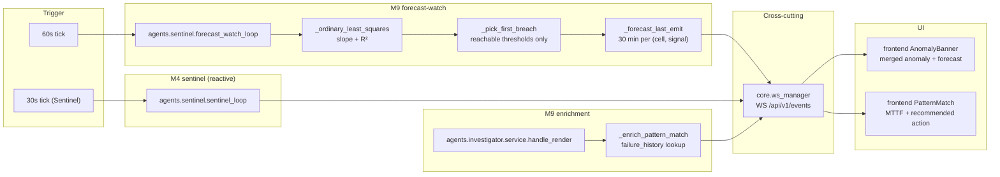
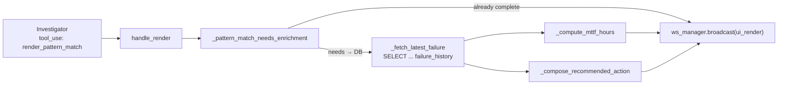

# M9 — Forecast-watch and predictive enrichment

> [!NOTE]
> M9 adds the predictive arm of the platform. Sentinel (M4) is reactive — it opens a work order *after* a threshold has been crossed. Forecast-watch is a sibling loop that runs an ordinary-least-squares regression on the tail of every monitored signal and emits a `forecast_warning` event when the projected trajectory will cross a threshold within a 12-hour horizon. Combined with server-side enrichment of the Investigator's `render_pattern_match` emission from the `failure_history` table, this turns the banner from "something broke" into "something will break, here is how long you have, and here is what to do about it".

---

## Why it exists

The audit in [docs/audits/M9-frontend-pre-demo-audit.md](../audits/M9-frontend-pre-demo-audit.md) flagged that the platform pitch — "predictive maintenance" — was not carried by any backend behaviour. Every alert surface fired strictly *after* a real threshold breach, and the Investigator's `render_pattern_match` artifact only recognised a past failure without projecting forward. Forecast-watch closes the gap by:

1. Alerting on drift *before* a breach occurs, with an explicit ETA and a regression confidence score.
2. Populating predictive fields (`predicted_mttf_hours`, `recommended_action`, `past_event_date`) on the pattern-match card from the matched incident's resolution, so a memory hit reads as a forecast rather than a trivia point.

Forecast-watch is advisory — no work order is opened and the Investigator is not spawned from here. See [decisions.md](./decisions.md) for the rationale.

---

## Topology



---

## Forecast-watch — the predictive loop

[backend/agents/sentinel/forecast.py](../../backend/agents/sentinel/forecast.py) — `forecast_watch_loop` + helpers. Sibling to [service.py](../../backend/agents/sentinel/service.py) under the [`agents.sentinel`](../../backend/agents/sentinel/) package.

### Loop structure

| Knob                   | Value                                                         | Reason                                                                                                                    |
|------------------------|---------------------------------------------------------------|---------------------------------------------------------------------------------------------------------------------------|
| Tick interval          | `_FORECAST_TICK_SECONDS = 60`                                 | Drift changes slower than single-sample breaches; halves DB pressure compared with Sentinel's 30 s.                       |
| Regression window      | `_FORECAST_WINDOW_HOURS = 6`                                  | Short enough for fresh drift to dominate the slope, long enough to average out periodic noise.                            |
| Forecast horizon       | `_FORECAST_HORIZON_HOURS = 12`                                | Longer horizons compound regression error linearly; 12 h is usable for maintenance-window planning without over-claiming. |
| Minimum samples        | `_FORECAST_MIN_SAMPLES = 20`                                  | Below this, slope is dominated by variance.                                                                               |
| Minimum R²             | `_FORECAST_MIN_CONFIDENCE = 0.35`                             | Empirical floor that rejects random-walk signals while still catching monotonic drift.                                    |
| Minimum drift rate     | `_FORECAST_MIN_DRIFT_RATE = 0.005` (0.5 %/h of current value) | Gates out signals that hover near a threshold with effectively zero slope.                                                |
| Per-signal debounce    | `_FORECAST_DEBOUNCE_SECONDS = 1800` (30 min)                  | Avoids hammering the banner every tick for 12 h straight with the same forecast.                                          |
| Fetch limit per signal | `_FORECAST_FETCH_LIMIT = 1000`                                | Downsampling before regression is fine; more rows only cost bandwidth.                                                    |

The outer loop wraps every tick body in `try/except` identically to Sentinel. A single bad cell or transient DB error logs and returns; the loop keeps going. The loop is started by the FastAPI lifespan in [backend/main.py](../../backend/main.py) as a sibling task to `sentinel_loop` inside the FastMCP sub-app's lifespan wrapper.

### Cell and signal selection

Forecast-watch consumes a single cross-cell query rather than iterating per-cell-per-signal like Sentinel does:

```sql
SELECT psd.id AS signal_def_id, psd.cell_id, psd.display_name, psd.kb_threshold_key,
       c.name AS cell_name,
       k.structured_data -> 'thresholds' -> psd.kb_threshold_key AS thresholds_json
FROM process_signal_definition psd
JOIN equipment_kb k ON k.cell_id = psd.cell_id
JOIN cell c ON c.id = psd.cell_id
WHERE k.onboarding_complete = TRUE
  AND psd.kb_threshold_key IS NOT NULL
ORDER BY psd.cell_id, psd.id
```

Only signals with a configured `kb_threshold_key` are monitored — a signal without a threshold cannot breach, so a forecast is meaningless. The `onboarding_complete = TRUE` gate mirrors Sentinel so a freshly onboarded cell appears in both loops on the next tick.

### Regression

`_ordinary_least_squares` fits `raw_value = slope * hours_since_t0 + intercept` over the fetched tail. The helper returns `None` on degenerate input — empty series, single timestamp, or all-constant values — so the caller never has to guard against numerical edge cases.

R² is computed as `1 - SS_res / SS_tot` and floored at zero. A constant series produces `SS_tot = 0` and returns `None` rather than division-by-zero; the caller skips.

> [!IMPORTANT]
> The slope is unit-per-hour. Every downstream computation (ETA, drift-rate floor, confidence gate) assumes hours; using a different unit silently breaks the horizon and debounce windows.

### Threshold selection

`_pick_first_breach` scans every numeric threshold in the KB payload for the signal and returns the one the projected trajectory crosses first:

- A threshold at `T` is *reachable* iff `sign(T - last_value) == sign(slope)`. A rising signal cannot reach a `low_alert` below it — skip.
- The ETA is `(T - last_value) / slope`. Only positive ETAs strictly below the horizon are eligible.
- Among eligible thresholds, the smallest ETA wins. A signal approaching both `alert` (at 15 in 5 h) and `trip` (at 25 in 15 h) produces the `alert` forecast; the `trip` one is redundant.

`_parse_thresholds` accepts the three input shapes that `equipment_kb.structured_data.thresholds[<kb_threshold_key>]` produces in practice (dict, JSON string, or `None`) and drops any non-numeric values. Booleans are explicitly excluded — `isinstance(True, (int, float)) == True` in Python, but a boolean threshold is never a real limit.

### Emission

A passing forecast emits one `forecast_warning` frame on the events bus via `ws_manager.broadcast`. The payload:

```python
{
    "cell_id": int,
    "cell_name": str,
    "signal_def_id": int,
    "signal_name": str,
    "current_value": float,        # rounded to 3 dp
    "threshold_value": float,
    "threshold_field": str,        # e.g. "alert", "high_alert", "trip"
    "slope_per_hour": float,       # rounded to 4 dp
    "confidence": float,           # regression R², rounded to 3 dp, 0.0-1.0
    "eta_hours": float,            # rounded to 2 dp, always > 0 and < horizon
    "trend": "rising" | "falling",
    "severity": "alert" | "trip",  # trip when eta_hours <= 2.0
    "projected_breach_at": str,    # ISO-8601 UTC
    "detected_at": str,            # ISO-8601 UTC
    "turn_id": str,                # fresh UUID hex per forecast
}
```

### Debounce

`_forecast_last_emit: dict[tuple[int, int], float]` is a module-level in-memory table keyed by `(cell_id, signal_def_id)`. The value is the monotonic `loop.time()` of the last emit. Process-local state is fine for the demo's single worker — it mirrors the WS manager's own scope in [core/ws_manager.py](../../backend/core/ws_manager.py). A multi-worker deployment would need Redis or similar.

> [!NOTE]
> The debounce is entirely in-process — a service restart clears it. This is a deliberate simplification: on restart, re-emitting any active forecast is the correct behaviour (the banner has been wiped too).

### Safety

Forecast-watch follows the same three non-negotiable conventions every long-running agent in ARIA follows:

1. Outer loop wraps every tick in `try/except` — one bad row cannot kill the loop.
2. Per-signal inner loop also wraps in `try/except` so one bad signal cannot kill the whole tick.
3. The emission is fire-and-forget; `ws_manager.broadcast` never raises to the caller.

Contrast with Sentinel: forecast-watch never writes to the database. It is a pure read + broadcast loop. This is the key architectural choice — see the decision note below.

---

## Server-side enrichment of `render_pattern_match`

[backend/agents/investigator/service.py](../../backend/agents/investigator/service.py) — `handle_render` + `_enrich_pattern_match`

### Problem

The Investigator emits `render_pattern_match` when a live anomaly's signature matches a past incident. The LLM populates `cell_id`, `current_event`, `past_event_ref`, `similarity` reliably but does not — without expensive prompt engineering — populate the predictive fields the frontend card accepts. Rather than prompt the LLM into a specific shape, the orchestrator enriches the payload server-side from the matched row in `failure_history`.

### Shape



### Rules

| Field                  | Source                                                              | Fallback                                                                                                                                   |
|------------------------|---------------------------------------------------------------------|--------------------------------------------------------------------------------------------------------------------------------------------|
| `past_event_date`      | `failure_history.failure_time.isoformat()`                          | Omit if `failure_time` is null.                                                                                                            |
| `predicted_mttf_hours` | `(resolved_time - failure_time)` in hours, rounded to 1 dp          | Conservative 24.0 h default when `resolved_time` is null or not after `failure_time`.                                                      |
| `recommended_action`   | First sentence of `failure_history.resolution`, capped at 160 chars | `"Inspect for <failure_mode> before the predicted window closes."` if `resolution` is empty but `failure_mode` is present; otherwise omit. |

The enrichment is best-effort. The `_fetch_latest_failure` helper catches every exception and returns `None`; the enrichment shortcut-returns the original args. A missing KB row or malformed `resolution` therefore never breaks the UI frame — the card still renders, just without the predictive rows.

### Schema contract

[backend/agents/ui_tools.py](../../backend/agents/ui_tools.py) — `RENDER_PATTERN_MATCH` and `RENDER_SIGNAL_CHART` were both flipped from `"additionalProperties": False` to `True` and the new optional properties documented in the schema. This is the only way an Anthropic-validated tool call survives the orchestrator adding server-side fields after the LLM has already populated the required ones.

`RENDER_SIGNAL_CHART` also gained `predicted_breach_hours` and `trend` in the schema to leave a door open for future server-side enrichment of live charts (not wired yet — the frontend computes its own projection from the data it fetches).

---

## Frontend surface

[frontend/src/features/control-room/useForecastStream.ts](../../frontend/src/features/control-room/useForecastStream.ts) — sibling hook to `useAnomalyStream`, listens to `forecast_warning`, exposes a capped FIFO.

[frontend/src/features/control-room/AnomalyBanner.tsx](../../frontend/src/features/control-room/AnomalyBanner.tsx) — merges both streams into a single banner.

### Merge rules

- **Head-slot precedence**: a real anomaly (Sentinel) always beats a forecast in the head slot. A breach that has actually happened is more urgent than a projection.
- **Count**: the `+N more` badge shows the union of both streams so the operator sees the queue depth regardless of kind.
- **Tone**: forecast items render in the cool `--accent-arc` token (the same token the `SignalChart` forecast line uses — visual rhyme). Real anomalies keep their destructive / warning tone.
- **Copy**: forecast banners are forward-looking — *"forecast to breach alert (12.4 to 15.0) in ~4.2 h"* — with a `Forecast · N% confidence` chip, an `Assess` button (vs `Investigate`), and `aria-live="polite"` always. A forecast never barges in mid-screen-reader speech.
- **CTA**: clicking `Assess` hands off to the chat with `buildForecastPrompt`, framed as a drift projection — "Assess whether a preventive investigation or maintenance window is warranted now" — rather than a failure post-mortem.

[frontend/src/components/artifacts/placeholders/PatternMatch.tsx](../../frontend/src/components/artifacts/placeholders/PatternMatch.tsx) — the card now reads as a forecast even without the optional predictive fields. When `predicted_mttf_hours` is present, renders a colour-graded MTTF row (destructive at ≤ 24 h, warning at ≤ 72 h). When `recommended_action` is present, renders a "Recommended · act now" row.

[frontend/src/components/artifacts/placeholders/SignalChart.tsx](../../frontend/src/components/artifacts/placeholders/SignalChart.tsx) — runs its own client-side regression on the visible window and renders a dashed projection past the "now" reference line. The trend and breach ETA are displayed as a caption strip. The client-side projection is independent of the backend forecast-watch — they answer different questions (client: "what is this chart projecting?", server: "should the operator be alerted?").

---

## End-to-end sequence

```mermaid
sequenceDiagram
    participant Loop as forecast_watch_loop
    participant DB as process_signal_data
    participant OLS as _ordinary_least_squares
    participant Pick as _pick_first_breach
    participant WS as ws_manager
    participant FE as AnomalyBanner
    participant Chat as QA agent
    participant Inv as Investigator
    participant Hist as failure_history

    Loop->>DB: SELECT last 6h of samples per monitored signal
    DB-->>Loop: rows
    Loop->>OLS: regress tail
    OLS-->>Loop: (slope, intercept, r², last_x, last_value)
    Loop->>Pick: (thresholds, last_value, slope, horizon)
    Pick-->>Loop: (threshold_value, field, eta_hours)
    Loop->>WS: broadcast(forecast_warning, {...})
    WS-->>FE: frame arrives on /api/v1/events
    FE->>FE: merge with useAnomalyStream
    FE->>FE: render cool-tone banner with ETA
    Note over FE: Operator clicks Assess
    FE->>Chat: sendMessage(buildForecastPrompt)

    Note over Inv,Hist: Later, on real breach
    Inv->>Inv: tool_use: render_pattern_match
    Inv->>Hist: SELECT latest failure for cell
    Hist-->>Inv: failure_time, resolved_time, resolution, failure_mode
    Inv->>Inv: compute MTTF + action
    Inv->>WS: broadcast(ui_render, pattern_match with predictive fields)
```

---

## Decisions

> [!IMPORTANT]
> **Ephemeral WS, not a table.** `forecast_warning` is broadcast only — no `forecast_event` row is persisted. A forecast is advisory and a restart correctly clears the banner; adding a table requires disambiguating forecast-vs-breach on every downstream surface (work orders, KPIs, logbook). If operator-side audit of past forecasts becomes a requirement, add a table then. See [decisions.md](./decisions.md).

> [!IMPORTANT]
> **No Investigator spawn on forecast.** Autonomous investigation before a real breach would change the product's trust model substantially — ARIA would be opening costly RCA loops on projections, not incidents. The forecast banner gives the operator a one-click `Assess` CTA that hands off to the Q&A agent; the operator remains the decision-maker. If an autonomous pre-breach Investigator is desired, the single-line change is in `_forecast_one_signal` after the broadcast: `asyncio.create_task(run_investigator_on_forecast(...))`.

> [!NOTE]
> **Why a sibling loop, not a new MCP tool.** An MCP tool `get_signal_forecast` was considered. The agent would call it on demand and the LLM would decide whether to alert. That approach makes forecasts synchronous to user questions and misses the core promise — ARIA should alert without being asked. A backend loop emitting on its own cadence is the right shape for "predictive" and keeps MCP tools for on-demand reads.

> [!NOTE]
> **Regression, not ML.** The hackathon-scope choice is a two-coefficient OLS with an R² gate. The shape is easy to defend in a demo, numerically stable on 20-1000 samples, and accurate enough for horizons up to 12 h. A future replacement (Holt-Winters, ARIMA, or a managed model) would plug into the same `forecast_watch_loop` pipeline without changing the event contract.

---

## Tests

[backend/tests/unit/agents/test_sentinel.py](../../backend/tests/unit/agents/test_sentinel.py) covers the forecast path in isolation from Sentinel's breach path:

- **`_ordinary_least_squares`** — recovers a clean slope with R² ≈ 1 on a linearly rising series; returns `None` on an all-constant series.
- **`_pick_first_breach`** — with two reachable thresholds, picks the one with the smallest positive ETA; rejects thresholds the trajectory is drifting away from; rejects thresholds whose ETA exceeds the horizon.
- **`_parse_thresholds`** — accepts dict / JSON string / None / booleans-as-numbers; drops non-numeric values.
- **End-to-end tick** — a rising series with a reachable alert threshold produces exactly one `forecast_warning` frame with the expected fields; a too-short series, a flat series, or a series drifting away from every reachable threshold produces none.
- **Debounce** — two back-to-back ticks emit only one `forecast_warning` per `(cell, signal)`.

The fake DB used here (`_ForecastFakeConn`) mirrors the pattern in the Sentinel tests: a `fetch` that branches on which SQL it was handed. No fixtures, no live DB.

Frontend coverage is via the existing `AnomalyBanner` tests — the banner merge refactor keeps all 112 frontend tests green.

---

## Audits and references

- [docs/audits/M9-frontend-pre-demo-audit.md](../audits/M9-frontend-pre-demo-audit.md) — the pre-demo audit that flagged the reactive-vs-predictive gap.
- [docs/planning/M9-polish-e2e/win-plan-48h.md](../planning/M9-polish-e2e/win-plan-48h.md) — the strategic plan that scoped the predictive-alerting work.
- [docs/planning/M9-polish-e2e/wow-factor-ideas.md](../planning/M9-polish-e2e/wow-factor-ideas.md) — original idea bucket for predictive moments.
- [04-sentinel-investigator.md](./04-sentinel-investigator.md) — the reactive loop that forecast-watch parallels.
- [cross-cutting.md](./cross-cutting.md#websocket-contracts) — full WebSocket frame catalogue (includes `forecast_warning`).

---

## Where to next

- Reading the reactive counterpart: [04-sentinel-investigator.md](./04-sentinel-investigator.md).
- Promoting a forecast to an autonomous investigation: the single-line change in `_forecast_one_signal` after the broadcast.
- Persisting forecasts for audit: new migration for a `forecast_event` table, plus a dedicated repository; then extend `ws_manager.broadcast("forecast_warning", ...)` to wrap an `INSERT` transaction. The WS contract would not need to change.
