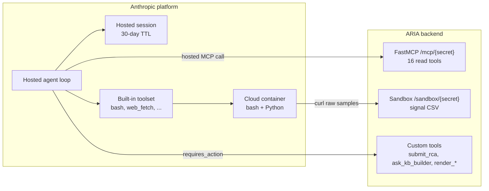
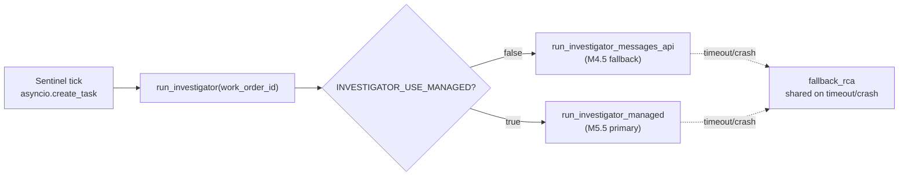
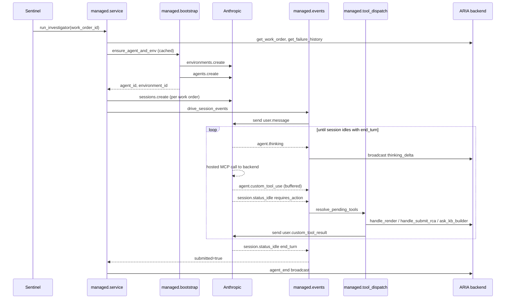
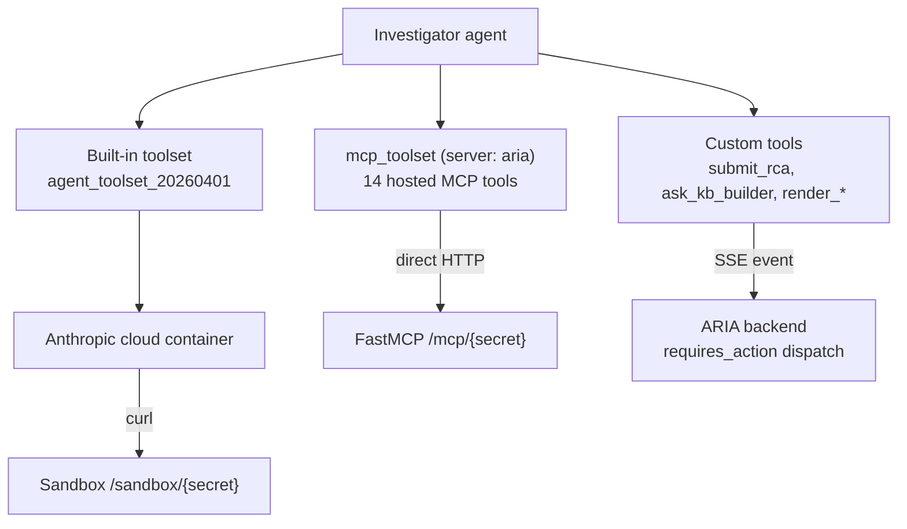

# M5.5 — Managed Agents

> [!NOTE]
> ARIA's Investigator runs on Anthropic Managed Agents. The hand-rolled Messages-API loop that originally shipped in M4 is kept on disk as a five-minute rollback (`INVESTIGATOR_USE_MANAGED=False`), but the production path is hosted: Anthropic owns the agent loop, owns the session memory, executes tool calls directly against our MCP server, and runs a sandboxed Python container we use for numerical diagnostics. This document explains why we picked that path for one specific agent, what the platform gives us in return, and how the wiring is shaped.

---

## The architectural question

ARIA has five agents. Each one does a different job and has a different shape — turn count, latency budget, tool intensity, whether the user is watching the cursor blink. Managed Agents is not a free upgrade; it changes how the loop is driven, how state is held, how streaming is granular, how tools are dispatched. Putting the wrong agent on the platform is worse than not using it at all.

The first version of the integration (M5.4) put Q&A on Managed Agents because Q&A was the prize-eligible candidate that came to mind first. It worked, but the implementation had to artificially re-chunk Anthropic's `agent.message` blocks into fake `text_delta` frames every fifteen milliseconds to mimic token streaming. We were fighting the platform's grain. The audit at [docs/audits/M5-managed-agents-refactor-audit.md](../audits/M5-managed-agents-refactor-audit.md) reframed the question:

> Which of ARIA's agents matches the platform's target profile — long-running, asynchronous, tool-heavy, with a session worth resuming hours later?

Reading the five agents against that profile gives one answer:

| Agent                | Turn duration           | Tool intensity | Streaming need        | Persistence value    |
|----------------------|-------------------------|----------------|-----------------------|----------------------|
| Investigator         | 12 turns / 120 s budget | High           | Block-level is fine   | High (resume per WO) |
| Q&A                  | Sub-second per turn     | Often zero     | Token-level mandatory | None (per WS)        |
| Sentinel             | One LLM-free 30 s tick  | One            | None                  | None                 |
| Work Order Generator | 6 turns / 60 s budget   | Low            | None                  | None                 |
| KB Builder           | Onboarding session      | Low            | None                  | Per-cell, ad-hoc     |

The Investigator is the only profile that fits, and the migration deletes more code than it adds. M5.5 is the pivot.

---

## What we gain

Four platform mechanisms make the migration worth doing. Each one removes complexity from our backend or unlocks a capability we cannot replicate ourselves.

### Hosted agent loop

Anthropic runs the `for _turn in range(...)` loop server-side. Our backend sends one `user.message`, then consumes a server-sent event stream and reacts. We no longer maintain a `messages: list` accumulator, no longer reconstruct signed `thinking` blocks turn-over-turn, no longer wrap `messages.stream` in a per-turn token budget. The hand-rolled `_llm_call` from the Messages-API path is replaced by an event consumer that branches on `event.type`. Two-thirds of the original loop body went away.

### Hosted session memory

Each work order gets its own Anthropic session. When the Investigator calls `submit_rca`, we persist the `session_id` on the `work_order` row (migration `009_work_order_investigator_session_id.up.sql`). The session — full reasoning trace, full tool history, full mid-investigation context — stays alive on Anthropic's side for thirty days. This is what makes the *Continue investigation* UX architecturally cheap: an operator on a later shift opens the same work order, the backend resumes `sessions.events.stream(session_id)`, and the agent answers follow-up questions from its own memory rather than from the static `rca_summary` text. We do not store conversation history; the platform does.

### Sandboxed cloud container

Managed Agents enables a built-in toolset (`agent_toolset_20260401`) that includes `bash`, `read`, `write`, `edit`, `glob`, `grep`, `web_fetch`, `web_search`. The Investigator's environment pre-installs `numpy`, `pandas`, `scipy` so the first session does not pay a thirty-to-sixty-second `pip install` cold-start. The agent then runs *real* numerical diagnostics — FFT on vibration spectra, linear regression for time-to-trip, Pearson correlation across coupled signals — instead of the prose arithmetic the Messages-API path was limited to. The diagnostic rules and the `Sandbox:` prefix that pins numerical output into the RCA live in [`agents/investigator/prompts.py`](../../backend/agents/investigator/prompts.py).

The container has no access to our database. To pull raw samples it curls a path-secret-gated FastAPI sub-app at `/sandbox/{secret}/signal/{id}/csv` which streams a `timestamp,value` window. That endpoint is the only data plane between Anthropic's container and our plant.

### Hosted MCP

Anthropic calls our MCP server directly when the agent invokes one of the fourteen MCP tools. ARIA's FastAPI process is no longer in the loop for tool execution — only for the three custom-tool families that genuinely need our backend (`submit_rca`, `ask_kb_builder`, `render_*`). This is the single biggest code-deletion driver of the migration: the dispatcher branch that used to wrap every MCP tool as a custom tool went away.

---

## Two execution paths, one entry point

`run_investigator(work_order_id)` is the only function Sentinel calls. It branches on a single setting:

Both paths share the same external contract: `agent_start` and `agent_end` broadcasts on the events bus, the same `submit_rca` write to `work_order`, the same `failure_history` row insert, the same handoff into the Work Order Generator. Switching between them is a flag flip — the rest of the system does not notice. This is deliberate: it lets us compare cost, latency, and quality between hosted and self-driven on the same demo flow, and it leaves a real escape hatch on demo day.

The shared `fallback_rca` writer is what makes the contract uniform. Whether the failure is a Messages-API timeout, a Managed Agents `retries_exhausted`, a hosted-MCP network blip, or an agent that ended its turn without ever calling `submit_rca`, the work order ends in `status='analyzed'` with an explanatory `rca_summary` and the operator-visible UI never gets stuck.

---

## Lifecycle of one investigation

The managed path is split into four concerns that mirror the four phases of a Managed-Agents-driven request: *bootstrap the agent definition*, *open a session*, *consume events*, *resolve custom-tool calls*. Each one lives in its own module under `backend/agents/investigator/managed/`.

Three lifecycle properties shape the implementation:

**Lazy, locked bootstrap.** The agent definition and the cloud environment are immutable once created — only the session changes per work order. We cache `(agent_id, environment_id)` process-wide and gate the first creation behind an `asyncio.Lock` so two concurrent Sentinel alerts on a fresh boot cannot race to create duplicate agents. The cache survives until process restart; the lock-gated creation runs at most once per process.

**Per-work-order session.** Sessions are never reused across investigations. A new session per work order keeps the conversation context tightly scoped, makes the `investigator_session_id` column meaningful as a pointer to *this* investigation's reasoning, and avoids cross-incident contamination of the agent's memory.

**Wall-clock budget on the outer call.** The managed body is wrapped in `asyncio.wait_for(..., timeout=180.0)` plus an outer `try/except`. The timeout is 50% longer than the Messages-API path (180 s vs 120 s) because hosted-MCP round-trips travel Anthropic → Cloudflare → our FastAPI rather than an in-process loopback. This is the same three-net safety contract every long-running ARIA agent follows; see [decisions.md](./decisions.md#safety-nets-on-every-agent-loop).

---

## How tool calls route

The agent definition exposes three tool categories. Each one takes a different path back to ARIA:

**Built-in tools execute inside Anthropic's container.** No round-trip to ARIA. The container needs raw signal samples for diagnostics; it gets them by curl-ing the path-secret-gated sandbox endpoint.

**MCP tools execute inside ARIA, but Anthropic calls them directly.** The hosted MCP server is registered in two places that must agree: a `mcp_servers` declaration with the public URL, and an `mcp_toolset` entry in the `tools` array referencing that server name. Without the second declaration the platform refuses to start. The `mcp_toolset` config also sets `permission_policy: always_allow`, otherwise the agent stalls on every MCP call waiting for a human approval that never arrives.

**Custom tools idle the session and wait for ARIA.** When the model emits a custom-tool call, the session reaches `status_idle` with `stop_reason.type == "requires_action"` and a list of `event_ids` to resolve. Our dispatcher buffers each `agent.custom_tool_use` by id as it arrives, then on `requires_action` runs each one through the existing handlers in `agents.investigator.service` and `agents.investigator.handoff` and posts back a `user.custom_tool_result`. Zero handler logic is duplicated between the Messages-API path and the managed path.

> [!IMPORTANT]
> Hosted-MCP tool ids appear in the same `requires_action.event_ids` list as custom-tool ids but are not custom-tool events. Sending a `user.custom_tool_result` for one of them returns `400 tool_use_id ... does not match any custom_tool_use event in this session`. The dispatcher recognises ids it has not buffered and silently skips them — Anthropic resolves those itself via the `/mcp/{secret}` endpoint.

---

## How auth works without auth headers

Anthropic's `mcp_servers` config does not support custom HTTP headers. OAuth and vault provisioning is several days of work and adds zero demo value. We needed a third option.

The MCP and sandbox sub-apps mount at `/mcp/{aria_mcp_path_secret}` and `/sandbox/{aria_mcp_path_secret}` respectively. The URL itself is the bearer token. The path secret is generated with `openssl rand -hex 32` and stored in `.env` only — it is the same secret across the loopback `MCPClient` and the Cloudflare-tunneled public URL Managed Agents calls into, so rotating the secret rotates both transports atomically. There is no per-request auth on either mount; an attacker with the URL has read access to the MCP read tools and to the signal CSV stream, which is the threat model we are accepting for the demo. The trade-off is documented in [decisions.md](./decisions.md#path-secret-url-as-the-mcp-auth-mechanism).

The Cloudflare tunnel that exposes the public URL ships as a compose profile in `docker-compose.yaml` (`docker compose --profile tunnel up`). When `ARIA_MCP_PUBLIC_URL` is empty the managed bootstrap refuses to start rather than silently falling back to wrapping MCP tools as custom tools — that fallback would re-create the M5.4 anti-pattern.

---

## Where the platform's contract bit us

Three of the seven cascade fixes in the M5.5 end-to-end test report are platform-shaped and worth knowing about before working on this code.

**Schemas with `additionalProperties` are rejected.** The Messages API tolerates the field; Managed Agents (`managed-agents-2026-04-01`) returns *"Extra inputs are not permitted"*. The bootstrap walks every custom-tool input schema recursively and strips the field before submitting the agent definition. The same Pydantic-generated schemas are reused unchanged on the Messages-API path.

**Tool-result payloads can overflow the context window.** The first end-to-end run returned 575k tokens from a single `get_signal_trends` call on a three-hour, four-signal, one-minute query. The platform's built-in compaction works at conversation grain, not tool-result grain, so the fix had to land in our MCP tools: `get_signal_anomalies` now aggregates consecutive breach samples into structured *breach windows* (240x reduction on the same query), and `get_signal_trends` enforces a hard 500-row cap with a `_truncated` hint so the LLM can self-correct. Both fixes apply on the Messages-API path too — the migration improved cost and latency on the existing path even though the trigger came from hosted MCP. See [decisions.md](./decisions.md#token-budget-hardening-breach-windows-and-trend-caps).

**Extended thinking is not a `create()` kwarg.** The Messages-API path enables thinking with `thinking={"type": "enabled", "budget_tokens": 10000}` per call. The Managed Agents `agents.create` API surface is intentionally narrow and the platform owns the thinking budget — we cannot configure it. Reasoning still surfaces, but at block-level via `agent.thinking` events rather than per-chunk `thinking_delta`. The Agent Inspector renders one frame per reasoning block instead of many per second; the live trace still works, just with coarser resolution.

---

## Configuration that matters

Three settings drive the path:

- `INVESTIGATOR_USE_MANAGED` — flag that selects Messages API vs Managed Agents. Off by default. Flipping it is the rollback path.
- `ARIA_MCP_PATH_SECRET` — required; the 32-byte token that gates `/mcp` and `/sandbox`. The backend refuses to start if unset or placeholder.
- `ARIA_MCP_PUBLIC_URL` — the Cloudflare-tunneled public URL ending in `/mcp/{secret}`. Empty means the managed bootstrap raises before `agents.create`.

`managed_agents_beta` is pinned in code (`managed-agents-2026-04-01`) so an SDK upgrade does not silently break the integration before the feature goes GA.

---

## Audits and references

- [docs/audits/M5-managed-agents-refactor-audit.md](../audits/M5-managed-agents-refactor-audit.md) — the audit that drove the M5.4 → M5.5 pivot. §3 frames the Investigator as the right target; §6.5 sketches the *Continue investigation* and *in-sandbox Python diagnostics* differentiation add-ons.
- [docs/audits/M5.5-end-to-end-test-report.md](../audits/M5.5-end-to-end-test-report.md) — full live-test report with the seven cascade fixes that landed during the migration.
- [decisions.md](./decisions.md#two-paths-messages-api-vs-managed-agents) — the four most relevant ADRs: path-only auth, hosted-MCP wiring quirks, `additionalProperties` stripping, breach-window token hardening.

---

## Where to next

- The M4.5 Messages-API Investigator that this path replaces (and that stays as the rollback): [04-sentinel-investigator.md](./04-sentinel-investigator.md#investigator--the-rca-agent).
- The Q&A agent that stayed on the Messages API for the deliberate streaming-grain reason: [05-workorder-qa.md](./05-workorder-qa.md#qa--operator-chat).
- The full WebSocket frame catalogue: [cross-cutting.md](./cross-cutting.md#websocket-contracts).
- The architecture decisions that shaped the wiring: [decisions.md](./decisions.md).
