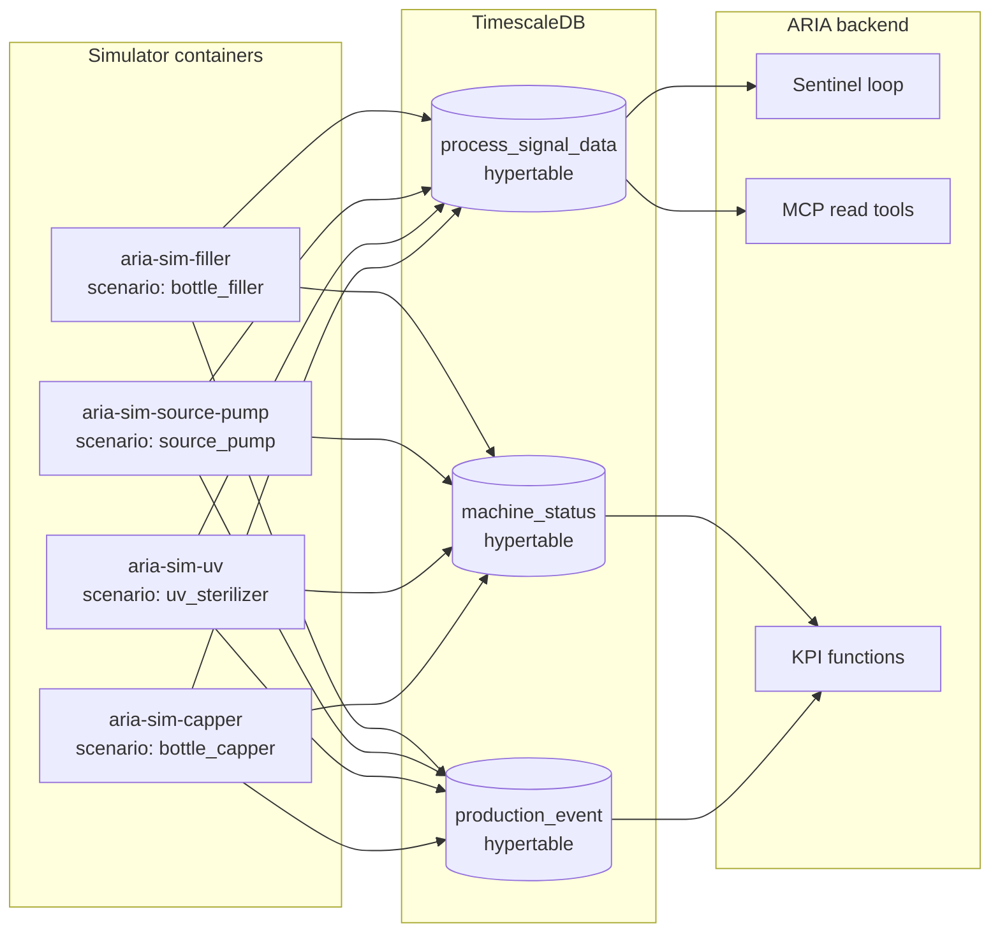
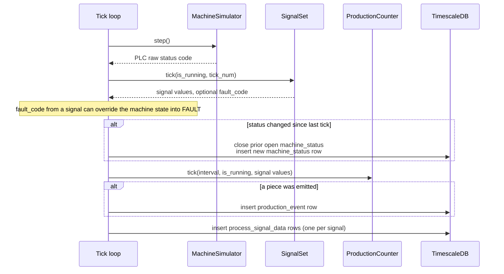
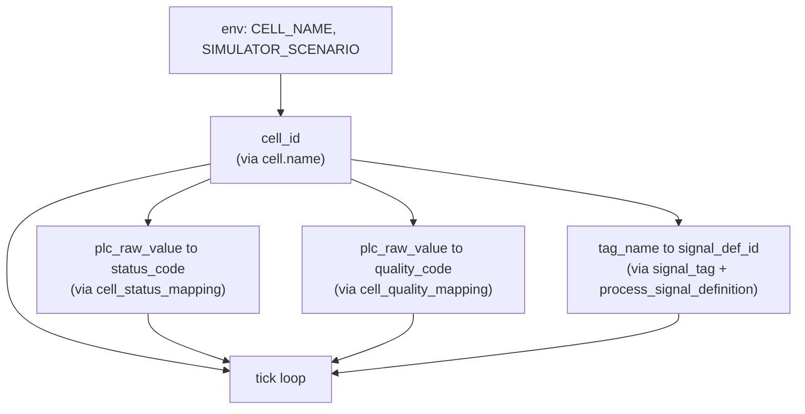

# Simulators

> [!NOTE]
> ARIA does not own a real bottling line. The simulators are what make the demo feel like a live plant: one container per cell, each running a configurable Markov state machine plus a stack of composable signal generators that write `machine_status`, `production_event`, and `process_signal_data` rows directly into TimescaleDB. They are how a bearing-failure drift, a seal-leak signature, or a UV-lamp aging curve becomes data the agents can actually detect, correlate, and explain. This document covers how the engine works, how a scenario is shaped, and how the simulator and the database are bound together at startup.

---

## Why simulators exist

The demo runs a five-cell bottled-water line — Source Pump, UV Sterilizer, Bottle Filler, Bottle Capper, Bottle Labeler. None of those machines are physically present. The product story we sell is *"ARIA reads your manual, calibrates with the operator, watches your equipment continuously, raises an alert before a failure, runs an RCA, and prints a work order"* — that pitch needs four things to be true on stage:

1. Real-time data is flowing into the database every second.
2. A specific equipment failure unfolds during the rehearsal window — not too fast, not too slow.
3. The signal trace looks plausible to a maintenance engineer in the room (drift rate, noise floor, fault threshold).
4. The story is reproducible: same scenario, same outcome, every demo run.

A real plant satisfies (1) and (3) but fails (2) and (4). A flat synthetic dataset satisfies (4) but fails (1) and (3). The simulators sit between those extremes: they run continuously, emit time-correlated rows for every relevant table, and let us encode each failure scenario as a configuration file rather than a script. Drift rates, fault thresholds, transition probabilities, and quality distributions are all parameters.

---

## Topology

Each monitored cell gets its own simulator container. They run independently, share no state, and write to the same database. The Bottle Labeler — the demo's onboarding target — is intentionally signal-less: it is the cell the operator onboards mid-presentation.

The simulator code itself lives at the repo root in `simulator/`, separate from the backend, and ships as a single `python:3.12-alpine` image. The same image runs every container — what differs is just two environment variables (`SIMULATOR_SCENARIO`, `CELL_NAME`). The Dockerfile is twelve lines; the runtime depends on `asyncpg` only.

---

## What a tick does

Every simulator runs the same loop: connect to TimescaleDB, resolve database identifiers for the configured cell, then tick once per second until a signal kills the process. One tick advances three coupled state machines and writes between zero and three rows.

Three coupling rules give the data its realism:

- **Status changes are sparse.** A new `machine_status` row is written only when the PLC raw status code changes between ticks. Each row carries an `end_time` that the next status row backfills, so any window query can reconstruct durations without a scan over per-tick rows.
- **Signals can drive faults, not just react to them.** A breached `fault_trigger` returns a fault code from `SignalSet.tick`; the loop then forces the machine into `FAULT` with that specific code. This is how a vibration spike becomes a `FAULT:VIBRATION` machine state, not just a high reading sitting on a green status.
- **Production is signal-driven.** In `accumulator` mode the counter integrates a flow signal over time and emits a piece every N litres. Stop the machine and flow goes to zero — the counter freezes automatically without a separate "is the machine running" branch in the production code.

---

## The three engine pieces

The engine is deliberately small and composable. Each piece owns one concern; configuration glues them together. None of them know about the database — that lives in the loop in `main.py`.

### MachineSimulator — the Markov state machine

`MachineSimulator` advances a four-state macro chain (`stop`, `run`, `fault`, `pause`) with config-supplied transition probabilities, then maps the current macro to a specific PLC status code. The macro chain is the abstraction; the PLC code is what the database stores. When the chain enters `fault`, a specific fault code is sampled from the configured `fault_codes` list — that is how one cell can express both `FAULT:VIBRATION` and `FAULT:TEMPERATURE` from the same configuration.

The transition step uses sequential Bernoulli trials rather than cumulative sampling. For each possible target from the current state, an independent random check decides whether that transition fires; the first one wins, otherwise the state holds. With small probabilities (under 0.01) this is mathematically equivalent to cumulative sampling but reads more directly as configuration: `{"run": {"stop": 0.0003, "fault": 0.0002}}` is exactly what the chain does per tick.

### SignalSet — composable signal behaviors

Every signal is the sum of a stack of behaviors. The order matters; the stack is fixed at:

1. Update the drift accumulator (a slow monotonic walk used for wear / fouling / aging).
2. Compute base value as `setpoint + drift + gaussian noise + sinusoidal`.
3. If the machine is not running, override with the `on_stop` behavior (zero out, or decay toward a target).
4. If the signal is `derived_from` another signal, override with `source × factor + offset`.
5. If the signal is in `level` mode, integrate a level-style accumulator with clamping.
6. Check the `fault_trigger` against the final value; return a fault code if breached.

That stack is the entire vocabulary for shaping a signal. The Bottle Filler's bearing-failure scenario uses three of the slots: a slow upward drift on vibration, a derived bearing temperature that follows it, and a fault trigger on vibration above the KB alert threshold. The Source Pump's seal-leak signature uses a different combination. Adding a new failure type is almost always a new combination of existing slots, not new code.

`SignalSet` resolves dependencies before evaluation: derived signals are sorted topologically so a derived `bearing_temp` always sees its source `vibration` value from the same tick rather than the previous one.

### ProductionCounter — three counting strategies

Production has three modes selectable by configuration. They differ in how a tick decides to emit a piece:

| Mode            | When a piece is emitted                                                     | Use case                                                                               |
|-----------------|-----------------------------------------------------------------------------|----------------------------------------------------------------------------------------|
| `cycle`         | Accumulated time across ticks reaches `ideal_cycle_ms`.                     | Discrete-piece equipment with a known cycle time (capper, labeler).                    |
| `probabilistic` | A per-tick coin flip clears `cycle_chance`.                                 | Coarse approximation when cycle time varies a lot.                                     |
| `accumulator`   | Integrated `source_signal × interval / time_unit` reaches `unit_per_count`. | Continuous-flow equipment (filler counts pieces per N litres pumped, pump per 1500 L). |

After a piece is emitted, a quality code is sampled: `0` (good) with probability `good_rate`, otherwise a uniformly random pick from `quality_bad_codes`. The expanded quality code list (`OUT_OF_SPEC`, `LOW_FILL`, `CAP_DEFECT`, `LABEL_DEFECT`, `BOTTLE_DAMAGE`) is what makes the Quality Pareto chart on the Equipment page render with meaningful buckets instead of a single "good vs bad" split. KPI math treats every non-conformant code identically — they all count as `bad_pieces`.

---

## Scenarios are configuration, not code

A scenario module exposes one function: `build(mode: str) -> dict`. The dict has three keys (`machine`, `signals`, `production`) that feed the three engine classes verbatim. Drift rates, transition probabilities, fault thresholds, signal noise floors, derived relationships — all are dict values. The engine itself never grows when a new failure mode is added.

The Bottle Filler scenario is the demo star. Its essential configuration choices encode the bearing-failure story:

- **Vibration drifts upward while running.** `setpoint=2.2 mm/s` (nominal, healthy bearing), `drift.rate_run=5e-3` per tick in demo mode, `drift.max=3.4` so the asymptote settles at `5.6 mm/s` — comfortably past the KB `vibration_mm_s.alert` threshold of `4.5 mm/s`. The drift is calibrated so that a four-minute demo run actually crosses the threshold during rehearsal.
- **Bearing temperature follows vibration.** Configured as `derived_from: filler_vibration` with `factor=6.0, offset=35.0`. At `2.2 mm/s` vibration the temp reads `48 °C`; at `4.5 mm/s` it reads `62 °C`. The two signals stay correlated automatically, giving the Investigator a real Pearson correlation it can compute in the sandbox.
- **A fault trigger above the alert threshold.** `fault_trigger: {above: 4.5, fault_code: 3}` — once vibration breaches, the next tick forces the machine into `FAULT:VIBRATION`, which is what the operator sees as a hard stop.
- **Production runs on flow.** The `accumulator` mode integrates `filler_flow` over time, emitting one piece per 1000 L pumped. When a fault stops flow, production naturally halts — there is no separate "stop counting on fault" rule.

> [!IMPORTANT]
> Every scenario's signal *names* must match `signal_tag.tag_name` rows seeded in migration `006_aria_demo_plant.up.sql` — the simulator resolves the `signal_def_id` for each signal by name at startup. A typo in a scenario file silently drops the signal at insert time. Likewise, the `fault_codes` and `pause_codes` arrays must match the `cell_status_mapping` rows for that cell, otherwise faults emit with no end state.

---

## Demo mode versus realtime mode

Every scenario takes a `mode` argument with two valid values: `demo` and `realtime`. The same engine code runs in both; what changes are the parameter calibrations.

In `realtime` mode the drift rates are tuned for the actual plant clock. The Bottle Filler bearing-failure asymptote is meant to take 72 hours of running time to climb from `2.2` to `5.6 mm/s` — `1.2 / (72 × 3600) ≈ 4.6e-6` per tick. Transition probabilities are similarly slow: a STOP-to-RUN transition fires with probability `0.015` per tick, faults are rarer than once per hour. This is what we run for soak tests and any video that needs to look like a real plant.

In `demo` mode the same drift covers the same range in roughly four wall-clock minutes — the rate is bumped to `5e-3` per tick, three orders of magnitude faster. Transition probabilities are pumped up too so the machine cycles through STOP, RUN, PAUSE, FAULT visibly during a rehearsal. The point is to compress the predictive-maintenance story into the rehearsal window without rewriting either the engine or the failure thresholds. Demo mode is the default for every scenario container in `docker-compose.yaml`.

---

## How a simulator binds to the database

Each container starts with the cell name and the scenario name in environment variables. Three database identifiers are resolved at startup before the tick loop opens:

The maps are not just lookup conveniences — they are the boundary between *what the scenario knows* (PLC raw values, signal tag names) and *what the database stores* (resolved foreign keys). The scenario can be reused across cells with different mappings: the same `bottle_filler` scenario shape could be rerun against a different physical cell by repointing `CELL_NAME`, as long as the corresponding `cell_status_mapping` and `signal_tag` rows exist. Migration `006_aria_demo_plant.up.sql` is what populates those mappings for the demo plant.

On startup the simulator also closes any `machine_status` row left dangling without an `end_time` from the previous run — otherwise a restart would leave a duration hole that `fn_status_durations` would treat as the cell having been in that state for the entire downtime. On graceful shutdown the final open status row is closed with the current timestamp for the same reason. The status table is meant to be a continuous covering of time per cell; the simulator is responsible for keeping it that way across process boundaries.

---

## What the simulators do not do

They do not write to `equipment_kb`, `work_order`, or `failure_history`. Those tables are agent territory. The simulators stay strictly on the operational hypertables (`machine_status`, `production_event`, `process_signal_data`) and the immutable reference tables they depend on. This separation is what lets the agent stack be tested end-to-end against simulated input without any awareness that the data was synthetic — the schema, indexes, and constraints are identical to the production deployment shape.

They also do not emit alerts, work orders, or any LLM-facing signal. A vibration breach inside the simulator triggers a *machine state change* (the `fault_trigger` returns a fault code that flips the macro to `FAULT`); detecting that breach as an *anomaly* is Sentinel's job, reading the same data the simulator just wrote. The two systems are decoupled: replace the simulators with a real PLC integration and Sentinel does not change.

---

## Where to next

- The operational tables the simulators write to and the OEE / MTBF / MTTR / quality math built on top of them: [09-kpi-and-telemetry.md](./09-kpi-and-telemetry.md).
- The Sentinel loop that detects breaches in the simulated signal stream: [04-sentinel-investigator.md](./04-sentinel-investigator.md).
- The agent-facing data layer (KB, work orders, failure history): [01-data-layer.md](./01-data-layer.md).
- The MCP tools the agents use to read this data: [02-mcp-server.md](./02-mcp-server.md).
