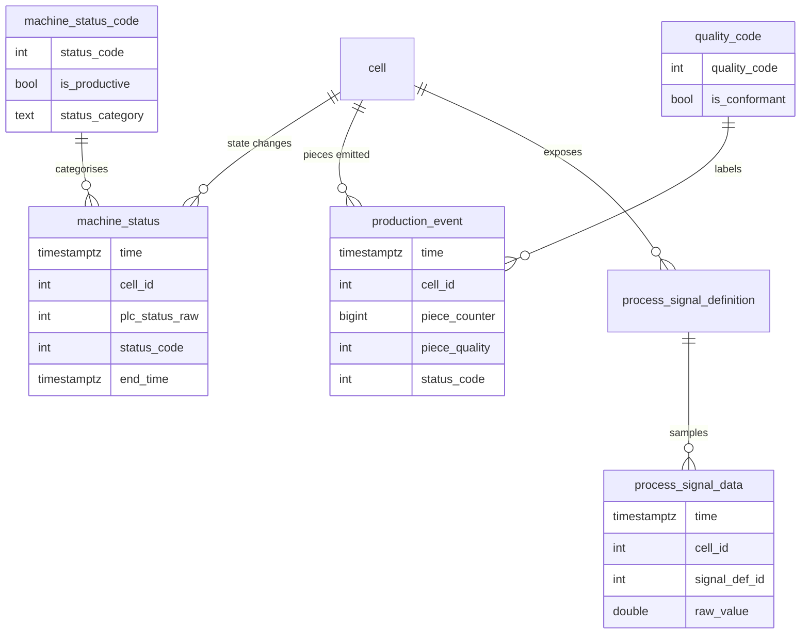
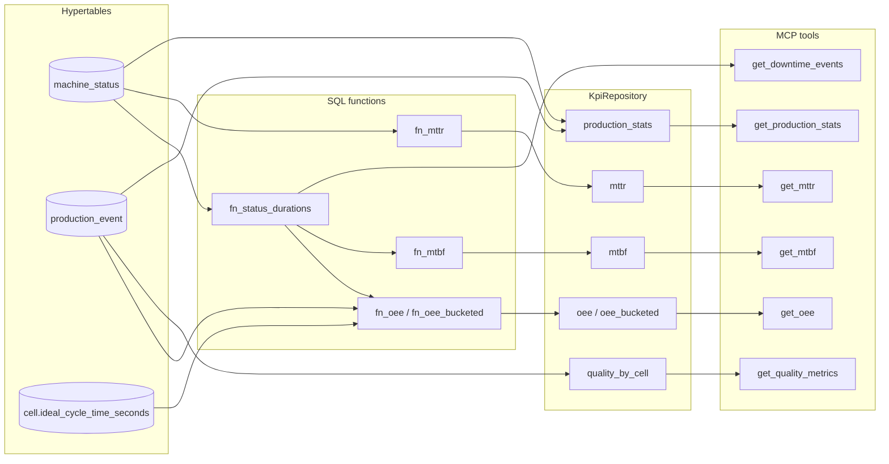

# Operational Data and KPIs

> [!NOTE]
> Three TimescaleDB hypertables hold the running pulse of the plant: `machine_status`, `production_event`, and `process_signal_data`. Five SQL functions and a thin repository layer turn those rows into the operational KPIs the product ships with — OEE (availability × performance × quality), MTBF, MTTR, downtime breakdown, quality metrics, production stats. The agent-facing data layer ([01-data-layer.md](./01-data-layer.md)) covers the JSONB columns the agents *write*; this document covers the time-series surface the agents *read* and the math built on top of it.

---

## Why the operational tables sit apart from the agent state

ARIA's data has two distinct shapes and they map to two distinct storage strategies. The agent state is structured documents (a knowledge base profile, a work order, a failure history row) that need rich validation and JSONB indexing — the M1 layer. The operational state is a continuous stream of timestamped events and samples that needs append-only writes, time-bucket aggregation, and millisecond-resolution range scans — the layer documented here.

Mixing them would be a mistake in both directions: putting JSONB documents on a hypertable would waste the time-bucketing machinery, and putting one-row-per-second signal samples on the regular agent tables would crush them under the volume that TimescaleDB's chunking handles natively. Keeping the two layers physically separate means each one can be sized, indexed, and queried for what it actually does.

The KPIs are not pre-aggregated into a separate table. They are computed on demand by SQL functions that read straight from the hypertables. This means a "what was OEE at 14:32 last Tuesday?" query is a real range scan rather than a lookup against a stale rollup — the data the demo shows is always the most recent ground truth.

---

## The three hypertables



**`machine_status` — sparse state changes with explicit ranges.** A row is written only when the PLC raw status code changes. Each row carries an `end_time` that the next status row backfills, so any window query reconstructs durations directly without scanning per-tick rows. The pair `(time, end_time)` is what every KPI function aggregates against.

**`production_event` — one row per emitted piece.** Carries the piece counter, the quality code, and the machine status that was active at emit time. The status is denormalised onto the row deliberately: it lets quality-by-status queries run without a temporal join back to `machine_status`. A bottle is good or off-spec, and we know whether the line was nominally running or limping when it produced it.

**`process_signal_data` — one row per signal per tick.** This is the highest-volume table by orders of magnitude. TimescaleDB's chunking handles the volume; the indexes (`(signal_def_id, time DESC)` and `(cell_id, time DESC)`) make per-signal range scans cheap. Sentinel reads from this table indirectly (via `get_signal_anomalies`); the Investigator reads from it via `get_signal_trends` and via raw-CSV pulls into the cloud sandbox container.

> [!IMPORTANT]
> The simulators are the writers ([08-simulators.md](./08-simulators.md)). They are responsible for keeping `machine_status` continuously covering: every gap is treated by `fn_status_durations` as the cell having been in some state, so a missing row would produce wrong KPIs. The simulator startup logic explicitly closes any dangling open row from a previous run; a restart that crashes mid-tick is the failure mode to watch for.

---

## Reference tables — the small-data backbone

Two reference tables make the math possible without LLM-aware columns being scattered across the schema.

`machine_status_code` declares both *what* a status means (`STOP`, `RUN`, `FAULT`, `PAUSE`, `MAINTENANCE`, `CHANGEOVER`) and *what category* it belongs to (`running`, `unplanned_stop`, `planned_stop`). The category is what the OEE math actually keys on — availability does not care whether a stop was a `FAULT` or a `PAUSE` so long as it was unplanned. A `CHECK` constraint pins the category to those three values; new status codes get categorised at seed time, not at query time.

`quality_code` declares whether a code counts toward `good_pieces` (`is_conformant=TRUE`) or `bad_pieces` (`is_conformant=FALSE`). The expanded code list (`GOOD`, `OUT_OF_SPEC`, `LOW_FILL`, `CAP_DEFECT`, `LABEL_DEFECT`, `BOTTLE_DAMAGE`) gives the Quality Pareto chart meaningful buckets while OEE quality math collapses everything non-conformant into a single denominator.

These tables are seeded once and rarely change. They are the contract every KPI function reads against; adding a new status code or quality code is a seed insert, not a code change.

---

## The duration helper everything builds on

Every KPI function in the system delegates time-window arithmetic to one helper:

```sql
fn_status_durations(p_cell_ids int[], p_window_start timestamptz, p_window_end timestamptz)
    -> TABLE(cell_id, status_code, duration_secs)
```

It takes a list of cells and a window, finds every `machine_status` row that overlaps the window, clips each row's `(time, end_time)` to the window edges, and sums the resulting seconds per `(cell_id, status_code)`. An open row (`end_time IS NULL`) is treated as ending at `NOW()` so the live cell contributes its current state up to the present.

This function is the only place where window-clipping logic lives. OEE, MTBF, the downtime breakdown — all read against it. Adding a new KPI that needs "how many seconds was cell X in status Y between A and B?" means joining `fn_status_durations` to `machine_status_code`, not reimplementing the clipping arithmetic.

---

## OEE — the headline KPI

OEE (Overall Equipment Effectiveness) is the product of three orthogonal ratios:

```
availability  = running_seconds / (running_seconds + unplanned_stop_seconds)
performance   = (total_pieces × ideal_cycle_time_seconds) / running_seconds
quality       = good_pieces / total_pieces
oee           = availability × performance × quality
```

`fn_oee` returns the four values for a given cell list and window. Each one is in `[0, 1]` or `null` when its denominator is zero (no production events, no running time, etc.) — the function does not silently return `0` for an undefined ratio.

Three implementation choices are worth knowing about:

**Per-cell averaging, not pooled.** When `cell_ids` contains more than one cell, `fn_oee` computes availability/performance/quality *per cell first*, then averages the three ratios across cells. The naive alternative — summing `running_seconds` across cells, summing `total_pieces` across cells, dividing — would inflate Performance whenever the pooled cells have very different cycle times. A fast capper averaged with a slow filler would look as if the slow cell had the fast cell's productivity. Per-cell-then-average is the only formulation that preserves the meaning of each ratio at the line level.

**Performance keys on `cell.ideal_cycle_time_seconds`.** Every cell row carries one calibration field — the cycle time we benchmark against when computing performance. The demo seed uses `50.0` seconds per cell rather than the textbook value (`180 bpm` is roughly `0.33 s` per piece) because the simulators emit at sub-Hz rates: the textbook number would crush performance to single-digit percent against any realistic simulated production volume. The seed comment in `006_aria_demo_plant.up.sql` documents this explicitly. Adjusting the calibration is a seed change; the math stays.

**Planned stops are excluded from availability.** The denominator is `running + unplanned_stop`, not total window seconds. A scheduled maintenance window does not count against the cell — it is on plan. The OEE definition this implements is the textbook one: the *availability loss* is downtime that should not have happened.

`fn_oee_bucketed` does the same math but returns one row per `(time_bucket, cell_id)` pair so the frontend can render an OEE trend. The `time_bucket` window is configurable via the `bucket_minutes` parameter on `get_oee`.

---

## MTBF and MTTR — reliability metrics

```
mtbf  = total_running_seconds_in_window / number_of_unplanned_stops_in_window
mttr  = average duration of unplanned_stop intervals overlapping the window
```

`fn_mtbf` divides the cumulative running time by the count of unplanned-stop rows that *started* inside the window. `fn_mttr` averages the clipped duration of every unplanned-stop row that *overlaps* the window. The asymmetry is intentional: MTBF is "how often do failures happen?", which is naturally counted per-event, while MTTR is "how long do they take?", which is naturally a duration average.

Both functions return `null` when their denominator is zero. A cell that did not fault during the window has *undefined* MTBF (not infinite), and a cell with no unplanned stops has *undefined* MTTR (not zero). Surfacing the null upward — as the `MaintenanceKpiDTO` does — is what lets the UI render a "—" instead of a misleading number.

The functions only see *unplanned* stops. Planned stops, changeovers, and pauses are excluded from both reliability metrics by joining on `machine_status_code.status_category = 'unplanned_stop'`. A maintenance window does not look like a failure to the system, which is what makes MTBF a meaningful trend across rolling weeks.

---

## Downtime, quality, and production stats

The raw KPI functions answer *"how good is this cell?"*. Three additional MCP tools answer *"what specifically went wrong, and what got produced?"* — they sit on the same hypertables but slice differently.

| Tool                     | What it returns                                                                                                | Built on                                                                |
|--------------------------|----------------------------------------------------------------------------------------------------------------|-------------------------------------------------------------------------|
| `get_downtime_events`    | Total seconds spent in each (`status_category`, `status_name`) pair for the window, sorted by total descending. | `fn_status_durations` joined to `machine_status_code`.                  |
| `get_quality_metrics`    | Per-cell `total_pieces` / `good_pieces` / `bad_pieces` / `quality_rate` (or null when no production).           | `production_event` joined to `quality_code`, grouped by cell.           |
| `get_production_stats`   | Window aggregate: productive seconds, unplanned-stop seconds, planned-stop seconds, plus piece counts.         | `fn_status_durations` plus a piece-count aggregation over the same window. |

The downtime breakdown is the structure the Investigator agent works from. The audit decision behind the M2.3 design was to expose downtime as *"where did the downtime go?"* rather than as raw event rows: an LLM does not need a thousand `machine_status` records to answer "the cell was down for 47 minutes; 38 of them were `FAULT:VIBRATION`, 9 were `PAUSE:MAINTENANCE`". Aggregation is the contract the tool returns.

The quality metrics tool is what the Q&A agent answers natural-language questions against: *"how many off-spec pieces today?"* runs as one MCP call rather than as a multi-turn investigation. The `quality_rate` is `null` when there is no production in the window — a cell that did not run produces no quality signal, and surfacing the null is what keeps the UI honest.

The production stats tool is the cheapest of the three. It returns one aggregated row across all requested cells and is what the Q&A agent reaches for when asked about totals (*"what was our production last week?"*). It does not break results down by cell — `get_quality_metrics` is the per-cell view if that is what the question needs.

---

## How the KPI surface is exposed



The layering is deliberate: SQL functions own the math, the repository owns the typed Pydantic boundary, the MCP tool layer owns the LLM-facing contract. An agent never touches `asyncpg` directly — it goes through `MCPClient`, which goes through FastMCP, which goes through `KpiRepository`, which calls the SQL functions. Replacing TimescaleDB with a different time-series store would be a repository-level change; the tools and the agents above them would not move.

---

## The calibration knobs

Three values determine what the KPI math produces. All three are seed values; none are baked into code.

| Knob                                | Owned by                          | Purpose                                                                                                                                  |
|-------------------------------------|-----------------------------------|------------------------------------------------------------------------------------------------------------------------------------------|
| `cell.ideal_cycle_time_seconds`     | `006_aria_demo_plant.up.sql`      | Performance benchmark per cell. Lower means the cell is expected to produce faster; performance ratios scale linearly against this.      |
| `machine_status_code.status_category` | `004_seed_reference.up.sql`       | What "running" / "unplanned_stop" / "planned_stop" mean. OEE availability and MTBF / MTTR all read this column to decide what counts.   |
| `quality_code.is_conformant`        | `004_seed_reference.up.sql`       | Whether a piece counts toward `good_pieces` or `bad_pieces`. Adding a new defect mode is a seed insert, not a math change.               |

This is the architectural property the design was aiming for: changing what "good" or "running" means is data, not code. The same KPI definitions work whether the demo is bottling water, capping bottles, or onboarding a brand-new cell mid-presentation.

---

## Where to next

- The simulators that write the rows the KPIs read: [08-simulators.md](./08-simulators.md).
- The agent-facing data layer (KB, work orders, failure history): [01-data-layer.md](./01-data-layer.md).
- The MCP tool surface that exposes these KPIs to the agents: [02-mcp-server.md](./02-mcp-server.md).
- The Sentinel loop that detects threshold breaches in `process_signal_data`: [04-sentinel-investigator.md](./04-sentinel-investigator.md).
