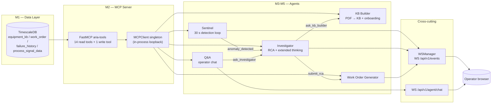
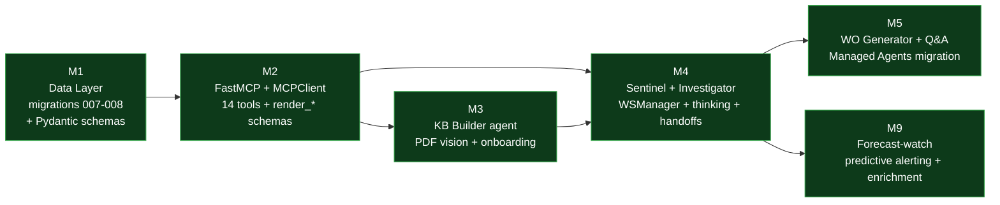

# ARIA Backend Architecture

> [!NOTE]
> Technical architecture documentation for the ARIA backend, covering Milestones M1 through M5 (data layer, MCP server, agents). The frontend is documented separately under [frontend/docs/](../../frontend/docs/).

This documentation is structured to serve two audiences in a single pass:

- **Overview readers** — the executive summary and the top diagram of each milestone document explain *what* ARIA does and *how* the pieces fit together. Reading this `README.md` plus the executive summary of each milestone doc is enough to understand the system end to end.
- **Deep-dive readers** — every section links down to concrete file paths, line ranges, and contracts. Engineers extending an agent, debugging a tool, or porting the architecture will find file references, schemas, and sequence diagrams sufficient to work without re-reading the source from scratch.

---

## Reading paths

| If you want to                                         | Read                                                         |
|--------------------------------------------------------|--------------------------------------------------------------|
| Understand the product end to end                      | This file, then [decisions.md](./decisions.md)               |
| Understand the data model                              | [01-data-layer.md](./01-data-layer.md)                       |
| Understand how agents access data                      | [02-mcp-server.md](./02-mcp-server.md)                       |
| Understand the onboarding flow (PDF → calibrated KB)   | [03-kb-builder.md](./03-kb-builder.md)                       |
| Understand anomaly detection and root-cause analysis   | [04-sentinel-investigator.md](./04-sentinel-investigator.md) |
| Understand the work order pipeline and operator chat   | [05-workorder-qa.md](./05-workorder-qa.md)                   |
| Understand predictive alerting and pattern enrichment  | [06-forecast-watch.md](./06-forecast-watch.md)               |
| Understand the WebSocket bus, auth, and shared helpers | [cross-cutting.md](./cross-cutting.md)                       |
| Understand why a non-obvious choice was made           | [decisions.md](./decisions.md)                               |

---

## What ARIA is

ARIA is an agentic predictive-maintenance platform for industrial operators. A multi-agent backend consumes time-series signals plus a structured equipment knowledge base (KB), detects anomalies in real time, runs root-cause analysis with extended thinking on Opus 4.7, generates printable work orders, and answers operator questions in natural language. Generative-UI artifacts (charts, diagnostic cards, work orders) are streamed directly into the operator's chat as the agents work.

The product premise is that 95 percent of industrial sites cannot afford the months of data-science work that traditional predictive maintenance configuration requires. ARIA collapses that into minutes by reading the manufacturer's PDF manual with Opus 4.7 vision, calibrating thresholds with the floor operator through a short dialogue, and then watching the equipment continuously.

The full product framing lives in [docs/ARIA_PRD.md](../ARIA_PRD.md). The backend documented here implements the agent topology, the data layer, and the MCP tool surface that makes that promise possible.

---

## System overview

---

## Component map

| Layer          | Module                                                                                           | Owner milestone | Purpose                                                                                                                  |
|----------------|--------------------------------------------------------------------------------------------------|-----------------|--------------------------------------------------------------------------------------------------------------------------|
| Data           | [backend/modules/](../../backend/modules/)                                                       | M1              | Domain repositories, Pydantic schemas, FastAPI routers per bounded context (kb, work_order, signal, kpi, logbook, etc.). |
| Data           | [backend/infrastructure/database/migrations/](../../backend/infrastructure/database/migrations/) | M1              | SQL migrations 001-009. The `equipment_kb` / `work_order` / `failure_history` extensions live in 007-009.                |
| Tools          | [backend/aria_mcp/server.py](../../backend/aria_mcp/server.py)                                   | M2              | `FastMCP("aria-tools")` instance, mounted at `/mcp/<path-secret>` from `main.py`.                                        |
| Tools          | [backend/aria_mcp/tools/](../../backend/aria_mcp/tools/)                                         | M2              | The 14 data tools split by surface: `kpi`, `signals`, `context`, `kb`, `hierarchy`.                                      |
| Tools          | [backend/aria_mcp/client.py](../../backend/aria_mcp/client.py)                                   | M2              | `MCPClient` singleton — every agent's only path to data tools.                                                           |
| Agents         | [backend/agents/anthropic_client.py](../../backend/agents/anthropic_client.py)                   | M3              | Shared `AsyncAnthropic` wrapper, model selection, JSON-response helper.                                                  |
| Agents         | [backend/agents/kb_builder/](../../backend/agents/kb_builder/)                                   | M3              | PDF vision extraction, onboarding session, `answer_kb_question` handler.                                                 |
| Agents         | [backend/agents/sentinel/](../../backend/agents/sentinel/)                                       | M4/M9           | Package with two sibling loops: `service.py` (reactive 30 s breach detection) and `forecast.py` (predictive 60 s regression-based alerting).              |
| Agents         | [backend/agents/investigator/](../../backend/agents/investigator/)                               | M4              | RCA agent loop with extended thinking; Messages-API path and Managed-Agents path.                                        |
| Agents         | [backend/agents/work_order_generator/](../../backend/agents/work_order_generator/)               | M5              | RCA → structured work order + recommended actions + parts list.                                                          |
| Agents         | [backend/agents/qa/](../../backend/agents/qa/)                                                   | M5              | Operator chat agent. WebSocket-driven, with `ask_investigator` agent-as-tool handoff.                                    |
| Agents         | [backend/agents/ui_tools.py](../../backend/agents/ui_tools.py)                                   | M2/M4           | Generative-UI tool schemas (`render_*`) shared across agents.                                                            |
| Cross-cutting  | [backend/core/ws_manager.py](../../backend/core/ws_manager.py)                                   | M4              | WebSocket fan-out singleton; `current_turn_id` ContextVar.                                                               |
| Cross-cutting  | [backend/core/thresholds.py](../../backend/core/thresholds.py)                                   | M2/M4           | Single source of truth for breach evaluation (single-sided vs double-sided).                                             |
| Cross-cutting  | [backend/core/security/](../../backend/core/security/)                                           | M5              | Cookie-based JWT auth shared by REST routers and WebSockets.                                                             |
| Chat transport | [backend/modules/chat/router.py](../../backend/modules/chat/router.py)                           | M5              | `WS /api/v1/agent/chat` — operator chat WebSocket.                                                                       |
| Bus transport  | [backend/modules/events/router.py](../../backend/modules/events/router.py)                       | M4              | `WS /api/v1/events` — global telemetry bus.                                                                              |

---

## Two transports, one event vocabulary

The backend exposes two WebSockets to the frontend, with overlapping but distinct semantics:

| WebSocket               | Source                                                         | Audience                       | Frame contract                                  |
|-------------------------|----------------------------------------------------------------|--------------------------------|-------------------------------------------------|
| `WS /api/v1/events`     | `ws_manager.broadcast(...)` from any agent or router           | Control Room and Inspector UIs | `EventBusMap` in `frontend/src/lib/ws.types.ts` |
| `WS /api/v1/agent/chat` | `ws.send_json(...)` from the chat router and Q&A tool dispatch | Chat panel only                | `ChatMap` in `frontend/src/lib/ws.types.ts`     |

The two contracts are deliberately distinct. The bus is broadcast and uses underscored field names (`from_agent`, `to_agent`); the chat socket is per-connection and uses unprefixed names (`from`, `to`). When an agent action concerns both audiences (for example `agent_handoff`), the source emits both frames with the per-channel field naming. The `tool_dispatch` modules of each agent encapsulate this dual emission.

See [cross-cutting.md](./cross-cutting.md#websocket-contracts) for the full frame catalogue.

---

## Milestone delivery in one diagram

Each milestone is fully shipped on `main`. The roadmap and the original issue inventory live in [docs/planning/ROADMAP.md](../planning/ROADMAP.md). Per-issue audits performed before and after implementation live in [docs/audits/](../audits/) — they are excellent secondary reading for anyone investigating *why* a particular contract has the shape it does.

---

## Conventions

> [!IMPORTANT]
> The backend follows three non-negotiable conventions that cut across every milestone document. New code that violates them will be rejected at review.

1. **Repositories own SQL. Routers own HTTP. Tools own LLM-facing contracts.** The agent layer never touches `asyncpg` directly — it goes through `MCPClient`, which goes through FastMCP, which goes through repositories.
2. **The frontend `EventBusMap` and `ChatMap` are the WebSocket contracts.** Backend payloads conform to those types verbatim. Field-name drift between the two is intentional and documented in [cross-cutting.md](./cross-cutting.md#websocket-contracts).
3. **Every long-running agent body is wrapped in `asyncio.wait_for(..., timeout=...)` and an outer `try/except`.** A hung tool call must not leave a work order stuck in `status='detected'` or a chat turn stuck without a `done` frame. See [decisions.md](./decisions.md#safety-nets-on-every-agent-loop).

---

## Where to go next

- New to the project: read [01-data-layer.md](./01-data-layer.md) → [02-mcp-server.md](./02-mcp-server.md) → [04-sentinel-investigator.md](./04-sentinel-investigator.md). That is the minimal trace of "anomaly to RCA".
- Frontend integrator: read [cross-cutting.md](./cross-cutting.md#websocket-contracts) and the per-agent doc for any agent you render.
- Adding a new MCP tool: read [02-mcp-server.md](./02-mcp-server.md#adding-a-new-tool).
- Adding a new agent: read [04-sentinel-investigator.md](./04-sentinel-investigator.md#agent-loop-template) for the canonical loop pattern, then [decisions.md](./decisions.md#two-paths-messages-api-vs-managed-agents) for which execution path to pick.
