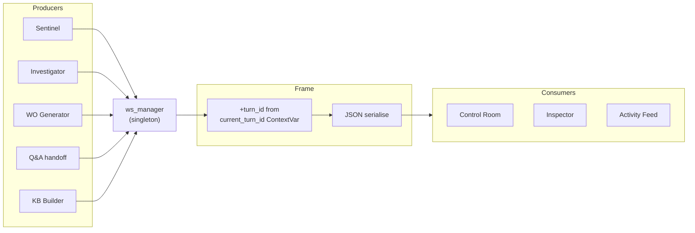

# Cross-cutting Concerns

> [!NOTE]
> This document covers the shared subsystems that no single milestone owns: the WebSocket transport contracts, the Anthropic client wrapper, authentication, configuration, and the conventions every agent follows. Read this when integrating with the backend from the frontend, or when adding a new agent that needs to plug into the existing telemetry and auth surfaces.

---

## WebSocket contracts

The backend exposes two WebSockets with deliberately distinct semantics. The frontend type definitions in [frontend/src/lib/ws.types.ts](../../frontend/src/lib/ws.types.ts) are the source of truth — backend payloads conform to those types verbatim.

### `WS /api/v1/events` — global telemetry bus (`EventBusMap`)

Source: `core.ws_manager.broadcast(event_type, payload)` from any agent or router.
Audience: Control Room, Agent Inspector, Activity Feed, Anomaly Banner.



Frame catalogue (the full list — backend-emitted):

| Type                  | Payload                                                                                         | Emitter                                                           |
|-----------------------|-------------------------------------------------------------------------------------------------|-------------------------------------------------------------------|
| `anomaly_detected`    | `{cell_id, signal_def_id, value, threshold, severity, direction, work_order_id, time, turn_id}` | Sentinel                                                          |
| `agent_start`         | `{agent, turn_id}`                                                                              | Every agent at run start                                          |
| `agent_end`           | `{agent, turn_id, finish_reason}`                                                               | Every agent at run end                                            |
| `agent_handoff`       | `{from_agent, to_agent, reason, turn_id}`                                                       | Investigator (`ask_kb_builder`), Q&A (`ask_investigator`)         |
| `thinking_delta`      | `{agent, content, turn_id}`                                                                     | Investigator (Messages API: per-chunk; Managed Agents: per-block) |
| `tool_call_started`   | `{agent, tool_name, args, turn_id}`                                                             | Every agent's tool dispatcher                                     |
| `tool_call_completed` | `{agent, tool_name, duration_ms, turn_id}`                                                      | Every agent's tool dispatcher                                     |
| `ui_render`           | `{agent, component, props, turn_id}`                                                            | Every `render_*` dispatch                                         |
| `rca_ready`           | `{work_order_id, rca_summary, confidence, turn_id}`                                             | Investigator on `submit_rca`                                      |
| `work_order_ready`    | `{work_order_id}`                                                                               | WO Generator on `submit_work_order`                               |
| `kb_updated`          | `{cell_id}`                                                                                     | KB Builder writes (planned)                                       |

### `WS /api/v1/agent/chat` — per-operator chat (`ChatMap`)

Source: `ws.send_json(...)` from `modules/chat/router.py` and `agents/qa/`.
Audience: chat panel only. Per-connection.

| Type             | Payload              | Notes                                                                                |
|------------------|----------------------|--------------------------------------------------------------------------------------|
| `text_delta`     | `{content}`          | Token-by-token streamed assistant text.                                              |
| `thinking_delta` | `{content}`          | Reserved for future use (Q&A is not extended-thinking-enabled today).                |
| `tool_call`      | `{name, args}`       | One per tool invocation. Frontend renders an inline collapsable card.                |
| `tool_result`    | `{name, summary}`    | Short string only — raw JSON forbidden on this channel.                              |
| `ui_render`      | `{component, props}` | Mirror of the bus `ui_render` (no `agent` field — chat already implies the speaker). |
| `agent_start`    | `{agent}`            | Speaker for this turn or sub-turn. Frontend flips the badge.                         |
| `agent_handoff`  | `{from, to, reason}` | Unprefixed names (vs `from_agent`/`to_agent` on the bus).                            |
| `done`           | `{error?: string}`   | Turn complete. `error` populated on degraded paths.                                  |

> [!IMPORTANT]
> The field-name divergence between the two channels is intentional. `from`/`to` on the chat socket reads more naturally for the per-conversation chatStore reducer; `from_agent`/`to_agent` on the bus avoids any chance of conflict with JS reserved words and disambiguates against generic event payloads. When an agent action concerns both audiences (handoffs, ui_render), the source emits both frames with the per-channel naming — this is encapsulated in each agent's `tool_dispatch` module.

### `current_turn_id` ContextVar

[backend/core/ws_manager.py](../../backend/core/ws_manager.py)

```python
from core.ws_manager import current_turn_id, ws_manager
import uuid

token = current_turn_id.set(uuid.uuid4().hex)
try:
    await ws_manager.broadcast("anomaly_detected", {...})  # turn_id auto-injected
finally:
    current_turn_id.reset(token)
```

The orchestrator sets the turn id once; every nested `ws_manager.broadcast` picks it up automatically. asyncio propagates ContextVars across `await` boundaries, so the same id flows into every tool call and every nested handler within the run.

---

## Anthropic client wrapper

[backend/agents/anthropic_client.py](../../backend/agents/anthropic_client.py)

A thin wrapper around `AsyncAnthropic` that owns:

- **Singleton instance.** One `anthropic` client per process.
- **Model selection.** `model_for("reasoning")` returns Opus 4.7, `model_for("chat")` returns Sonnet, `model_for("extraction")` returns the model used for PDF vision. Toggling `ARIA_MODEL=opus` for Investigator-only runs is the cost lever; the wrapper isolates this from agent code.
- **Timeout and retry.** `httpx.AsyncClient(timeout=60.0)` and `max_retries=2` to keep stuck calls from hanging the demo.
- **`parse_json_response` helper.** Strips ```json fences, falls back to regex extraction if `json.loads` fails — the Sonnet quirk that breaks every agent the first time it ships.

Every agent imports `anthropic` and `model_for` from this module. No agent constructs its own SDK client.

---

## Authentication

[backend/core/security/](../../backend/core/security/)

| File          | Purpose                                                                                     |
|---------------|---------------------------------------------------------------------------------------------|
| `jwt.py`      | Issue / decode access tokens. HS256, short TTL, signed with `ARIA_JWT_SECRET`.              |
| `cookies.py`  | Set / clear the access cookie (HTTP-only, `Secure` in production).                          |
| `password.py` | bcrypt hashing helpers — used by the auth module's user creation flow.                      |
| `role.py`     | `Role` enum (`ADMIN`, `OPERATOR`, `VIEWER`) and the `require_role(...)` FastAPI dependency. |
| `deps.py`     | Standard FastAPI dependencies: `get_current_user`, `require_role(...)`.                     |
| `ws_auth.py`  | `require_access_cookie(ws)` — the WebSocket-side decoder. Returns `User` or closes 4401.    |

Both WebSockets (`/api/v1/events` and `/api/v1/agent/chat`) authenticate via the same `require_access_cookie` helper. The cookie is set by the REST login flow and is automatically attached to the WebSocket handshake by the browser. There is no separate WebSocket token.

The `/mcp/<secret>/` mount has *no* per-request auth — the path secret is the auth. See [decisions.md](./decisions.md#path-secret-url-as-the-mcp-auth-mechanism).

---

## Configuration

[backend/core/config.py](../../backend/core/config.py)

A single `Settings` class loaded from environment variables via `pydantic-settings`. Notable fields:

| Setting                    | Purpose                                                                                   |
|----------------------------|-------------------------------------------------------------------------------------------|
| `database_url`             | TimescaleDB DSN.                                                                          |
| `anthropic_api_key`        | Required for all agents.                                                                  |
| `aria_model`               | `sonnet` (default) or `opus`. Drives `model_for("reasoning")`.                            |
| `aria_jwt_secret`          | HS256 signing key for access tokens.                                                      |
| `aria_mcp_path_secret`     | The path segment for the MCP mount. Generate with `openssl rand -hex 32`.                 |
| `aria_mcp_url`             | Internal MCP URL used by the loopback `MCPClient`.                                        |
| `aria_mcp_public_url`      | Public MCP URL (Cloudflare tunnel) used by hosted Managed Agents.                         |
| `investigator_use_managed` | `True` to route Investigator through Managed Agents, `False` to fallback to Messages API. |

`.env` is gitignored. `.env.example` documents the full set with placeholder values.

---

## Database access pattern

[backend/core/database.py](../../backend/core/database.py)

`db: Database` is a module-level singleton holding an `asyncpg.pool` (`min_size=2`, `max_size=20`). Every repository acquires a connection from this pool.

The `_with_conn(...)` pattern ensures pool acquisition is scoped to the call:

```python
async def get_oee(cell_id: int, window_start: str) -> dict:
    async with db.pool.acquire() as conn:
        return await KpiRepository.oee(conn, cell_id, window_start)
```

This pattern is mandatory inside MCP tools because FastMCP tool functions cannot use FastAPI's `Depends()`. It is also the only sanctioned path for any module that runs outside the request lifecycle (Sentinel, the Investigator background task, the Work Order Generator background task).

---

## Repository pattern

Every domain module in `backend/modules/` follows the same shape:

```
modules/<domain>/
├── __init__.py
├── router.py        # FastAPI router (HTTP)
├── schemas.py       # Pydantic input/output models
├── repository.py    # async classmethods, takes a connection
└── (optional)
    ├── service.py   # cross-repo orchestration
    └── helpers.py
```

Repositories are stateless classes with classmethods that take an `asyncpg.Connection` as the first argument. This makes them trivially testable and consistent across the codebase. SQL never lives outside `repository.py`.

---

## Conventions

### Safety nets on every long-running agent

Every agent body that runs outside the request lifecycle (Sentinel tick, Investigator run, WO Generator run, Q&A turn) is wrapped in:

1. `asyncio.wait_for(body, timeout=N)` — wall-clock budget.
2. Outer `try/except Exception` — never let an agent crash propagate into the asyncio task supervisor.
3. A graceful-degradation update to the relevant DB row (work order, session) so the operator-visible state always reflects the outcome.

A hung tool call must never leave a work order stuck in `status='detected'`. The contract is encoded in [decisions.md](./decisions.md#safety-nets-on-every-agent-loop) and enforced at code review.

### `tool_use` dispatch is per-agent

Each agent has its own `tool_dispatch` module that owns:

- The branch logic on tool name.
- The dual-channel emission (events bus + chat socket where applicable).
- The `safe_send` wrapper that swallows closed-socket errors so a dropped client never tears down the agent loop mid-turn.
- The `tool_result` summarisation for the chat channel (the chat contract forbids raw tool JSON).

Sharing one global dispatcher would couple every agent's tool surface — the per-agent split is what lets each agent declare its own `tools` array without affecting the others.

### Pydantic at boundaries, not internally

Repositories return `asyncpg.Record` or plain `dict`. Pydantic validates only at the HTTP/MCP/tool-input boundary. Agents pass dicts to each other internally — no schema boilerplate inside the agent loop. The two reasons:

1. Pydantic instantiation is hot-path-expensive on a tool call that runs every 30 seconds.
2. The schema is the LLM contract. Re-validating mid-loop adds no safety the LLM has not already implicitly satisfied by emitting a `tool_use` that the SDK accepted.

### Logger names are stable

Every module uses `log = logging.getLogger("aria.<domain>")`. The full set:

- `aria.sentinel`
- `aria.investigator`
- `aria.work_order_generator`
- `aria.qa_agent`
- `aria.kb_builder`
- `aria.ws_manager`
- `aria.chat.ws`
- `aria.mcp.client`

Filtering docker logs by logger name is the standard debugging path.

---

## Where to next

- The data layer that everything reads and writes: [01-data-layer.md](./01-data-layer.md).
- The MCP tool catalogue: [02-mcp-server.md](./02-mcp-server.md).
- Why a particular non-obvious choice was made: [decisions.md](./decisions.md).
