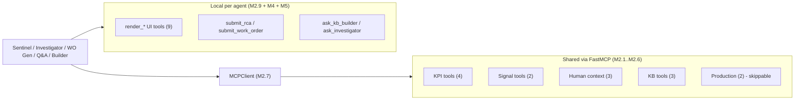
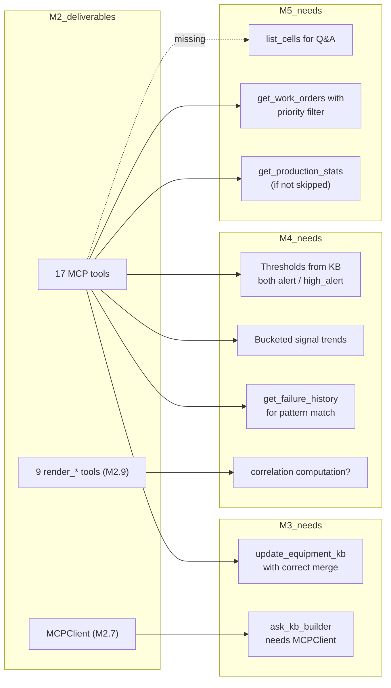

# M2 — MCP Server — Technical Audit

> **Scope.** Review the 9 issues that compose Milestone 2 (#8 to #16) against the downstream milestones (M3 KB Builder, M4 Sentinel + Investigator, M5 WO Generator + Q&A), the repository's current architecture, and the ARIA product promise ("zero-config predictive maintenance in 2 hours"). This document is read-only guidance — no code changes.

---

## 0. Executive summary

> [!NOTE]
> **Verdict: architecturally sound for a hackathon, with 6 gaps that will bite during M3–M5 integration if not resolved before you start coding M2.**

The separation-of-concerns is clean: **MCP tools = DB access**, **local `submit_*` tools = structured output**, **local `ask_*` tools = agent handoffs**, **local `render_*` tools = generative UI**. That layering is the right one and matches the "Best Managed Agents" pitch.

**What's strong.** Tool layering, streamable-HTTP decision, `_with_conn()` pattern for DB access outside FastAPI DI, `submit_*` local tools (vs markdown parsing), agent-as-tool pattern, M2.6 explicit skippability with a pre-declared fallback.

**What's weak.** Under-specified tool I/O contracts. Two tools missing (`list_cells`, `get_current_signals`) that the Q&A and Sentinel flows silently assume exist. One tool (`render_correlation_matrix`) has no data source behind it. Merge semantics of `update_equipment_kb` unspecified — this is the single most critical data path in the product and is the only write-tool shared across agents.

**Bottom line.** You can ship M2 as-is and M3–M5 will still work for the P-02 happy path, but you will spend J5 reverse-engineering tool output shapes from Pydantic error messages and papering over the missing `list_cells`. **~4 hours of spec work before coding saves ~8 hours of integration debug later.**

---

## 1. Per-issue audit

### M2.1 — FastMCP server + mount (#8)

> [!NOTE]
> **Status: sound. Minor hygiene gaps.**

| Aspect                 | Assessment                                                                                                                                                                                                                                                                                                                                                                                                                                                                        |
|------------------------|-----------------------------------------------------------------------------------------------------------------------------------------------------------------------------------------------------------------------------------------------------------------------------------------------------------------------------------------------------------------------------------------------------------------------------------------------------------------------------------|
| streamable_http vs SSE | Correct call (SSE is legacy, streamable HTTP is the only path Anthropic SDK + MCP Inspector both support)                                                                                                                                                                                                                                                                                                                                                                         |
| Mount path `/mcp`      | No collision with existing `/api/v1/*` router prefixes — safe                                                                                                                                                                                                                                                                                                                                                                                                                     |
| Dependency             | `fastmcp` **not yet in `backend/requirements.txt`** — add + pin version in this issue's PR                                                                                                                                                                                                                                                                                                                                                                                        |
| Lifespan               | `main.py` already has `@asynccontextmanager lifespan`. FastMCP's `streamable_http_app()` returns a Starlette sub-app with its own lifecycle — verify it composes cleanly with the parent's `db.connect()` / `db.disconnect()`. Specifically: does `app.mount()` propagate lifespan events? FastAPI docs say sub-app lifespans are **not** run by default; FastMCP may require mounting via `app.router.lifespan_context` or a manual `@app.on_event`. Not addressed in the issue. |
| Auth                   | **Zero auth on `/mcp`.** Anyone on the network can call any tool, including `update_equipment_kb` (destructive write). Acceptable for a hackathon demo on localhost.                                                                                                                                                                                                                                                                                                              |

**Recommended additions to issue #8:**

- [ ] Add `fastmcp==<version>` to `requirements.txt` with version pinned to whatever you test J3.
- [ ] Verify sub-app lifespan propagation (1-line test: a log-message in FastMCP startup shows up during `docker compose up`).
- [ ] Add a note/TODO for post-hackathon: protect `/mcp` with the same cookie-JWT path (M5.2 already builds `core/security/ws_auth.py` — same helper applies).

---

### M2.2 — KPI tools (#9)

> [!WARNING]
> **Status: sound on pattern; three gaps on the tool contract.**

| Aspect                      | Assessment                                                                                                                                                                                                                                                                                                                                                               |
|-----------------------------|--------------------------------------------------------------------------------------------------------------------------------------------------------------------------------------------------------------------------------------------------------------------------------------------------------------------------------------------------------------------------|
| `_with_conn()` helper       | Correct — FastMCP tools have no `Depends()`. Pattern is clean.                                                                                                                                                                                                                                                                                                           |
| `KpiRepository` reuse       | Correct — the repo already wraps `fn_oee`, `fn_mtbf`, `fn_mttr`.                                                                                                                                                                                                                                                                                                         |
| `window_start: str` params  | **Gap.** The repo takes `datetime`. Tool signature should be `str` (JSON-friendly for MCP clients) — but the issue does not specify the parsing contract. Decide **now**: "ISO-8601 with offset, reject naïve". Otherwise `datetime.fromisoformat("2026-04-22T13:00")` gives naïve UTC and TimescaleDB compares against `timestamptz` — silent wrong results.            |
| Return shape                | **Gap.** Issue says `get_oee(...) -> dict` but the repo returns an `asyncpg.Record` with `Decimal` fields. A raw `dict(record)` won't JSON-serialise (Decimal → str or float?). The LLM will depend on whatever shape actually comes out. Specify the exact schema (e.g., `{availability: float, performance: float, quality: float, oee: float, window_seconds: int}`). |
| `get_downtime_events`       | **Gap.** No existing repo method for this. The closest is `fn_status_durations` (status-category aggregated seconds) — but the issue signature returns `list[dict]` (event-level, not aggregated). You will either need a new SQL query against `machine_status` or you need to change the tool shape. Not addressed.                                                    |
| Missing: `get_oee_bucketed` | The existing `KpiRepository.oee_bucketed(...)` is not exposed as a tool. The Q&A agent asked "show me OEE trend this week" would need bucketed data — currently forced to do 7 single-day calls. Consider either adding `bucket` arg to `get_oee` or exposing a second tool.                                                                                             |

**Recommended additions to issue #9:**

- [ ] Nail the datetime contract (ISO-8601 with offset, `datetime.fromisoformat` + assert `tzinfo is not None`).
- [ ] Spell out JSON return schemas per tool.
- [ ] Either add a `get_oee_bucketed` tool or extend `get_oee` with an optional `bucket_minutes` arg.
- [ ] Clarify `get_downtime_events` source: event-level or aggregated? Likely you want aggregated by `(status_label, category)` for a short window — aligns with `fn_status_durations`.

---

### M2.3 — Signal tools (#10)

> [!WARNING]
> **Status: sound on intent; two gaps, one soft duplication with Sentinel.**

| Aspect                                 | Assessment                                                                                                                                                                                                                                                                                                                                                                                     |
|----------------------------------------|------------------------------------------------------------------------------------------------------------------------------------------------------------------------------------------------------------------------------------------------------------------------------------------------------------------------------------------------------------------------------------------------|
| `get_signal_trends`                    | **Gap.** Current repo method `signal_data()` returns raw rows, not bucketed. The issue's default `aggregation="1m"` needs a new SQL using Timescale `time_bucket('1 minute', time)`. Not trivial-wrapper; explicit scope.                                                                                                                                                                      |
| `get_signal_anomalies` threshold shape | **Gap.** The seed (M1.1) uses `alert`/`trip` for vibration/temp but `low_alert`/`high_alert` for flow/pressure. The issue says "compare valeurs vs `equipment_kb.structured_data.thresholds.*.alert`" — that key doesn't exist for flow/pressure. Logic must handle both shapes, otherwise flow anomalies are silently invisible.                                                              |
| Return shape                           | **Gap.** Neither tool specifies return shape. Investigator will drive charts off this — mismatches = silent truncation in `render_signal_chart`.                                                                                                                                                                                                                                               |
| Duplication with Sentinel (M4.2)       | **Soft overlap.** Sentinel's 30-sec loop does its own threshold-breach query inline. If `get_signal_anomalies` already encapsulates this, Sentinel should call it (one source of truth). Planning puts SQL inline in Sentinel. Decide: either Sentinel is a thin scheduler around this tool, or the tool implements the richer "last-N-minute-breach" semantics that Sentinel needs. Pick one. |
| `signal_def_id: int` singular          | **Minor.** Investigator's correlation workflow wants 3–4 signals side-by-side. One call per signal = 4 HTTP loopbacks + 4 pool acquires. Consider `signal_def_ids: list[int]`.                                                                                                                                                                                                                 |

**Recommended additions to issue #10:**

- [ ] Extend `SignalRepository` with a `signal_data_bucketed(signal_def_id, start, end, bucket)` method using `time_bucket`.
- [ ] Define the "threshold breach" rule that covers both `alert` and `(low_alert, high_alert)` shapes — single utility reused by Sentinel.
- [ ] Decide Sentinel ↔ `get_signal_anomalies` relationship explicitly in the issue.
- [ ] Change signature to `signal_def_ids: list[int]` for trends.

---

### M2.4 — Human context tools (#11)

> [!NOTE]
> **Status: sound. Small API mismatch to fix.**

| Aspect                                                 | Assessment                                                                                                                                                                                                     |
|--------------------------------------------------------|----------------------------------------------------------------------------------------------------------------------------------------------------------------------------------------------------------------|
| Wrapper pattern                                        | Clean. All three wrap existing repos.                                                                                                                                                                          |
| `get_shift_assignments(cell_id, date_start, date_end)` | **Mismatch.** `ShiftRepository.list_assignments` takes `assigned_date: date` (single day), not a range. Either extend the repo or do `BETWEEN` in the tool-level SQL.                                          |
| `get_work_orders` filters                              | Missing `priority` and `generated_by_agent` filters. Q&A "show critical open WOs" or "agent-generated vs manual" are natural questions. Low blocker.                                                           |
| Keyword search on logbook                              | **Nice-to-have gap.** Q&A "did any operator mention vibration lately?" currently can't full-text-search `logbook_entry.content`. Postgres `to_tsvector` + GIN index would cost ~10 min. Not blocking the demo. |

**Recommended additions to issue #11:**

- [ ] Add `list_assignments_for_range(date_start, date_end, cell_id)` to `ShiftRepository`.
- [ ] Add `priority` + `generated_by_agent` filters to `get_work_orders`.

---

### M2.5 — KB tools (#12)

> [!IMPORTANT]
> **Status: critical gaps. This is the single most important tool group and the most under-specified.**

`update_equipment_kb` is the **only shared write tool** in the whole system. The entire "2 hours from manual upload to first prediction" promise funnels through this one call. The issue is under-specified in three ways that will each cause subtle data corruption.

| Aspect                                     | Assessment                                                                                                                                                                                                                                                                                                                                                                                                                                                                                                                                         |
|--------------------------------------------|----------------------------------------------------------------------------------------------------------------------------------------------------------------------------------------------------------------------------------------------------------------------------------------------------------------------------------------------------------------------------------------------------------------------------------------------------------------------------------------------------------------------------------------------------|
| Merge semantics of `structured_data_patch` | **Critical gap.** Deep merge vs shallow? If operator calibrates only `thresholds.vibration_mm_s.alert`, does the patch: (a) replace the whole `thresholds` dict, (b) replace the whole `thresholds.vibration_mm_s` leaf, or (c) replace only the `.alert` field? Onboarding (M3.3) assumes (c). KB Builder (M3.5) may assume (b) when it pushes a full threshold block from PDF extraction. **Both behaviours must be supported.** Common pattern: RFC-7396 JSON Merge Patch semantics (recursive dict merge, leaf values replace). Write it down. |
| `calibration_log` storage location         | **Gap.** M1 migration 007 created no `calibration_log` column. Implication: it lives inside `structured_data.calibration_log` as an array (append-on-write). This means every update_equipment_kb call does `structured_data = jsonb_set(..., '{calibration_log}', existing \|\| new_entry)`. Spell it out.                                                                                                                                                                                                                                        |
| `kb_meta.version` increment                | **Gap.** Writes should bump `kb_meta.version`, recompute `confidence_score`, and touch `last_enriched_at`. Not in the issue. Otherwise the UI "last calibrated 5 min ago" badge never moves.                                                                                                                                                                                                                                                                                                                                                       |
| No broadcast on write                      | **Gap.** After `update_equipment_kb`, nothing tells the frontend the KB changed. A live KB card (M8.2 inline-editable thresholds) expects `ws_manager.broadcast("kb_updated", {cell_id})`. Not mentioned. Without it, operator edits from two browser tabs fight silently.                                                                                                                                                                                                                                                                         |
| Optimistic locking                         | None. Concurrent calibrations from Investigator-via-`ask_kb_builder` and operator-via-onboarding can clobber each other. Probably acceptable for a hackathon demo but worth a one-line comment.                                                                                                                                                                                                                                                                                                                                                    |
| `source` + `calibrated_by` trust           | Already decided ("trust the system prompt"). Fine for demo. For prod, move `calibrated_by` to a server-injected context (JWT user id), not a tool param — same reason the frontend doesn't let users write their own `created_by` on work orders.                                                                                                                                                                                                                                                                                                  |
| `get_equipment_kb(cell_id)` return shape   | Must return `structured_data` **parsed** (not the raw JSON string from asyncpg). Confirm that the tool does `json.loads` before returning — the existing `KbRepository.get_by_cell` returns a raw record.                                                                                                                                                                                                                                                                                                                                          |
| `get_failure_history`                      | Correct wrap. Will return `signal_patterns` (added in M1.3) via `decode_record`. No action.                                                                                                                                                                                                                                                                                                                                                                                                                                                        |

**Recommended additions to issue #12:**

- [ ] **Block 1 — write the merge contract explicitly.** Use RFC-7396-style recursive merge for dicts, full replace for leaf values and arrays. Add a 10-line pytest in `test_mcp_tools.py` that runs 3 canonical patches and asserts the resulting blob.
- [ ] **Block 2 — spell out `calibration_log` location + shape.** Suggest `structured_data.calibration_log: list[{timestamp, source, calibrated_by, patch_summary}]`.
- [ ] **Block 3 — wire the post-write broadcast** (`ws_manager.broadcast("kb_updated", {cell_id})`) — or acknowledge that M2 doesn't add it and M8.2 will.
- [ ] **Block 4 — auto-bump `kb_meta.version` + recompute `confidence_score` inside the tool**, not at each caller.

---

### M2.6 — Production tools — skippable (#13)

> [!NOTE]
> **Status: sound priority logic. One inconsistency with the pitch.**

The skip-if-late decision tree is well-reasoned. Two observations:

- "14 tools" is repeated in ROADMAP + README intro. If M2.6 is skipped, the number becomes 12. Either keep the pitch wording neutral ("a dozen tools") or commit to implementing M2.6 (it's ~60 lines total, both methods already exist on `KpiRepository`).
- For Q&A conversational use ("what was our production last week?"), `get_production_stats` is actually the most natural tool to call. Q&A value degrades more than Investigator's does without it.

**Recommendation:** implement M2.6. The cost is negligible (2 wrappers around existing repo methods) and the Q&A surface is materially better. The "skippable" framing is a hedge that you probably won't need.

---

### M2.7 — MCPClient singleton (#14)

> [!WARNING]
> **Status: sound architecturally; three under-specified operational details.**

| Aspect                                 | Assessment                                                                                                                                                                                                                                                                                                                                            |
|----------------------------------------|-------------------------------------------------------------------------------------------------------------------------------------------------------------------------------------------------------------------------------------------------------------------------------------------------------------------------------------------------------|
| Connection-per-call pattern            | Correct. The closure bug cited in `technical.md` §2.2 is real (it has bitten every FastMCP + asyncio user). Do not switch to persistent sessions.                                                                                                                                                                                                     |
| In-process HTTP loopback               | Correct trade-off. 5–15 ms overhead, and the "our MCP server is callable by Claude Desktop out of the box" pitch line is worth it.                                                                                                                                                                                                                    |
| MCP → Anthropic tool schema conversion | **Gap.** "Conversion format Anthropic SDK" is hand-waved. MCP's tool spec uses `inputSchema`, Anthropic expects `input_schema`. Also: Anthropic SDK requires each tool's `name`, `description`, `input_schema` to be sanitised (no `additionalProperties: false` in some cases, no `$ref`, etc.). Worth a small adapter function with 2–3 unit tests. |
| Error handling policy                  | **Gap.** When a tool errors (DB down, ValueError, asyncpg timeout), what does `call_tool` return? Raise a Python exception? Return a `{error: ...}` dict? Anthropic SDK treats tool errors specifically (wrap in `tool_result` with `is_error: true` so the LLM can recover). Not specified.                                                          |
| Pool sizing under load                 | **Risk.** `asyncpg.pool(min=2, max=10)`. Under "Sentinel tick + Investigator loop (5 tool calls) + Q&A loop (3 tool calls) + onboarding session" concurrency, each tool acquires a conn. 10 is tight for the demo if two browser tabs are open. Bump to `max=20` when M2 ships.                                                                       |
| Tool-schema caching                    | Cached in memory — correct (tools are declared at startup, never mutate).                                                                                                                                                                                                                                                                             |

**Recommended additions to issue #14:**

- [ ] Write the MCP→Anthropic schema adapter as a separate helper with 2 unit tests (smoke, then edge-case with nested schema).
- [ ] Define the error contract: tool exceptions → structured `tool_result` with `is_error=true` + the exception message.
- [ ] Bump pool `max_size` in `core/database.py` at the same time (one-line change, same PR).

---

### M2.8 — Test isolation script (#15)

> [!NOTE]
> **Status: sound in intent; weak in coverage.**

| Aspect              | Assessment                                                                                                                                                                                                                                                                                          |
|---------------------|-----------------------------------------------------------------------------------------------------------------------------------------------------------------------------------------------------------------------------------------------------------------------------------------------------|
| Non-pytest script   | Acceptable for a smoke test. Means it won't run in `make test`.                                                                                                                                                                                                                                     |
| Write-tool coverage | **Gap.** `update_equipment_kb` is a write. Testing it requires rolling back after, else the test corrupts the demo seed on every run. Either wrap in `BEGIN; ... ROLLBACK;` (needs raw conn), or point writes at a second test cell (e.g., create a `TEST-00` cell at script start). Not addressed. |
| Import path         | Minor. Path is `backend.tests.test_mcp_tools` in the issue — but Makefile sets `PYTHONPATH=.` inside `backend/`, so the import path at runtime is `tests.test_mcp_tools`. Fix before you write the file.                                                                                            |
| Shape assertions    | **Gap.** Acceptance is "14 ✅". What does ✅ mean? `assert result is not None`? `assert "oee" in result`? Specify per-tool.                                                                                                                                                                           |

**Recommended additions to issue #15:**

- [ ] For `update_equipment_kb`: either use a dedicated test cell or wrap each call in a `SAVEPOINT/ROLLBACK` (MCP tools don't expose transactions — probably a test cell is easier).
- [ ] Define per-tool assertion rules (not just non-empty).
- [ ] Fix import path.

---

### M2.9 — UI generative tools (#16)

> [!IMPORTANT]
> **Status: clean architecture; two props-data mismatches that break the demo.**

The "tool call = UI event, no DB side-effect" pattern is correct and aligns with the Anthropic artifacts pattern.

| Aspect                                 | Assessment                                                                                                                                                                                                                                                                                                                                                                                                                                                                                                                      |
|----------------------------------------|---------------------------------------------------------------------------------------------------------------------------------------------------------------------------------------------------------------------------------------------------------------------------------------------------------------------------------------------------------------------------------------------------------------------------------------------------------------------------------------------------------------------------------|
| Local-vs-MCP split for `render_*`      | Correct. These are output-shape tools, not data tools.                                                                                                                                                                                                                                                                                                                                                                                                                                                                          |
| `tools_schema` concatenation per agent | Clean. Each agent declares only the `render_*` tools it actually uses.                                                                                                                                                                                                                                                                                                                                                                                                                                                          |
| `render_signal_chart` props            | **Gap.** Props are `{signal_def_id, window_hours, mark_anomaly_at?, threshold?}`. The **actual chart data** is not in the props — the frontend has to re-fetch via `GET /api/v1/signals/.../data?window_hours=N`. Confirm that the frontend component (M8.1) does this, and that the endpoint exists and is fast enough. If not, the artifact renders an empty axis.                                                                                                                                                            |
| `render_correlation_matrix` props      | **Critical gap.** Props are `{sources[], impact_matrix[][]}`. A matrix of what? Pearson correlations over which window? There is **no MCP tool** that computes correlations. The LLM will either (a) synthesise plausible-looking but made-up numbers (very bad for a predictive-maintenance pitch), or (b) refuse to call the tool. Either add a `compute_correlations(signal_def_ids, window_start, window_end)` MCP tool **or** drop `render_correlation_matrix` from the bundle and rely on `render_signal_chart` overlays. |
| `render_alert_banner` emission         | Emitted by Sentinel directly (no LLM loop). This tool is **never in any `tools_schema`** — it's a pure frontend-channel event disguised as a tool schema. Harmless, but worth a comment so a future reader doesn't look for it in the Sentinel's tools list.                                                                                                                                                                                                                                                                    |
| Filtering by `cell_id` on the frontend | **Gap.** ROADMAP says "frontend filters by `cell_id` in payload." But `render_signal_chart` props has `signal_def_id`, not `cell_id`. Frontend must join `signal_def → cell` to filter. Either add `cell_id` to every `render_*` props, or document the join dependency and ensure the frontend has a cached `signal_def → cell` map.                                                                                                                                                                                           |
| "rendered" tool_result                 | Correct. The LLM needs *some* tool_result to keep the loop healthy. Literal string `"rendered"` is fine.                                                                                                                                                                                                                                                                                                                                                                                                                        |

**Recommended additions to issue #16:**

- [ ] **Decision point (ask before coding):** keep `render_correlation_matrix` with a new `compute_correlations` MCP tool, or drop the artifact and ship only charts. My recommendation below is: **drop it**.
- [ ] Add `cell_id` to every `render_*` props where it isn't already present.
- [ ] Add a 1-line note that `render_alert_banner` is never exposed to an LLM; it's emitted via `ws_manager.broadcast` by the Sentinel.

---

## 2. Cross-cutting gaps (affect multiple issues)

### 2.1 Missing tools the downstream milestones quietly assume

> [!IMPORTANT]
> These two tools aren't in M2 but are required by M3/M4/M5 flows. Adding them now is cheap; discovering them missing on J5 is expensive.

| Tool                                                    | Why it's needed                                                                                                                                                                                                                                                                                                        | Cost to add                                                               |
|---------------------------------------------------------|------------------------------------------------------------------------------------------------------------------------------------------------------------------------------------------------------------------------------------------------------------------------------------------------------------------------|---------------------------------------------------------------------------|
| `list_cells(site_id: int \| None = None) -> list[dict]` | **Q&A (M5.2/M5.4)** receives natural-language questions like "OEE of pompe P-02?". To resolve "P-02" to a `cell_id`, either the LLM needs a lookup tool or `cell_id` must be injected into the system prompt at session start. The latter only works if a single cell is in scope — not suitable for multi-cell sites. | 15 min — one SELECT against `cell` joined to `line/area/site/enterprise`. |
| `get_current_signals(cell_id: int) -> list[dict]`       | **Investigator (M4.3)** during RCA wants "what are all signals on P-02 right now?" without having to iterate `get_signal_trends` per signal. The `current_process_signals` view already exists.                                                                                                                        | 10 min — one `SELECT * FROM current_process_signals WHERE cell_id = $1`.  |

### 2.2 Merge semantics of `update_equipment_kb` (repeated from M2.5)

This is the single most important spec item in M2. Choose **RFC-7396 JSON Merge Patch** semantics (recursive dict merge, leaf replace, `null` = delete) — it matches what LLMs already produce and is the de-facto web standard. Alternative (JSON Patch RFC-6902) is more powerful but LLMs generate it badly.

### 2.3 Timezone contract

Every tool that takes a time window should **reject naïve datetimes**. One-line guard in `_with_conn`'s sibling helper. Decision to write down: "ISO-8601 with offset, everything is UTC internally."

### 2.4 Tool I/O schemas — write them down

For each of the 12–14 data tools, specify the exact JSON return shape, in the issue body. This is the contract that M3/M4/M5 agents will depend on. Writing it once in the tool's docstring doubles as the schema the LLM sees via `list_tools`. Two hours of spec work avoids one day of "why is `oee` a string here and a float there" in M4.

### 2.5 End-to-end integration checkpoint

M2.8 tests tools in isolation. The full chain — **anomaly → Sentinel → Investigator RCA → Work Order Generator → printable card** — is only rehearsed at M9. That is very late. Consider adding a **micro-scenario script** at the tail of M4 (not M2) that runs the whole chain against seed P-02. If it works at M4 end, M9 is lipstick; if not, J5 afternoon is for bug-hunting, not polish.

### 2.6 No authentication on `/mcp`

Out of scope for the hackathon demo. Add a tracking issue post-M10.

---

## 3. Integration risk matrix — M2 → M3/M4/M5

| Risk                                                                       | Probability           | Impact                                        | Mitigation cost before coding M2           |
|----------------------------------------------------------------------------|-----------------------|-----------------------------------------------|--------------------------------------------|
| `update_equipment_kb` merge semantics wrong → silent KB corruption         | High                  | Critical (breaks onboarding demo scene 1)     | 30 min spec                                |
| Missing `list_cells` → Q&A can't resolve natural-language cell refs        | Near-certain on J5    | High (breaks demo scene 5)                    | 15 min to add                              |
| `render_correlation_matrix` has no data source → LLM hallucinates a matrix | Certain if left as-is | High (visible bad UX, bad pitch)              | 45 min (new tool) or 5 min (drop artifact) |
| Tool return shapes undocumented → agent flows silently truncated           | Certain               | Medium (debuggable but slow)                  | 2 h spec                                   |
| Naïve-datetime comparisons → silent empty results                          | Medium                | Medium (buries real bugs)                     | 15 min guard                               |
| `_with_conn` pool exhaustion under demo load                               | Low-medium            | High if it hits live (Sentinel dies silently) | 5 min (bump pool max)                      |
| MCP `/mcp` unauthenticated                                                 | None during demo      | N/A for hackathon                             | 0 — post-M10 ticket                        |

---

## 4. Fit with the ARIA mission

> **The product promise.** Zero-config predictive maintenance. Upload a manual, calibrate in 2 hours, ARIA fuses signals + KPIs + logbooks + shifts + history continuously, generates printable work orders.

| ARIA capability                               | Tool that enables it                                          | State in M2 spec                                                                   |
|-----------------------------------------------|---------------------------------------------------------------|------------------------------------------------------------------------------------|
| PDF → structured KB (zero data-scientist)     | `update_equipment_kb` (write path) + M3 vision extraction     | **Write-path under-specified** (merge, log location, version bump)                 |
| Calibrate to real installation                | Onboarding session (M3.3) calls `update_equipment_kb` 4x      | Dependent on the above                                                             |
| Fuse signals + KPIs + logbook + shift         | 12 MCP tools cover all four surfaces                          | Good. `list_cells` missing (1 of 2 blind spots).                                   |
| Predict anomaly from signals + KB thresholds  | Sentinel loop + `get_signal_anomalies`                        | Duplication risk: Sentinel does threshold check inline; tool does the same. Align. |
| RCA correlating all sources                   | Investigator agent loop + all 12 tools                        | Good. `render_correlation_matrix` has no compute backend — either fix or drop.     |
| Printable work order                          | WO Generator + `render_work_order_card`                       | Good.                                                                              |
| Knowledge doesn't retire with the senior tech | `failure_history` + `get_failure_history` + M4.7 memory scene | Good.                                                                              |

**Overall fit:** M2's surface area is well-chosen for the mission. The three specification gaps (merge semantics, `list_cells`, correlation matrix) are the only real threats to the demo.

---

## 5. Prioritised action list — before you start coding M2

> [!IMPORTANT]
> Each bullet is a spec change in an **existing issue**, not a new issue. Total estimated spec work: ~3–4 hours. Saves ~8 hours of M3–M5 integration debugging.

### 5.1 Must-fix before coding

1. **Issue #12 (M2.5)** — write the `update_equipment_kb` merge contract (RFC-7396 semantics), spell out `calibration_log` location, auto-increment `kb_meta.version` and recompute `confidence_score` inside the tool.
2. **Issue #16 (M2.9)** — decide on `render_correlation_matrix`: either add a `compute_correlations` MCP tool in M2.2 or drop the artifact. **Recommendation: drop.** The `render_signal_chart` overlays already carry the visual message.
3. **New issue (M2.10?)** — add `list_cells` and `get_current_signals` as two trivial tools in a new issue or append to M2.4. Both are 15–25 lines each.
4. **Issue #10 (M2.3)** — decide Sentinel vs `get_signal_anomalies` relationship. My recommendation: Sentinel **uses** the tool (it's a 30s scheduler — no reason to duplicate SQL). Same threshold logic runs in one place.
5. **Across all tools** — specify JSON return shapes in each issue body. Takes 90 minutes, saves days.

### 5.2 Should-fix before M2 PR merges

6. **Issue #9 (M2.2)** — add `bucket_minutes` optional arg to `get_oee` (or expose `get_oee_bucketed`).
7. **Issue #9 (M2.2)** — define `get_downtime_events` source (aggregated `fn_status_durations` vs event-level scan).
8. **Issue #11 (M2.4)** — add `priority` filter to `get_work_orders`.
9. **Issue #14 (M2.7)** — write MCP→Anthropic schema adapter with 2 unit tests; define tool error contract.
10. **Issue #8 (M2.1)** — verify FastMCP sub-app lifespan; add `fastmcp` to `requirements.txt`.

### 5.3 Can-defer but track

11. Timezone guard + UTC-everywhere convention in a `core/datetime_helpers.py`.
12. Pool `max_size` bump to 20.
13. Post-hackathon ticket: auth on `/mcp`, rate limiting, full-text search on logbook.
14. Micro-E2E scenario script at M4 tail (not M2) — catches chain regressions before M9.

---

## 6. Architecture verdict

> [!NOTE]
> **Keep the architecture.** The MCP / local-tool / UI-tool layering is the right design and directly serves the "Best Managed Agents" pitch. No restructuring needed.

> [!WARNING]
> **Tighten the specs before coding.** The 6 gaps above (merge semantics, `list_cells`, correlation matrix, TZ, tool I/O shapes, write-path broadcast) are not design flaws — they are under-specifications. Writing them down in the issues now costs an afternoon. Discovering them via agent debugging on J5 costs a day you don't have.

> [!IMPORTANT]
> **Single biggest recommendation.** Spend J3 AM before starting M2 code turning the 6 gaps into concrete issue-body updates. Everything else falls in line after that.
