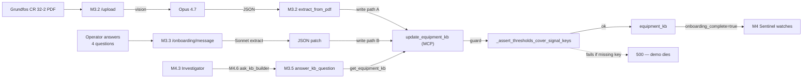
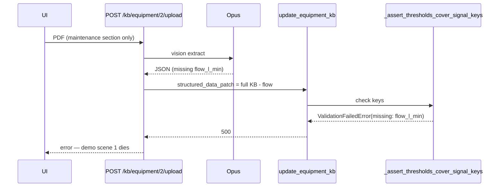
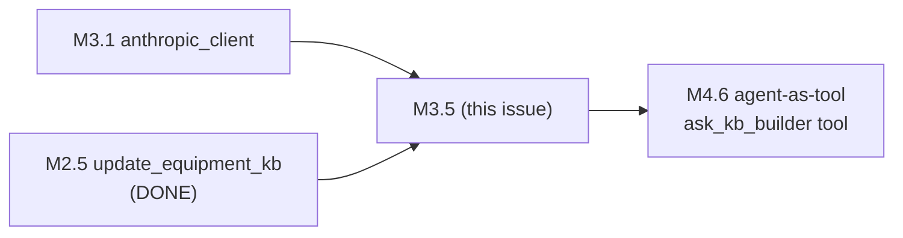
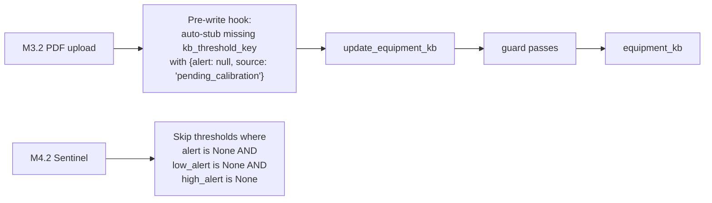
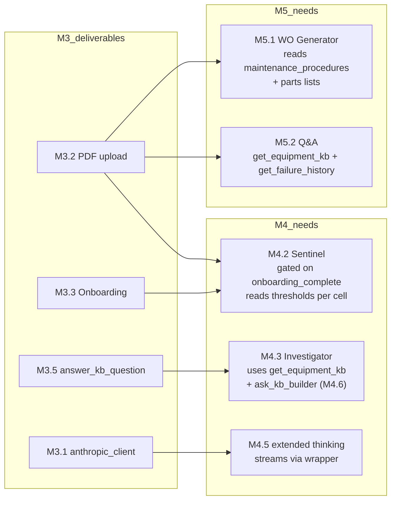

# M3 — KB Builder Agent — Technical Audit

> **Scope.** Review the 6 issues that compose Milestone 3 (#17–#22) against M1 (data layer), M2 (MCP server — already implemented), M4 (Sentinel + Investigator), M5 (WO Generator + Q&A), and the ARIA product promise ("upload a manual, calibrate in 2 hours, zero data scientists"). Read-only guidance — no code changes.

---

## 0. Executive summary

> [!NOTE]
> **Verdict: architecturally sound; one landmine (`kb_threshold_key` guard) that will blow up the first demo PDF upload, and one inconsistency (write path) that will cause subtle state drift between M3.2 and M3.3.**

M3 is the **scene-1 milestone** — the "upload a manual → 2 minutes later ARIA is watching your pump" demo moment. It's also the first milestone where M1 + M2 get **actually exercised together**. The merge contract, auto-housekeeping, calibration log, and completeness scoring from M2.5 are already live and well-implemented (`backend/aria_mcp/tools/kb.py` is clean). **Do not re-build any of that in M3.**



**What's strong.** Write-contract already nailed (M2.5). `EquipmentKB` Pydantic already done (M1.4). `render_kb_progress` / `render_equipment_kb_card` already defined in `agents/ui_tools.py`. The architectural pattern (PDF extraction → onboarding enrichment → callable handler for Investigator handoff) is exactly right for a predictive-maintenance product.

**What's weak.**
1. **`kb_threshold_key` guard collision.** Migration 008 enforces that every `process_signal_definition.kb_threshold_key` must exist in `structured_data.thresholds`. A partial PDF extraction (common — Opus misses 1 of 4 thresholds) will **crash the upload with a 500**. Nothing in any M3 issue mentions this guard. This was added in issue #69 after the planning doc was written.
2. **Write path inconsistency.** M3.2 says "upsert `structured_data` + `raw_markdown`" (direct repo). M3.3 says "call `update_equipment_kb` via MCPClient" (tool with housekeeping). Two paths = two bug surfaces + drift in `calibration_log` / `kb_meta.version` behaviour.
3. **`onboarding_complete` dual truth.** Column + `kb_meta.onboarding_complete`. `update_equipment_kb` tool currently touches neither. No plan to flip both atomically.
4. **Cold-start onboarding is a bug-guaranteed path.** If operator runs onboarding before uploading a PDF (empty `structured_data = {}`), the first vibration patch will fail the guard because other threshold keys don't exist.

**Bottom line.** M3 can ship for the P-02 happy-path demo if the four gaps above are fixed **in the M3 spec before coding** (~2 hours of spec work). Otherwise J5 morning will be "why does the upload return 500 when Opus misses `pressure_bar`?".

---

## 1. Per-issue audit

### M3.1 — Anthropic client wrapper (#17)

> [!NOTE]
> **Status: sound. Minor hygiene + one naming clarification.**

| Aspect                                  | Assessment                                                                                                                                                                                                                                                                                                                                                                     |
|-----------------------------------------|--------------------------------------------------------------------------------------------------------------------------------------------------------------------------------------------------------------------------------------------------------------------------------------------------------------------------------------------------------------------------------|
| `AsyncAnthropic` singleton              | Correct pattern.                                                                                                                                                                                                                                                                                                                                                               |
| `anthropic` in `requirements.txt`       | **Not yet listed.** Add with version pin.                                                                                                                                                                                                                                                                                                                                      |
| `ANTHROPIC_API_KEY` in `core/config.py` | **Not yet there.** Plus `ARIA_MODEL` (`sonnet` default).                                                                                                                                                                                                                                                                                                                       |
| Model slugs                             | `claude-sonnet-4-5`, `claude-opus-4-7` — both valid as of 2026-04. The "verify J6 morning" hedge is sensible.                                                                                                                                                                                                                                                                  |
| Timeout / retry policy                  | **Not in issue.** Anthropic SDK defaults are very long (~10 min). A stuck Opus vision call hangs the entire upload request — the frontend will just spin. Set `http_client=httpx.AsyncClient(timeout=60.0)` at construction.                                                                                                                                                   |
| Rate-limit handling                     | Nothing. 429s from Opus during a demo are a real risk. Either (a) add exponential backoff in the wrapper, or (b) accept and document the failure mode.                                                                                                                                                                                                                         |
| `model_for(...)` signature              | `Literal["dev", "vision", "agent"]` conflates "which Claude capability" with "which agent". `"agent"` is used both for Investigator extended-thinking (Opus) and KB Builder mini-session (Sonnet is fine). Rename to e.g. `model_for("extraction" \| "reasoning" \| "chat")` or pass the target agent: `model_for("investigator" \| "kb_builder" \| "qa" \| "kb_extraction")`. |
| Streaming support                       | M4.5 will need `messages.create(stream=True)` for `thinking_delta`. The wrapper should not block this — i.e. do not force `stream=False` in a helper.                                                                                                                                                                                                                          |

**Recommended additions to issue #17:**

- [ ] Pin `anthropic==<version>` in `backend/requirements.txt`.
- [ ] Add `ANTHROPIC_API_KEY` + `ARIA_MODEL` to `core/config.py` with env-var reads.
- [ ] Default `timeout=60.0` and `max_retries=2` on the SDK client.
- [ ] Rename `"dev"` in `model_for` to something more descriptive, or scope by agent. Low-churn if done now — painful later.
- [ ] Expose the raw client so callers can `stream=True` where needed (M4.5).

---

### M3.2 — PDF upload + Opus vision (#18)

> [!IMPORTANT]
> **Status: the core scene-1 endpoint. Five gaps, two of them demo-breaking.**

#### 1. `kb_threshold_key` guard collision — DEMO BREAKER

The M2.5 tool (and the `KbRepository.upsert`) enforce: every `kb_threshold_key` declared on a `process_signal_definition` for this cell must appear in `structured_data.thresholds`. P-02 has 4 such keys (vibration, bearing_temp, flow, pressure — see migration 008). Opus vision extraction routinely misses one — especially `flow_l_min` if the manual is "maintenance" section only.



> [!WARNING]
> Nothing in the current M3.2 issue addresses this. Planning was written before issue #69 landed.

- [ ] **Decide a mitigation (pick one):**
  - **(A) Auto-stub missing keys (recommended).** Before calling `update_equipment_kb`, the extractor pre-fills missing `kb_threshold_key` entries with `{alert: null, source: "pending_calibration", confidence: 0.0}`. Sentinel already has the two-shape helper — extend it to **skip thresholds where `alert is None and high_alert is None and low_alert is None`** (i.e. treat pending as "not yet monitored"). Cleanest.
  - **(B) Relax the guard for bootstrap writes.** Accept a `bootstrap=True` param on the write path that suspends the guard when the existing KB is empty `{}`. Requires tool API change.
  - **(C) Delete stale `kb_threshold_key` rows before upload.** Ugly; destroys configuration.

#### 2. Write path inconsistency with M3.3

Issue text says "Upsert dans `equipment_kb.structured_data` + `raw_markdown`" — direct repo. But M3.3 says "Appel `update_equipment_kb` via `MCPClient`". Using the repo skips:
- `calibration_log` append
- `kb_meta.version` bump
- `confidence_score` recompute
- `last_enriched_at` refresh

- [ ] **Use the MCP tool for both M3.2 and M3.3.** Single source of write truth. Extend `update_equipment_kb` with an optional `raw_markdown: str | None` param (or store it separately via a sibling tool). The tool already handles housekeeping.

#### 3. Missing dependencies

Neither is in `backend/requirements.txt`:

- [ ] `aiofiles` for async file reading (not strictly needed if reading `bytes` from `UploadFile`).
- [ ] `pypdf` (or `pdfplumber`) for the `page_count > 50` check.

#### 4. Retry + fallback UX

Spec says "1 retry with Pydantic error". What happens after 2 total failures?

- [ ] Define the user-facing failure: HTTP 422 with the Pydantic error message, `raw_markdown` saved anyway (for manual debugging), KB unchanged. Otherwise operators see a raw 500.

#### 5. Authentication

- [ ] Add `dependencies=[Depends(require_role(Role.ADMIN, Role.OPERATOR))]` — same pattern as other KB writes in `modules/kb/router.py`.

#### 6. Progress streaming

A single Opus vision call is **15–40 s of visible "nothing happening"**. M3.6 emits 5 `render_kb_progress` events but the phases are synthetic (there's only one LLM call). For the demo this is acceptable — just broadcast a phase every ~5 s on a timer OR bracket the `await` with 3–4 status events (opening / reading / extracting / validating / done).

- [ ] Write down the exact phase list and who emits them (orchestrator in M3.2, not the LLM).

#### 7. Concurrency

- [ ] If two uploads hit the same `/kb/equipment/{cell_id}/upload` concurrently, both overwrite. Serialise with a simple per-cell `asyncio.Lock()` in the endpoint, or accept and document the last-write-wins semantics.

#### Confirmed sound

- Document content block shape (`{"type": "document", "source": {"type": "base64", "media_type": "application/pdf", "data": b64(...)}}`) — correct for Opus vision.
- 50-page cap + prose+few-shot system prompt — right calls.
- Response parsing via `EquipmentKB.model_validate_json()` — already possible (M1.4 done).

---

### M3.3 — Onboarding session (#19)

> [!WARNING]
> **Status: sound shape, three correctness gaps, one demo-logic concern.**

#### 1. Cold-start path is a bug

If an operator runs onboarding on a cell without a prior PDF upload:
- `equipment_kb.structured_data = '{}'::jsonb` (M1 default).
- Patch from Q1 = `{thresholds: {vibration_mm_s: {alert: 2.8, ...}}}`.
- Guard checks: `required = {vibration_mm_s, bearing_temp_c, flow_l_min, pressure_bar}`, `provided = {vibration_mm_s}`. **Missing 3 → ValidationFailedError.**

Same fix as M3.2 §1 applies: if M3.2 pre-stubs all `kb_threshold_key`-referenced entries (option A), onboarding works after a PDF upload. Still breaks if onboarding runs **without** an upload — decide:

- [ ] **Option α:** require PDF upload before onboarding can start (gate in `/onboarding/start` → 409 if `equipment_kb` is empty). Matches the demo script anyway.
- [ ] **Option β:** `/onboarding/start` auto-stubs missing threshold keys with `null` alerts (same helper as M3.2 §1 option A).

#### 2. `onboarding_complete` flip — two sources of truth

Spec says at end of Q4: "set `onboarding_complete=true`". There are **two places** this flag lives after M1.1 + current `kb_meta`:
- `equipment_kb.onboarding_complete` (boolean column).
- `structured_data.kb_meta.onboarding_complete` (inside the blob — currently written by the seed but never updated by code).

The `update_equipment_kb` MCP tool touches neither today (auto-housekeeping covers `version`, `completeness_score`, `last_calibrated_by` — but not `onboarding_complete`).

- [ ] **Pick one** (recommended: column is authoritative, `kb_meta.onboarding_complete` is a shadow for the LLM's convenience).
- [ ] **Update path:** extend `update_equipment_kb` with an optional `onboarding_complete: bool | None = None` parameter that updates both atomically — OR add a sibling tool `complete_onboarding(cell_id: int)` if you don't want to bloat `update_equipment_kb`.

#### 3. LLM patch validation before write

Sonnet is asked to convert operator free-text to a structured patch. It will sometimes emit `{"thresholds": {"vibration_mm_s": {"alert": "high"}}}` (string instead of float), or nest incorrectly.

- [ ] Validate the patch against a narrow Pydantic model before calling `update_equipment_kb`. Something like:
  ```
  class OnboardingPatch(BaseModel):
      thresholds: dict[str, ThresholdValue] | None = None
      equipment: EquipmentMeta | None = None
      failure_patterns: list[FailurePattern] | None = None
  ```
  Reject invalid → retry Sonnet with the Pydantic error, same pattern as M3.2. Without this, `update_equipment_kb` gets junk patches that then fail Pydantic re-validation inside the tool — the error comes back at a less helpful boundary.

#### 4. Session key is session_id only, not cell_id

Two browsers on the same cell → two concurrent sessions writing patches → `kb_meta.version` increments race, `calibration_log` order is interleaved.

- [ ] Add a secondary index `_sessions_by_cell: dict[int, str] = {}`. `/onboarding/start` rejects with 409 if the cell already has an active session.

#### 5. The 4 questions calibrate only 1 of 4 thresholds

Current question set:
1. Vibration nominal → `thresholds.vibration_mm_s` (calibrated)
2. Bearing age → `failure_patterns[*]` (pattern data, not a threshold)
3. Recurring failures → `failure_patterns[*]` (ditto)
4. Install conditions → `equipment.*` metadata

So after 4 questions, only `vibration_mm_s` is operator-calibrated. The other 3 thresholds stay at PDF-extracted values. For the P-02 demo's "aha moment" (confidence 0.40 → 0.85), this is fine: vibration is the signal that moves during the anomaly scene. For the product claim ("calibrate to real installation"), 1-of-4 is skinny.

- [ ] **Note in the issue** that post-hackathon, the question set expands to cover bearing_temp + flow + pressure baselines. Don't over-scope now; just acknowledge.

#### 6. Session TTL cleanup

Spec says "TTL 30 min checked on each message". A cell that starts onboarding and never comes back leaks the session until memory pressure.

- [ ] Acceptable for the hackathon (single user, low concurrency). Add a 1-line comment "// deliberate leak, demo scope".

#### Confirmed sound

- In-memory dict as session store — right for a 2-minute interactive flow.
- Sonnet in dev (not Opus) for patch extraction — cost/latency appropriate.
- `confidence: 0.92` hardcoded — OK for demo; real product would use operator certainty.
- Append to `calibration_log` — already handled by `update_equipment_kb`.

---

### M3.4 — confidence_score logic (#20)

> [!NOTE]
> **Status: already done (M1.4 is live in `backend/modules/kb/kb_schema.py::EquipmentKB.compute_completeness`). Close after final verification.**

- [ ] Confirm `update_equipment_kb` calls it on every write — **it does** (line 248 of `aria_mcp/tools/kb.py`).
- [ ] Confirm the algorithm matches the weights in M1.4 (thresholds 0.50 / failure_patterns 0.20 / procedures 0.20 / equipment 0.10) — **it does** (line 127 of `kb_schema.py`).
- [ ] No code work remains. Close as done / redirect to M1.4 (#5).

---

### M3.5 — `ask_kb_builder` handler (#21)

> [!NOTE]
> **Status: sound. Four under-specified operational details.**

#### 1. `parse_json_response` is undefined

Claude often wraps JSON in ```json fences or adds preamble ("Here's the answer:\n\n{...}"). No utility to extract a JSON object from a `Message.content` list.

- [ ] Write a small helper in `backend/agents/_json.py`:
  - Iterate `response.content` for the first `TextBlock`.
  - Try direct `json.loads`.
  - Fall back to regex-stripping ```json / ``` fences.
  - Retry once with Sonnet if both fail — OR return `{answer: "parse_failed", source: null, confidence: 0.0}` cleanly.

#### 2. Handler should be side-effect free (no broadcast)

Spec says M4.6 handles the `agent_handoff` broadcast. The M3.5 handler itself just reads KB and returns JSON.

- [ ] **Make this explicit** in the issue: the handler is a pure async function. All WS broadcasts (`agent_handoff`, `agent_start`, `agent_end` for the mini-session) happen in the M4.6 orchestrator wrapper. Otherwise two implementations will race to broadcast.

#### 3. Context is KB-only — no failure history, no logbook

`ask_kb_builder` answers "Quel torque max boulons turbine ?" by reading only `get_equipment_kb`. But a real operator question could hide in a failure log entry ("Technician X noted that turbine bolts had been torqued to 65 Nm in 2024-03").

- [ ] Decide scope: KB-only (spec) or broader (also `get_failure_history`, `get_logbook_entries`). Recommendation: **KB-only for M3**, extend in M4.6 if the demo needs it. Keep the handler single-purpose.

#### 4. Error handling

If `get_equipment_kb` raises `NotFoundError` (cell has no KB row), the handler bubbles up an exception into the Investigator tool loop. Anthropic SDK best practice: return a `tool_result` with `is_error=true` + a readable message, so the LLM can recover.

- [ ] Wrap the handler: on any exception, return `{answer: "KB not available for this cell", source: null, confidence: 0.0}` and let the orchestrator mark the `tool_result` as error.

#### 5. `model_for("agent")` is ambiguous

This is KB Builder calling Sonnet for a quick factual Q&A, NOT Investigator's extended-thinking. Using the same `model_for("agent")` alias for both means toggling `ARIA_MODEL=opus` for Investigator also switches KB Builder to Opus — 10× cost for no benefit.

- [ ] Tie to the rename recommendation in M3.1 — use `model_for("chat")` or `model_for("kb_builder")` here.

#### Dependency



---

### M3.6 — UI tools during onboarding (#22)

> [!NOTE]
> **Status: sound pattern. Two dependencies that are easy to miss.**

#### 1. Blocked by M4.1 (`WSManager`)

`ws_manager.broadcast(...)` doesn't exist yet. Until M4.1 lands, M3.6 can only be stub-tested.

- [ ] **Add `Blocked by: M4.1 (#23)` at the top of the issue body.** Currently only M2.9 is listed in the planning doc.

#### 2. Render schemas are already defined

`backend/agents/ui_tools.py` (M2.9 is done) has `RENDER_KB_PROGRESS` and `RENDER_EQUIPMENT_KB_CARD` with `cell_id` as a required prop. M3.6's spec doesn't mention `cell_id` in the progress example.

- [ ] Update the acceptance example to include `"cell_id": 2` in the broadcast payload — otherwise the frontend filter drops the event.

#### 3. Progress phases are synthetic

For the extraction side (M3.2), there's only one LLM call. The "5 events" must be **bracketing markers** fired by the orchestrator around the `await`, not real LLM-driven phase transitions.

- [ ] Spell out the 5 phase labels explicitly:
  - `"Validating PDF"` (0 s)
  - `"Reading pages with Opus vision"` (after page count check)
  - `"Extracting thresholds"` (during LLM call — fired once at start, orchestrator has nothing finer)
  - `"Validating schema"` (after LLM response, during Pydantic parse)
  - `"Saving knowledge base"` (during the MCP write call)

#### 4. Missing progress during the 4-question phase

Spec mentions progress during PDF extraction only. The 4-question interactive phase is where the operator spends most of their time — progress feedback is even more important there.

- [ ] Emit `render_kb_progress` after each question with steps as `[{label: "Q1 vibration", status: "done"}, {label: "Q2 bearing age", status: "in_progress"}, ...]`.

#### 5. `render_equipment_kb_card` data flow

Props carry `{cell_id, highlight_fields}` — no KB data. The frontend component (M8.2) re-fetches via `GET /api/v1/kb/equipment/{cell_id}`. That endpoint already exists in `modules/kb/router.py`.

- [ ] No action — just verify the render emits **after** the final `update_equipment_kb` has persisted, so the re-fetch sees the latest data. Current spec has the emit at "end of onboarding" — OK.

---

## 2. Cross-cutting gaps (affect multiple issues)

### 2.1 `kb_threshold_key` guard — the single biggest landmine

Migration 008 enforces schema-level integrity: every signal with a `kb_threshold_key` must have a matching entry in `structured_data.thresholds`. This guard:
- Is **not mentioned** in any M3 issue body.
- Breaks both M3.2 (partial PDF extraction) and M3.3 (cold-start onboarding).
- Was added as part of issue #69, after M3's planning doc.

**Recommended global fix** (consistent across M3.2 and M3.3):



Cost to add: 1 helper function (~15 lines) in `backend/agents/kb_builder.py` or a new `bootstrap_thresholds` helper in `modules/kb/`. Applies to both PDF extraction (M3.2) and onboarding cold-start (M3.3).

### 2.2 Write path unification

M3.2 must use `update_equipment_kb` just like M3.3 does. Otherwise:
- M3.2 writes bypass the housekeeping that M3.3 writes apply.
- `calibration_log` starts at entry-2 (from Q1) instead of entry-1 (from PDF extract).
- `kb_meta.version` starts at 1 (not bumped by direct upsert) and jumps inconsistently.

- [ ] Add an optional `raw_markdown: str | None = None` param to `update_equipment_kb` OR pass `raw_markdown` as part of `structured_data_patch` under a reserved `_raw_markdown` key that the tool moves to the column. The former is cleaner.

### 2.3 `onboarding_complete` atomic flip

Today, no code flips either source of this flag. The Sentinel loop (M4.2) filters by `equipment_kb.onboarding_complete=true`. If M3.3's end-of-flow doesn't flip it, **Sentinel will not watch the cell** — the whole predictive-maintenance chain dies silently.

- [ ] Add `onboarding_complete: bool | None = None` to `update_equipment_kb`. When not-None, update both the column and `structured_data.kb_meta.onboarding_complete` in the same UPDATE.
- [ ] M3.3 Q4 handler calls `update_equipment_kb(..., onboarding_complete=True)` atomically with the final patch.

### 2.4 Token cost + timeouts

M3 is the first milestone that spends Anthropic tokens. Opus vision on a 30-page PDF = ~5–10¢ per call. A tight retry loop on a malformed PDF could easily rack up $5 in the afternoon.

- [ ] Set a request timeout (60 s) and `max_retries=2` in M3.1.
- [ ] Log token usage (`response.usage.input_tokens + output_tokens`) on every call. One log line is enough.

### 2.5 Dependencies not yet in `requirements.txt`

- [ ] `anthropic` (M3.1)
- [ ] `aiofiles` (M3.2 — arguably optional)
- [ ] `pypdf` (M3.2, for page count check)

### 2.6 Auth gating

None of the M3 endpoints currently mention `require_role`. Existing KB routes (`/api/v1/kb/equipment` PUT) already gate on `ADMIN, OPERATOR`.

- [ ] Match the existing pattern on every new endpoint: upload, onboarding/start, onboarding/message.

---

## 3. Integration risk matrix — M3 → M4/M5



| Risk                                                                               | Probability                   | Impact                            | Fix cost now                                         |
|------------------------------------------------------------------------------------|-------------------------------|-----------------------------------|------------------------------------------------------|
| `kb_threshold_key` guard rejects PDF extraction → upload 500                       | **Near-certain on P-02 demo** | Critical (breaks scene 1)         | 20 min (auto-stub helper + Sentinel null-alert skip) |
| Write path split (repo vs tool) → drift in `calibration_log` and `kb_meta.version` | High                          | Medium (debug rathole)            | 15 min (unify on tool + add `raw_markdown` param)    |
| `onboarding_complete` never flipped → Sentinel silently doesn't watch              | **Near-certain**              | Critical (breaks scene 2)         | 15 min (tool param + Q4 call)                        |
| Cold-start onboarding without PDF → guard rejection                                | Medium                        | Medium (breaks a demo branch)     | 0 if you pick option α (gate on start)               |
| Sonnet emits invalid JSON patch → merge error with unhelpful message               | Medium                        | Low-medium                        | 20 min (Pydantic patch model)                        |
| Opus vision call hangs → upload request never returns                              | Low-medium                    | High (hangs demo UI)              | 5 min (timeout on SDK client)                        |
| Token cost blowout on retry loop                                                   | Low                           | Low for demo, Medium for real use | 5 min (max_retries=2, timeout=60)                    |
| Multi-cell / multi-operator race                                                   | Low for demo                  | Medium for real use               | 15 min (per-cell lock)                               |
| `parse_json_response` missing → M3.5 crashes on fenced output                      | Medium                        | Medium                            | 15 min (helper)                                      |

---

## 4. Fit with the ARIA mission

> **Promise.** Upload a manual → Opus reads → dialogue with operator → KB calibrated to real installation → Sentinel watches in < 2 hours.

| Capability                                   | Tool that enables it                              | M3 status                                                                               |
|----------------------------------------------|---------------------------------------------------|-----------------------------------------------------------------------------------------|
| PDF → structured KB                          | M3.2 + Opus vision                                | **Blocked by the guard** until auto-stub helper lands                                   |
| Local calibration dialogue                   | M3.3 4-question flow                              | Sound; cold-start needs guarding                                                        |
| "Calibration log is auditable"               | M2.5 `calibration_log` (done)                     | Live; confirm M3.2 routes through the tool                                              |
| Confidence score 0.40 → 0.85 "aha"           | M1.4 `compute_completeness` (done)                | Live; current seed scores ~0.85 — verify post-extraction starts lower                   |
| Investigator consults KB Builder             | M3.5 `answer_kb_question`                         | Sound; needs `parse_json_response` helper                                               |
| "Senior technician knowledge doesn't retire" | `failure_history` (M1.3) + `calibration_log`      | KB side: good. Failure side: pre-seeded.                                                |
| 2 hours from upload to first prediction      | M3.2 (~30 s) + M3.3 (~2 min) + Sentinel 30 s tick | **Demo reality: ~3 min.** Pitch claim is real-world data gathering, not software. Fine. |

**Predictive-maintenance fit:** M3 is the front door of the whole product. Once M3 works, M4 gets thresholds + `onboarding_complete=true`, and Sentinel fires. The two blockers above (guard + flag flip) are **the only things** standing between "scene 1 ends" and "scene 2 starts automatically".

---

## 5. Prioritised action list — before you start coding M3

> [!IMPORTANT]
> Each item is a spec addition to an existing issue. Total: ~2 hours of spec work. Prevents the known demo-breakers.

### 5.1 Must-fix before coding

1. **Issue #18 (M3.2)** — auto-stub missing `kb_threshold_key` entries before calling `update_equipment_kb`; Sentinel skips thresholds with null alerts. (Fixes demo-breaker #1.)
2. **Issue #19 (M3.3)** — either gate `/onboarding/start` on non-empty KB, or apply the same auto-stub helper. (Fixes demo-breaker #2.)
3. **Issues #18 + #19** — unify on `update_equipment_kb` MCP tool. Add optional `raw_markdown` + `onboarding_complete` params to the tool; remove the direct-repo path from M3.2. (Fixes write-path drift.)
4. **Issue #19 (M3.3)** — call `update_equipment_kb(..., onboarding_complete=True)` at end of Q4. (Fixes the silent Sentinel-never-starts bug.)

### 5.2 Should-fix before M3 PR merges

5. **Issue #17 (M3.1)** — pin `anthropic`; add `ANTHROPIC_API_KEY` + `ARIA_MODEL` to config; set SDK `timeout=60` + `max_retries=2`; rename `model_for` cases to de-conflate `"agent"`.
6. **Issue #18 (M3.2)** — pin `pypdf` (+ `aiofiles` if used); add `require_role` dependency; document retry+fallback UX; per-cell `asyncio.Lock`.
7. **Issue #19 (M3.3)** — Pydantic validation of Sonnet-produced patches; `_sessions_by_cell` secondary index; auth gating.
8. **Issue #21 (M3.5)** — add `parse_json_response` helper; wrap handler errors into `{answer: "unknown"}`; mark handler as pure (broadcasts happen in M4.6).
9. **Issue #22 (M3.6)** — list "Blocked by: M4.1 #23"; spell out the 5 synthetic phase labels; emit progress during 4-question phase too; include `cell_id` in every payload.

### 5.3 Can-defer but track

10. Token usage logging + cost ceiling alert.
11. Streaming during PDF extraction (replace synthetic phases with real LLM-side stream events).
12. Session persistence across restarts.
13. Adaptive questions per equipment type.
14. Broaden `ask_kb_builder` context (failure history + logbook) after M4.6 ships.

### 5.4 Close as done

15. **Issue #20 (M3.4)** — already implemented in `backend/modules/kb/kb_schema.py::compute_completeness`. Close with a comment pointing to M1.4.

---

## 6. Architecture verdict

> [!NOTE]
> **Keep the architecture.** PDF extraction + interactive calibration + callable-handler pattern is exactly right for a "zero-config" predictive-maintenance product. Nothing to rebuild.

> [!WARNING]
> **Tighten the spec against the M1/M2 reality.** The planning doc was written before migration 008 landed and before M2.5 crystallised. M3 issues need to be re-read with the current code in hand — specifically: the `_assert_thresholds_cover_signal_keys` guard, the `update_equipment_kb` tool's auto-housekeeping, and the `raw_markdown` / `onboarding_complete` column lifecycle. These three pieces of reality weren't in the planning doc's world.

> [!IMPORTANT]
> **Single biggest recommendation.** Before opening M3.2, patch the 4 items in §5.1. They are all ~15-minute spec updates and each one kills a demo-breaker. Anything that ships without fixing #1 and #3 will demo-fail on the first PDF.

---

## 7. Codebase cross-reference — findings after live code inspection

> **Date:** 2026-04-22. Full read of `backend/aria_mcp/tools/kb.py`, `backend/modules/kb/repository.py`, `backend/modules/kb/kb_schema.py`, `backend/modules/kb/schemas.py`, `backend/core/config.py`, `backend/core/thresholds.py`, `backend/agents/ui_tools.py`, `backend/main.py`, `backend/requirements.txt`, and all issues #17–#31, #69.

### 7.1 Audit findings confirmed correct

Every critical finding in §§1–5 is confirmed against the live code. Specific evidence:

| Finding                                                         | Code evidence                                                                                                                                                     |
|-----------------------------------------------------------------|-------------------------------------------------------------------------------------------------------------------------------------------------------------------|
| `_assert_thresholds_cover_signal_keys` guard is live            | `backend/modules/kb/repository.py::upsert()` — calls the guard on every write including direct repo calls                                                         |
| Guard fires on 4 keys for P-02                                  | `backend/infrastructure/database/migrations/versions/008_kb_threshold_key.up.sql` — seeds `vibration_mm_s`, `bearing_temp_c`, `flow_l_min`, `pressure_bar`        |
| `update_equipment_kb` never sets `onboarding_complete`          | `backend/aria_mcp/tools/kb.py::update_equipment_kb()` — only passes `cell_id, structured_data, confidence_score, last_enriched_at, last_updated_by` to `upsert()` |
| `anthropic` absent from `requirements.txt`                      | File contains only `fastapi`, `uvicorn`, `asyncpg`, `pydantic`, `pydantic-settings`, `PyJWT`, `werkzeug`, `python-multipart`, `fastmcp`                           |
| `ANTHROPIC_API_KEY` / `ARIA_MODEL` absent from `core/config.py` | File has Postgres + JWT + CORS + `mcp_api_key` only                                                                                                               |
| No `agents/anthropic_client.py` exists yet                      | `backend/agents/` contains only `__init__.py` and `ui_tools.py` — M3.1 is a clean slate                                                                           |
| `parse_json_response` is undefined                              | No file in `backend/agents/` contains it                                                                                                                          |
| Issue #18 mermaid shows direct DB write                         | Augmented diagram `Builder->>DB: upsert structured_data, raw_markdown` bypasses MCP tool                                                                          |

### 7.2 Findings that update or correct the audit

#### 7.2.1 Sentinel null-alert skip is FREE — no code change needed on M4.2

The audit (§1, §2.1) says: "extend Sentinel to skip thresholds where `alert is None and high_alert is None and low_alert is None`". This is already handled transparently.

`backend/core/thresholds.py::evaluate_threshold()` only fires a breach when a bound is `not None`:

```python
if threshold.trip is not None and value >= threshold.trip: ...
if threshold.high_alert is not None and value >= threshold.high_alert: ...
if threshold.alert is not None and value >= threshold.alert: ...
if threshold.low_alert is not None and value <= threshold.low_alert: ...
```

An auto-stubbed entry `{alert: null, source: "pending_calibration"}` will produce `breached: False` without any guard logic. **M4.2 Sentinel does not need to be modified** to handle pending thresholds — the existing helper already does it. The only required work is the auto-stub pre-write hook in M3.2/M3.3.

#### 7.2.2 `RENDER_KB_PROGRESS` already requires `cell_id` — audit §3.6.2 is a spec-only gap

The audit says "M3.6's spec doesn't mention `cell_id` in the progress example". The actual schema in `backend/agents/ui_tools.py` already has `"required": ["cell_id", "steps"]`. The fix is updating the *issue body example*, not the tool schema. Zero code cost.

#### 7.2.3 `EquipmentKbUpsert` and `KbRepository.upsert()` already support `raw_markdown` and `onboarding_complete`

`backend/modules/kb/schemas.py::EquipmentKbUpsert` has `raw_markdown: Optional[str]` and `onboarding_complete: Optional[bool]` fields.
`backend/modules/kb/repository.py::upsert()` dynamically builds its SQL from whatever fields are in the dict — it will pass through any key in `EquipmentKbUpsert`.

Therefore extending `update_equipment_kb` to accept and forward these two fields costs **~10 lines total** (add two optional params + include them in the dict passed to `repo.upsert()`). No schema migrations required.

Recommended final signature:

```python
async def update_equipment_kb(
    cell_id: int,
    structured_data_patch: dict,
    source: str,
    calibrated_by: str,
    raw_markdown: str | None = None,          # ← add
    onboarding_complete: bool | None = None,  # ← add
) -> dict:
```

When `onboarding_complete=True` is passed, also update `structured_data.kb_meta.onboarding_complete` inside the merged blob so both the column and the blob stay in sync — one extra dict assignment before `upsert()`.

#### 7.2.4 New gap not in the original audit — M4.2 Sentinel uses `.alert` only (spec bug)

Issue #24 specifies: "Compare la dernière valeur vs `kb.thresholds.<signal>.alert`". P-02's `flow_l_min` and `pressure_bar` use `low_alert`/`high_alert` (double-sided), **not** `alert`. A literal implementation would silently miss flow and pressure breaches — the most physically dangerous ones. `vibration_mm_s` and `bearing_temp_c` are single-sided and would still fire, but the product promise ("watch your pump") partly depends on pressure/flow monitoring.

The fix is zero code: `evaluate_threshold()` in `backend/core/thresholds.py` already handles both shapes. Issue #24 **must say "use `core.thresholds.evaluate_threshold()`"** not raw `.alert` access. This is a spec wording bug, not a logic bug.

- [ ] **Add to issue #24:** replace "Compare la dernière valeur vs `kb.thresholds.<signal>.alert`" with "Evaluate via `core.thresholds.evaluate_threshold(threshold, value)` — handles both single-sided (`alert`/`trip`) and double-sided (`low_alert`/`high_alert`) shapes. Do NOT read `.alert` directly."

#### 7.2.5 `get_signal_anomalies` raises `ValueError` not returns warning — agents must handle

The audit (§69 original issue) anticipated a warning dict in the response. The live code in `backend/aria_mcp/tools/signals.py::get_signal_anomalies()` **raises `ValueError`** on misconfigured KB/signal mapping. This is a harder failure than a warning.

This is correct from a data-integrity standpoint (an empty list is not the same as "KB missing"). However, when Investigator calls this tool and the KB is partially calibrated (during M3 → M4 transition), the `ValueError` will surface as a tool error in the agent loop. The MCPClient wraps this into `ToolCallResult(is_error=True)` — the Investigator/Sentinel must handle `is_error` gracefully.

- [ ] **Issue #24 (Sentinel):** before calling any anomaly tool, check that `onboarding_complete=True` (already gated by the cell filter) AND log/skip if `ToolCallResult.is_error` is returned from `get_signal_anomalies` rather than crashing the loop.
- [ ] **Issue #25 (Investigator):** same — check `result.is_error` after `get_signal_anomalies` and inject a diagnostic message into the agent context rather than re-raising.

#### 7.2.6 `EquipmentKbOut` already has `raw_markdown` field — round-trip confirmed

`backend/modules/kb/schemas.py::EquipmentKbOut` includes `raw_markdown: Optional[str]`. This means the API response from `/kb/equipment/{cell_id}` already exposes `raw_markdown` to the frontend. The frontend onboarding wizard (M8.6) can display the source markdown if useful. No schema work needed.

### 7.3 Updated risk matrix (delta from §3)

| Risk                                                              | Original assessment                       | Updated assessment                                                                                      |
|-------------------------------------------------------------------|-------------------------------------------|---------------------------------------------------------------------------------------------------------|
| Sentinel null-alert skip requires code change in M4.2             | "extend Sentinel to skip null thresholds" | **No M4.2 code change needed** — `evaluate_threshold()` is already null-safe                            |
| `raw_markdown` + `onboarding_complete` require significant rework | "extend `update_equipment_kb`"            | **~10 lines** — `KbRepository.upsert()` is already dynamic; schema already supports both fields         |
| `RENDER_KB_PROGRESS` missing `cell_id`                            | Code fix needed                           | **Spec fix only** — schema already requires `cell_id`                                                   |
| M4.2 Sentinel misses double-sided thresholds                      | Not in audit                              | **NEW: spec bug in issue #24** — will silently miss flow/pressure breaches if `.alert` is read directly |
| `get_signal_anomalies` returns warning dict                       | "include structured warning"              | **Raises `ValueError`** — callers must handle `is_error=True` in `ToolCallResult`                       |

### 7.4 Updated action list delta

The §5 action list is correct. Add the following:

**Must-fix before coding M4.2:**
- [ ] **Issue #24 (M4.2 Sentinel):** replace raw `.alert` access with `evaluate_threshold()` call. Otherwise flow and pressure anomalies are never detected.
- [ ] **Issue #24 (M4.2 Sentinel):** handle `ToolCallResult.is_error=True` from `get_signal_anomalies` — log and skip the cell for that tick rather than crashing the loop.
- [ ] **Issue #25 (M4.3 Investigator):** same `is_error` guard for `get_signal_anomalies` calls.

**No longer needed (cheaper than estimated):**
- ~~"Extend Sentinel to skip null-alert thresholds"~~ — `evaluate_threshold()` does this already.
- ~~"Fix `RENDER_KB_PROGRESS` schema to add `cell_id`"~~ — schema already correct; only update the issue body example.
