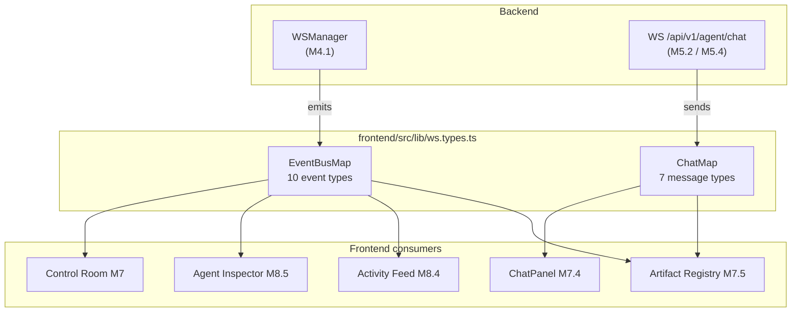

# M4 + M5 — Per-Issue Context Pass

> **Purpose.** For each of the 11 M4/M5 issues (#23–#33), list (A) exact drifts from the current `main` codebase, (B) context that should be appended to the issue body so it is implementable cold without re-reading adjacent issues, (C) cross-references to the closed-and-shipped M1/M2/M3 issues and to the open downstream M7/M8 consumers.
>
Companion to [`M4-M5-sentinel-investigator-workorder-qa-audit.md`](./M4-M5-sentinel-investigator-workorder-qa-audit.md). The audit lists *what is wrong*; this doc lists *what to paste into each issue* so that wrong becomes right.
> Everything cited below was verified against files on `main` at 2026-04-23. Line numbers are current.
>

> ---

## 0. Shared facts the M4/M5 issues must anchor on

These facts are already on `main` — they are the **reality** that every issue in M4/M5 must align with. They are repeated in §2 per-issue context blocks so the issue bodies can be read standalone, but it helps to see them consolidated here first.

### 0.1 Anthropic client — `backend/agents/anthropic_client.py`

| Fact                                                                                                                                                                                | Location                                       |
|-------------------------------------------------------------------------------------------------------------------------------------------------------------------------------------|------------------------------------------------|
| Singleton `anthropic = AsyncAnthropic(...)` with `timeout=60.0, max_retries=2` already built                                                                                        | `anthropic_client.py:38-42`                    |
| `model_for(use_case)` signature is `Literal["extraction", "vision", "reasoning", "chat"]`                                                                                           | `anthropic_client.py:49`                       |
| `"reasoning"` + `ARIA_MODEL=opus` resolves to `claude-opus-4-7`; all other paths stay Sonnet                                                                                        | `anthropic_client.py:49-70`                    |
| `parse_json_response(message)` extracts JSON from raw / fenced / preamble-prefixed replies                                                                                          | `anthropic_client.py:77-117`                   |
| Streaming contract: *"callers needing streaming must hit `anthropic.messages.create(stream=True)` directly on the singleton — do not introduce a wrapper that forces stream=False"* | `anthropic_client.py:14-16` (module docstring) |

[!WARNING]
**Drift source.** Several M4/M5 issue snippets call `model_for("agent")`. That string is not a valid `Literal` member. Use `model_for("reasoning")` for Investigator, `model_for("chat")` for Q&A, `model_for("reasoning")` for Work Order Generator.
> 
> ### 0.2 MCP client — `backend/aria_mcp/client.py`

| Fact                                                                                                     | Location                 |
|----------------------------------------------------------------------------------------------------------|--------------------------|
| Singleton `mcp_client = MCPClient(...)` at module bottom                                                 | `client.py:116`          |
| `await mcp_client.get_tools_schema()` returns `list[dict]` in Anthropic format, cached in memory         | `client.py:57-69`        |
| `await mcp_client.call_tool(name, arguments)` returns `ToolCallResult(content: str, is_error: bool)`     | `client.py:35-44, 71-95` |
| Transport failures (connection refused, 5xx, timeout) **raise**; tool-side errors return `is_error=True` | `client.py:71-95`        |
| `invalidate_cache()` exists for tests                                                                    | `client.py:97-99`        |

### 0.3 UI tools module — `backend/agents/ui_tools.py`

Per-agent bundle names and contents (exact symbol names to import):

```python
from agents.ui_tools import (
    INVESTIGATOR_RENDER_TOOLS,    # [SignalChart, DiagnosticCard, PatternMatch]
    QA_RENDER_TOOLS,              # [SignalChart, BarChart, EquipmentKbCard]
    KB_BUILDER_RENDER_TOOLS,      # [EquipmentKbCard, KbProgress]
    WORK_ORDER_GEN_RENDER_TOOLS,  # [WorkOrderCard]
    ALL_LLM_RENDER_TOOLS,         # union of the four above
    ALERT_BANNER_SCHEMA,          # NOT an LLM tool — Sentinel-only
)
```

| Fact                                                                                                           | Location                     |
|----------------------------------------------------------------------------------------------------------------|------------------------------|
| `render_correlation_matrix` was **dropped** — no MCP tool computes signal correlations, LLM would hallucinate  | `ui_tools.py:18-23`          |
| Multi-signal overlay via `render_signal_chart` with `signal_def_ids: list[int]` replaces it                    | `ui_tools.py:70-110`         |
| `cell_id` is added to every tool's props (frontend `ArtifactRenderer` filters by it)                           | `ui_tools.py:25-27`          |
| `render_alert_banner` is **NOT** in any agent's bundle — Sentinel emits it via `ws_manager.broadcast` directly | `ui_tools.py:29-32, 325-363` |
| `ALERT_BANNER_SCHEMA.severity` enum: `["info", "alert", "trip"]`                                               | `ui_tools.py:347-351`        |

### 0.4 WebSocket contract — `frontend/src/lib/ws.types.ts` (SOURCE OF TRUTH)

The frontend WS types are already shipped on `main` (M6.4, #37 closed). **They are the contract — backend must match, not the other way around.**

Two separate maps, two separate endpoints, two different naming conventions:



**`EventBusMap` field names on `main`** (must match exactly):

| Event                 | Fields                                                          | Notes                                      |
|-----------------------|-----------------------------------------------------------------|--------------------------------------------|
| `anomaly_detected`    | `cell_id, signal_def_id, value, threshold, work_order_id, time` | No `severity` / `direction` yet — see §2.1 |
| `tool_call_started`   | `agent, tool_name, args, turn_id`                               |                                            |
| `tool_call_completed` | `agent, tool_name, duration_ms, turn_id`                        | `duration_ms` is mandatory                 |
| `agent_handoff`       | `from_agent, to_agent, reason, turn_id`                         | **underscored** on the events bus          |
| `thinking_delta`      | `agent, content, turn_id`                                       |                                            |
| `rca_ready`           | `work_order_id, rca_summary, confidence, turn_id`               |                                            |
| `work_order_ready`    | `work_order_id`                                                 |                                            |
| `ui_render`           | `agent, component, props, turn_id`                              |                                            |
| `agent_start`         | `agent, turn_id`                                                |                                            |
| `agent_end`           | `agent, turn_id, finish_reason`                                 |                                            |

**`ChatMap` message types on `main`**:

```ts
ChatMap =
  | { type: "text_delta"; content: string }
  | { type: "thinking_delta"; content: string }
  | { type: "tool_call"; name: string; args: Record<string, unknown> }
  | { type: "tool_result"; name: string; summary: string }     // note: `summary` not raw content
  | { type: "ui_render"; component: string; props: Record<string, unknown> }
  | { type: "agent_handoff"; from: string; to: string; reason: string }   // note: `from`/`to` on chat channel
  | { type: "done"; error?: string };
```

[!IMPORTANT]
Two cross-channel naming differences that will trip you up:
> 1. **`agent_handoff`** — `from_agent`/`to_agent` on the events bus, `from`/`to` on the chat channel. Both are correct per their respective channel types. Agents must emit to the correct field set per channel.
> 2. **`tool_result`** on the chat channel carries `summary: string`, not the raw tool output. The Q&A WS handler must produce a short summary before sending.
>

> ### 0.5 Work order schema — `backend/modules/work_order/schemas.py`
> 
| Fact                                                                                              | Location                                    |
|---------------------------------------------------------------------------------------------------|---------------------------------------------|
| `Status = Literal["detected", "analyzed", "open", "in_progress", "completed", "cancelled"]`       | `work_order/schemas.py:12`                  |
| `Priority = Literal["low", "medium", "high", "critical"]`                                         | `work_order/schemas.py:11`                  |
| JSON columns: `required_parts`, `required_skills`, `recommended_actions` (named in `JSON_FIELDS`) | `work_order/repository.py:9`                |
| `WorkOrderUpdate` has `required_parts` — **not** `parts_required`                                 | `work_order/schemas.py:61`                  |
| `suggested_window_start` / `suggested_window_end` — names match                                   | `work_order/schemas.py:26-27, 50-51, 70-71` |
| `trigger_anomaly_time`, `triggered_by_signal_def_id`, `triggered_by_alert` columns exist          | `work_order/schemas.py:31-33, 54-55, 72`    |
| `generated_by_agent: bool = False`                                                                | `work_order/schemas.py:56`                  |
| `rca_summary: Optional[str]` exists                                                               | `work_order/schemas.py:35, 55, 69`          |

[!WARNING]
**Enum drift in issue #25.** Investigator sets `status="investigated"` in the GitHub issue text. This value is not in the `Status` Literal. Use `"analyzed"`.
**Field name drift in issue #30.** Work Order Generator submits `parts_required`. The field is `required_parts`.
> 
> ### 0.6 MCP tools shipped in M2
>

> | Tool                       | File                            | Signature                                                                                   |
|----------------------------|---------------------------------|---------------------------------------------------------------------------------------------|
| `get_oee`                  | `aria_mcp/tools/kpi.py`         | KPI aggregate                                                                               |
| `get_mtbf`, `get_mttr`     | `aria_mcp/tools/kpi.py`         |                                                                                             |
| `get_signal_trends`        | `aria_mcp/tools/signals.py:19`  | Bucketed time-series                                                                        |
| `get_signal_anomalies`     | `aria_mcp/tools/signals.py:57`  | Returns breaches; **raises** `ValueError` on misconfig (MCPClient wraps as `is_error=True`) |
| `get_current_signals`      | `aria_mcp/tools/signals.py:171` | Latest value per signal                                                                     |
| `get_logbook_entries`      | `aria_mcp/tools/context.py:32`  |                                                                                             |
| `get_shift_assignments`    | `aria_mcp/tools/context.py:69`  |                                                                                             |
| `get_work_orders` (plural) | `aria_mcp/tools/context.py:94`  | **No singular `get_work_order(id)` exists** — see §2.3                                      |
| `get_equipment_kb`         | `aria_mcp/tools/kb.py`          | Returns parsed `structured_data`                                                            |
| `get_failure_history`      | `aria_mcp/tools/kb.py:122`      | Supports `cell_id, limit`                                                                   |
| `update_equipment_kb`      | `aria_mcp/tools/kb.py`          | Merge-patch, housekeeping, `calibration_log` auto-append                                    |
| Production tools (M2.6)    | `aria_mcp/tools/hierarchy.py`   |                                                                                             |

### 0.7 Threshold evaluation — `backend/core/thresholds.py`

| Fact                                                                               | Location                   |
|------------------------------------------------------------------------------------|----------------------------|
| `evaluate_threshold(threshold: ThresholdValue, value: float) -> BreachResult`      | `core/thresholds.py:28`    |
| `BreachResult = {breached, severity, direction, threshold_field, threshold_value}` | `core/thresholds.py:20-26` |
| Severity enum: `"alert" \| "trip"`; direction enum: `"high" \| "low"`              | `core/thresholds.py:21-22` |
| Precedence (highest severity wins): `trip > high_alert > alert > low_alert`        | `core/thresholds.py:31`    |
| Null-stub thresholds (all four fields `None`) return `breached=False` naturally    | `core/thresholds.py:34-76` |

### 0.8 KB Builder handler — already shipped (M3.5, #21 closed)

| Fact                                                                                                     | Location                        |
|----------------------------------------------------------------------------------------------------------|---------------------------------|
| `async def answer_kb_question(cell_id: int, question: str) -> dict`                                      | `agents/kb_builder/qa.py:37`    |
| Returns `{answer: str, source: str \| None, confidence: float}` on every code path — **never raises**    | `agents/kb_builder/qa.py:39-76` |
| Uses `model_for("chat")` (Sonnet) — does not respect `ARIA_MODEL=opus`                                   | `agents/kb_builder/qa.py:59`    |
| Pure handler: no WS broadcasts, no DB writes (guarded by `test_module_does_not_import_ws_manager_or_db`) | `agents/kb_builder/qa.py:1-26`  |
| Re-exported from `agents.kb_builder` — `from agents.kb_builder import answer_kb_question` works          | `agents/kb_builder/__init__.py` |

### 0.9 Auth building blocks for WS endpoints

| Fact                                                                                                            | Location                   |
|-----------------------------------------------------------------------------------------------------------------|----------------------------|
| `verify_access_token(token: str) -> dict \| None` returns the decoded payload (with `sub`) or `None` on failure | `core/security/jwt.py:54`  |
| Cookie name used by the HTTP auth flow: `access_token`                                                          | `core/security/cookies.py` |
| **No `core/security/ws_auth.py` exists yet** — M4.1 and M5.2 both need to create it                             | N/A                        |
| The symbol called `decode_jwt` in issue #31 does not exist — it is `verify_access_token`                        | drift                      |

---

## 1. Drift summary matrix

| #  | Issue                     | Status | Drifts found                                                                                                                                                   |
|----|---------------------------|--------|----------------------------------------------------------------------------------------------------------------------------------------------------------------|
| 23 | M4.1 WSManager            | OPEN   | `anomaly_detected` payload lacks `severity` + `direction` (§2.1)                                                                                               |
| 24 | M4.2 Sentinel loop        | OPEN   | `alert_banner` broadcast should import `ALERT_BANNER_SCHEMA` from `ui_tools.py` (§2.2)                                                                         |
| 25 | M4.3 Investigator loop    | OPEN   | `status="investigated"` invalid; `get_work_order` tool missing; `model_for("agent")` invalid; missing `tool_call_started` / `duration_ms`; import paths (§2.3) |
| 26 | M4.4 Lifespan             | OPEN   | Sentinel startup must be inside `mcp_http_app.lifespan(...)` wrapper (§2.4)                                                                                    |
| 27 | M4.5 Extended thinking    | OPEN   | `model_for("agent")` invalid; signed-thinking-block preservation contract not mentioned (§2.5)                                                                 |
| 28 | M4.6 Agent-as-tool        | OPEN   | Broadcast snippet uses `from`/`to` on events bus — must be `from_agent`/`to_agent` (§2.6)                                                                      |
| 29 | M4.7 Memory               | OPEN   | Low drift — only minor prompt wording (§2.7)                                                                                                                   |
| 30 | M5.1 Work Order Generator | OPEN   | `parts_required` vs `required_parts`; missing bundle name `WORK_ORDER_GEN_RENDER_TOOLS` (§2.8)                                                                 |
| 31 | M5.2 Q&A WS endpoint      | OPEN   | `decode_jwt` does not exist (use `verify_access_token`); `tool_result` on chat carries `summary` not raw content; bundle name (§2.9)                           |
| 32 | M5.3 REST fallback        | OPEN   | No drift — skip-by-default is sound                                                                                                                            |
| 33 | M5.4 Managed Agents       | OPEN   | `ALIGNMENT.md` dangling link; SDK-supports-local-Python assumption unverified (§2.10)                                                                          |

---

## 2. Per-issue context to paste

Each subsection below contains three blocks:

- **A. Drifts** — concrete mismatches with current `main`, citing `file:line`.
- **B. Context to append to the issue body** — ready-to-paste markdown.
- **C. Cross-references** — bidirectional links to the closed M1/M2/M3 issues and the open M7/M8 consumers. Add a "Cross-references" section to each issue with this list.

---

### 2.1 Issue #23 — M4.1 `WSManager` broadcast manager

#### A. Drifts

- `anomaly_detected` payload in the issue is `{cell_id, signal_def_id, value, threshold, work_order_id, time}`. `evaluate_threshold()` (`core/thresholds.py:28`) returns **`severity` and `direction`**, which the AlertBanner needs — the frontend type `frontend/src/lib/ws.types.ts:10-17` also lacks them. Fixing requires a coordinated backend + frontend-type bump.
- The issue says "Pas d'event `error`". Confirmed — `ChatMap` has `{type: "done", error?}` and no `error` type on the events bus. Good, keep it explicit.
- The issue calls out `ALIGNMENT.md` — file does not exist in `docs/planning/`.

#### B. Context to append

```markdown
## Real-code anchors (as of 2026-04-23)

- No existing file at `backend/core/ws_manager.py`. Create module-level singleton `ws_manager` per the scope.
- Shared `turn_id` via `contextvars.ContextVar`, set by whoever calls `broadcast("agent_start", ...)`. Pattern below.

```python
from contextvars import ContextVar

current_turn_id: ContextVar[str | None] = ContextVar("turn_id", default=None)

async def broadcast(self, event_type: str, payload: dict) -> None:
    payload = {**payload}
    if "turn_id" not in payload and (tid := current_turn_id.get()):
        payload["turn_id"] = tid
    # ... fanout
```

## Frontend contract is the source of truth

`frontend/src/lib/ws.types.ts` is already shipped. Backend must match `EventBusMap` field names exactly. Any change here requires a coordinated bump of that file.

[!IMPORTANT]
**`anomaly_detected` payload gap.** Current frontend type and issue text do not include `severity` and `direction`, but the Sentinel `evaluate_threshold()` result carries both and the AlertBanner needs them to color the banner and to say "TOO HIGH" vs "TOO LOW" for double-sided signals (flow, pressure). Decision required — either:
1. (recommended) extend both the `EventBusMap.anomaly_detected` type and the backend payload to include `severity: "alert" | "trip"` and `direction: "high" | "low"`, or
2. derive them frontend-side from `value` / `threshold` comparison, accepting incorrect direction display for double-sided signals.
> 
> ## Auth on `/api/v1/events`
> 
> JWT cookie decode is needed here, not just on `/api/v1/agent/chat` (#31). Extract a reusable helper:

- Create `backend/core/security/ws_auth.py` exposing `async def require_access_cookie(ws: WebSocket) -> dict` that reads `ws.cookies.get("access_token")`, calls `verify_access_token` (`core/security/jwt.py:54`), closes with code 4401 on failure, or returns the decoded payload.
- Reuse from #31.

## ALIGNMENT.md

The issue currently references `docs/planning/ALIGNMENT.md` which does not exist. Either remove the link or create the file mirroring the `EventBusMap` and `ChatMap` tables.
```

#### C. Cross-references to add

- **Upstream (blocked by):** #16 (M2.9 UI tools) — shipped, provides `ALERT_BANNER_SCHEMA` — needed by #24.
- **Downstream (blocks):** #24 (Sentinel broadcasts), #25 (Investigator broadcasts), #28 (agent_handoff), #30 (work_order_ready), #31 (Q&A broadcasts ui_render).
- **Consumers (frontend):** #42 (M7.3 anomaly banner), #43 (M7.4 chat wire), #44 (M7.5 artifact registry), #48 (M8.4 activity feed), #49 (M8.5 inspector thinking stream).

---

### 2.2 Issue #24 — M4.2 Sentinel asyncio loop

#### A. Drifts

- `ALERT_BANNER_SCHEMA` is already defined in `backend/agents/ui_tools.py:334-364` and explicitly documented as *"NOT an LLM tool — emitted directly by Sentinel via ws_manager. Schema kept here for WSManager-side validation"*. The issue broadcasts `alert_banner` inline without referencing the shared schema name.
- `ALERT_BANNER_SCHEMA.severity` enum is `["info", "alert", "trip"]` (`ui_tools.py:347-351`). `evaluate_threshold()` returns `"alert" | "trip"`. Sentinel can forward verbatim; `"info"` never gets produced organically.
- `get_failure_history` requires `cell_id, limit: int = 50` (default 50) — the issue's debounce SQL query is independent, good.
- `_logged_cells` module-level flag works but a `ContextVar` or a `logged_once` set keyed by the process PID survives hot-reload cleaner. Minor.

#### B. Context to append

```markdown
## Shared schema reference

The `ui_render(alert_banner, ...)` broadcast payload must validate against `ALERT_BANNER_SCHEMA` in `backend/agents/ui_tools.py:334`. Required keys: `cell_id, severity, message, anomaly_id`. Severity enum: `"info" | "alert" | "trip"` — forward the value from `evaluate_threshold()` verbatim (it returns `"alert" | "trip"`, never `"info"`).

```python
from agents.ui_tools import ALERT_BANNER_SCHEMA  # for typing / reference

await ws_manager.broadcast("ui_render", {
    "agent": "sentinel",
    "component": "alert_banner",
    "props": {
        "cell_id": cell_id,
        "severity": breach["severity"],          # already "alert" | "trip"
        "message": f"{cell_name}: {breach['display_name']} = {breach['value']} ({breach['threshold_field']} {breach['threshold_value']})",
        "anomaly_id": wo_id,
    },
    "turn_id": turn_id,
})
```

## `anomaly_detected` payload

If #23 resolves to add `severity` + `direction`, emit them here:

```python
await ws_manager.broadcast("anomaly_detected", {
    "cell_id": cell_id,
    "signal_def_id": signal_def_id,
    "value": breach["value"],
    "threshold": breach["threshold_value"],
    "work_order_id": wo_id,
    "time": breach["time"],
    # Pending decision on #23:
    "severity": breach["severity"],
    "direction": breach["direction"],
})
```

## Investigator spawn

`asyncio.create_task(run_investigator(work_order_id=wo_id))` — function signature defined in #25. Import path: `from agents.investigator import run_investigator`.

## Test seed

For the acceptance test "simulator raises P-02 vibration to 5.0 mm/s":
- Vibration `alert` threshold for P-02 seeded at 4.5 mm/s in `backend/infrastructure/seeds/` (confirm exact file path in migration 006).
- Simulator service (see `simulator/`) must be running and writing to `process_signal_data` with `cell_id = P-02`.
```

#### C. Cross-references to add

- **Upstream:** #23 (WSManager), #12 (M2.5 `get_equipment_kb`, `get_failure_history`), #10 (M2.3 `get_signal_anomalies`), #14 (M2.7 MCPClient), #16 (M2.9 `ALERT_BANNER_SCHEMA`), #19 (M3.3 `onboarding_complete` flag).
- **Downstream:** #25 (spawns Investigator), #26 (lifespan starts this loop).
- **Consumers:** #42 (M7.3 anomaly banner).

---

### 2.3 Issue #25 — M4.3 Investigator agent loop

This is the critical-path issue — it has the most drifts because it touches the most subsystems.

#### A. Drifts

| Drift                                  | Current issue says                                                           | Real code                                                                                                                               |
|----------------------------------------|------------------------------------------------------------------------------|-----------------------------------------------------------------------------------------------------------------------------------------|
| Status value                           | `status="investigated"`                                                      | `"investigated"` not in `Status` Literal (`work_order/schemas.py:12`)                                                                   |
| `get_work_order` MCP tool              | `await mcp_client.call_tool("get_work_order", {"work_order_id": ...})`       | Does not exist — only plural `get_work_orders` (`tools/context.py:94`)                                                                  |
| Model slug                             | `model_for("agent")` (implied by M4.5 cross-ref)                             | Not in `Literal` — use `model_for("reasoning")`                                                                                         |
| `tool_call_started` broadcast          | Issue example only broadcasts `tool_call_completed`                          | `EventBusMap` declares both; `started` carries `args`, `completed` carries `duration_ms`                                                |
| `duration_ms` on `tool_call_completed` | Missing in example code                                                      | Mandatory per TS type                                                                                                                   |
| `ask_kb_builder` import                | Implicit                                                                     | `from agents.kb_builder import answer_kb_question` (re-export in `__init__.py`)                                                         |
| `submit_rca` required fields           | `["root_cause", "confidence", "contributing_factors", "recommended_action"]` | Planning doc says `["root_cause", "confidence", "recommended_action"]` (no `contributing_factors`) — minor; issue #25 is stricter, keep |
| Max turns / timeout                    | Not mentioned                                                                | Required for demo safety (see audit §4.1)                                                                                               |
| Outer `try/except`                     | Not mentioned                                                                | Sentinel has it, Investigator needs it too                                                                                              |

#### B. Context to append

```markdown
## Real-code anchors

- Model: `from agents.anthropic_client import anthropic, model_for` — use `model_for("reasoning")` (the `"agent"` name does not exist; see `anthropic_client.py:49`).
- MCP: `from aria_mcp.client import mcp_client` — returns `ToolCallResult(content: str, is_error: bool)` (`aria_mcp/client.py:35`).
- UI tools bundle: `from agents.ui_tools import INVESTIGATOR_RENDER_TOOLS` — three tools: SignalChart, DiagnosticCard, PatternMatch (`ui_tools.py:374-378`).
- KB Builder handoff: `from agents.kb_builder import answer_kb_question` (re-export from `agents/kb_builder/__init__.py`; file is `agents/kb_builder/qa.py`).
- WorkOrder status: `"analyzed"` (not `"investigated"` — see `modules/work_order/schemas.py:12`).

## Replace `get_work_order` call

The `get_work_order` (singular) MCP tool does not exist. Pick one:

1. **Add a new tool (recommended).** Append to `backend/aria_mcp/tools/context.py`:

   ```python
   @mcp.tool()
   async def get_work_order(work_order_id: int) -> dict | None:
       """Fetch a single work order by id."""
       async with with_conn() as conn:
           row = await WorkOrderRepository(conn).get(work_order_id)
       return WorkOrderOut.model_validate(dict(row)).model_dump(mode="json") if row else None
   ```

2. **Reuse the plural tool.** Replace with `get_work_orders(cell_id=..., limit=1)` + client-side filter on `id`. Requires knowing the `cell_id` upfront (which the Investigator does via the Sentinel trigger — but you still need to look it up or pass it through the spawn).

## Tool event broadcasting contract

Both `tool_call_started` and `tool_call_completed` must fire, with the field sets below (from `frontend/src/lib/ws.types.ts`):

```python
import time

for tool_use in response_tool_uses:
    t0 = time.monotonic()
    await ws_manager.broadcast("tool_call_started", {
        "agent": "investigator",
        "tool_name": tool_use.name,
        "args": tool_use.input,
        "turn_id": turn_id,
    })
    # ... dispatch (render_* / ask_kb_builder / MCP / submit_rca) ...
    await ws_manager.broadcast("tool_call_completed", {
        "agent": "investigator",
        "tool_name": tool_use.name,
        "duration_ms": int((time.monotonic() - t0) * 1000),
        "turn_id": turn_id,
    })
```

## Safety nets (non-negotiable for demo)

```python
MAX_TURNS = 12

async def run_investigator(work_order_id: int) -> None:
    turn_id = str(uuid.uuid4())
    current_turn_id.set(turn_id)
    try:
        await asyncio.wait_for(
            _run_investigator_body(work_order_id, turn_id),
            timeout=120.0,
        )
    except asyncio.TimeoutError:
        await _fallback_rca(work_order_id, reason="Investigation timed out", turn_id=turn_id)
    except Exception as exc:
        log.exception("Investigator crashed for WO %d", work_order_id)
        await _fallback_rca(work_order_id, reason=f"Investigation failed: {exc}", turn_id=turn_id)


async def _fallback_rca(work_order_id: int, reason: str, turn_id: str) -> None:
    await mcp_client.call_tool("update_work_order", {
        "work_order_id": work_order_id,
        "status": "analyzed",
        "rca_summary": reason,
    })
    await ws_manager.broadcast("rca_ready", {
        "work_order_id": work_order_id,
        "rca_summary": reason,
        "confidence": 0.0,
        "turn_id": turn_id,
    })
```

(Note: `update_work_order` is currently not an MCP tool either. Either add it alongside `get_work_order` in the step above, or write directly via `WorkOrderRepository`. Decide consistently with the `get_work_order` choice.)

## `submit_rca` handler side-effects

When the LLM calls `submit_rca`:

1. UPDATE `work_order` with `rca_summary`, `confidence`, `status="analyzed"`.
2. INSERT `failure_history(cell_id, failure_time, failure_mode, root_cause, signal_patterns, work_order_id)` — column contract from migration 007 (`signal_patterns` added there, #4 closed).
3. `ws_manager.broadcast("rca_ready", {work_order_id, rca_summary, confidence, turn_id})`.
4. `asyncio.create_task(run_work_order_generator(work_order_id))` — see #30.
5. Break the agent loop; then `ws_manager.broadcast("agent_end", {agent: "investigator", turn_id, finish_reason: "submit_rca"})`.

## Extended thinking + tool use (pointer to #27)

Thinking on Investigator is enabled via #27. **The signed `thinking` block returned by the API must be preserved verbatim in `messages[]` on the next request during a tool-use turn.** Not preserving it will cause a 400 on the continuation `messages.create()`. See #27 for details.

## Agent loop skeleton

```python
async def _run_investigator_body(work_order_id: int, turn_id: str) -> None:
    await ws_manager.broadcast("agent_start", {"agent": "investigator", "turn_id": turn_id})

    # Context load
    wo_result = await mcp_client.call_tool("get_work_order", {"work_order_id": work_order_id})
    wo = json.loads(wo_result.content)
    past_result = await mcp_client.call_tool("get_failure_history", {"cell_id": wo["cell_id"], "limit": 5})

    tools_schema = (
        await mcp_client.get_tools_schema()
        + INVESTIGATOR_RENDER_TOOLS
        + [SUBMIT_RCA_TOOL, ASK_KB_BUILDER_TOOL]
    )
    messages = [{"role": "user", "content": _build_user_prompt(wo)}]

    for _ in range(MAX_TURNS):
        response = await anthropic.messages.create(
            model=model_for("reasoning"),
            system=INVESTIGATOR_SYSTEM.format(past_failures=past_result.content),
            messages=messages,
            tools=tools_schema,
            thinking={"type": "enabled", "budget_tokens": 10000},  # see #27
            max_tokens=4096,
            stream=True,
        )
        assistant_blocks, tool_results, submitted = await _consume_stream(response, turn_id)
        messages.append({"role": "assistant", "content": assistant_blocks})  # MUST include thinking blocks verbatim
        if submitted:
            break
        messages.append({"role": "user", "content": tool_results})

    await ws_manager.broadcast("agent_end", {
        "agent": "investigator", "turn_id": turn_id,
        "finish_reason": "submit_rca" if submitted else "max_turns",
    })
```
```

#### C. Cross-references to add

- **Upstream:** #17 (M3.1 `anthropic_client.py`), #14 (M2.7 MCPClient), #16 (M2.9 `INVESTIGATOR_RENDER_TOOLS`), #21 (M3.5 `answer_kb_question`), #23 (M4.1 WSManager), #24 (M4.2 triggers this).
- **Related:** #27 (M4.5 thinking), #28 (M4.6 `ask_kb_builder`), #29 (M4.7 failure_history).
- **Downstream:** #30 (spawns Work Order Generator).
- **Consumers:** #44 (M7.5 registry renders `diagnostic_card`), #45 (M8.1 SignalChart), #48 (M8.4 tool activity feed), #49 (M8.5 thinking stream).

---

### 2.4 Issue #26 — M4.4 Lifespan integration

#### A. Drifts

- Current `backend/main.py:34-43` wraps `mcp_http_app.lifespan(mcp_http_app)`. Sentinel calls `MCPClient` which connects to `http://localhost:8000/mcp/` (loopback) — so Sentinel must start **inside** the MCP lifespan wrapper, not outside it.
- Issue body is very thin. It should include the exact diff.

#### B. Context to append

```markdown
## Exact placement in `backend/main.py`

Sentinel uses the loopback MCP endpoint (`ARIA_MCP_URL` defaulting to `http://localhost:8000/mcp/`). The MCP app lifespan mounts the endpoint, so Sentinel must start **inside** the existing `mcp_http_app.lifespan` context:

```python
@asynccontextmanager
async def lifespan(app: FastAPI):
    await db.connect()
    app.state.db = db
    log.info("ARIA backend ready")
    async with mcp_http_app.lifespan(mcp_http_app):
        log.info("MCP server ready at /mcp")
        from agents.sentinel import sentinel_loop
        sentinel_task = asyncio.create_task(sentinel_loop(), name="sentinel")
        log.info("Sentinel started")
        try:
            yield
        finally:
            sentinel_task.cancel()
            try:
                await sentinel_task
            except asyncio.CancelledError:
                pass
            log.info("Sentinel cancelled")
            await db.disconnect()
```

## Why inside the MCP wrapper

If Sentinel starts outside, its first `mcp_client.call_tool()` hits a 404 because the MCP HTTP app has not yet been mounted. Verified by the current `main.py` ordering.

## Investigator is NOT started in lifespan

`run_investigator` is spawned per-anomaly by Sentinel via `asyncio.create_task(...)`. Do not start it here.
```

#### C. Cross-references to add

- **Upstream:** #8 (M2.1 MCP mount), #24 (M4.2 loop body).
- **Blocks:** nothing — this is the last M4 backend infra issue.

---

### 2.5 Issue #27 — M4.5 Extended thinking on Investigator

#### A. Drifts

- Example uses `model_for("agent")` — not a valid `Literal` member. Use `model_for("reasoning")`.
- Issue does not mention the signed-thinking-block preservation rule (the most common first-timer bug).
- Issue does not mention that `thinking` is incompatible with the `tool_choice={"type": "any"}` parameter; it requires `tool_choice` to be `"auto"` (default) or omitted.
- Streaming event name: the SDK surfaces thinking via `content_block_delta` with `type: "thinking_delta"` inside the block — the Python SDK's `MessageStream` exposes these as `.thinking` events. Code sketch should reflect the actual SDK shape.

#### B. Context to append

```markdown
## Real-code anchors

- `from agents.anthropic_client import anthropic, model_for`
- Use `model_for("reasoning")` — `"agent"` does not exist (`anthropic_client.py:49`).
- The singleton already has `timeout=60.0, max_retries=2` (`anthropic_client.py:40-42`).
- Module docstring at `anthropic_client.py:14-16` explicitly permits streaming: *"callers needing streaming must hit `anthropic.messages.create(stream=True)` directly on the singleton"*.

## Call

```python
stream = await anthropic.messages.create(
    model=model_for("reasoning"),
    thinking={"type": "enabled", "budget_tokens": 10000},
    system=INVESTIGATOR_SYSTEM,
    messages=messages,
    tools=tools_schema,
    max_tokens=4096,
    stream=True,
)
```

## Signed-thinking-block preservation (critical)

[!IMPORTANT]
When `thinking` is enabled and the turn includes `tool_use`, the API returns `thinking` (and sometimes `redacted_thinking`) content blocks alongside `tool_use` blocks. On the **next** `messages.create()` call — the one that sends `tool_result` blocks back — the full assistant turn must include those `thinking` blocks **in their original order and with their cryptographic signatures intact**.
If they are dropped or reordered, the API returns `400 invalid_request_error: thinking block signature invalid`.
The safe pattern is to accumulate all received content blocks into a single `content` list and append that list verbatim to `messages`:
> ```python
> assistant_content: list[dict] = []
>
async for event in stream:
> if event.type == "content_block_start":
>
assistant_content.append(event.content_block.model_dump())
> elif event.type == "content_block_delta":
>
# mutate the last entry in assistant_content with the delta
> ...
> messages.append({"role": "assistant", "content": assistant_content})
> ```
>     
>         ## Broadcasting `thinking_delta` while streaming
>     
>         ```python
>         await ws_manager.broadcast("thinking_delta", {
>
    "agent": "investigator",
>     "content": delta_text,
>     "turn_id": turn_id,
})
```

Event shape must match `EventBusMap.thinking_delta` in `frontend/src/lib/ws.types.ts:36-40` — `{agent, content, turn_id}`. Do not rename fields.

## Cost budget

10k tokens of thinking per RCA on Opus 4.7 ≈ 5¢. Budget-bounded by `max_budget_tokens` in the request; the model may emit fewer tokens than the budget.

## Scope confirmation

Only the Investigator enables thinking. The KB Builder (`answer_kb_question`) uses `model_for("chat")` — always Sonnet, thinking disabled. The Work Order Generator uses `model_for("reasoning")` but without `thinking` enabled — a short structured-output generation does not benefit from extended reasoning.
```

#### C. Cross-references to add

- **Upstream:** #17 (M3.1 `anthropic_client.py`).
- **Integrated into:** #25 (M4.3 Investigator loop).
- **Consumers:** #49 (M8.5 Inspector — consumes `thinking_delta`).

---

### 2.6 Issue #28 — M4.6 Agent-as-tool (dynamic handoffs)

#### A. Drifts

- Broadcast handler snippet uses `{from: "investigator", to: "kb_builder", ...}`. That shape belongs to `ChatMap.agent_handoff` (sent to the chat channel). When broadcasting to the events bus via `ws_manager.broadcast`, use `{from_agent, to_agent, reason, turn_id}` per `EventBusMap.agent_handoff` (`ws.types.ts:30-35`).
- `answer_kb_question` is already shipped (issue #21 closed). Import path is `from agents.kb_builder import answer_kb_question`.
- `ToolCallResult` is exported from `aria_mcp.client`, not from the agents package. Return type should match what the Investigator loop expects.

#### B. Context to append

```markdown
## Channel-specific handoff payload shapes

[!WARNING]
`agent_handoff` uses **different field names per channel**. Using the wrong set silently drops the event on the frontend.
| Channel                             | Fields                                  | Type in `ws.types.ts`                     |
|-------------------------------------|-----------------------------------------|-------------------------------------------|
| Events bus (`/api/v1/events`)       | `from_agent, to_agent, reason, turn_id` | `EventBusMap.agent_handoff` (lines 30-35) |
| Chat channel (`/api/v1/agent/chat`) | `from, to, reason` (+ `type`)           | `ChatMap.agent_handoff` (line 73)         |

Backend uses `ws_manager.broadcast` → events bus → `from_agent`/`to_agent`.
> Q&A WS handler uses `ws.send_json` → chat channel → `from`/`to`.
> 
>
## `ask_kb_builder` handler (corrected)
> 
> ```python
> import json, uuid
> from aria_mcp.client import ToolCallResult
from agents.kb_builder import answer_kb_question

async def _handle_ask_kb_builder(args: dict, parent_turn_id: str) -> ToolCallResult:
    await ws_manager.broadcast("agent_handoff", {
        "from_agent": "investigator",
        "to_agent": "kb_builder",
        "reason": args["question"],
        "turn_id": parent_turn_id,
    })
    child_turn_id = str(uuid.uuid4())
    await ws_manager.broadcast("agent_start", {
        "agent": "kb_builder",
        "turn_id": child_turn_id,
    })
    try:
        answer = await answer_kb_question(args["cell_id"], args["question"])
        content = json.dumps(answer)
        is_error = False
    except Exception as exc:  # noqa: BLE001 — answer_kb_question is documented as never-raising; defense-in-depth
        content = json.dumps({"answer": f"handoff failed: {exc}", "source": None, "confidence": 0.0})
        is_error = True
    await ws_manager.broadcast("agent_end", {
        "agent": "kb_builder",
        "turn_id": child_turn_id,
        "finish_reason": "answered" if not is_error else "error",
    })
    return ToolCallResult(content=content, is_error=is_error)
```

## Symmetric Q&A → Investigator handoff

Declared in #31 / #33 (`ASK_INVESTIGATOR_TOOL`). Implementation lives in the Q&A WS handler. Note the Investigator loop is long-running (up to 120s per #25) — consider an abbreviated inline invocation path when called as a tool (e.g. deterministic RCA lookup from recent `failure_history`) to avoid blocking the chat WS for 2 minutes.

## Demo scenes that must trigger handoffs

- Scene 3: Investigator → KB Builder (looking up a part reference not in the extracted KB).
- Scene 5: Q&A → Investigator (operator asks "why did P-02 trip yesterday at 14h?").
```

#### C. Cross-references to add

- **Upstream:** #21 (M3.5 `answer_kb_question` shipped), #23 (M4.1 WS contract).
- **Integrates into:** #25 (M4.3 Investigator loop tool registry), #31 / #33 (Q&A side).

---

### 2.7 Issue #29 — M4.7 Memory flex scene

#### A. Drifts

- Low drift. `get_failure_history(cell_id, limit=50)` default is 50; issue example uses `limit=5` — fine, it is a parameter.
- `failure_history` table has `signal_patterns jsonb` (migration 007, #4 closed). Not referenced in the issue body — worth naming so the Investigator knows the column exists when it builds the INSERT.
- Demo endpoint `POST /api/v1/demo/trigger-memory-scene` is not yet a route — the issue does not specify where it lives. Suggest `backend/modules/demo/` as a new throwaway module.

#### B. Context to append

```markdown
## `failure_history` schema anchors

Columns as of migration 007 (`infrastructure/migrations/versions/007_aria_kb_workorder_extension.up.sql:71-75`):

- `id, cell_id, failure_time, resolved_time, failure_mode, root_cause, signal_patterns (jsonb), work_order_id`.

When Investigator calls `submit_rca` successfully, INSERT one row with `signal_patterns` populated from the signal trends observed during the investigation (e.g. `{"vibration_mm_s": {"peak": 5.2, "duration_min": 12}}`).

## Base behavior (always on)

Investigator agent loop (see #25) loads `get_failure_history(cell_id, limit=5)` at start and injects into system prompt. The prompt template is in #25 (`INVESTIGATOR_SYSTEM` variable). Add the past-failures block:

```text
Past failures for this cell (most recent first):
{past_failures_json}

If the current signal pattern matches one of these, cite the matching entry's id or date in `similar_past_failure`.
```

## Demo endpoint scope

`POST /api/v1/demo/trigger-memory-scene` lives in a new `backend/modules/demo/router.py`. Kept separate from production routes; mount behind an `ARIA_DEMO_ENABLED=true` env flag so it is clearly not shipped code.

Flow:
1. Clear any existing `failure_history` rows for P-02 younger than 1 week.
2. INSERT one `failure_history` row dated 3 months ago with `failure_mode="bearing_wear"`, `signal_patterns={"vibration_mm_s": {"peak": 5.4, "duration_min": 14}}`.
3. Call the simulator endpoint (or write directly to `process_signal_data`) to raise vibration to 5.0 mm/s — same pattern as the seeded past failure.
4. Return `{ok: true, work_order_id_to_watch: <id once created>}`.

Sentinel will detect within 30s, spawn Investigator, Investigator loads the past failure, RCA cites it.
```

#### C. Cross-references to add

- **Upstream:** #4 (M1.3 `signal_patterns` column), #12 (M2.5 `get_failure_history`).
- **Integrated into:** #25 (M4.3 Investigator context load).
- **Consumer:** #53 (M9.3 Memory flex UI scene).

---

### 2.8 Issue #30 — M5.1 Work Order Generator agent

#### A. Drifts

| Drift              | Current issue says             | Real code                                                                             |
|--------------------|--------------------------------|---------------------------------------------------------------------------------------|
| Field name         | `parts_required: [{ref, qty}]` | Column / Pydantic field is `required_parts` (`work_order/schemas.py:21,52,70`)        |
| Render bundle name | "UI tools" (generic)           | `WORK_ORDER_GEN_RENDER_TOOLS` — only `RENDER_WORK_ORDER_CARD` (`ui_tools.py:391-393`) |
| Status target      | `status='open'`                | Valid per `Status` Literal                                                            |
| Tool name          | `submit_work_order`            | Not a real MCP tool — declared inline like `submit_rca` (see #25 rule)                |

#### B. Context to append

```markdown
## Real-code anchors

- Model: `from agents.anthropic_client import anthropic, model_for` — use `model_for("reasoning")`.
- MCP: `from aria_mcp.client import mcp_client`.
- UI bundle: `from agents.ui_tools import WORK_ORDER_GEN_RENDER_TOOLS` — a list with a single entry (`RENDER_WORK_ORDER_CARD`). Source: `ui_tools.py:391-393`.
- Target status: `"open"` (valid per `work_order/schemas.py:12`).

## Use `required_parts`, not `parts_required`

The `work_order` table and `WorkOrderUpdate` use `required_parts`. `JSON_FIELDS` in the repo is `("required_parts", "required_skills", "recommended_actions")` (`work_order/repository.py:9`). Any UPDATE that uses `parts_required` will silently no-op (dict merge) or fail (strict validation) depending on path.

## `SUBMIT_WORK_ORDER_TOOL` schema

Declared inline in the agent file, not in FastMCP (same rule as `submit_rca` in #25):

```python
SUBMIT_WORK_ORDER_TOOL = {
    "name": "submit_work_order",
    "description": "Submit the completed work order. Call exactly once when ready.",
    "input_schema": {
        "type": "object",
        "properties": {
            "title": {"type": "string", "maxLength": 200},
            "description": {"type": "string"},
            "recommended_actions": {
                "type": "array",
                "items": {"type": "string"},
                "description": "Ordered procedure steps for the technician.",
            },
            "required_parts": {
                "type": "array",
                "items": {
                    "type": "object",
                    "properties": {"ref": {"type": "string"}, "qty": {"type": "integer"}},
                    "required": ["ref", "qty"],
                },
            },
            "priority": {"type": "string", "enum": ["low", "medium", "high", "critical"]},
            "estimated_duration_min": {"type": "integer"},
            "suggested_window_start": {"type": "string", "format": "date-time"},
            "suggested_window_end": {"type": "string", "format": "date-time"},
        },
        "required": ["title", "recommended_actions", "required_parts", "priority"],
    },
}
```

## Persistence after `submit_work_order`

1. UPDATE `work_order` with all fields above, `status="open"`.
2. `ws_manager.broadcast("work_order_ready", {"work_order_id": work_order_id})` — payload matches `EventBusMap.work_order_ready` (just `work_order_id`).
3. Optional generative-UI step: before returning, Opus may call `render_work_order_card` with `{work_order_id, printable: true}` — the orchestrator emits `ui_render` and returns `"rendered"` per #16.

## Pipeline trigger

Spawned from the Investigator `submit_rca` handler via `asyncio.create_task(run_work_order_generator(work_order_id))`. See #25 step 4 of the submit_rca handler.

## Tool registry

```python
tools_schema = (
    await mcp_client.get_tools_schema()
    + WORK_ORDER_GEN_RENDER_TOOLS
    + [SUBMIT_WORK_ORDER_TOOL]
)
```
```

#### C. Cross-references to add

- **Upstream:** #17 (M3.1), #14 (M2.7), #16 (M2.9 `WORK_ORDER_GEN_RENDER_TOOLS`), #23 (M4.1), #25 (M4.3 spawns this), #7 (M1.6 `WorkOrderUpdate` fields).
- **Consumers:** #47 (M8.3 WorkOrderCard artifact), #51 (M9.1 WO console).

---

### 2.9 Issue #31 — M5.2 Q&A WebSocket endpoint

#### A. Drifts

| Drift                         | Current issue says                   | Real code                                                                                            |
|-------------------------------|--------------------------------------|------------------------------------------------------------------------------------------------------|
| JWT decode function           | `decode_jwt(token)`                  | `verify_access_token(token)` (`core/security/jwt.py:54`); returns `dict \| None`                     |
| `ws_auth.py` file             | Referenced as existing helper        | Does not exist — create as new file                                                                  |
| `tool_result` on chat channel | "`{type: "tool_result", name, ...}`" | Per `ChatMap` (`ws.types.ts:71`): `{type, name, summary: string}` — summary is mandatory             |
| Render bundle name            | "UI_TOOLS"                           | `QA_RENDER_TOOLS` (`ui_tools.py:380-384`) — SignalChart, BarChart, EquipmentKbCard                   |
| Agent handoff payload         | Implicit                             | Chat channel uses `{type: "agent_handoff", from, to, reason}` per `ChatMap:73`                       |
| Thinking on Q&A               | Not mentioned                        | `ChatMap` has `thinking_delta` type but Q&A uses `model_for("chat")` (Sonnet, no thinking) — clarify |

#### B. Context to append

```markdown
## Real-code anchors

- Model: `from agents.anthropic_client import anthropic, model_for` — use `model_for("chat")` (Sonnet, see `anthropic_client.py:49`).
- MCP: `from aria_mcp.client import mcp_client`.
- UI bundle: `from agents.ui_tools import QA_RENDER_TOOLS` — three tools: SignalChart, BarChart, EquipmentKbCard.
- Auth building block: `from core.security.jwt import verify_access_token` (`core/security/jwt.py:54`) — returns `dict | None`.

## Create `backend/core/security/ws_auth.py` (shared with #23)

```python
"""WebSocket cookie-auth helper shared by /events and /agent/chat."""

from __future__ import annotations

from fastapi import WebSocket
from core.security.jwt import verify_access_token


async def require_access_cookie(ws: WebSocket) -> dict | None:
    """Decode the `access_token` cookie; close with 4401 on failure.

    Returns the decoded payload on success, or None after closing the socket.
    Callers should `if payload is None: return` before `await ws.accept()`.
    """
    token = ws.cookies.get("access_token")
    payload = verify_access_token(token) if token else None
    if payload is None:
        await ws.close(code=4401)
        return None
    return payload
```

## `ChatMap` shapes (from `frontend/src/lib/ws.types.ts`)

Everything the handler sends on the chat channel must match one of these discriminated union members:

| Client → server                                                                                 | Server → client                                                                                       |
|-------------------------------------------------------------------------------------------------|-------------------------------------------------------------------------------------------------------|
| `{type: "user", content: str}` (issue-specified; not in `ChatMap` yet — **coordinate with FE**) | `{type: "text_delta", content}`                                                                       |
|                                                                                                 | `{type: "thinking_delta", content}` (present in map; Q&A does not produce this — Sonnet, no thinking) |
|                                                                                                 | `{type: "tool_call", name, args}`                                                                     |
|                                                                                                 | `{type: "tool_result", name, summary}` — **summary is mandatory, short string**                       |
|                                                                                                 | `{type: "ui_render", component, props}` (component is bare name, e.g. `"signal_chart"`)               |
|                                                                                                 | `{type: "agent_handoff", from, to, reason}` — **unprefixed field names on this channel**              |
|                                                                                                 | `{type: "done", error?}` — fires at end_turn                                                          |

[!WARNING]
`tool_result.summary` is a short **string**, not the raw tool JSON. Produce it server-side. Example helper:
```python
def _summarize_tool_result(name: str, content: str, is_error: bool) -> str:
if is_error:
return f"{name} failed"
try:
data = json.loads(content)
except ValueError:
> return content[:120]
> if isinstance(data, list):
>
return f"{name} returned {len(data)} rows"
> if isinstance(data, dict):
> return f"{name} returned {list(data.keys())[:5]}"
>     return str(data)[:120]
>         ```
>     
>         ## Dual-channel broadcast rule
>     
>         Every `ui_render` and `agent_handoff` must fire on **both** channels so Control Room and ChatPanel both see the event:
>     
>         1. `ws_manager.broadcast("ui_render", {...})` — events bus, `EventBusMap` shape.
>     2. `await ws.send_json({"type": "ui_render", "component": ..., "props": ...})` — chat channel, `ChatMap` shape.
>         
>     Same for `agent_handoff` (with the two different field conventions, see #28).
> 
## Client input contract

The issue specifies the client sends `{type: "user", content: str}`. That shape is not yet in `ChatMap` on the frontend. Either:
1. Extend `ChatMap` with a client → server variant (cleanest), or
2. Accept arbitrary `{content}` server-side and do not type it on the client.

Coordinate with #43 (M7.4 ChatPanel wire) before committing to the shape.

## Language

System prompt should default to French for operator context:

```text
You are ARIA, a maintenance assistant. Answer operator questions about their equipment using the available tools. Always cite your sources (KB, logbook, signals, past RCAs). Respond in the language of the operator's question. Default to French if ambiguous.
```
```

#### C. Cross-references to add

- **Upstream:** #17 (M3.1), #14 (M2.7), #16 (M2.9 `QA_RENDER_TOOLS`), #23 (M4.1 WSManager + ws_auth.py), #28 (M4.6 `ask_investigator` symmetric side).
- **Downstream:** #33 (M5.4 swaps the loop for Managed Agents), #43 (M7.4 ChatPanel wire).
- **Consumers:** #44 (M7.5 artifact registry), #47 (M8.3 BarChart), #48 (M8.4 activity feed).

---

### 2.10 Issue #32 — M5.3 Q&A REST fallback

#### A. Drifts

None. Skip-by-default decision is sound. Acceptance criteria: only build if M5.2 is broken at 11am Sunday.

#### B. Context to append

```markdown
## When to implement

Only if M5.2 (#31) and M5.4 (#33) both fail during J6 rehearsal. Budget: 30 minutes to implement, 10 to test. If > 1 hour has passed on J6 without working WS, pause #31/#33 debugging and switch to this fallback.

## Contract

```http
POST /api/v1/agent/chat
Content-Type: application/json

{"messages": [{"role": "user", "content": "..."}]}

Response 200:
{
  "response": "text answer",
  "tool_calls": [{"name": "...", "args": {...}, "result_summary": "..."}]
}
```

One round-trip, no streaming, no `ui_render` events, no dynamic handoff visibility. Pure compatibility path to keep Scene 5 Q&A on-camera even if WS is dead.
```

#### C. Cross-references to add

- **Alternative to:** #31, #33.

---

### 2.11 Issue #33 — M5.4 Managed Agents migration

#### A. Drifts

- Dangling link to `docs/planning/ALIGNMENT.md` — file does not exist.
- Assumption "custom tools = local Python functions" is **not verified** — could require HTTP or MCP tool declarations. Risk-flagged in the audit §5 (M5.4).
- System prompt example in the issue is identical to M5.2 — good.
- `ask_investigator` custom tool: its schema is declared where? The issue says *"agent-as-tool cf. M4.6"* but #28 only details `ask_kb_builder`. Need an explicit `ASK_INVESTIGATOR_TOOL` constant (symmetric to `ASK_KB_BUILDER_TOOL` in #28).

#### B. Context to append

```markdown
## Pre-implementation checklist (J5 morning)

Verify on the Claude Managed Agents docs before writing any code:

- [ ] Custom tools can be defined as local Python callbacks (similar to Messages API `tools` parameter).
- [ ] If not: tools must be HTTP endpoints or MCP declarations — in which case the 14 MCP tools are fine, but `ask_investigator` has to be exposed either via MCP (risky: pollutes the tool namespace for all agents) or as a local HTTP endpoint mounted specifically for the Managed Agent runtime.
- [ ] Streaming interface format matches what the WS handler expects (SSE vs WebSocket native vs raw text chunks).
- [ ] Session state TTL and how to bind a session to a WebSocket connection.
- [ ] Cost: custom-tool Managed Agent calls are priced like Messages API + session overhead.

## `ASK_INVESTIGATOR_TOOL` schema (missing from #28)

```python
ASK_INVESTIGATOR_TOOL = {
    "name": "ask_investigator",
    "description": (
        "Consult the Investigator agent for a diagnostic analysis when the user asks "
        "about an anomaly, root cause, or past failure. Returns an RCA summary with "
        "cited evidence. Use instead of answering from raw signals when the question "
        "implies causation."
    ),
    "input_schema": {
        "type": "object",
        "properties": {
            "cell_id": {"type": "integer"},
            "question": {"type": "string"},
        },
        "required": ["cell_id", "question"],
    },
}
```

Handler must avoid spawning a full 2-minute Investigator run when called from Q&A. Shortcut path:
1. Try `get_failure_history(cell_id, limit=3)` + most recent `work_order.rca_summary` — return cited summary if the question matches.
2. Only fall through to a full Investigator spawn if no match — and stream `agent_handoff` + `agent_start` to the chat so the user sees progress.

## Feature flag

```python
# core/config.py
use_managed_agents: bool = Field(default=False, alias="USE_MANAGED_AGENTS")
```

Handler selects at request time:

```python
if settings.use_managed_agents:
    await _run_managed_agent(ws, user_message)
else:
    await _run_messages_api_loop(ws, user_message)  # the M5.2 impl
```

## ALIGNMENT.md link

Remove the link or create `docs/planning/ALIGNMENT.md`. See #23 for the same issue.
```

#### C. Cross-references to add

- **Upstream:** #31 (M5.2 fallback), #28 (M4.6 `ask_investigator` definition).
- **Prize eligibility:** Best Use of Managed Agents.

---

## 3. Cross-reference map to add to each issue body

Add a "## Cross-references" section to each M4/M5 issue with the relevant subset:

```mermaid
flowchart TB
    subgraph Closed["Closed (M1-M3) - shipped on main"]
        I2["#2 M1.1 equipment_kb cols"]
        I3["#3 M1.2 work_order cols"]
        I4["#4 M1.3 failure_history.signal_patterns"]
        I5["#5 M1.4 EquipmentKB Pydantic"]
        I7["#7 M1.6 WorkOrder Pydantic"]
        I10["#10 M2.3 signal tools"]
        I12["#12 M2.5 KB tools"]
        I14["#14 M2.7 MCPClient"]
        I16["#16 M2.9 ui_tools.py bundles"]
        I17["#17 M3.1 anthropic_client"]
        I19["#19 M3.3 onboarding + onboarding_complete"]
        I21["#21 M3.5 answer_kb_question"]
    end
    subgraph M4M5["Open - this audit scope"]
        I23["#23 M4.1 WSManager"]
        I24["#24 M4.2 Sentinel"]
        I25["#25 M4.3 Investigator"]
        I26["#26 M4.4 Lifespan"]
        I27["#27 M4.5 Thinking"]
        I28["#28 M4.6 agent-as-tool"]
        I29["#29 M4.7 Memory"]
        I30["#30 M5.1 WO Gen"]
        I31["#31 M5.2 Q&A WS"]
        I33["#33 M5.4 Managed Agents"]
    end
    subgraph FE["Open - frontend consumers"]
        I42["#42 M7.3 anomaly banner"]
        I43["#43 M7.4 chat wire"]
        I44["#44 M7.5 artifact registry"]
        I45["#45 M8.1 SignalChart"]
        I47["#47 M8.3 artifacts bundle"]
        I48["#48 M8.4 activity feed"]
        I49["#49 M8.5 Inspector thinking"]
    end
    I16 --> I23
    I16 --> I24
    I16 --> I25
    I16 --> I30
    I16 --> I31
    I14 --> I24
    I14 --> I25
    I14 --> I30
    I14 --> I31
    I17 --> I25
    I17 --> I27
    I17 --> I30
    I17 --> I31
    I21 --> I28
    I12 --> I29
    I4 --> I29
    I19 --> I24
    I23 --> I24
    I23 --> I25
    I23 --> I30
    I23 --> I31
    I24 --> I25
    I24 --> I26
    I25 --> I27
    I25 --> I28
    I25 --> I29
    I25 --> I30
    I31 --> I33
    I23 --> I42
    I23 --> I48
    I23 --> I49
    I24 --> I42
    I25 --> I44
    I25 --> I45
    I25 --> I49
    I27 --> I49
    I30 --> I47
    I31 --> I43
    I31 --> I44
```



---

## 4. Process recommendation

Run this as a two-phase pass before starting M4 code:

### Phase 1 — 30 minutes, no code

1. Paste the Context-to-append blocks (§2.1–§2.11) as comments on the corresponding GitHub issues. GitHub supports collapsible `<details>` and the callouts render correctly in issue comments.
2. Add a "Cross-references" section to each issue body with the relevant row from §3.
3. Create `docs/planning/ALIGNMENT.md` mirroring the tables in §0.4 (deletes two dangling links in #23 and #33, unblocks vgtray for M6 finalization).

### Phase 2 — 15 minutes, two tiny code changes

1. Create `backend/core/security/ws_auth.py` with `require_access_cookie` (used by both #23 and #31 — doing it once here avoids duplication).
2. Decide `get_work_order(id)` path (add MCP tool vs use plural + filter). If adding: paste the 15-line `@mcp.tool()` into `backend/aria_mcp/tools/context.py`. This unblocks #25 — Investigator's first tool call.

Everything else stays in M4/M5 issue scope and gets coded per issue as you reach it.

---

## 5. One-paragraph verdict

The M4/M5 plan is architecturally complete but the issue bodies have drifted from `main` in ~15 specific places over the two weeks since they were written. None of the drifts are architectural — they are all name-level: enum values, field names, import paths, tool bundle names, file references that no longer exist. The frontend has already shipped the authoritative WS contract (`frontend/src/lib/ws.types.ts`) which every backend issue must match. Pasting §2's context blocks into the issue comments and running the two Phase-2 code changes gives you 11 issues that can be implemented cold, in parallel if needed, without re-reading adjacent issue bodies. Budget 45 minutes for the context pass plus the two code changes; it saves a full half-day of round-trip debugging during M4/M5 implementation.
