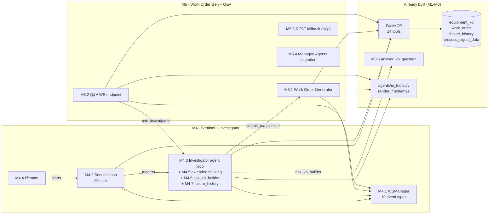
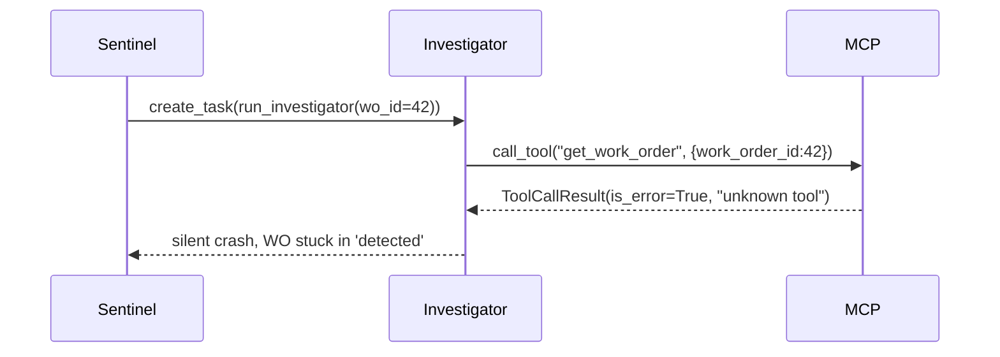
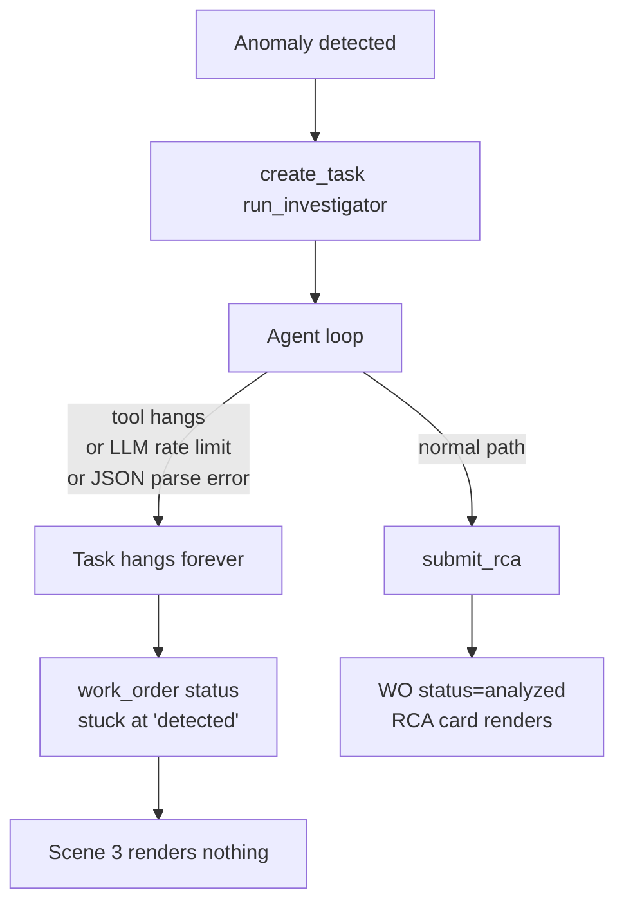
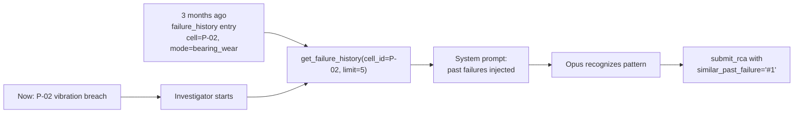
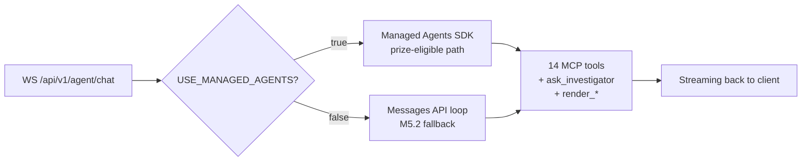

# M4 — Sentinel + Investigator & M5 — Work Order Generator + Q&A — Technical Audit

> **Scope.** Review the 11 issues that compose Milestones 4 (#23–#29) and 5 (#30–#33) against M1 (data layer — merged), M2 (MCP server + 14 tools — merged), M3 (KB Builder — just merged), the existing `backend/` code, and the ARIA product promise ("upload a manual, calibrate in 2 hours, zero data scientists, zero threshold-engineering"). Read-only guidance — no code changes.

---

## 0. Executive summary

> [!NOTE]
> **Verdict: architecturally sound. The plan already delivers the full pitch story end-to-end. Seven concrete inconsistencies would bite the demo if shipped as written, and three missing guard-rails would turn a crash into a silent stuck state. Every fix is one line to one hour. No redesign needed.**

M4 and M5 are the **critical path** of the hackathon — Sentinel detects, Investigator reasons with extended thinking (Opus 4.7 wow factor), Work Order Generator produces the printable artifact, Q&A closes the loop via Managed Agents (the Best Managed Agents prize eligibility). Together they move ARIA from "a knowledge base with charts" (end of M3) to "an agentic predictive-maintenance platform" — which is the product the pitch describes.



**What's strong.**

1. Sentinel spec already absorbs two real production bugs (`evaluate_threshold()` for double-sided signals, `is_error` propagation from `get_signal_anomalies`). This is the tightest issue in the plan.
2. Investigator has the correct mixture: MCP tools (read-only data), local `submit_rca` (structured output), `ask_kb_builder` (dynamic handoff), `render_*` (generative UI), `get_failure_history` (memory).
3. Extended thinking is scoped **only** on the Investigator — right call for both latency and cost. 5¢ per RCA is rounding error vs 25% of the prize score.
4. Agent-as-tool (M4.6) keeps the scripted pipeline as a fallback and layers dynamic handoffs on top. Without this, "5 agents orchestrated" is a Python workflow. With this, it is a real multi-agent system.
5. Managed Agents (M5.4) is correctly scoped to **one agent only** (Q&A) with a feature-flag fallback to the Messages API loop. Minimises prize-eligibility risk.
6. Cookie-based JWT decode for the Q&A WS matches the auth pattern already in the backend.

**What's weak.**

1. **Schema drift between GitHub issues and the current codebase** — `status="investigated"` does not exist in the `Status` Literal; `parts_required` does not exist in `WorkOrderUpdate` (the column is `required_parts`); `get_work_order` (singular) is not an MCP tool.
2. **WS payload inconsistency** — `agent_handoff` has three different field-name variants across three issues; `anomaly_detected` is missing `severity` and `direction`, which the frontend AlertBanner needs.
3. **`ALIGNMENT.md` referenced but does not exist** — M4.1 and M5.4 both cite `docs/planning/ALIGNMENT.md` as the WS contract source of truth. `grep -rln ALIGNMENT docs/` returns nothing. Frontend (vgtray) starts M6 against a phantom spec.
4. **No `max_turns` or wall-clock timeout on the Investigator** — a hung tool call leaves the WO stuck in `status='detected'` forever. Scene 3 never renders.
5. **Extended-thinking + tool-use signed-block handling is not mentioned** — the single most common first-timer bug when combining `thinking` with `tools`.
6. **Investigator has no outer `try/except`** — Sentinel does. Same failure mode as point 4, worse debugging UX.
7. **`render_correlation_matrix` was dropped in `ui_tools.py` with a strong rationale (hallucinated numbers in a trust-critical domain) but is still in the M4.3 mermaid and the ROADMAP sequence diagram.**

**Bottom line.** The plan is substantially correct against the pitch. Fix the seven inconsistencies in §3 **before** writing a line of M4.3 code (they are all copy-paste drift between the GitHub issues and the planning markdown), add the three guard-rails in §4, and you are in a very strong position for both the Opus 4.7 and Managed Agents prizes.

---

## 1. Does M4 + M5 actually deliver the product you are pitching?

The ARIA one-pager makes seven specific claims. Map to milestones:

| Pitch claim                                                  | Where it lives                                                                    | Delivered?                                                                                                                                          |
| ------------------------------------------------------------ | --------------------------------------------------------------------------------- | --------------------------------------------------------------------------------------------------------------------------------------------------- |
| "Manual upload, thresholds extracted by vision"              | M3.2 (merged)                                                                     | Yes                                                                                                                                                 |
| "Dialogue with operator to calibrate"                        | M3.3 / M3.5 (merged)                                                              | Yes                                                                                                                                                 |
| "Fuses signals + KPIs + logbook + shifts + maint. history"   | MCP tools (M2.3 / M2.4 / M2.5) consumed by Investigator M4.3                      | Yes — all 14 tools are in `backend/aria_mcp/tools/`, including `get_logbook_entries`, `get_shift_assignments`, `get_work_orders`, `get_failure_history` |
| "Anomaly emerges, Investigator correlates, produces RCA"     | M4.2 Sentinel + M4.3 Investigator + M4.5 thinking + M4.7 memory                   | Yes conceptually, with caveats — see §3 and §4                                                                                                      |
| "Ready-to-print work order for the field technician"         | M5.1 Work Order Generator                                                         | Yes conceptually, with field-name drift — see §3.2                                                                                                  |
| "Zero config, 2h from manual to first prediction"            | M3 onboarding + Sentinel gated on `onboarding_complete=true`                      | Yes                                                                                                                                                 |
| "Knowledge doesn't retire when the senior technician leaves" | `failure_history` as context (M4.7) + KB Builder as ongoing partner (M3.5 / M4.6) | Yes — this is the strongest architectural alignment with your narrative                                                                             |
| "Operator can ask questions in natural language"             | M5.2 / M5.4 Q&A                                                                   | Yes                                                                                                                                                 |

> [!NOTE]
> **Story coverage is complete.** The five agents (KB Builder, Sentinel, Investigator, WO Generator, Q&A) correspond cleanly to the five demo scenes. M4.6 (agent-as-tool) and M4.7 (memory) are the two issues that turn this from "a nice pipeline" into "an agentic system that justifies Opus 4.7". They are correctly prioritized. **Do not drop them.**

Nothing is promised in the one-pager that is not built. The reverse check — is there scope in M4/M5 that the pitch does not justify — also comes back clean. No gold-plating.

---

## 2. Does it fit a realistic industrial deployment?

Three checks against a realistic rotating-equipment deployment (pumps, compressors, motors):

### 2.1 Double-sided signals (flow, pressure) — the hydraulic failure modes

M4.2 correctly flags the original spec bug (read `.alert`) and routes through `evaluate_threshold()` which handles `low_alert` / `high_alert`. For hydraulic equipment this is **load-bearing** — the difference between detecting a flow collapse (pressure drop, leak, cavitation) vs only detecting bearing failure (vibration rise). A silent bug here would miss the most common class of pump failure.

### 2.2 Noisy field sensors

30s sampling + 5 min lookback + 30 min per-WO debounce is reasonable. But there is **no denoising of the underlying reading** — a single breach creates a WO. In production you would want an "N of M breaches within window" consensus + EWMA smoothing before opening a WO.

> [!TIP]
> For the hackathon this is fine (cleaner demo, faster trigger). Worth one honest sentence in `README.md`: *"Sentinel uses single-reading threshold detection for the demo; production would add an N-of-M consensus and EWMA smoothing to handle sensor noise."* Judges ask about exactly this and the honest answer scores better than hand-waving.

### 2.3 Operator language

Q&A system prompt in M5.2 is English-only. Demo script mentions French operator interactions.

- [ ] Add to M5.2 system prompt: *"Respond in the language of the operator's question. Default to French if ambiguous."*
- [ ] Same for M3.5 `answer_kb_question` (low priority — KB answers are consumed by another agent, not a human).

---

## 3. Concrete inconsistencies — fix before writing M4.3 code

### 3.1 `work_order.status = "investigated"` is not a valid enum value

> [!WARNING]
> **Demo breaker.** Issue #25 says `UPDATE work_order SET ... status="investigated"`. `backend/modules/work_order/schemas.py` line 12:

```python
Status = Literal["detected", "analyzed", "open", "in_progress", "completed", "cancelled"]
```

No `"investigated"`. Pydantic will reject. The planning markdown at `docs/planning/M4-sentinel-investigator/issues.md:127` uses `'analyzed'`, which does exist. The GitHub issue drifted.

- [ ] Update issue #25 — `status="analyzed"` (not `"investigated"`).

### 3.2 Field name drift: `parts_required` vs `required_parts`

> [!WARNING]
> **Demo breaker.** Issue #30 (M5.1) says WO Generator submits `parts_required: [{ref, qty}]`. The DB column and Pydantic field are `required_parts` — see `work_order/schemas.py` lines 21, 52, 70 and `work_order/repository.py:9` (`JSON_FIELDS`).

Two failure modes depending on how the update is coded: silent drop (dict-merge) or 422 validation error (Pydantic-first). Either way, `required_parts` ends up `NULL` in the DB, the Work Order Card renders empty in Scene 4, and Scene 5 Q&A cannot answer "what parts do I need?".

- [ ] Update issue #30 — `required_parts` everywhere (not `parts_required`).
- [ ] `suggested_window_start` / `suggested_window_end` — OK, already match.

### 3.3 `get_work_order` (singular) MCP tool does not exist

> [!WARNING]
> **Demo breaker.** Issue #25 opens with:

```python
wo = await mcp_client.call_tool("get_work_order", {"work_order_id": work_order_id})
```

Only `get_work_orders` (plural, list+filter) exists — see `backend/aria_mcp/tools/context.py:95`. The Investigator fails at its very first tool call.



- [ ] Pick one:
  - **(A) Add a new MCP tool (recommended).** 15-line `@mcp.tool() async def get_work_order(work_order_id: int)` in `aria_mcp/tools/context.py`. Clean, schema-discoverable, judges reading the tool list will see a coherent API.
  - **(B) Use existing plural tool.** Replace the call with `get_work_orders(cell_id=..., limit=200)` + client-side filter. No new code but uglier Investigator.
- [ ] Update issue #25 once chosen.

### 3.4 `docs/planning/ALIGNMENT.md` referenced but does not exist

> [!IMPORTANT]
> Both #23 (M4.1) and #33 (M5.4) point to `docs/planning/ALIGNMENT.md` as the source of truth for `EventBusMap` and `ChatMap`. `grep -rln ALIGNMENT docs/` returns nothing. vgtray (frontend) is coding M6 against a phantom spec — any divergence only surfaces Sunday morning when the two tracks finally wire up.

- [ ] Create `docs/planning/ALIGNMENT.md` today. Minimum content:
  - The 10-row WS event table from issue #23 (source of truth for `EventBusMap`).
  - The 7 chat message types from issue #31 (source of truth for `ChatMap`).
  - The `turn_id` contract.
  - One line per event explaining who emits it and who filters on what.

### 3.5 `agent_handoff` payload field names inconsistent across three issues

- M4.1 event table: `{from_agent, to_agent, reason, turn_id}`
- M4.6 example code: `{from: "investigator", to: "kb_builder", reason: args.question, turn_id}`
- M5.2 example: `{type: "agent_handoff", from: "qa", to: "investigator", reason}`

Three issues, three variants. Frontend will parse whichever is in the typed `EventBusMap`, backend will emit whichever is in the code — silent mismatch, no handoff ever rendered, you lose the Managed Agents wow moment on camera.

- [ ] Standardize on `{from_agent, to_agent, reason, turn_id}` (unambiguous, not a JS-reserved word).
- [ ] Propagate across #23, #28, #31, and `ALIGNMENT.md`.

### 3.6 `anomaly_detected` payload missing `severity` and `direction`

`evaluate_threshold()` returns `severity` (`alert`|`trip`) and `direction` (`high`|`low`). The `anomaly_detected` payload in issue #23 only carries `{cell_id, signal_def_id, value, threshold, work_order_id, time}`. The frontend AlertBanner needs severity to color the banner and direction to render "vibration TOO HIGH" vs "flow TOO LOW". Deriving direction from `value > threshold` works for single-sided thresholds only — it breaks for the two signal types that are most physically dangerous on a water pump (flow and pressure, both double-sided).

- [ ] Add `severity` and `direction` to the `anomaly_detected` payload spec in #23 and `ALIGNMENT.md`. Zero DB cost — `evaluate_threshold()` already computes them.

### 3.7 `render_correlation_matrix` dropped but still referenced

`backend/agents/ui_tools.py` (the M2.9 file already on `main`) explicitly drops `render_correlation_matrix` with a strong rationale: *"there is no MCP tool computing signal correlations, so the LLM would synthesise plausible-looking but made-up numbers — fatal for a predictive-maintenance demo"*. That audit decision is **correct** — do not walk it back.

But the demo sequence diagram in `ROADMAP.md` and the M4.3 mermaid in issue #25 still reference it. If the Investigator prompt or the demo narration lists it, Opus will emit it, and nothing will render.

- [ ] Update the mermaid in issue #25 and `ROADMAP.md` to reference `render_signal_chart` with `signal_def_ids: list[int]` (multi-signal overlay). Same visual message, grounded in real data.

---

## 4. Missing guard-rails — demo-safety nets

These are not bugs in the spec. They are absent safety nets that turn a sunny-day demo survive a rainy afternoon.

### 4.1 Investigator has no `max_turns` and no wall-clock timeout

> [!WARNING]
> Issue #25 shows `while not end_turn:` with no upper bound on iterations and no timeout on `asyncio.create_task(run_investigator(wo_id))`. On a hackathon judge's laptop, one hung tool call leaves the Investigator task hanging → WO stuck in `status='detected'` → Scene 3 never renders an RCA card. **No recovery path.**



- [ ] Add to issue #25:
  - `MAX_TURNS = 12` — empirically enough for a complete RCA loop.
  - Wrap the whole run: `await asyncio.wait_for(run_investigator(wo_id), timeout=120)`.
  - On timeout or max-turns: `UPDATE work_order SET status='analyzed', rca_summary='Investigation timed out'`, broadcast `rca_ready` with `confidence=0.0`. Graceful degradation — the operator still sees something and the WO pipeline unsticks.

### 4.2 Extended-thinking + tool-use: signed-thinking-block handling

> [!IMPORTANT]
> M4.5 enables `thinking={"type": "enabled", "budget_tokens": 10000}` together with tools. The Anthropic Messages API requires that the **signed `thinking` block** be preserved verbatim in `messages[]` on the next request during a tool-use turn. Drop it and the API returns 400. Issue #27 does not mention this. It is the single most common first-timer bug when combining extended thinking with tool loops.

- [ ] Add one explicit note to issue #27:
  > When appending the assistant turn to `messages`, keep every `thinking` and `redacted_thinking` content block in the exact order returned by the API. Do not re-stream thinking on continuation requests. The signed payload is the API's integrity check — drop it and the next `messages.create()` will 400.

### 4.3 Investigator has no outer `try/except`

Sentinel correctly wraps `_sentinel_tick()` in `try/except` with a log (#24). The Investigator does not (#25). An exception in the agent loop (LLM rate limit, DB glitch, JSON parse error, unexpected `is_error=True` path) silently kills the Task. Same observable failure as §4.1: WO stuck in `detected`.

- [ ] Wrap the whole Investigator body in `try/except Exception: log.exception(...)`; in the `except` branch still UPDATE the WO to `status='analyzed', rca_summary=f'Investigation failed: {exc}'` so the operator sees the outcome.

### 4.4 `WS /api/v1/events` auth not specified

M5.2 specifies cookie-based JWT decode for `WS /api/v1/agent/chat`. Issue #23 (M4.1) says nothing about auth for `WS /api/v1/events`. For the demo (single operator) it does not matter. For a production deployment, anomaly events leak `cell_id` + WO details + RCA summaries to any unauthenticated client.

- [ ] One line in README: *"Single-tenant demo. Production would reuse `core/security/ws_auth.py` on both `/events` and `/agent/chat`."*
- [ ] Optional: wire the same helper on `/events` in M4.1. 3 extra lines, cleaner story.

---

## 5. Per-issue verdict

### M4.1 — WSManager broadcast manager (#23)

> [!NOTE]
> **Status: sound. Two payload fixes.**

Single-topic global is the right call at demo scale (1 site, 5 cells, 1 operator). `turn_id` via `ContextVar` is the right Python idiom.

- [ ] Fix `agent_handoff` field names (§3.5).
- [ ] Add `severity` + `direction` to `anomaly_detected` (§3.6).
- [ ] Consider reusing `core/security/ws_auth.py` on `/events` (§4.4).

### M4.2 — Sentinel asyncio loop (#24)

> [!NOTE]
> **Status: the tightest issue in the plan. Ship as written.**

Already absorbs `evaluate_threshold()` routing, `is_error` propagation, DB-level debounce, startup logging. 30s tick matches demo pacing. Null-stub thresholds from the M3.2 PDF bootstrap return `breached=False` naturally — no special-case code needed. Zero fixes.

### M4.3 — Investigator agent loop (#25)

> [!IMPORTANT]
> **Status: critical-path deliverable. Four fixes, all small.**

- [ ] `status="analyzed"` not `"investigated"` (§3.1).
- [ ] `get_work_order` MCP tool — add it or rewrite the call (§3.3).
- [ ] `MAX_TURNS` + `asyncio.wait_for(..., timeout=120)` + graceful-degradation RCA (§4.1).
- [ ] Outer `try/except` (§4.3).
- [ ] Drop `render_correlation_matrix` from the mermaid (§3.7).

### M4.4 — Lifespan integration (#26)

> [!NOTE]
> **Status: trivial but one ordering detail.**

Current `main.py` lifespan wraps `mcp_http_app.lifespan(...)`. Sentinel needs to start **inside** that wrapper so it can reach the in-process MCP endpoint. Add to the issue:

```python
async with mcp_http_app.lifespan(mcp_http_app):
    sentinel_task = asyncio.create_task(sentinel_loop())
    try:
        yield
    finally:
        sentinel_task.cancel()
        await db.disconnect()
```

### M4.5 — Extended thinking on Investigator (#27)

> [!IMPORTANT]
> **Status: this is your Opus 4.7 differentiator. Non-negotiable.**

5¢ per run is rounding error vs ~25% of the prize score. The only risk is the signed-thinking-block bug (§4.2). Add that note and ship.

### M4.6 — Agent-as-tool dynamic handoffs (#28)

> [!NOTE]
> **Status: the single highest-leverage issue in the plan. Do not downgrade.**

Without this, "5 agents" is a Python workflow. With this, dynamic delegation + visible handoffs prove the multi-agent claim. Both handoff paths (Investigator → KB Builder in Scene 3, Q&A → Investigator in Scene 5) are correctly scripted.

Handler snippet for `ask_kb_builder` is already consistent with the existing `agents/kb_builder/qa.py::answer_kb_question` (which is already on `main`): the function does no DB writes and no WS broadcasts — the orchestrator wraps it with `agent_handoff` / `agent_start` / `agent_end`. This is the correct separation of concerns, preserve it.

- [ ] Only change: align `agent_handoff` field names across #23 / #28 / #31 (§3.5).

### M4.7 — Memory flex scene (#29)

> [!NOTE]
> **Status: P1 is the right priority. The base behavior is what matters.**

The base behavior (Investigator reads `failure_history` and injects into system prompt) sells the "knowledge doesn't retire" claim. The `/trigger-memory-scene` endpoint is theatre — skip under time pressure. Zero fixes.



### M5.1 — Work Order Generator (#30)

> [!NOTE]
> **Status: sound. One field-name fix.**

Keeping the WO Generator as a separate agent is correct — "5 agents orchestrated" is a pitch pillar and re-running the generator from the frontend ("Regenerate work order") is a genuinely plausible operator feature worth 20s of demo time.

- [ ] Use `required_parts` everywhere (§3.2).
- [ ] Verify the submit_work_order local-tool schema mirrors the WorkOrder DB columns exactly — any drift here repeats §3.2 in a different place.

### M5.2 — Q&A WebSocket endpoint (#31)

> [!NOTE]
> **Status: cleanest issue in M5. Ship as written.**

Cookie-based JWT decode is the right auth pattern. Multi-turn state correctly pushed to the client (server holds `messages: list`, client renders blocks in arrival order). No changes needed besides the shared `agent_handoff` field-name fix (§3.5) and the French-default system-prompt tweak (§2.3).

### M5.3 — Q&A REST fallback (#32)

> [!NOTE]
> **Status: skip-by-default is correct. Do not build until M5.2 is proven broken at 11am Sunday.**

The streaming WS is the demo wow effect for Scene 5. REST fallback is a 30-minute safety net — only cash it in if absolutely necessary.

### M5.4 — Q&A migration to Managed Agents (#33)

> [!WARNING]
> **Status: correct architecture, one unverified assumption.**

Feature-flag fallback is the right design. Only-Q&A is the right scope (five agents in Managed Agents is over-engineered and risky).

**The unverified assumption:** the Claude Managed Agents SDK supporting local Python functions as `ask_investigator` custom tools. If the SDK requires tools as HTTP endpoints or MCP declarations only, the implementation changes shape — `ask_investigator` becomes a local tool schema sent to the managed agent, and the WS handler intercepts the `tool_use` the same way `render_*` is intercepted.

- [ ] Verify this **before J5 morning**, not at 4pm Sunday. The implementation is ~30–60 min if the assumption holds, potentially 2+ hours otherwise.



---

## 6. Prioritized action list

### Before writing any M4 code (~15 minutes total)

- [ ] Update issue #25: `status="analyzed"` (§3.1)
- [ ] Update issue #25: add `get_work_order` MCP tool or use `get_work_orders` + filter (§3.3)
- [ ] Update issue #30: `required_parts` everywhere (§3.2)
- [ ] Standardize `agent_handoff` payload to `{from_agent, to_agent, reason, turn_id}` across #23 / #28 / #31 (§3.5)
- [ ] Add `severity` + `direction` to `anomaly_detected` payload in #23 (§3.6)
- [ ] Update mermaid in #25 and `ROADMAP.md` — drop `render_correlation_matrix`, use `render_signal_chart` multi-signal (§3.7)
- [ ] Write `docs/planning/ALIGNMENT.md` with WS event + chat message tables (§3.4)

### Add to issues before J4 morning (~30 minutes total)

- [ ] Issue #25: `MAX_TURNS=12`, `asyncio.wait_for(..., timeout=120)`, graceful-degradation RCA (§4.1)
- [ ] Issue #27: signed-thinking-block preservation note (§4.2)
- [ ] Issue #25: outer `try/except` with fallback RCA write (§4.3)
- [ ] Issue #26: ordering — Sentinel inside `mcp_http_app.lifespan` wrapper (§5, M4.4)
- [ ] Issue #31 + #33 system prompt: French-default response language (§2.3)

### Verify before J5

- [ ] Managed Agents SDK supports local Python custom tools for `ask_investigator` (§5, M5.4). If not, redesign `ask_investigator` as a local-tool-schema intercept before the deadline pressure hits.

### One-line disclaimers to include in the final README

- [ ] "Sentinel uses single-reading threshold detection for the demo; production would add N-of-M consensus + EWMA smoothing" (§2.2).
- [ ] "Single-tenant demo. Production would reuse `core/security/ws_auth.py` on `/events`." (§4.4).

---

## 7. One-paragraph verdict

The M4 + M5 plan is **substantially correct and architecturally sound for a five-agent hackathon build**. It already internalizes non-obvious production concerns (double-sided thresholds, `is_error` propagation, debounce via DB, onboarding gate, single-agent extended thinking, feature-flagged Managed Agents). The remaining work is tightening — seven small inconsistencies that look like copy-paste drift between the GitHub issues and the planning markdown, plus three demo-safety guard-rails that turn a crash into a visible-but-graceful degradation. None of this is a redesign. Fix §3 before starting M4.3 tomorrow morning, add §4 to the issue bodies before J4, and you are in a very strong position to hit both the Best Use of Opus 4.7 and Best Use of Managed Agents prizes.
