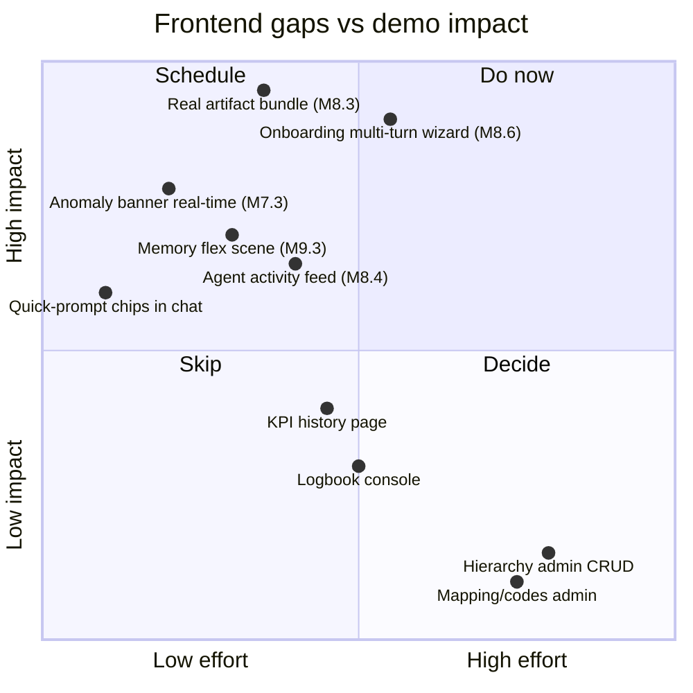
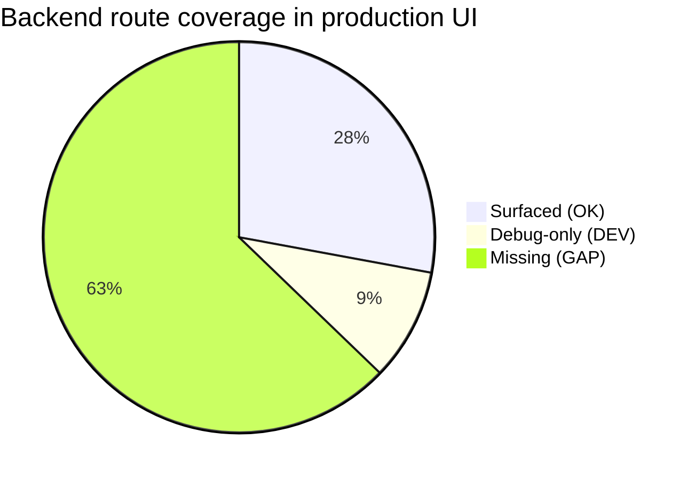
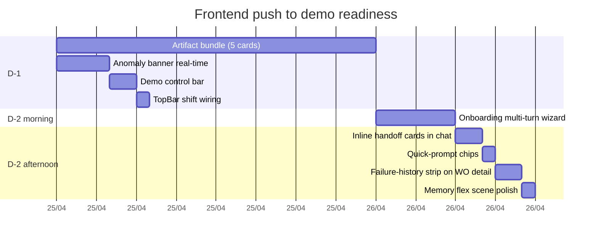
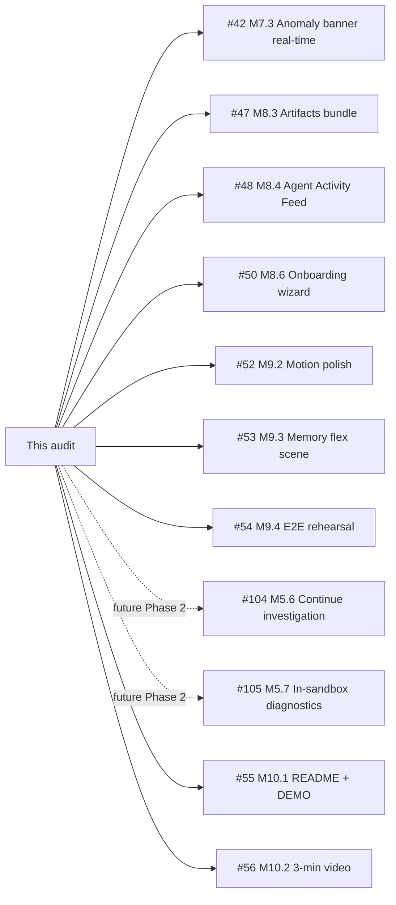

# Frontend Audit — Pre-Demo Critical Review

> [!IMPORTANT]
> Scope: a complete review of the React/TypeScript frontend against the backend capabilities documented in [docs/architecture/](../architecture/), the Day 1 product vision in [idea.md](../../idea.md), and the design intent in [frontend/docs/DESIGN_PLAN_v2.md](../../frontend/docs/DESIGN_PLAN_v2.md). This is the surface judges see first. Every gap below is a point we leave on the table.

> [!NOTE]
> This document combines a structural audit, a backend-vs-frontend coverage matrix, an honest critique of the chat-first UX choice, and a prioritised set of propositions ranked by demo impact and implementation cost. Read sections 1-4 for the diagnosis and section 5 for the recommendations.

---

## Table of contents

0. [Changelog since audit (24 Apr, J-2)](#0-changelog-since-audit-24-apr-j-2)
1. [Executive summary](#1-executive-summary)
2. [What the frontend ships today](#2-what-the-frontend-ships-today)
3. [Backend-to-frontend coverage matrix](#3-backend-to-frontend-coverage-matrix)
4. [Critical issues](#4-critical-issues)
5. [Propositions ranked by demo impact](#5-propositions-ranked-by-demo-impact)
6. [Open issues that map to this audit](#6-open-issues-that-map-to-this-audit)
7. [Reference material](#7-reference-material)

---

## 0. Changelog since audit (24 Apr, J-2)

> [!NOTE]
> Updates landed between the original audit and the J-2 pull. Tracked against the original Tier 1 / Tier 2 propositions in §5.

### Shipped since audit

| Commit                                                           | Item                                                                                                                                                                                                       | Maps to                                                  |
|------------------------------------------------------------------|------------------------------------------------------------------------------------------------------------------------------------------------------------------------------------------------------------|----------------------------------------------------------|
| `09bae3c`                                                        | `activityFeedStore` with circular FIFO buffer.                                                                                                                                                             | Tier 2 #13 — Agent Activity Feed                         |
| `d6cba0a`                                                        | `useActivityFeedStream` wired to `/events` bus.                                                                                                                                                            | Tier 2 #13                                               |
| `c76412a`                                                        | `ActivityFeed.tsx` (312 LOC) — agent dot + badges, filters per agent, handoff sweep, role=log.                                                                                                             | Tier 2 #13 — **shipped** (M8.4 done)                     |
| `5a6f87e`                                                        | ActivityFeed mounted under chat drawer (collapsible, 38% height, persisted state).                                                                                                                         | Tier 2 #13 (UI mount)                                    |
| `ec61562`                                                        | `feat(demo)` Investigator replay trigger — `DemoReplayButton` (DEV-only, bottom-left of AppShell) + new `modules/debug` backend (`POST /debug/replay-investigator/{id}`, `GET /debug/recent-work-orders`). | Tier 1 #9 — *partial* (replay flavour, not memory-scene) |
| `7cd0362`                                                        | `ARIA_DEMO_ENABLED` forwarded to backend container.                                                                                                                                                        | Demo infra                                               |
| `62fd942`                                                        | Investigator: `thinking.type=adaptive` + `display=summarized`.                                                                                                                                             | Inspector UX polish                                      |
| `d3eaba3`                                                        | Agent turn buffer persisted in global `agentTurnsStore` (Inspector survives drawer remount).                                                                                                               | Inspector UX polish                                      |
| `2d174cb`                                                        | `PrintableWorkOrder` mounted via React Portal (decoupled from grid constraints).                                                                                                                           | Tier 3 / print polish                                    |
| `c254fc8`, `10ab9b0`, `d78646d`, `3b85714`, `7b9dd70`, `e8dffd2` | Print-mode hardening (no trailing blank page, `position: static` for multi-page, `parseList` dedup, parts as array of objects).                                                                            | Tier 3 / print polish                                    |
| `3b3b447`                                                        | Investigator architecture docs enhanced with failure-history mechanism.                                                                                                                                    | Documentation                                            |
| `2bc9fcc`                                                        | Backend architecture documentation set.                                                                                                                                                                    | Documentation (Depth signal)                             |

### Audit items revisited

| Original finding (§4 / §5)                             | Status as of J-2                                                                                                                                                                                                                  |
|--------------------------------------------------------|-----------------------------------------------------------------------------------------------------------------------------------------------------------------------------------------------------------------------------------|
| §4.6 Anomaly banner not real-time *(Tier 1 #7)*        | **Already shipped** at audit time — `AnomalyBanner.tsx` imports `useAnomalyStream` (commit `d8ff3e5` M7.3). Audit was stale on this point.                                                                                        |
| §4.7 Agent Activity Feed missing *(Tier 2 #13)*        | **Shipped.** Lives under chat drawer, filters work, handoff sweep animation in place.                                                                                                                                             |
| §4.5 Memory flex scene has no UI trigger *(Tier 1 #9)* | **Partial.** A demo trigger button now exists (`DemoReplayButton`), but it replays the Investigator on an existing WO — it does **not** call `POST /demo/trigger-memory-scene`. The memory-scene kill-switch is still missing.    |
| §4.4 TopBar uses local clock *(Tier 1 #8)*             | **Still open.** No commit touched `TopBar.tsx` for `/shifts/current`.                                                                                                                                                             |
| §4.2 Onboarding wizard *(Tier 1 #6)*                   | **Still open.** `features/onboarding/` still contains only `PdfUpload.tsx`. No `CalibrationQuestion`, no session view.                                                                                                            |
| §4.1 Artifact bundle *(Tier 1 #1-#5)*                  | **Still open.** `placeholders/` directory unchanged: `AlertBanner` 443B, `BarChart` 432B, `DiagnosticCard` 556B, `KbProgress` 561B, `PatternMatch` 553B, `WorkOrderCard` 489B. Only `SignalChart` and `EquipmentKbCard` are real. |
| §4.3 Chat panel is a plain LLM box                     | **Partly mitigated.** Activity Feed now sits under the chat = "team, not chatbot" cue. But inline handoff cards in the *message stream*, equipment chips, and quick-prompts are still missing (Tier 2 #10-#12).                   |

### Net status of §5 propositions

```
Tier 1:  ▓▓▓░░░░░░░  3/9 effectively addressed (banner already done, activity feed via mount under chat, replay button partial)
         Remaining P0: 5 artifacts (#1-5), onboarding wizard (#6), TopBar shift (#8), memory-scene UI trigger (#9 proper)

Tier 2:  ▓▓░░░░░░░░  1/6 shipped (Activity Feed #13)
         Remaining: inline handoff cards (#10), quick-prompts (#11), thinking indicator (#12), failure-history strip (#14), printable WO in chat (#15)

Tier 3:  ▓░░░░░░░░░  Print polish unblocked (multiple commits). Motion pass / theme demo / empty states untouched.
```

### Demo-readiness re-score

> [!IMPORTANT]
> **Trajectory positive but the headline gap is unchanged.** The artifact bundle (Tier 1 #1-5) and the onboarding wizard (#6) are still the two demo-blocking deltas. Everything shipped since the audit is *real* (Activity Feed in particular is judge-visible and well executed) but it does not move the needle on the "six placeholders rendered as coloured rectangles" problem flagged as the single biggest visible gap.

### New surfaces worth noting for the demo

- **Activity Feed** is now the natural backdrop for the *Agent Constellation* idea (see [docs/planning/M9-polish-e2e/wow-factor-ideas.md](../planning/M9-polish-e2e/wow-factor-ideas.md)). The data layer (`activityFeedStore` + `useActivityFeedStream`) can feed the constellation directly — no new plumbing needed.
- **DemoReplayButton** is the right *pattern* for the memory-scene trigger. Cloning it for `POST /demo/trigger-memory-scene` is now a 30-line task instead of a 200-line one.
- **Persisted `agentTurnsStore`** means the Inspector can be opened *after* an agent runs and still show the trace — useful for the live demo if the operator clicks late.

---

## 1. Executive summary

### Verdict

The frontend is **architecturally clean but demo-thin**. The shell, design system, equipment grid, work-order console, agent inspector, and chat plumbing are well built, well tested, and well aligned to the operator-calm direction in v2 of the design plan. The Day 1 vision, however, asks for a five-scene narrative ending in a printable work order — and roughly half of that narrative is currently rendered as either a placeholder or not at all.

> [!WARNING]
> Seven of the nine generative-UI artifacts the backend can emit (`AlertBanner`, `BarChart`, `DiagnosticCard`, `KbProgress`, `PatternMatch`, `WorkOrderCard`, plus the dropped `CorrelationMatrix`) are 11-15 line `PlaceholderShell` stubs. Only `SignalChart` (298 lines) and `EquipmentKbCard` (448 lines) are real. When the agents stream `ui_render` frames live during the demo, six of seven cards will look identical — a coloured rectangle with a name. **This is the single biggest visible gap.**

### The three wins to claim and the three losses to fix



**Wins to claim (already shipped, lean into them):**

1. The Agent Inspector is a proper differentiator. 413 lines of real reasoning-trace rendering, paired with the live `thinking_delta` stream from the Investigator. No competing demo will have this.
2. The Work Orders console with live-update via the events bus is real: filterable, sortable, printable, with `useWorkOrdersStream` cleanly invalidating React Query on `work_order_ready`/`rca_ready`.
3. The design system pivot to "operator-calm" reads as a real SaaS console rather than a hackathon. This survives the half-second judge look.

**Losses to fix (decision points for the next 48 hours):**

1. The artifact bundle is six placeholders. Without them, generative UI is a claim, not a feature.
2. The onboarding wizard stops at PDF upload. The "2 minutes from manual to first prediction" demo moment from Scene 1 of [idea.md](../../idea.md) cannot actually be performed end-to-end in the UI.
3. The chat panel is a plain ChatGPT clone. It does nothing to surface what makes ARIA's chat different (equipment context, agent handoffs visible inline, suggested investigations, KB-grounded answers).

---

## 2. What the frontend ships today

### Routes

| Route                     | Page              | Purpose                                        | LOC | Status                    |
|---------------------------|-------------------|------------------------------------------------|-----|---------------------------|
| `/login`                  | `LoginPage`       | Cookie JWT auth.                               | -   | Shipped.                  |
| `/control-room`           | `ControlRoomPage` | Equipment grid + inspector + AppShell.         | -   | Shipped.                  |
| `/work-orders`            | `WorkOrderList`   | Filterable, sortable, live-updated WO console. | 392 | Shipped.                  |
| `/work-orders/:id`        | `WorkOrderDetail` | RCA + actions + parts + printable card.        | 260 | Shipped.                  |
| `/onboarding`             | `OnboardingPage`  | Cell picker + PDF upload only.                 | -   | Partial — wizard missing. |
| `/onboarding/:session_id` | `SessionStub`     | Stub landing after upload.                     | -   | Stub. M8.6 not shipped.   |
| `/data`                   | `DataPage`        | Debug dump of every backend endpoint.          | -   | Internal/dev only.        |
| `/design`                 | `DesignPage`      | Design-system playground.                      | -   | Internal/dev only.        |

### Major feature areas

| Area                  | Files                                                    | Strengths                                                                          | Weaknesses                                                                                                                                                 |
|-----------------------|----------------------------------------------------------|------------------------------------------------------------------------------------|------------------------------------------------------------------------------------------------------------------------------------------------------------|
| **Design system**     | `design-system/` 14 files                                | v2 "operator-calm" palette, dark+light parity, motion tokens, typography locked.   | Some legacy v1 components linger (`MetaStrip`, `StatusRail` largely unused outside design page).                                                           |
| **Shell**             | `app/AppShell.tsx`, `TopBar.tsx`, `Drawer.tsx`           | Resizable chat drawer with localStorage persistence; keyboard-aware focus capture. | TopBar's `useShift` computes the shift from `Date.getHours()` instead of hitting `/shifts/current`.                                                        |
| **Equipment**         | `features/control-room/EquipmentGrid + Inspector + Node` | Data-driven, equipment-agnostic, anomaly-status overlay via `useAnomalyStatusMap`. | Inspector body is shallow — no live signal trends, no recent WO list, no failure history.                                                                  |
| **KPIs**              | `features/control-room/KpiBar + useKpiData`              | Live OEE + maintenance + status events, sparkline, refresh on a 15s timer.         | One bar on the top — no history page, no MTBF/MTTR breakdown, no quality, no production stats.                                                             |
| **Work orders**       | `features/work-orders/`                                  | List + detail + printable + WS-driven invalidation. Tested.                        | `WorkOrderDetail` does not show the failure_history pattern match — the strongest narrative beat.                                                          |
| **Agent inspector**   | `features/agents/AgentInspector.tsx` 413 lines           | Real `thinking_delta` rendering, tool-call timeline, agent-handoff visualisation.  | Hidden behind a 40vh drawer; not surfaced as a wow moment in the chat flow.                                                                                |
| **Chat panel**        | `app/chat/` 7 files, ~900 LOC                            | Throttled message list, auto-scroll, connection indicator, focus management.       | Plain prompt → response. No quick prompts, no equipment scoping shown, no inline handoff cards.                                                            |
| **Onboarding**        | `features/onboarding/PdfUpload.tsx`                      | XHR-based upload with byte-level progress, abort, drag-and-drop, page preview.     | Stops there. No wizard for the four calibration questions.                                                                                                 |
| **Artifact registry** | `artifacts/` + `placeholders/`                           | Registry pattern is correct; `SignalChart` and `EquipmentKbCard` are production.   | 7 of 9 artifacts are stubs — `BarChart` (11 LOC), `AlertBanner` (11), `DiagnosticCard` (15), `PatternMatch` (15), `WorkOrderCard` (14), `KbProgress` (15). |

---

## 3. Backend-to-frontend coverage matrix

The backend exposes 86 REST routes across 13 modules. The table below maps every backend capability to whether the frontend currently surfaces it.

### Legend

| Symbol | Meaning                                                                     |
|--------|-----------------------------------------------------------------------------|
| OK     | Surfaced in a real, judge-visible page or panel.                            |
| DEV    | Surfaced only in `/data` (debug page) or `/design` (playground).            |
| GAP    | Backend route exists, frontend has no consumer.                             |
| WS     | Frontend gets the data via a WebSocket frame instead of REST (intentional). |

### Coverage by domain

| Backend module | Capability                                                   | Frontend surface                                            | Status                            |
|----------------|--------------------------------------------------------------|-------------------------------------------------------------|-----------------------------------|
| **auth**       | login / logout / me                                          | `LoginPage` + `lib/auth.ts`                                 | OK                                |
| **auth**       | refresh                                                      | Not used — JWT TTL bridges the demo window.                 | GAP (acceptable)                  |
| **hierarchy**  | `GET /hierarchy/tree`                                        | `EquipmentPicker`, `EquipmentGrid`, `DataPage`              | OK                                |
| **hierarchy**  | full CRUD on enterprises/sites/areas/lines/cells (20 routes) | None.                                                       | GAP (admin scope, low demo value) |
| **kpi**        | `GET /kpi/oee`                                               | `KpiBar` (current value), `DataPage` (table)                | OK                                |
| **kpi**        | `GET /kpi/oee/trend`                                         | `KpiBar` Sparkline                                          | OK                                |
| **kpi**        | `GET /kpi/maintenance` (MTBF / MTTR)                         | `KpiBar` (current values only)                              | OK (thin)                         |
| **kpi**        | `GET /kpi/production-stats`                                  | None.                                                       | GAP                               |
| **kpi**        | `GET /kpi/quality/by-cell`                                   | None.                                                       | GAP                               |
| **signal**     | `GET /signals/definitions` (+ id)                            | `useSignalDefinitions`, `SignalChart`                       | OK                                |
| **signal**     | `GET /signals/data/{id}`                                     | `SignalChart`                                               | OK                                |
| **signal**     | `GET /signals/current`                                       | `DataPage` only                                             | DEV                               |
| **signal**     | tags / definitions / units / types CRUD (10 routes)          | None.                                                       | GAP (admin)                       |
| **monitoring** | `GET /monitoring/status/current`                             | `useKpiData` (machine-status events), `DataPage`            | OK                                |
| **monitoring** | `GET /monitoring/events/machine-status`                      | `useKpiData`                                                | OK                                |
| **monitoring** | `GET /monitoring/events/production`                          | None.                                                       | GAP                               |
| **logbook**    | `GET /logbook` + `GET /logbook/{id}` + `POST /logbook`       | `DataPage` only.                                            | DEV                               |
| **shift**      | `GET /shifts/current`                                        | `DataPage` only — `TopBar` uses local clock instead!        | BUG                               |
| **shift**      | `GET /shifts/assignments` + POST                             | None.                                                       | GAP                               |
| **work_order** | full CRUD                                                    | `WorkOrderList`, `WorkOrderDetail`, `useWorkOrders`         | OK                                |
| **kb**         | `GET /kb/equipment` + `/{cell_id}`                           | `EquipmentKbCard` artifact                                  | OK                                |
| **kb**         | `PUT /kb/equipment`                                          | `EquipmentKbCard` (inline edit)                             | OK                                |
| **kb**         | `POST /kb/equipment/{cell_id}/upload`                        | `PdfUpload`                                                 | OK                                |
| **kb**         | `POST /kb/equipment/{cell_id}/onboarding/start`              | None — wizard not shipped.                                  | GAP (CRITICAL)                    |
| **kb**         | `POST /kb/equipment/{cell_id}/onboarding/message`            | None — wizard not shipped.                                  | GAP (CRITICAL)                    |
| **kb**         | `GET /kb/failures`                                           | None.                                                       | GAP (HIGH demo value)             |
| **mapping**    | status-codes / quality-codes (8 routes)                      | None.                                                       | GAP (admin)                       |
| **demo**       | `POST /demo/trigger-memory-scene`                            | None — judges can't trigger Scene 5 from the UI.            | GAP (CRITICAL for demo control)   |
| **WS events**  | anomaly_detected / agent_* / thinking_delta / ui_render      | `useAnomalyStream`, `useAgentStream`, `useWorkOrdersStream` | WS / OK                           |
| **WS chat**    | text_delta / tool_call / agent_handoff / done / ui_render    | `chatStore`                                                 | WS / OK                           |

### Aggregate



> [!NOTE]
> The 54 GAP routes are mostly admin/setup CRUD (hierarchy, signals, mapping). For a judging context, **the demo-relevant gaps are five**: the onboarding wizard endpoints (2), `/kb/failures`, `/demo/trigger-memory-scene`, and the `TopBar` shift bug. Everything else is acceptable scope for a hackathon.

---

## 4. Critical issues

### 4.1 The artifact bundle is mostly placeholder

> [!CAUTION]
> When the Investigator emits `render_diagnostic_card` mid-RCA in Scene 3, the frontend renders a generic `PlaceholderShell` reading "diagnostic_card" with the props as a JSON dump. Same for `render_pattern_match` in the memory scene, `render_work_order_card` in Scene 4, and `render_alert_banner` in Scene 2.

The artifact registry plumbing is correct — the `ui_render` events route to the right component. But six of seven targets are stubs. The contract the backend honours (`{component, props, agent}`) is satisfied; the rendering is not.

The two real ones are exemplars:

- `SignalChart.tsx` (298 LOC) — fetches definition + data, renders an svg trend with anomaly markers, threshold bands.
- `EquipmentKbCard.tsx` (448 LOC) — full editable KB profile with inline calibration.

The other six need to reach roughly the same fidelity. They do not need to be 300+ lines each — `WorkOrderCard` and `DiagnosticCard` are mostly typography over a structured payload.

**Issue:** [#47 M8.3](https://github.com/zestones/Aria/issues/47) — open, M8 milestone.

### 4.2 The onboarding wizard does not exist

> [!WARNING]
> Scene 1 of the demo from [idea.md](../../idea.md) shows ARIA reading the PDF, asking three calibration questions, then producing a calibrated KB. Today the UI uploads the PDF, drops the operator on a stub page, and says "the full multi-turn wizard lands in M8.6". M8.6 has not landed.

The backend has the conversation endpoints (`POST /kb/equipment/{cell_id}/onboarding/start` and `/message`) and the four-question session machine is implemented and tested. The frontend wires neither. This is the most important narrative arc in the product pitch and it currently has no visual.

A working wizard does not need to be elaborate. Three components is enough:
- A `<KbProgress>` real implementation showing the five `kb_progress` phases the backend already emits.
- A `<CalibrationQuestion>` card that posts the operator's free-text answer and renders the next question from the response.
- A reveal animation when `onboarding_complete=true` flips, transitioning to the calibrated `EquipmentKbCard`.

**Issue:** [#50 M8.6](https://github.com/zestones/Aria/issues/50) — open, M8 milestone.

### 4.3 The chat panel is a plain LLM box

> [!IMPORTANT]
> The user's instinct is correct: a generic chat is the worst possible front for an agentic platform. Judges have seen 200 chat boxes this hackathon. None of what makes ARIA's chat different is visible in the UI.

What ARIA's chat actually does that no other demo's does:

- It can hand off to a sub-agent (`ask_investigator`) and the sub-agent runs with persisted session memory.
- It is grounded in real time-series data via the MCP tool surface.
- It can render generative-UI artifacts inline with the conversation.
- It knows the operator's selected equipment from the `EquipmentPicker`.

What the UI shows: a connection dot, a list of bubbles, an input. The handoff isn't visualised in the message stream (it lives in the side Inspector). There is no equipment-context chip on each user message. There are no example prompts. There is no sense that the chat has any more capability than a Claude.ai window.

**Concrete gaps:**

| Capability                                        | Backend ready                | UI shows it            |
|---------------------------------------------------|------------------------------|------------------------|
| `ask_investigator` handoff with sub-turn marker   | Yes                          | No (Inspector only)    |
| Equipment scope ("ARIA is asking about P-02")     | Yes (selection state)        | No                     |
| Suggested investigations / quick prompts          | N/A — UI affordance          | No                     |
| Inline rendered artifact in the chat stream       | Yes (`ui_render` on chat WS) | Partial (placeholders) |
| KB-grounded answer with citation chip             | Yes (Q&A reads KB)           | No                     |
| "What ARIA is thinking" indicator while streaming | Yes (`thinking_delta`)       | Inspector only         |

A 90-minute fix moves the chat from "a chat" to "a co-pilot": add three example-prompt chips above the input that change with the selected equipment, render an inline collapsible "→ asked Investigator" card when `agent_handoff` arrives on the chat socket, and show the active equipment as a chip on the user's bubble.

### 4.4 The TopBar shift is computed locally

[`frontend/src/app/TopBar.tsx#L7`](../../frontend/src/app/TopBar.tsx) — `computeShift(date)` returns "Shift A/B/C" from `date.getHours()`. The backend has `GET /shifts/current` that returns the actual shift assignment with the operator name. We display fake data above the actual ARIA brand.

A judge running the demo at 14:00 sees "Shift B 14-22" with no operator name — instead of "Night shift, Karim Belkacem". This is a 30-line fix and a real loss.

### 4.5 The memory flex scene has no UI trigger

The `failure_history` injection into the Investigator's system prompt is the strongest "moat" demo moment — "ARIA recognised this matches the bearing failure from last March". The backend exposes `POST /demo/trigger-memory-scene`. The frontend has no button to fire it.

If the demo timeline drifts and the natural anomaly does not produce a recognisable pattern, there is no kill-switch to force the moment.

**Issue:** [#53 M9.3](https://github.com/zestones/Aria/issues/53) — open, M9 milestone.

### 4.6 The anomaly banner is not real-time

> [!NOTE]
> `AnomalyBanner.tsx` is 270 lines and well structured, but it does not subscribe to live `anomaly_detected` events. The backend broadcasts the frame; the banner does not render it.

**Issue:** [#42 M7.3](https://github.com/zestones/Aria/issues/42) — open, M7 milestone.

### 4.7 The Agent Activity Feed is missing

The Inspector renders a single agent's reasoning. There is no surface that shows "in the last 30 minutes ARIA detected 2 anomalies, ran 2 investigations, generated 1 work order, answered 4 questions". This is what makes the platform feel *alive* between user actions.

**Issue:** [#48 M8.4](https://github.com/zestones/Aria/issues/48) — open, M8 milestone.

---

## 5. Propositions ranked by demo impact

Ordered by impact-per-hour. Pick the top items first; the bottom items are enhancements.

### Tier 1 — Demo-blocking. Must ship.

| # | Proposition                                          | Impact   | Effort | Owner    |
|---|------------------------------------------------------|----------|--------|----------|
| 1 | Real `WorkOrderCard` artifact (Scene 4).             | High     | S      | Frontend |
| 2 | Real `DiagnosticCard` artifact (Scene 3).            | High     | S      | Frontend |
| 3 | Real `PatternMatch` artifact (Scene 5 memory).       | High     | S      | Frontend |
| 4 | Real `KbProgress` artifact (Scene 1 progress).       | High     | S      | Frontend |
| 5 | Real `AlertBanner` artifact (Scene 2 anomaly).       | High     | S      | Frontend |
| 6 | Onboarding multi-turn wizard (Scene 1 calibration).  | Critical | M      | Frontend |
| 7 | Anomaly banner real-time WS subscription.            | High     | XS     | Frontend |
| 8 | TopBar `/shifts/current` integration.                | Medium   | XS     | Frontend |
| 9 | Demo control bar with "trigger memory scene" button. | Medium   | XS     | Frontend |

### Tier 2 — Differentiation. Big judge-impact wins.

| #  | Proposition                                                                     | Impact | Effort | Owner    |
|----|---------------------------------------------------------------------------------|--------|--------|----------|
| 10 | Inline `agent_handoff` cards in the chat stream.                                | High   | S      | Frontend |
| 11 | Equipment-scoped quick-prompt chips above the chat input.                       | High   | XS     | Frontend |
| 12 | "ARIA is investigating…" inline indicator on the user's last bubble.            | Medium | XS     | Frontend |
| 13 | Agent Activity Feed (M8.4) — last-30-min event stream panel.                    | High   | M      | Frontend |
| 14 | Failure-history strip on `WorkOrderDetail` ("3 similar incidents").             | High   | S      | Frontend |
| 15 | Render the printable `WorkOrderCard` directly in chat after `work_order_ready`. | Medium | XS     | Frontend |

### Tier 3 — Polish. Win the judging detail-pass.

| #  | Proposition                                                             | Impact | Effort |
|----|-------------------------------------------------------------------------|--------|--------|
| 16 | Motion polish pass — entrance for new WO rows, RCA reveal in inspector. | Medium | S      |
| 17 | Light/dark theme demo pass — start dark, switch to light during pitch.  | Medium | XS     |
| 18 | Empty/loading/error state copy pass across artifacts.                   | Low    | S      |
| 19 | KPI history page (`MTBF`/`MTTR`/quality trends) for the data-rich view. | Low    | M      |
| 20 | Logbook console under `/logbook`.                                       | Low    | M      |

### Tier 4 — Skip for the hackathon, document for the post-mortem.

- Hierarchy CRUD admin (sites/areas/lines/cells management).
- Mapping codes admin (status-codes, quality-codes).
- Signal definitions / tags CRUD.
- Production stats and quality views.
- Auth refresh flow.

---

### Suggested 48-hour plan



---

## 6. Open issues that map to this audit



| Issue                                                                                  | Maps to                                 | Priority |
|----------------------------------------------------------------------------------------|-----------------------------------------|----------|
| [#42 M7.3 Anomaly banner real-time](https://github.com/zestones/Aria/issues/42)        | Tier 1 — item 7                         | P0       |
| [#47 M8.3 Artifacts bundle](https://github.com/zestones/Aria/issues/47)                | Tier 1 — items 1-5                      | P0       |
| [#48 M8.4 Agent Activity Feed](https://github.com/zestones/Aria/issues/48)             | Tier 2 — item 13                        | P1       |
| [#50 M8.6 Onboarding wizard](https://github.com/zestones/Aria/issues/50)               | Tier 1 — item 6                         | P0       |
| [#52 M9.2 Motion polish](https://github.com/zestones/Aria/issues/52)                   | Tier 3 — item 16                        | P2       |
| [#53 M9.3 Memory flex scene](https://github.com/zestones/Aria/issues/53)               | Tier 1 — item 9 (UI side)               | P0       |
| [#54 M9.4 E2E demo rehearsal](https://github.com/zestones/Aria/issues/54)              | Demo-day prep                           | P0       |
| [#104 M5.6 Continue investigation add-on](https://github.com/zestones/Aria/issues/104) | Phase 2 — Managed Agents differentiator | P2       |
| [#105 M5.7 In-sandbox signal diagnostics](https://github.com/zestones/Aria/issues/105) | Phase 2 — Managed Agents differentiator | P3       |

---

## 7. Reference material

- Backend architecture: [docs/architecture/](../architecture/)
- Original product vision: [idea.md](../../idea.md)
- Frontend design plan v2: [frontend/docs/DESIGN_PLAN_v2.md](../../frontend/docs/DESIGN_PLAN_v2.md)
- Frontend roadmap origin: [docs/planning/M6-frontend-foundation/](../planning/M6-frontend-foundation/), [M7-control-room/](../planning/M7-control-room/), [M8-agentic-workspace/](../planning/M8-agentic-workspace/), [M9-polish-e2e/](../planning/M9-polish-e2e/)
- Hackathon scoring criteria: [docs/hackathon/rules.md](../hackathon/rules.md)

---

> [!TIP]
> If only one item from this audit ships before the demo, **make it the artifact bundle (Tier 1 items 1-5)**. They are individually small, cumulatively transformative, and they directly determine whether the agents' visible output is "a coloured rectangle" or "a polished diagnostic card the operator could actually use". This is the difference between "yet another agent demo" and "a product".
