# ARIA — PRD Demo Video (v4)

> **PRD frontend/backend pour la video submission hackathon "Built with Opus 4.7".**
> Destinataire principal : **zestones** (on s'aligne sur ses docs strategiques + branche `133-m95-full-frontend-polish` deja livree).
>
> Base : audit main + audit branche polish (2026-04-24 21h, 36 commits ahead of main).
> Deadline submission : **2026-04-26 20:00 EST**.
>
> **v4 — resync sur la branche polish au 2026-04-24 21h** (13 commits apres v3) :
> - **DashboardPage** remplace ControlRoomPage sur `/control-room` — landing operateur avec hero shift + KPI tiles + top anomalies + top WOs + logbook recent
> - **Equipment grid** (5 tiles machines) extrait vers **`/equipment`** (EquipmentPage)
> - **Shifts feature complete** (`/shifts`) — RotaPanel, ShiftActivityPanel, ShiftLogbookPanel, ShiftHeader
> - **ActivityFeed supprimee** (-312 LOC) — simplification, le Constellation reste seul wow-factor
> - **`/design` et `/data` supprimes** des routes publiques — Tier 0.3 win-plan DONE
> - **SessionsMenu + SessionsPanel** chat — session management
> - **EquipmentBootstrap** component pour cell creation inline
> - **WorkspaceChat** inline artifact rendering
> - **NativeSelect** component
> - **Theme selection dans UserMenu** (remove ThemeToggle)

---

## 1. Objectif + diagnostic strategique

### Objectif

Aligner l'app sur le script video final (`docs/demo/SCRIPT.md` v5). Video 3 min tournee scene par scene, assemblee en **Remotion** ou **Hyperframes** (decision pending cf. tests `~/Documents/Projets/aria-video/aria-pitch/` et `aria-hyperframes/`).

### Diagnostic (merci `win-plan-48h.md`)

**ARIA n'est PAS en retard sur les features. ARIA est en retard sur la *pitch-legibility*.**

- **Impact 30%** → match nul. Leverage faible.
- **Demo 25%** → rattrape via Constellation + Dashboard credible + scenario plain English. Reste : video + README.
- **Opus 4.7 Use 25%** → **LE critere le plus exploitable**. ARIA domine en capability, doit captionner chaque capability.
- **Depth 20%** → ARIA gagne deja. README rewrite pour l'exposer.

### Les 3 items "si un seul ship"

1. **README rewrite** — juge voit "5 Managed Agents + MCP + 1M context" en 30s
2. **Migration 010 + seed bottled-water** — 5 machines nommees plain English + 7j history
3. **1-phrase hook** — accroche repetee (README + login + video thumbnail)

### Conseils CM Anthropic (2026-04-24 soir)

- **Adrian Michalski** : *"imagine they're watching the 342nd video... a guy in a lab coat walks in and shows them an operating room. What turns you on more?"* → **humain visible dans la video**.
- **Barbara** : stack confirme top 6 : OBS + Claude + ElevenLabs + **CapCut Pro**. Conseil narrative : *"lead with the pain, not the mechanics. Once the viewer cares, then dazzle them with technical details."*

---

## 2. Script video de reference

Voir `docs/demo/SCRIPT.md` v5. Resume des 5 scenes + intro/outro :

| Scene | Duree | Hero shot UI | Target | Trigger |
|---|---|---|---|---|
| Intro | 0:00–0:30 | Stock + logo anime (+ facecam Adam si decision go) | — | Pur montage |
| 1 Onboarding | 0:30–0:55 | Dashboard → `/onboarding` avec EquipmentBootstrap + PdfUpload + MultiTurnDialog | **Bottle Labeler** | User drop PDF |
| 2 Predictive | 0:55–1:15 | **Dashboard `/control-room`** card "Open anomalies" + SignalChart forecast overlay | **Bottle Filler** | `POST /demo/scene/seed-forecast` + wait 60s |
| 3 Investigation ⭐ | 1:15–2:05 | Inspector drawer + thinking stream + DiagnosticCard + ToolCallRow collapsible + shift header Karim | **Bottle Filler** | `POST /demo/scene/trigger-breach` + click anomaly |
| 4 Work Order | 2:05–2:25 | WorkOrderDetail + failure-history strip + PrintableWorkOrder | Bottle Filler | Auto cree apres submit_rca |
| 5 Memory recall | 2:25–2:40 | PatternMatch card mentionnant Samir (closed by) | **Bottle Capper** | `POST /demo/trigger-memory-scene` |
| Outro Constellation | 2:40–3:00 | **AgentConstellation plein ecran live** + closing | — | Hotkey `A` |

---

## 3. Inventaire backend existant

### 3.1 Agents

| Agent | Chemin | Status | Runtime |
|---|---|---|---|
| **KB Builder** | `backend/agents/kb_builder/` | Live | Messages API (Opus vision PDF, Sonnet patch). 4 questions onboarding. |
| **Sentinel (reactive)** | `backend/agents/sentinel/service.py` | Live | Local. Tick 30s. Broadcast `anomaly_detected` + `ui_render(alert_banner)`. |
| **Sentinel (predictive)** | `backend/agents/sentinel/forecast.py` | Live (polish) | Local. Tick 60s. OLS regression 6h. Emits `forecast_warning` avec ETA + R². Debounce 30 min. |
| **Investigator** | `backend/agents/investigator/managed/` | **Live sur Managed Agents** (M5.5) | **Claude Managed Agents** extended thinking (10k budget). Hosted-MCP. Fallback `INVESTIGATOR_USE_MANAGED=false`. |
| **Work Order Generator** | `backend/agents/work_order_generator/` | Live | Chain apres `submit_rca` |
| **Q&A** | `backend/agents/qa/` | Live | Messages API Sonnet local. Managed Agents removed en M5.5. |

### 3.2 MCP Server — 17 tools

Tous dans `backend/aria_mcp/tools/` :

1. `get_logbook_entries` / 2. `get_shift_assignments` / 3. `get_work_order` / 4. `get_work_orders` / 5. `list_cells` / 6. `get_equipment_kb` / 7. `get_failure_history` / 8. `update_equipment_kb` / 9. `get_oee` / 10. `get_mtbf` / 11. `get_mttr` / 12. `get_downtime_events` / 13. `get_quality_metrics` / 14. `get_production_stats` / 15. `get_signal_trends` / 16. `get_signal_anomalies` / 17. `get_current_signals`

### 3.3 REST endpoints (par module)

| Module | Path base | Endpoints clefs |
|---|---|---|
| auth | `/api/v1/auth` | login, refresh, logout, me |
| chat | `/api/v1/agent` | WS `/chat` (Sonnet Q&A streame) |
| debug | `/api/v1/debug` | `POST /replay-full-flow/{id}`, `POST /replay-investigator/{id}`, `GET /recent-work-orders` |
| **demo** | `/api/v1/demo` | `trigger-memory-scene` (existant) + **4 nouveaux endpoints a creer** (cf. §3.5) |
| events | `/api/v1/events` | WS `/events` global |
| hierarchy | `/api/v1/hierarchy` | ISA-95 CRUD + `GET /tree` |
| kb | `/api/v1/kb` | `GET/PUT /equipment`, `POST /equipment/{cell_id}/upload`, `POST /onboarding/start`, `POST /message`, `GET /failures` |
| kpi | `/api/v1/kpi` | oee, maintenance, production-stats, quality |
| logbook | `/api/v1/logbook` | entries CRUD |
| monitoring | `/api/v1/monitoring` | status/current, events |
| shift | `/api/v1/shift` | `GET /current` (WIRED cote UI via `useShifts` + ShiftHeader), assignments |
| signal | `/api/v1/signal` | tags, definitions |
| work_order | `/api/v1/work-orders` | CRUD **+ edit/delete** (commit `a33b62b`) |

### 3.4 WS events

- `agent_start` (agent: sentinel, kb_builder, investigator, work_order_generator, qa)
- `anomaly_detected` (reactive)
- **`forecast_warning`** (predictive) — payload : eta_hours, confidence R², slope_per_hour, trend, severity, projected_breach_at
- `kb_updated`
- `ui_render` components : alert_banner, kb_progress, pattern_match (enrichi avec predicted_mttf_hours, past_event_date, recommended_action), diagnostic_card, work_order_card, equipment_kb_card, signal_chart, bar_chart

### 3.5 Demo endpoints

Tous gated `ARIA_DEMO_ENABLED=true`.

| Endpoint | Status | Purpose | Latency |
|---|---|---|---|
| `POST /api/v1/debug/replay-full-flow/{wo_id}` | ✅ **EXISTANT** | Joue Sentinel banner → Investigator → Work Order | ~20s |
| `POST /api/v1/debug/replay-investigator/{wo_id}` | ✅ **EXISTANT** | Investigator seulement | ~15s |
| `POST /api/v1/demo/trigger-memory-scene` | ✅ **EXISTANT** (a updater pour target Capper) | Memory flex scene | ≤35s |
| `POST /api/v1/demo/reset/full` | ❌ **A CREER** | Wipe + reseed + restart simulator | 10-15s |
| `POST /api/v1/demo/reset/light` | ❌ **A CREER** | Cancel open WOs + clear 2h readings + forecast debounce | ~1s |
| `POST /api/v1/demo/scene/seed-forecast` | ❌ **A CREER** | Inject 40 drifting samples sur Filler | ≤60s |
| `POST /api/v1/demo/scene/trigger-breach` | ❌ **A CREER** | Append 5 above-threshold samples sur Filler | ≤30s |
| `POST /api/v1/demo/scene/run-full` | ❌ **A CREER** | Chain reset/light → seed-forecast → 75s → trigger-breach → 4min → memory-scene | ~6 min |

**Pre-requis :** `ARIA_DEMO_ENABLED=true` dans `.env` ET `docker-compose.yaml` service `backend` bloc `environment:`.

---

## 4. Inventaire frontend (branche `133-m95-full-frontend-polish` @ 2026-04-24 21h)

### 4.1 Architecture (refactor complet + continuing)

- Feature/layer architecture (`services/` par domaine, `routes/`, `providers/`, `components/layout/`, `components/ui/`, `components/artifacts/`)
- Tailwind v4 named utilities
- Shadcn-style semantic tokens + editorial palette Mastercard-inspired (`DESIGN.md`)
- `styles/base.css` + `dark.css` + `light.css`
- Theme selection via UserMenu (ThemeToggle TopBar removed)

### 4.2 Routes (mise a jour 2026-04-24 21h)

```
/login                        → LoginPage                         (public)
/workspace                    → WorkspacePage                     (auth, full-screen)
[AppShell + RequireAuth]
  /control-room               → DashboardPage                     (NEW — landing operateur)
  /equipment                  → EquipmentPage                     (NEW — grid 5 tiles machines)
  /anomalies                  → AnomaliesPage
  /work-orders                → WorkOrderList
  /work-orders/:id            → WorkOrderDetail (+ edit/delete)
  /logbook                    → LogbookPage
  /shifts                     → ShiftsPage                        (NEW — Rota + Activity + Logbook)
  /onboarding                 → OnboardingPage (+ EquipmentBootstrap)
  /onboarding/:session_id     → OnboardingPage (wizard)
/                             → redirect /control-room
```

**Supprime de la v3** : `/design` + `/data` (routes publiques supprimees — Tier 0.3 win-plan DONE).

### 4.3 Features shipped sur la branche polish

| Feature | Fichiers clefs | Status |
|---|---|---|
| `agents/` | **`AgentConstellation`** 877 LOC (Magic Dirt), `AgentInspector`, stores, streams | ✅ Live (-312 LOC ActivityFeed retiree) |
| `control-room/` | `AnomalyBanner`, `EquipmentGrid`, `EquipmentInspector`, `KpiBar`, `Sparkline`, **`SignalChart` + forecast overlay**, **`useForecastStream`** | ✅ Live |
| `anomalies/` | `AnomaliesList` 398 LOC + page | ✅ Live |
| `chat/` | `ChatPanel`, `ChatInput`, `Message` avec **`HandoffRow`**, **`QuickPrompts`**, **`SessionsMenu` + `chatSessionsStore`**, `chatDrawerStore`, **`ToolCallRow` collapsible** | ✅ Live |
| `onboarding/` | `PdfUpload` + **`MultiTurnDialog` + `OnboardingWizard`** + **`EquipmentBootstrap`** | ✅ Live (M8.6 shipped + enrichi) |
| **`shifts/`** (NEW) | `RotaPanel`, `ShiftActivityPanel`, `ShiftLogbookPanel`, `ShiftHeader`, `ShiftsView`, `useShifts`, `utils.ts` | ✅ Live — **feature ajoutee sur polish** |
| `logbook/` | `LogbookPage` + entry form + list | ✅ Live |
| `demo/` | `DemoReplayButton` | ✅ Live (a etendre en DemoControlStrip) |
| `work-orders/` | `WorkOrderList`, `WorkOrderDetail` (+ edit/delete), `PrintableWorkOrder` | ✅ Live |
| **`artifacts/` (6 reels)** | AlertBanner, BarChart, DiagnosticCard, KbProgress, PatternMatch, WorkOrderCard + SignalChart + EquipmentKbCard | ✅ M8.3 shipped |
| `workspace/` | `WorkspacePage` full-screen + **`WorkspaceChat` inline artifact rendering** | ✅ Live |

**Removed (commits `5ec7eb5` + `be21c19`) :**
- `ActivityFeed` 312 LOC (sortie de la TopBar, simplification)
- Composants unused + routes `/design` `/data`

### 4.4 AppShell post-refactor

- **TopBar** avec AriaMark + EquipmentPicker + Sidebar toggle + UserMenu (theme selection integree)
- **Sidebar** complete avec 7 liens : Control room, Equipment, Anomalies, Work orders, Logbook, Shifts, Onboarding
- KpiBar
- AnomalyBanner (contextuel)
- DemoReplayButton
- Chat drawer (`ChatPanel`) avec QuickPrompts + SessionsMenu + session management
- AgentInspector (bottom ~40vh)
- **AgentConstellation** modal (hotkey `A`)
- `useAgentTurnsIngest` singleton

### 4.5 Etat pages par scene du script v5

| Scene | Target page | Status tournage |
|---|---|---|
| 1 Onboarding | `/onboarding` → wizard (+ EquipmentBootstrap pour Labeler creation) | ✅ SHIPPED. Manque : seed Labeler avec `onboarding_complete=FALSE` |
| 2 Forecast | **`/control-room` (DashboardPage)** card "Open anomalies" + SignalChart forecast | ✅ Infrastructure live. Manque : `seed-forecast` endpoint + seed Filler signals |
| 3 Investigation ⭐ | AppShell Inspector drawer + thinking + DiagnosticCard + ToolCallRow | ✅ Live. **Manque** : badge "Managed Agent" header Inspector + "View WO" button |
| 4 Work Order | `/work-orders/:id` + PrintableWorkOrder | ✅ OK. **Manque** : failure-history strip |
| 5 Memory recall | Inspector PatternMatch card mentionnant Samir | ✅ Shipped. Manque : `trigger-memory-scene` button UI + seed Capper failure_history |
| Outro Constellation | Hotkey `A` → AgentConstellation plein ecran | ✅ Shipped. **Manque** : auto-reveal sur `/control-room` mount + caption "5 Managed Agents · MCP · 17 tools" |

---

## 5. Decisions architecturales pour la demo

### 5.1 GARDE

- Architecture feature/layer complete
- Toutes les routes actuelles post-polish
- AppShell + Sidebar 7 liens + Constellation (Magic Dirt)
- 6 artifacts reels (BarChart / AlertBanner / DiagnosticCard / KbProgress / PatternMatch / WorkOrderCard)
- MultiTurnDialog / OnboardingWizard / EquipmentBootstrap
- SignalChart + forecast overlay + useForecastStream
- Shifts feature complete (Rota + Activity + Logbook + header)
- Chat SessionsMenu + session management
- WorkspaceChat inline artifacts
- Design system Mastercard-inspired

### 5.2 CHANGE (cibles filmabilite demo)

1. **AgentInspector header** : badge `Opus 4.7 · Extended thinking · Managed Agent` quand agent === investigator
2. **Constellation sur-title** : caption `5 Managed Agents · MCP server · 17 tools`
3. **Constellation auto-reveal sur `/control-room` mount** : 4s puis fade-out
4. **DiagnosticCard** : ajouter bouton `View generated work order →` qui nav vers `/work-orders/{id}`
5. **ShiftHeader** : s'assurer qu'il affiche operator name (Karim/Amina/Yacine/Samir selon heure) — deja wire via `useShifts` mais verifier seed
6. **EquipmentKbCard** caption : `KB built from PDF manual in Xs · Opus 4.7 vision + 1M context`
7. **WorkOrderCard** caption : `Work order — generated by Opus 4.7 from investigator RCA`
8. **PatternMatch card** caption : `Memory hit — recognised from failure on [past date] · closed by [supervisor]`

### 5.3 AJOUTE

1. **Migration 010** `010_demo_plant_rename.sql` — rename P-02 → Bottle Filler + 4 cells (Source Pump, UV Sterilizer, Bottle Capper, Bottle Labeler) + KB rows + signal defs
2. **Seed script** `backend/infrastructure/database/seeds/demo/__main__.py` — 7j history, 350k signal rows, 10-12 WOs, 5 failure_history, 20 logbook, 4 operator names + shift_assignment 7j
3. **4 demo endpoints** : reset/full, reset/light, seed-forecast, trigger-breach, run-full + update trigger-memory-scene pour Capper
4. **DemoControlStrip** — 6 boutons fixed bottom-left DEV-only dans AppShell :
   ```
   [ Reset plant ] [ Clear alerts ] [ Predict failure ] [ Trigger breach ] [ Memory recall ] [ Run whole demo ]
   ```
5. **Failure-history strip** sur `/work-orders/:id` — fetch `/kb/failures?cell_id=X`, render 2-3 mini-cards "Similar incidents"
6. **Memory-scene kill-switch** (clone DemoReplayButton → `POST /demo/trigger-memory-scene`) → peut s'integrer dans DemoControlStrip
7. **`make demo` single-command** — docker-compose + seed + auto-open en <60s
8. **Root README rewrite** — cf. §6

### 5.4 SUPPRIME (deja ou a faire)

- ✅ `/design` route (DONE, commit `be21c19`)
- ✅ `/data` route (DONE, commit `be21c19`)
- ✅ ActivityFeed (DONE, commit `5ec7eb5`)
- A faire : login flow pre-tournage, dark mode toggle manuel, loading states intermediaires visibles a l'ecran

---

## 6. Root README rewrite

Target structure (win-plan-48h §1.1) :

```markdown
# ARIA — Maintenance copilot for industrial operators

> Onboard a machine in 2 minutes, get a maintenance copilot for life.

[hero GIF of Agent Constellation with 2 handoffs firing]

## What this is
One paragraph : pain point ($500k/6 months to deploy predictive maintenance),
user (operator at a bottled-water plant in Algeria),
outcome (live monitoring + predictive alerts + printable work orders).

## How it works — 5 Managed Agents + MCP
- Sentinel watches live signals (reactive + predictive forecast-watch)
- Investigator runs extended thinking on anomalies (Opus 4.7, 10k token budget)
- KB Builder extracts equipment profiles from manuals (vision, 1M context)
- Work Order Generator writes printable work orders from RCAs
- QA answers operator questions with KB-grounded citations

[architecture diagram — backend module map]

## Opus 4.7 capabilities on display
- Extended thinking streamed live (Inspector panel, `thinking_delta`)
- Managed Agents with session persistence (`investigator_session_id`)
- 1M context window (full PDF manuals + KB history)
- MCP server — 17 tools (signals, KB, logbook, shifts, KPIs)
- Generative UI — 8 artifact types rendered from `ui_render` frames
- Predictive forecasting — OLS regression + R² confidence gates

## Run it locally
make demo

## Numbers
86+ REST routes • 13 backend modules • 200+ tests • 5 ADRs • 5 agents + 1 predictive loop

## Docs
- [Architecture](docs/architecture/)
- [Audit trail](docs/audits/)
- [Demo script](docs/demo/SCRIPT.md)
- [Demo PRD](docs/demo/PRD.md)
- [Win plan 48h](docs/planning/M9-polish-e2e/win-plan-48h.md)
- [Demo plant design](docs/planning/M9-polish-e2e/demo-plant-design.md)
```

---

## 7. Scenario bottled-water plant (demo-plant-design §2-3)

### 7.1 Plant

**Bottled-water plant en southern Algeria**, 5 machines, ~50 000 personnes.

```
Well → Source Pump → UV Sterilizer → Bottle Filler → Bottle Capper → Bottle Labeler → Truck
```

### 7.2 Machines (Grandparent Test)

| Machine | Purpose plain-English | Signaux | Role demo |
|---|---|---|---|
| Source Pump | Pulls water from well | Motor current, flow | Background |
| UV Sterilizer | UV bacteria kill | Lamp brightness, runtime | Background |
| **Bottle Filler** | Fills bottles | Motor shake, pressure, bottles/min | **Forecast + RCA target** |
| **Bottle Capper** | Seals caps | Motor shake, jams | **Memory recall target** |
| **Bottle Labeler** | Prints/sticks labels | (not monitored yet) | **Onboarding wizard target** |

### 7.3 Signals plain-English (display_name — backend keys inchanges)

| Backend key | Display name | Unit |
|---|---|---|
| `vibration_mm_s` | **Motor shake** | mm/s |
| `discharge_pressure_bar` | **Water pressure** | bar |
| `flow_l_min` | **Water flow** | L/min |
| `motor_current_a` | Motor current | A |
| `uv_intensity_mw_cm2` | UV lamp brightness | mW/cm² |
| `uv_runtime_h` | UV lamp hours | h |
| `bottles_per_minute` | **Bottles per minute** | /min |
| `cap_torque_nm` | Cap tightness | N·m |

### 7.4 Operator names (shift + logbook — feature shifts LIVE sur polish)

- **Karim Belkacem** — Night shift (22h-06h) ← cite Scene 3 ("written by Karim at 2am")
- **Amina Haddad** — Day shift (06h-14h) ← implicite Scene 2 ("shift operator logs in")
- **Yacine Ben Saïd** — Evening shift (14h-22h)
- **Samir Ouazene** — Shift supervisor ← cite Scene 5 ("Samir closed that incident")

**Feature shifts** (`/shifts` page) rend ces noms navigables → le juge voit Rota + Activity + Logbook par operateur.

---

## 8. Seed data plan (demo-plant-design §6)

| Table | Volume | Notes |
|---|---|---|
| `cell` | 5 rows | Migration 010 |
| `equipment_kb` | 4 onboarded + 1 NOT onboarded (Labeler) | Labeler `onboarding_complete=FALSE` pour Scene 1 |
| `process_signal_definition` | 14-18 rows 5 cells | Each machine 3-5 signals |
| `process_signal_data` | ~350k rows (7j × 30s × 5 sig × 4 cells) | Mean-reverting nominal, pas de drift net last 6h |
| `machine_status` | ~40 transitions | Mostly running, 1 maint window / machine / 7j |
| `production_event` | ~2000 rows | OEE computation meaningful |
| `work_order` | 10-12 rows | Mix agent-generated + manual, closed + cancelled, 5 cells, 7j |
| `failure_history` | **5 rows** | 2 Filler, **1 Capper** (memory target), 1 Source Pump, 1 UV Sterilizer |
| `logbook_entry` | 20 rows | Shift-note realistic. Operators rotation. |
| `shift_assignment` | Last 7j + current | Karim/Amina/Yacine/Samir — consomme par `/shifts` + `ShiftHeader` dans tout l'AppShell |

**Principes :**
- Seed stops at NOW()
- No current anomaly
- No in-flight WO sur target cells
- No drift last 6h sur Filler (force via simulator + seed-forecast endpoint)

---

## 9. Integration Managed Agents visible

**Probleme residuel :** post-polish, "Managed Agents" pas nommee en UI.

**Solutions :**
1. **Inspector header** (§5.2 item 1) : badge `Managed Agent`
2. **Constellation sur-title** (§5.2 item 2) : "5 Managed Agents · MCP · 17 tools"
3. **Activity dans `/workspace` ou Inspector** : pictogramme `managed` sur turn_id Investigator
4. **README headline** (§6) : "5 Managed Agents + MCP"
5. **Voice-over** (SCRIPT.md v5 Scene 3 + Act III) : prononce 2 fois

---

## 10. Identite visuelle (DESIGN.md)

Mastercard-inspired :
- Canvas cream `#F3F0EE`
- Radius extremes (40px, 99px, 1000px)
- Typography MarkForMC (fallback Sofia Sans)
- Pill-shaped, circular portraits, traced orange orbits
- Warm-black `#141413` CTAs
- Editorial magazine feel

**Anti-patterns banned** : no GSAP app, no shadcn components (tokens OK), no glassmorphism, no AI-slop.

---

## 11. Backlog J-2 / J-1 — aligne sur `win-plan-48h.md` + `demo-plant-design.md` + etat polish 2026-04-24 21h

### Tier 0 — Must-ship (backend + seed)

| # | Tache | Effort | Status polish branche |
|---|---|---|---|
| 0.1 | **Migration 010** : rename P-02 → Bottle Filler + 4 cells + KB rows + signal defs | 45 min | ❌ Pas encore |
| 0.2 | **Seed script** demo (scaffold + history generator + WO + logbook + failure + shift_assignment) | 2-3h | ❌ Pas encore |
| 0.3 | **4 demo endpoints** reset/full, reset/light, seed-forecast, trigger-breach, run-full + update trigger-memory-scene (Capper target) | 1-2h | ❌ Pas encore |
| 0.4 | **DemoControlStrip** 6 boutons AppShell | 45 min | ❌ Pas encore |
| 0.5 | **`make demo`** single-command verify | 30 min | ❌ Pas encore |

### Tier 0 — DONE sur polish branche

| # | Tache | Done par commit |
|---|---|---|
| ✅ | **TopBar `/shifts/current` wiring** → shifts feature live avec ShiftHeader | `85927fb` |
| ✅ | **Lock ou delete `/design` et `/data`** routes | `be21c19` |
| ✅ | **ActivityFeed removal** (simplification) | `5ec7eb5` |
| ✅ | **EquipmentBootstrap** pour cell creation onboarding | `6bb35f2` |

### Tier 1 — Decide win ou pas (6-10h)

| # | Tache | Effort | Status |
|---|---|---|---|
| 1.1 | **Root README rewrite** | 2-3h | **PRIORITE #1** — Adam |
| 1.2 | **Constellation auto-reveal** sur `/control-room` mount + sur-title caption | 1-2h | Open — zestones |
| 1.3 | **1-phrase hook** place README/login/thumbnail | 30 min | Open |
| 1.4 | **Caption capabilities in-UI** (Inspector header, Constellation sur-title, EquipmentKbCard, WorkOrderCard, PatternMatch) | 1-2h | Open — zestones |
| 1.5 | **Failure-history strip** sur `/work-orders/:id` | 2-3h | Open — zestones |
| 1.6 | **3-min demo video** (screen captures + voice-over + montage Remotion/Hyperframes/CapCut) | 3-4h | Adam |

### Tier 2 — Polish sans risque (2-4h)

| # | Tache | Effort | Criterion |
|---|---|---|---|
| 2.1 | Typewriter WorkOrder generation (2s char-by-char actions) | 45 min | Opus 4.7 Use |
| 2.2 | "Continue Investigation" button (session persistence Managed Agents) | 1-2h | Opus 4.7 Use |
| 2.3 | Equipment-scope chip sur user chat bubbles | 30 min | Demo |
| 2.4 | KB confidence score arc (0.40 → 0.85 reveal) | 1h | Demo |
| 2.5 | Constellation screenshot = GitHub OG social image | 20 min | First-impression |
| 2.6 | SVG topographic layer @ 8% opacity control-room bg | 2h | Demo |

### Tier 3 — Stretch

- B-roll 3-4 plates plant Guedila (stock)
- Single anomaly chime + WO-ready chime
- Numbers dashboard script

### Tier 4 — Skip

- Hierarchy/mapping CRUD admin
- KPI history page
- Production-stats page
- Auth refresh

**Total Tier 0+1 remaining :** ~12-16h. Fits en 48h.

---

## 12. Rollout order (demo-plant-design §10 + etat polish)

```mermaid
gantt
    title Demo-plant build order — J-2 through J-1
    dateFormat  HH:mm
    axisFormat %H:%M
    section Prep (J-2 soir)
    Merge branche polish sur main             :m0, 22:00, 30m
    Migration 010 (rename + new cells)        :m1, after m0, 45m
    Seed script scaffold                      :m2, after m1, 30m
    Signal-definition rows                    :m3, after m2, 30m
    section History (J-2 soir/nuit)
    History generator (7 d signal data)       :h1, after m3, 90m
    WO + logbook + failure history + shifts   :h2, after h1, 75m
    section Endpoints (J-1 matin)
    reset/full + reset/light                  :e1, 08:00, 45m
    seed-forecast + trigger-breach            :e2, after e1, 45m
    trigger-memory-scene update Capper        :e3, after e2, 20m
    run-full wrapper                          :e4, after e3, 30m
    section Frontend (J-1 matin)
    DemoControlStrip 6 boutons                :f1, after e4, 45m
    Badge Managed Agent + sur-title           :f2, after f1, 1h
    Constellation auto-reveal                 :f3, after f2, 1h
    Failure-history strip WorkOrderDetail     :f4, after f3, 2h
    section Docs (J-1 AM/PM)
    README rewrite                            :d1, after f4, 3h
    1-phrase hook placement                   :d2, after d1, 30m
    section Video (J-1 PM/soir)
    Screen captures 5 scenes + Constellation  :v1, 15:00, 2h
    Voice-over ElevenLabs (ou Adam facecam)   :v2, after v1, 1h
    Composition Remotion/Hyperframes/CapCut   :v3, after v2, 2h
    Export + YouTube upload                   :v4, after v3, 45m
    section Submission (J-0)
    Dry-run x3                                :s1, 2026-04-26 09:00, 2h
    Final polish + submission                 :s2, after s1, 3h
    Submit                                    :milestone, 2026-04-26 15:00, 0
```



---

## 13. Bonus — Specs video production (Remotion vs Hyperframes vs CapCut)

3 options testees dans `~/Documents/Projets/aria-video/` :

### 13.1 Remotion (`aria-pitch/`)

- React + TSX. Test `AriaTest` (logo+stats) + `AriaFacecamDemo` (multi-couches facecam+screen+annotations) deja scaffoldes.
- Licence : source-available, gratuit jusqu'a 3 devs.
- Superpowers : composants typed reutilisables, interpolations complexes avec easing bezier, composition multi-layers native, hot-reload React.

### 13.2 Hyperframes (`aria-hyperframes/`)

- HTML + CSS + GSAP. Test equivalent `index.html` deja scaffolde.
- Licence : Apache 2.0 full open-source.
- Superpowers : skill Claude Code `/hyperframes` natif, linter intelligent (detecte hard-kill missing), zero build step, HTML natif.

### 13.3 CapCut Pro (stack confirmee Barbara top 6)

- Drag-drop video editor.
- Licence : $8/mois subscription.
- Superpowers : captions AI auto, transitions library, facecam multi-pistes trivial, workflow non-code.

### 13.4 Workflow commun (quel que soit l'outil)

1. **Screen recordings** (OBS Studio gratuit OU Screen Studio Mac ~$90) — 6 clips MP4 1920x1080 60fps (5 scenes + Constellation)
2. **Facecam** Adam intro (15s) + outro (5s) si decision go
3. **Voice-over** ElevenLabs ($5) OU voix reelle Adam (headset decent)
4. **Montage** dans outil choisi → MP4 final 3 min
5. **Upload** YouTube unlisted

### 13.5 Fallback

Si le primary outil bugue samedi : **DaVinci Resolve** (gratuit) peut assembler les MP4 + voice-over + annotations basiques.

---

## 14. Risques mis a jour

| Risque | Probabilite | Mitigation |
|---|---|---|
| Merge conflict main vs polish sur docs/demo/*.md | **Faible** (docs/demo/ inchange dans polish) | Auto-resolve |
| Forecast-watch fire pas deterministiquement | **Moyenne** | Endpoint `seed-forecast` force le fire en <60s |
| Pattern Match ne rend pas malgre seed | Moyenne | `_enrich_pattern_match` fill card regardless |
| Extended-thinking stream stall live | Moyenne | Pre-flight warm-up + fallback recorded video |
| Judge ne voit pas "Managed Agents" / "MCP" | Haute si Tier 1.4 pas fait | Caption pass + README + voice-over |
| DemoControlStrip visible camera | Faible | Fixed bottom-left, screen-share crop peut exclure |
| `reset/full` depasse 15s mid-demo | Faible | Use `reset/light` mid-demo, `reset/full` entre rehearsals |
| Video pas prete dimanche | Moyenne | Buffer 2h dimanche PM |
| README pas rewritten | Haute si pas Tier 1.1 | **PRIORITE #1** |
| Shifts assignments manquent seed pour nommer Karim/etc dans voice-over | Moyenne | Seed script Tier 0.2 doit inclure `shift_assignment` 7j rotation |

---

## 15. Success criteria (fin J-1)

- [ ] Juge ouvrant le repo voit "5 Managed Agents + MCP + 1M context" en premier screen README
- [ ] Juge lance `make demo` et voit le produit end-to-end en <60s
- [ ] Juge regardant 30 premieres secondes voit les 5 machines plain English + shift header avec operateur reel
- [ ] Juge regardant 30 dernieres secondes voit la Constellation
- [ ] Chaque capability Opus 4.7 utilisee est captionee en UI
- [ ] Memory-scene demo beat firable par 1 clic
- [ ] Tous les labels user-facing passent le Grandparent Test
- [ ] Shifts header montre operator name (Karim a 2am, Amina en journee, etc.)
- [ ] 1-phrase hook present dans 3+ surfaces

---

## 16. Annexes

### 16.1 Documents sources (tous sur branche polish `133-m95-full-frontend-polish`)

- `docs/demo/SCRIPT.md` — script voix-off v5
- `docs/planning/M9-polish-e2e/demo-plant-design.md` (**zestones**) — scenario bottled-water
- `docs/planning/M9-polish-e2e/win-plan-48h.md` (**zestones**) — plan strategique
- `docs/planning/M9-polish-e2e/competitive-analysis-vs-crossbeam.md` (**zestones**)
- `docs/planning/M9-polish-e2e/wow-factor-ideas.md` (**zestones**) — Constellation + cinematique
- `docs/audits/M9-frontend-pre-demo-audit.md` (**zestones**) — audit pre-demo (stale)
- `docs/architecture/06-forecast-watch.md` (**zestones**) — forecast-watch
- `DESIGN.md` (**zestones**) — design system Mastercard-inspired
- `docs/hackathon/rules.md` — rules officielles
- `idea.md` — vision produit

### 16.2 Fichiers references (repo polish)

- `backend/agents/sentinel/forecast.py` — forecast-watch loop
- `backend/agents/investigator/managed/service.py` — Managed Agents Investigator
- `backend/modules/demo/router.py` — demo triggers (a etendre)
- `backend/infrastructure/database/seeds/demo/__main__.py` — seed bottled-water (a creer)
- `frontend/src/features/agents/AgentConstellation.tsx` — Magic Dirt
- `frontend/src/features/control-room/useForecastStream.ts`
- `frontend/src/features/shifts/*` — feature shifts complete
- `frontend/src/features/chat/SessionsMenu.tsx`, `chatSessionsStore.ts` — session management
- `frontend/src/features/onboarding/EquipmentBootstrap.tsx`
- `frontend/src/pages/DashboardPage.tsx` — nouvelle landing `/control-room`
- `frontend/src/pages/EquipmentPage.tsx` — 5 tiles machines
- `frontend/src/pages/ShiftsPage.tsx` — Rota + Activity + Logbook
- `frontend/src/features/demo/DemoReplayButton.tsx` — a etendre en DemoControlStrip

### 16.3 Lessons learned pertinentes

- `2026-04-24-aria-j2-demo-unblock-opus-4-7` : full context J-2
- `patterns/portal-mount-for-print-isolation`
- `patterns/singleton-bus-consumer-with-store`
- `patterns/display-summarized-required-for-opus-4-7-thinking-streaming`
- `anti-patterns/docker-compose-env-forwarding-trap`

---

**Status :** v4 · aligne sur polish branche 2026-04-24 21h (36 commits ahead of main) · priorite #1 : README rewrite
**Deadline interne zestones :** Tier 0 backend/seed fini samedi midi, Tier 1 caption + README fini samedi soir, video samedi soir
