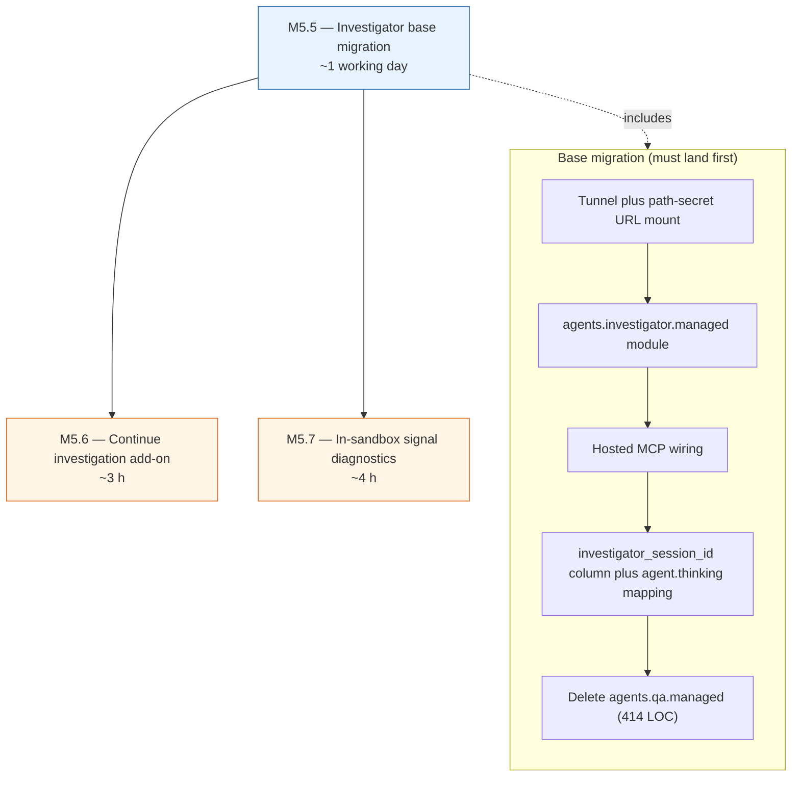
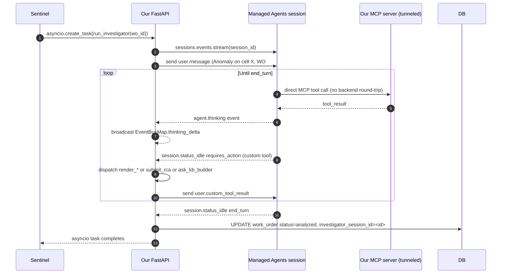
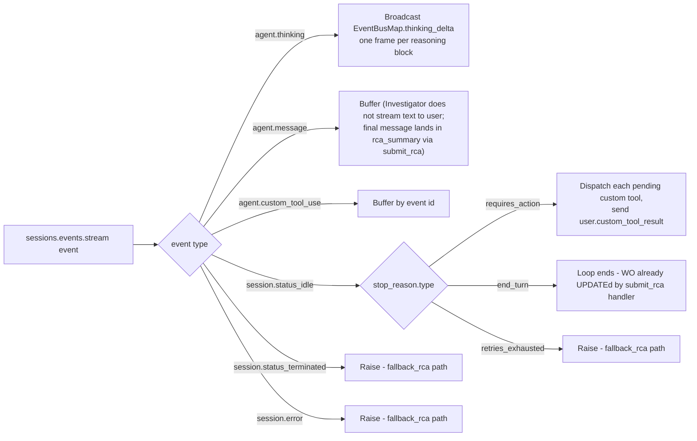
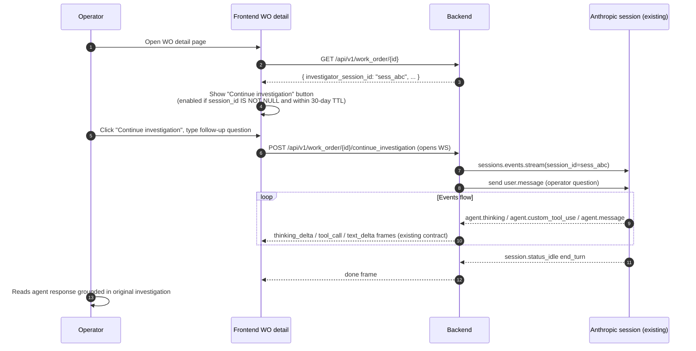
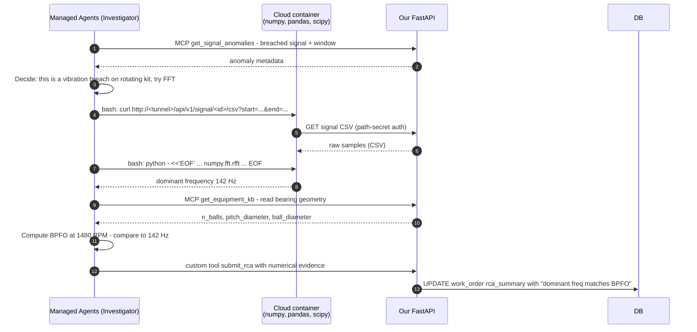
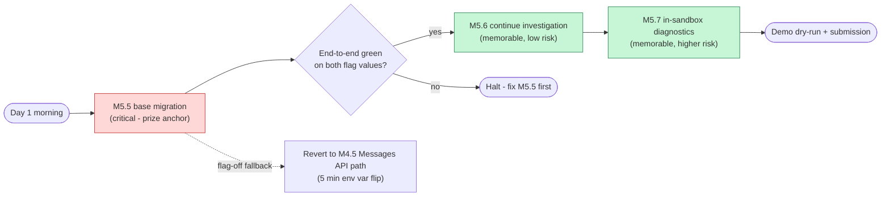

# M5 — Managed Agents refactor — issue slate

> **Source.** Derived from [docs/audits/M5-managed-agents-refactor-audit.md](../../audits/M5-managed-agents-refactor-audit.md). Each issue below is self-contained — the audit is background reading, not a prerequisite for implementation. All three issues can land inside the remaining hackathon window (deadline: Sunday 2026-04-26).

> [!IMPORTANT]
> **Why this refactor exists.** The current Managed Agents integration lives on the Q&A agent (`agents.qa.managed`), which is the wrong fit per the platform's own positioning (*"long-running tasks, asynchronous work, minutes or hours with multiple tool calls"*). The smoking gun is `_trickle_text` — 30-character server-side re-chunking at 15 ms intervals to fake a token stream that Managed Agents does not natively emit. We fight the platform's grain for zero architectural win. The migration pivots Managed Agents onto the Investigator (12 turns, 120 s wall clock, async background, tool-heavy) where the platform earns its keep, and reverts Q&A to the Messages API path that was designed for interactive sub-second turns.

---

## Dependency graph



---

## Issue M5.5 — Investigator migration to Managed Agents (base)

> [!IMPORTANT]
> **This is the load-bearing issue.** It delivers the prize narrative (*"Managed Agents runs the Investigator, our backend is a thin orchestrator, Anthropic calls our MCP server directly"*) and unblocks M5.6 and M5.7. Ship this before attempting either add-on. Gate the new path behind `INVESTIGATOR_USE_MANAGED=False` so M4.5 stays the default until end-to-end verified; flip the flag for the demo.

### Context

Investigator today runs a hand-rolled agent loop in our FastAPI process: `agents/investigator/service.py` pairs `_run_investigator_body` (74 LOC, for-loop over 12 turns) with `_dispatch_tool_uses` (64 LOC, manual tool routing) and `_llm_call` (streams `thinking_delta` + MessageStreamEvents from `anthropic.messages.stream`). Total ~140 LOC of agent-loop boilerplate plus a wall-clock timeout, signed-thinking-block reconstruction across turns, and ContextVar-based turn-id plumbing.

Managed Agents replaces that with a hosted agent loop (`client.beta.sessions.events.stream(session_id)`) where Anthropic runs the for-loop, holds the conversation history, and calls our MCP endpoint directly. Our process only dispatches the three custom tools that genuinely need our backend: `submit_rca` (DB write plus handoff to Work Order Generator), `ask_kb_builder` (handoff to KB Builder), and `render_*` (three generative-UI tools: `render_signal_chart`, `render_diagnostic_card`, `render_pattern_match`).

### Flow after refactor



### Scope (single issue, multiple workstreams)

**1. Hosted MCP exposure (`/mcp` is a public endpoint once tunneled).**

- Generate a 32-byte token, persist as `ARIA_MCP_PATH_SECRET` in `.env` and `.env.example`.
- In `backend/main.py`, mount the MCP app at `/mcp/{settings.aria_mcp_path_secret}` instead of `/mcp`. The URL itself is the secret — Anthropic's `mcp_servers` config does not support custom HTTP headers (documented: *"No auth tokens are provided at this stage."*), so a FastAPI bearer-auth middleware is not forwardable.
- Add `ARIA_MCP_PUBLIC_URL` to `.env.example` pointing at the tunneled URL (e.g. `https://<random>.trycloudflare.com/mcp/<secret>`).
- Document the tunnel setup in the backend README: `cloudflared tunnel --url http://localhost:8000`.
- Do NOT log the full public URL. The secret is in the path.

**2. `agents.investigator.managed` module.**

Create `backend/agents/investigator/managed.py` as a mirror of the existing `agents/qa/managed.py` structure:

- `run_investigator_managed(work_order_id: int) -> None` — same signature as `run_investigator`, so Sentinel's `asyncio.create_task` call is unchanged.
- `_ensure_agent_and_env()` + `_ensure_session()` — lazy creation with a process-wide asyncio lock. Reuse the pattern from `qa/managed.py:_bootstrap_lock`.
- Custom tools registered: `submit_rca`, `ask_kb_builder`, `render_signal_chart`, `render_diagnostic_card`, `render_pattern_match`. No MCP schemas wrapped as custom — MCP goes via hosted MCP.
- `mcp_servers=[{"type": "url", "name": "aria", "url": settings.aria_mcp_public_url}]` on `agents.create(...)`.
- Extended thinking enabled: `thinking={"type": "enabled", "budget_tokens": 10000}` passed to the agent definition (mirror the existing `_llm_call` config in `service.py:74`).
- Event loop: consume `sessions.events.stream`, branch on event type.

**3. Event mapping (see `sessions.events.stream` event catalogue in §1 of the audit).**



**Note on thinking granularity.** The Managed Agents events stream does NOT emit per-chunk thinking deltas. It emits whole `agent.thinking` events per reasoning block (one event per "thought"). We map each to one `EventBusMap.thinking_delta` WebSocket frame (`{agent, content, turn_id}`) — same contract as M4.5, zero frontend changes. The only user-visible difference is that the Agent Inspector updates once per block instead of once per token. The character-by-character fill animation is lost; the reasoning trace itself is preserved.

**4. Persist `session_id` on the work_order row.**

- New migration: `work_order.investigator_session_id TEXT NULL`. Additive, backwards-compatible.
- In the `submit_rca` custom-tool handler (migrated from `service.py:_handle_submit_rca`), add the session id to the UPDATE alongside `status='analyzed'` and `rca_summary`.
- The existing `WorkOrderRepository.update` already accepts arbitrary fields; just pass `investigator_session_id=session_id`.

**5. Custom tool handlers — reuse existing logic.**

The three `requires_action` branches wrap existing code:

- `submit_rca` -> call `service._handle_submit_rca` (rename to public `handle_submit_rca` when moving). Writes the RCA, creates the `failure_history` row, spawns Work Order Generator via `handoff.spawn_work_order_generator`. Zero behavioral change.
- `ask_kb_builder` -> call `handoff.handle_ask_kb_builder` (already public). Zero change.
- `render_*` -> call `service._handle_render` (rename to `handle_render`). Zero change in broadcast shape.

**6. Fallback path.**

- `run_investigator` becomes a thin dispatcher: branches on `settings.investigator_use_managed`. Default `False` during rollout, flipped `True` for demo.
- The existing `run_investigator` body stays intact as the `False` branch. Sentinel calls `run_investigator(work_order_id)` unchanged.
- Flip takes <5 min (env var), no data-shape impact. The `work_order` row is the only persisted artifact and its shape is unchanged apart from the additive column.

**7. Tests.**

Mirror `backend/tests/unit/agents/test_qa_agent_managed.py`:

- `_FakeEvents` harness for `sessions.events.stream` and `events.send`.
- Happy path: `agent.thinking` event broadcasts one `thinking_delta`; `submit_rca` custom tool call triggers `_handle_submit_rca`, writes WO update, spawns Work Order Generator.
- `ask_kb_builder` requires_action path mirrors the `ask_investigator` test in the Q&A managed file — asserts handoff frames.
- Error path: `session.error` event routes to the fallback (flip WO to analyzed with a reason, broadcast `rca_ready` with confidence 0.0).
- Session reuse: `investigator_session_id` is persisted on the WO row after `submit_rca`.

Full test suite (`make backend.test`) must stay green on both flag values.

**8. Cleanup — delete `agents.qa.managed`.**

Once M5.5 is green, remove the Q&A managed path entirely:

- `backend/agents/qa/managed.py` (414 LOC)
- `backend/agents/qa/schemas.py::build_custom_tools`
- `backend/tests/unit/agents/test_qa_agent_managed.py`
- `use_managed_agents` setting in `core/config.py`
- `run_qa_turn_managed` re-export in `agents/qa/__init__.py`
- The `use_managed_agents` branch in `modules/chat/router.py` — always calls `run_qa_turn`.
- `USE_MANAGED_AGENTS` env var in `.env.example`.

Keep `qa.schemas.ASK_INVESTIGATOR_TOOL` (still used by `messages_api.py`).

**9. Cold-start measurement.**

First Investigator run after process start pays environment plus agent plus session creation latency. Unknown today — measure on the dev stack. If >2 s, pre-warm in the FastAPI `lifespan` startup (create env and agent at app boot, not on first anomaly).

**10. Docs.**

- README architecture diagram — flip Investigator from Messages API to Managed Agents, note Q&A stays on Messages API.
- Demo script — new pitch in audit §6 is the reference.
- `.env.example` — add `ARIA_MCP_PUBLIC_URL`, `ARIA_MCP_PATH_SECRET`, `INVESTIGATOR_USE_MANAGED`; remove `USE_MANAGED_AGENTS`.

### Files touched

```
backend/
  main.py                                          # mount path change
  core/config.py                                   # add INVESTIGATOR_USE_MANAGED, ARIA_MCP_*; remove USE_MANAGED_AGENTS
  agents/
    investigator/
      __init__.py                                  # re-export run_investigator_managed
      managed.py                                   # NEW
      service.py                                   # _handle_submit_rca, _handle_render made public
      handoff.py                                   # already public, no change
    qa/
      __init__.py                                  # drop run_qa_turn_managed re-export
      managed.py                                   # DELETE (414 LOC)
      schemas.py                                   # drop build_custom_tools
  modules/chat/router.py                           # remove managed branch, always Messages API
  infrastructure/database/migrations/
    NNN_work_order_investigator_session_id.sql     # NEW, additive TEXT NULL
  tests/unit/agents/
    investigator/                                  # NEW folder
      test_managed.py                              # NEW
    test_qa_agent_managed.py                       # DELETE
.env.example                                       # add ARIA_MCP_*, INVESTIGATOR_USE_MANAGED; remove USE_MANAGED_AGENTS
README.md                                          # tunnel setup + architecture diagram
```

### Acceptance criteria

- [ ] `cloudflared tunnel --url http://localhost:8000` exposes `/mcp/<secret>` and a curl against it returns an MCP tool list.
- [ ] With `INVESTIGATOR_USE_MANAGED=False`, full test suite is green (regression baseline).
- [ ] With `INVESTIGATOR_USE_MANAGED=True`, Sentinel anomaly on P-02 produces the same `rca_ready` frame, `work_order.status='analyzed'`, `failure_history` row, and Work Order Generator spawn as the M4.5 path.
- [ ] With `INVESTIGATOR_USE_MANAGED=True`, `work_order.investigator_session_id` is populated on submit_rca.
- [ ] `agent.thinking` events surface as `thinking_delta` WebSocket frames in the Agent Inspector. At least one frame per reasoning block.
- [ ] Hosted MCP path is in use — confirm via `ws_manager` event trace that MCP tool calls do NOT pass through `_dispatch_custom_tool` on the managed path.
- [ ] `agents.qa.managed` deleted. `make backend.test` still green.
- [ ] `make backend.lint` and `make backend.typecheck` clean.
- [ ] Bootstrap latency measured and documented. If >2 s, `lifespan` prewarm added.
- [ ] Rollback drill: flip `INVESTIGATOR_USE_MANAGED=False`, restart, verify M4.5 path still works end-to-end in <5 min.

### Effort

Approximately 1 working day. Effort table:

| Workstream                                                  | Rough estimate |
|-------------------------------------------------------------|----------------|
| Tunnel + path-secret URL mount                              | 45 min         |
| `agents.investigator.managed` module                        | 3-4 h          |
| Hosted MCP wiring (`mcp_servers=[...]`)                     | 30 min         |
| Migration: `work_order.investigator_session_id` column      | 15 min         |
| Tests (mirror `test_qa_agent_managed.py`)                   | 2 h            |
| Cold-start measurement plus optional `lifespan` prewarm     | 30 min         |
| Delete `agents.qa.managed` (414 LOC) plus its tests         | 45 min         |
| Docs (README tunnel doc, architecture diagram, demo script) | 30 min         |

### Risks and mitigations

| Risk                                                                                 | Mitigation                                                                                                                                   |
|--------------------------------------------------------------------------------------|----------------------------------------------------------------------------------------------------------------------------------------------|
| Bootstrap cold start >2 s surprises the demo                                         | Measure empirically; if confirmed, `lifespan` prewarm the env and agent at app boot                                                          |
| Tunnel flakes mid-demo                                                               | Pre-open the tunnel the morning of, keep the path secret static, monitor with a health curl                                                  |
| Path secret leaks via logs                                                           | Audit uvicorn access logs; set `--log-level warning` on the mount; ensure `main.py` does not log `settings.aria_mcp_path_secret`             |
| Thinking block granularity feels sparse in the Inspector                             | Acceptable for a 3-min demo - blocks are more readable than 3-char fragments. Do not re-disable thinking                                     |
| `agent.thinking` event shape differs from expectation                                | Probe with a minimal script against the beta before wiring the broadcast. Fallback: log the raw event shape and tweak the content extractor  |
| Hosted MCP latency on our MCP endpoint (tunneled round-trip) > local FastAPI latency | Expected; measure. If blocking, fall back to `USE_MANAGED_AGENTS=False` for demo                                                             |
| Pricing unknown (§7 risk 5 of the audit)                                             | Not publicly documented. Measure `session.usage.*` during dry-run. Hackathon volume is low; budget-check post-hackathon if project continues |

### Bloque

- M5.6 (Continue investigation) — needs `investigator_session_id` populated.
- M5.7 (In-sandbox signal diagnostics) — needs the managed path as the execution environment.

### Bloqué par

- None. Stack reads of the Managed Agents docs done; implementation is self-contained.

---

## Issue M5.6 — "Continue investigation" add-on

> [!NOTE]
> **Differentiation goal.** The base migration in M5.5 is architecturally correct but not uniquely demoable — most submissions will look similar (long-running agent plus hosted MCP). This add-on delivers a capability that is **architecturally impossible on the Messages API path**: re-opening a finished investigation and continuing the same session days later, with the agent answering from its own memory of what it tried (not from a static `rca_summary` text field). Messages API would require replaying the full message history (including signed thinking blocks) on every reopen — hosted sessions make it free.

### Context

After M5.5 lands, every investigated work order has `investigator_session_id` set. The Managed Agents session on Anthropic's side holds the full reasoning trace, tool history, and mid-investigation context for 30 days after last activity (documented session checkpoint TTL). This add-on exposes a "Continue investigation" affordance in the UI that reconnects to that session and lets the operator ask follow-up questions against the live agent state.

### Flow



### Demo line (10 s clip)

> *"Day-shift operator triggers the investigation. We jump 8 hours — night-shift operator opens the same work order, asks 'why did you rule out the bearing?', and the agent answers from its own memory of what it tried earlier today. That is architecturally free on Managed Agents. On Messages API, we would have to replay every turn — including signed thinking blocks — and pay full token cost for context that already lived server-side."*

### Scope

**Backend.**

- New endpoint `POST /api/v1/work_order/{id}/continue_investigation` — opens a WebSocket, auth via the same cookie helper used by M5.2 (`core/security/ws_auth.py`).
- On first inbound user frame, resume the session: `anthropic.beta.sessions.events.stream(session_id)`. Reuse the event-consumer code from M5.5's `agents.investigator.managed` — same branch logic on `agent.thinking`, `agent.message`, `agent.custom_tool_use`, `session.status_idle`.
- Stream out the same frames as the primary investigation: `thinking_delta`, `tool_call`, `tool_result`, `ui_render`, `text_delta`, `done`. Zero new frame types.
- Validate the session is still within the 30-day TTL before opening the stream. If expired, return HTTP 410 Gone with `{"error": "session expired", "rca_summary": <row.rca_summary>}` and let the frontend fall back to a read-only view.
- The session remains live across reopens — no `sessions.delete` call. Checkpoint TTL extends on each activity.

**Frontend.**

- On the WO detail page, show a "Continue investigation" button when:
  - `investigator_session_id IS NOT NULL`
  - Checkpoint is within 30-day TTL (compute on the frontend from `work_order.updated_at` or similar; server also enforces on connect).
- On click, open the Agent Inspector view seeded with the resumed session. Reuse the existing chat component from Q&A (`ChatPanel` in M6.5).
- Display a banner noting this is a resumed investigation: *"Continuing from day-shift investigation, 8 hours ago"*.

**Tests.**

- Backend: mirror `test_second_turn_reuses_cached_session` from the existing Q&A managed test file — second WebSocket call to a known `session_id` hits `sessions.events.stream(<existing_id>)` instead of creating a new session. Assert no `agents.create` or `environments.create` calls on the resume path.
- Backend: `410 Gone` path when the session is flagged expired. Mock the TTL check.
- Frontend: unit test for the button gating logic.

### Files touched

```
backend/
  modules/work_order/router.py                     # new POST /continue_investigation endpoint
  agents/investigator/managed.py                   # extract the event-consumer into a reusable helper
  tests/unit/modules/work_order/
    test_continue_investigation_router.py          # NEW
frontend/
  src/pages/WorkOrderDetail.tsx                    # "Continue investigation" button gating
  src/components/ContinueInvestigationChat.tsx     # NEW, reuses ChatPanel internals
```

### Acceptance criteria

- [ ] New endpoint `POST /api/v1/work_order/{id}/continue_investigation` accepts a WebSocket upgrade, resumes an existing session, streams the EventBusMap frame contract.
- [ ] Calling the endpoint twice on the same WO resumes the same session both times — only one session id ever exists for a given WO.
- [ ] `investigator_session_id IS NULL` → button disabled (or endpoint returns 404).
- [ ] Expired session → endpoint returns 410 Gone with the static `rca_summary` payload.
- [ ] E2E: trigger an anomaly on P-02, wait for submit_rca, click "Continue investigation" in the UI, ask a question, receive a grounded answer.
- [ ] Demo script updated with the pitch line above. Pitch wording explicitly acknowledges the 30-day TTL — *"reopen until checkpoint expires"* — not *"reopen indefinitely"*.

### Effort

Approximately 3 hours. Most of the complexity is in M5.5 — this add-on reuses the event consumer and frame contract verbatim.

### Risks

| Risk                                                                                                   | Mitigation                                                                                                                                   |
|--------------------------------------------------------------------------------------------------------|----------------------------------------------------------------------------------------------------------------------------------------------|
| 30-day TTL expires between demo dry-run and demo day                                                   | Trigger a fresh investigation the morning of — gap is minutes, not days                                                                      |
| Frontend has no WO detail page yet, or the existing chat component is tightly coupled to the Q&A route | Check the state of M6/M7 before scheduling. If the page is missing, scope-limit M5.6 to the backend endpoint and a `curl` demo for the pitch |
| Session stays "running" if our backend crashes mid-stream                                              | Per docs, running sessions cannot be deleted without an interrupt event. Acceptable for a hackathon — document as post-hackathon hardening   |

### Bloque

- None (this is a prize-differentiation feature, not on the critical path).

### Bloqué par

- M5.5 (needs `investigator_session_id` populated and the managed path as the primary Investigator implementation).

---

## Issue M5.7 — In-sandbox signal diagnostics (Add-on B)

> [!NOTE]
> **Framing.** The capability is **Python signal diagnostics inside Anthropic's cloud container**, not "FFT on pump bearings." ARIA's schema is equipment-agnostic: `equipment.equipment_type` is a free string, thresholds are keyed by signal name (not equipment class), and the signal catalogue covers 13 types (vibration, temperature, pressure, flow, voltage, current, power, torque, speed, force, cycle_time, score, level) — any rotating, fluid, thermal, or electrical asset. The agent picks the diagnostic technique based on which signal breached and what reference values the KB carries. The P-02 seed happens to be a Grundfos centrifugal pump with vibration breaches — so the dry-run demo uses an FFT — but swap the demo cell and the script changes, not the capability.

### Context

Messages API cannot offer numerical diagnostics that exceed what the model computes in tokens (trend fits over thousands of samples, frequency content, cross-signal correlation, statistical process control). Managed Agents ships a cloud container with `bash` plus `read` / `write` / `edit` / `glob` / `grep` plus `web_fetch` / `web_search` — Python runs inside that container via `bash`, with arbitrary pre-installed pip packages. This add-on teaches Investigator to lean on that container for math it cannot do in tokens, and to cite the numerical evidence in the RCA.

### What the agent can actually compute

Menu, not mandate — the agent picks based on the breached signal and the KB's `failure_patterns.signal_signature`:

| Signal type              | Diagnostic technique                                                    | Asset examples                                  |
|--------------------------|-------------------------------------------------------------------------|-------------------------------------------------|
| Any time-series          | Rolling mean or median, linear or exponential trend fit, rate-of-change | All equipment                                   |
| Any time-series          | SPC control limits (+-3 sigma), CUSUM drift detection                   | All equipment                                   |
| Multi-signal             | Cross-correlation (current vs temperature rise, pressure vs flow, etc.) | Motors, compressors, HVAC                       |
| Vibration, current       | FFT plus spectral peak detection                                        | Rotating equipment, VFD-driven motors           |
| Vibration on rolling kit | Bearing fault frequencies (BPFO/BPFI/BSF/FTF) if KB has geometry        | Pumps, fans, gearboxes with known bearing specs |
| Temperature, pressure    | Degradation fit - projected time-to-threshold                           | Heat exchangers, seals, filters                 |

### Flow



### Demo scenario

The current seed is a centrifugal pump with vibration breaches. The demo clip reads:

> *"The agent suspects bearing wear. It writes a Python script in its sandbox, runs an FFT on the raw vibration signal, compares the dominant frequency against the bearing's outer-race fault frequency, and concludes outer-race spalling with 0.87 confidence. None of that math happens in tokens — it runs as actual Python in Anthropic's container."*

If the demo cell changes (e.g. a motor or heat exchanger is added before submission), the script the agent writes changes — rolling-mean trend on temperature, FFT on motor current signature analysis, SPC on pressure — but the capability line does not. That is the point.

### Scope

**1. Environment dependencies.**

When `agents.investigator.managed._ensure_agent_and_env` creates the environment, declare Python pip dependencies in the environment config: `numpy`, `pandas`, `scipy`. Per docs, environments allow pre-installed packages. This is a one-time bootstrap; subsequent sessions reuse the same environment.

**2. Prompt update.**

Extend `agents/investigator/prompts.py::INVESTIGATOR_SYSTEM` with a new guidance section:

> *"For numerical anomalies, you may write Python inside the sandbox container via the bash tool to compute trends, statistics, frequency content, or cross-correlations on raw signals. Numpy, pandas, and scipy are pre-installed. Cite the numerical results (dominant frequency, trend slope, correlation coefficient, whatever is relevant) in your submit_rca call."*

Include **at least two worked examples** mapped to the demo cell's signature signals — one time-series example (e.g. rolling-mean trend on temperature or pressure) plus one frequency or cross-signal example (e.g. FFT on vibration, current-temperature correlation). The examples anchor the behavior; without them the model tends to describe the analysis instead of running it.

**3. Signal CSV endpoint.**

- `GET /api/v1/signal/{signal_id}/csv?start=<iso>&end=<iso>` returns the raw signal window as CSV: `timestamp,value` per line.
- Mount behind the same path-secret prefix as `/mcp` — i.e. `/api/<secret>/signal/...` or a separate `ARIA_SIGNAL_CSV_SECRET`. Reuse the secret from M5.5 for simplicity unless the threat model separates them.
- Stream the response — do not materialize the full window in memory.
- Error model: 404 if signal id unknown, 400 if window is malformed, 413 if the window exceeds a sane cap (e.g. 1 million rows).

**4. KB reference values.**

Ensure the demo cell's `equipment_kb.failure_patterns[*].signal_signature` dict carries whatever reference values the chosen diagnostic technique needs. The schema is already flexible (free-form dict); no migration needed. Examples:

- Rotating kit with FFT-to-BPFO: `n_balls`, `pitch_diameter_mm`, `ball_diameter_mm`, nominal `shaft_rpm`.
- Thermal kit with degradation fit: `design_temperature_c`, `alert_threshold_c`, `trip_threshold_c`.
- Any SPC-amenable signal: recent `mean`, `stddev`, and `sample_count` of a reference window.

These go in via the KB Builder onboarding flow, not via this issue. If the demo cell's KB is missing values, add them as a one-line SQL fixture in the seed.

**5. Tests.**

- Unit: assert `INVESTIGATOR_SYSTEM` contains the signal-diagnostics guidance and at least two worked examples.
- Unit: signal CSV endpoint — happy path, path-secret rejection, 404 for unknown signal id, 400 for malformed window.
- Integration skipped if the `bash` tool is not available in the test fake — the real validation is the dry-run trace.

**6. Dry-run validation.**

Before the demo, run the scenario end-to-end once on the dev stack and confirm:

- The agent actually invokes `bash` with a Python heredoc — not just describes the analysis in prose.
- The script pulls the CSV via `bash curl`, runs the math, prints numerical output that lands in the RCA summary.
- Container cold-start on first run is within the 2 s budget (coordinate with M5.5's `lifespan` prewarm).

### Files touched

```
backend/
  agents/investigator/
    prompts.py                                     # extend INVESTIGATOR_SYSTEM with diagnostics guidance
    managed.py                                     # declare numpy/pandas/scipy in env config (depends on M5.5)
  modules/signal/router.py                         # new GET /signal/{id}/csv endpoint
  tests/unit/agents/investigator/
    test_prompts.py                                # NEW (or extended) - assert guidance present
  tests/unit/modules/signal/
    test_csv_router.py                             # NEW
.env.example                                       # reuse ARIA_MCP_PATH_SECRET or add ARIA_SIGNAL_CSV_SECRET
```

### Acceptance criteria

- [ ] Investigator environment created with `numpy`, `pandas`, `scipy` pre-installed. Container boot completes within cold-start budget.
- [ ] `INVESTIGATOR_SYSTEM` contains signal-diagnostics guidance plus at least two worked examples matching the demo cell's signature signals.
- [ ] `GET /api/v1/signal/{id}/csv?start=&end=` returns the window as CSV behind path-secret auth. Rejects unknown signal id (404) and malformed windows (400, 413).
- [ ] Demo cell's `equipment_kb` carries the reference values the demo technique needs (bearing geometry for rotating kit, temperature band for thermal kit, etc.).
- [ ] Dry-run: the agent writes a Python script in `bash` and prints numerical output that lands in the `submit_rca` payload. Verified by tracing the stream events for a manual trigger.
- [ ] `make backend.test` green. `make backend.lint` and `make backend.typecheck` clean.

### Effort

Approximately 4 hours. The agent writes the diagnostic code — we do not. Our work is plumbing: deps declaration, prompt examples, CSV endpoint, KB fixture, dry-run trace.

### Risks

| Risk                                                            | Mitigation                                                                                                                                                                                      |
|-----------------------------------------------------------------|-------------------------------------------------------------------------------------------------------------------------------------------------------------------------------------------------|
| Agent describes the analysis in prose instead of running `bash` | Two concrete worked examples in the system prompt. Dry-run before the demo. If still flaky, add an `ask_sandbox` custom tool that explicitly wraps `bash python -c "..."` to nudge the behavior |
| numpy / scipy install latency on first container boot           | Declare deps in the environment config so they are pre-installed (per docs). Measure during M5.5 cold-start work; if still slow, `lifespan` prewarm includes one dummy session                  |
| Signal CSV endpoint leaks data if path secret leaks             | Same threat model as `/mcp` in M5.5 — rotate the secret by remounting. Do not expose any signal the operator is not already authorized to see                                                   |
| Window size blows up container memory                           | Enforce a row cap (e.g. 1M rows, 413 Payload Too Large). Most diagnostic techniques care about a targeted window (breach window plus context), not the full history                             |
| Demo cell KB missing reference values                           | Add a one-line SQL fixture in the seed before demo day. Budget 15 min for this                                                                                                                  |

### Bloque

- None (differentiation feature).

### Bloqué par

- M5.5 (needs `agents.investigator.managed._ensure_agent_and_env` as the place to declare environment deps).

---

## Rollout order and fallback



> [!CAUTION]
> **If under time pressure, ship M5.5 and M5.7 — skip M5.6.** The audit's judgment (§6.5 "If only one ships, ship B") is that the Python-in-container clip is the more memorable 30-second demo moment. M5.6 is useful and clean but less visually striking on stage.

---

## Cross-cutting acceptance

Across all three issues, before submission:

- [ ] Demo script (`docs/demo/demo-script.md` or equivalent) updated with the three pitch lines from audit §6 and §6.5.
- [ ] README architecture diagram shows Investigator on Managed Agents, Q&A on Messages API, hosted MCP as the tool-execution path.
- [ ] `make backend.test && make backend.lint && make backend.typecheck` green.
- [ ] Rollback drill executed at least once — `INVESTIGATOR_USE_MANAGED=False`, restart, M4.5 still works. Document the drill outcome in the demo script so the on-stage operator knows the exact commands.
- [ ] `session.usage.*` measured during a full dry-run. Numbers logged in the planning folder alongside the cold-start latency figures.

---

## References

- Source audit: [docs/audits/M5-managed-agents-refactor-audit.md](../../audits/M5-managed-agents-refactor-audit.md)
- Prior M5 issues (M5.1-M5.4, for context — this slate supersedes M5.4): [docs/planning/M5-workorder-qa/issues.md](issues.md)
- Managed Agents docs: [platform.claude.com/docs/en/managed-agents/overview](https://platform.claude.com/docs/en/managed-agents/overview)
- Prior MCP security audit (path-secret rationale): [docs/audits/M2-mcp-server-audit.md](../../audits/M2-mcp-server-audit.md)
- Prior agent-chain audit (Investigator profile): [docs/audits/M4-M5-sentinel-investigator-workorder-qa-audit.md](../../audits/M4-M5-sentinel-investigator-workorder-qa-audit.md)
