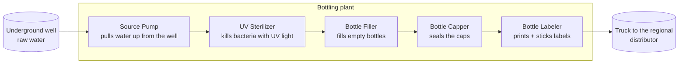
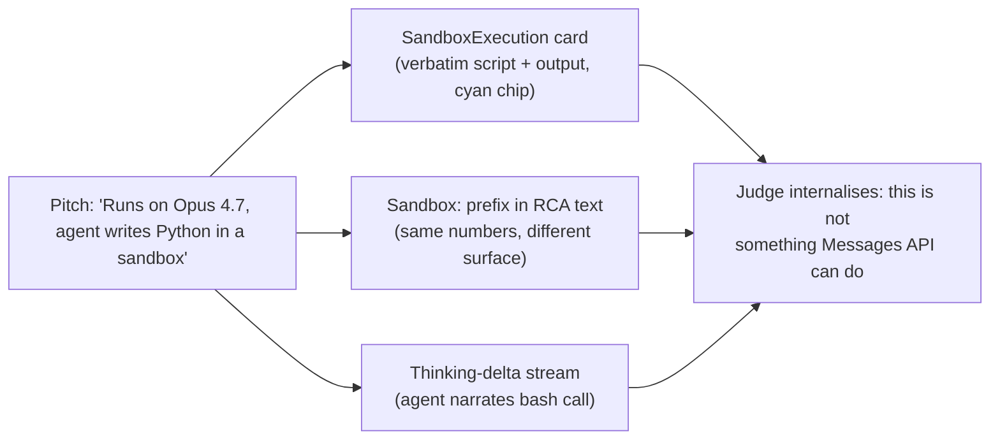
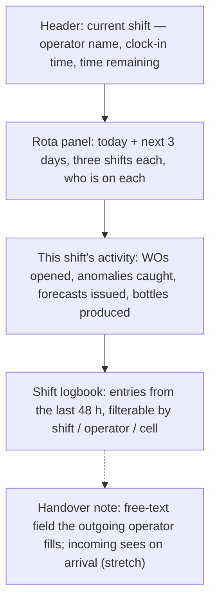

# Demo Plant Design — A Scene for Anyone

> [!NOTE]
> Companion to [demo-playbook.md](./demo-playbook.md) and [win-plan-48h.md](./win-plan-48h.md). This document locks the **business layer** of the demo: what plant the judges are looking at, what its machines do, what happens in the 10-minute story. It is deliberately written before any seed / endpoint code so the shape of the demo is reviewable and arguable on paper first. Written 2026-04-24 (J-2).

---

## Table of contents

0. [The one test everything obeys](#0-the-one-test-everything-obeys)
1. [What ARIA is proving, in one paragraph](#1-what-aria-is-proving-in-one-paragraph)
2. [Answers to the three open questions](#2-answers-to-the-three-open-questions)
3. [The plant — five machines, one bottle](#3-the-plant--five-machines-one-bottle)
4. [The story a judge sees, in plain English](#4-the-story-a-judge-sees-in-plain-english)
5. [Scene-by-scene narration script](#5-scene-by-scene-narration-script)
5bis. [The Opus 4.7 visibility layer — the video-critical beat](#5bis-the-opus-47-visibility-layer--the-video-critical-beat)
6. [Seed data plan](#6-seed-data-plan)
7. [Demo endpoint plan](#7-demo-endpoint-plan)
8. [Onboarding PDF choice](#8-onboarding-pdf-choice)
9. [Shift page — the lived-in system](#9-shift-page--the-lived-in-system)
10. [Naming migration from P-02](#10-naming-migration-from-p-02)
11. [Rollout order](#11-rollout-order)
12. [Risks and mitigations](#12-risks-and-mitigations)
13. [Open points before I start coding](#13-open-points-before-i-start-coding)
14. [Reference map](#14-reference-map)

---

## 0. The one test everything obeys

Every naming, label, caption, and spoken line must pass this test:

> **The Grandparent Test.** Read the tile name, the banner copy, and the machine label aloud to a grandparent who has never been in a factory. If they cannot tell you *what that machine does* in one sentence, rename it.

If a label fails the grandparent test, it is wrong — no matter how industrially accurate it is. `P-02` fails. `DST-01` fails. `Vibration RMS at discharge flange` fails. `The Filler` passes. `How shaky the motor is` passes. `Bottles per minute` passes.

This test is the single most important constraint for the demo narrative. Everything below derives from it.

---

## 1. What ARIA is proving, in one paragraph

A hackathon judge who spends ten minutes with ARIA should leave able to repeat this to a friend in the hallway without ever using an industrial word:

> *"It's a system that watches the machines in a factory, predicts which one is about to break before it breaks, explains why in plain English, remembers what went wrong last time a similar pattern showed up, and prints the repair order for the technician. It runs on Claude Opus 4.7 — you can literally watch the AI think on screen while it works out the cause."*

Every demo decision below is judged against whether it helps the judge reach that sentence.

---

## 2. Answers to the three open questions

### 2.1 What process?

**A small bottled-water plant.** Five machines, one product — sealed bottles of clean drinking water shipped to a regional distributor. Geographically unspecified: the demo narrates the plant, not the country.

Reasons, ranked:

1. **Universal product.** Everyone on the planet understands "bottled water". There is no prerequisite knowledge.
2. **Clean failure narrative.** "The filler broke and we could not ship water for four hours" is instantly sympathetic. Contrast: "the centrifugal stage-3 discharge bearing was exhibiting pre-failure harmonics" is not.
3. **Keeps the water-vertical story.** ARIA's existing product framing already assumes water; a bottled-water plant keeps the narrative continuity without asking judges to follow a treatment-plant process diagram.
4. **Real stakes without drama.** Drinking water for 50 000 people is a real responsibility; a sympathetic judge will internalise that the software is *not* a toy without any explicit pitch about it.
5. **Visible equipment diversity.** A bottling line naturally has different machines doing different jobs — so the grid is not five identical pump tiles.

Alternatives considered and rejected: water-treatment plant (process too complex to explain), HVAC chiller (audience does not emotionally care), bakery (breaks the existing water storyline), frozen-pizza factory (tone-wrong for a serious pitch).

> [!NOTE]
> **No country, no city, no specific plant-name.** Earlier drafts anchored the demo in southern Algeria. That added no judge-visible value and carried a cost — a specific locale is an extra cognitive load for a judge who is not from there, and it risks reading as a personal pitch rather than a product pitch. The plant is *a* plant, the operators are *operators*, the stakes are numeric (50 000 people). Everything else is redacted.

### 2.2 Cell naming

**Rename everything. Keep no legacy `P-02` references in production paths.** The old codenames are left as optional aliases only in one place — the migration file that creates the new cells — so existing backend tests can be kept readable during the transition. All user-facing strings in frontend, docs, demos, and seeds use plain English.

See [§9 Naming migration](#9-naming-migration-from-p-02) for the explicit map.

### 2.3 Number of cells

**Five.** One per live-action scene beat plus two for "the plant is clearly real, not a toy". Any fewer reads as a sandbox. More dilutes attention.

| # | Machine name   | Role in the demo                       |
|---|----------------|----------------------------------------|
| 1 | Source Pump    | Plant context                          |
| 2 | UV Sterilizer  | Plant context                          |
| 3 | Bottle Filler  | Forecast + anomaly + RCA (the star)    |
| 4 | Bottle Capper  | Memory recall (recognised pattern)     |
| 5 | Bottle Labeler | Onboarding wizard target (new machine) |

One-row grid, five tiles. Readable in a half-second glance.

---

## 3. The plant — five machines, one bottle

### 3.1 Process flow



### 3.2 One-line purpose for each machine

| Machine        | Plain-English purpose                          | What ARIA measures on it                                    |
|----------------|------------------------------------------------|-------------------------------------------------------------|
| Source Pump    | Pulls water up from the underground well.      | How hard the motor is working, water flow out.              |
| UV Sterilizer  | Kills bacteria in the water with UV lamps.     | How bright the lamps are, how many hours they've run.       |
| Bottle Filler  | Fills empty bottles with clean water.          | How shaky the motor is, water pressure, bottles per minute. |
| Bottle Capper  | Screws the cap onto every filled bottle.       | How shaky the drive motor is, how often it jams.            |
| Bottle Labeler | Prints the label and sticks it on each bottle. | (Not monitored yet — onboarding target.)                    |

### 3.3 Signals in the plant

All signals have human-readable names. The underlying `signal_type` and `unit` rows stay technical; only `process_signal_definition.display_name` is judge-visible. Examples:

| Backend signal key       | Display name (what the judge sees) | Unit   |
|--------------------------|------------------------------------|--------|
| `vibration_mm_s`         | Motor shake                        | mm/s   |
| `discharge_pressure_bar` | Water pressure                     | bar    |
| `flow_l_min`             | Water flow                         | L/min  |
| `motor_current_a`        | Motor current                      | A      |
| `uv_intensity_mw_cm2`    | UV lamp brightness                 | mW/cm² |
| `uv_runtime_h`           | UV lamp hours                      | h      |
| `bottles_per_minute`     | Bottles per minute                 | /min   |
| `cap_torque_nm`          | Cap tightness                      | N·m    |

Judges see "Motor shake is rising" instead of "RMS vibration on the discharge flange is trending toward the ISO 10816 class II alert threshold". The second sentence is *true*; the first one is *understood*.

---

## 4. The story a judge sees, in plain English

Uncut version, one paragraph. This is the script the voice-over memorises; every screen the demo produces must stay consistent with it.

> *This is a small plant that bottles drinking water for about fifty thousand people. Five machines, one after the other: a pump brings water up from the well, UV light sterilises it, a filler fills the bottles, a capper seals them, a labeler puts the labels on. ARIA watches all five. Right now, ARIA is telling us the Bottle Filler is going to fail in about two hours — not because anything is broken yet, but because the motor is shaking more every hour. That's a prediction, not an alarm. In a few minutes the motor will actually cross its safe limit, and ARIA is going to catch the real failure live. Watch the right-hand side of the screen — that's five AI agents, built on Claude Opus 4.7, passing the problem between themselves. One detects the breach, one investigates the cause — you can literally see it write Python, run it inside Anthropic's cloud sandbox, and cite the numbers it got back — one remembers we saw this exact pattern last January on the Bottle Capper, one writes the work order, one prints it. Two minutes ago the Filler looked fine. Eight minutes from now the technician has a printable repair order with the recommended action, the estimated time to failure, and a reference to the previous incident. That is what ARIA does. Now let me show you the new machine coming online — the Bottle Labeler — you upload its manual and ARIA reads it cover to cover and starts monitoring it in two minutes."*

That paragraph is the demo. Everything below is how to make it happen.

---

## 5. Scene-by-scene narration script

Seven beats, ten minutes. The left column is what the judge's eyes are on; the right column is the sentence the presenter says.

| Beat | On screen                                          | Spoken line (memorise; paraphrase freely)                                                                                                                            |
|------|----------------------------------------------------|----------------------------------------------------------------------------------------------------------------------------------------------------------------------|
| 0    | Landing on the Control Room                        | "This is a small water-bottling plant, five machines, serving fifty thousand people."                                                                                |
| 0    | Hit `A` → Agent Constellation opens                | "Five AI agents, Claude Opus 4.7, MCP server. You will see them pass problems to each other."                                                                        |
| 1    | Close Constellation; click the Bottle Labeler tile | "New machine coming online — the Labeler. Let me upload its manual."                                                                                                 |
| 1    | Upload PDF → wizard shows Progress → Q&A → KB Card | "ARIA reads the manual, asks me three questions, and calibrates the alerts. Under two minutes."                                                                      |
| 2    | Back to Control Room, forecast banner appears      | "ARIA is telling us the Filler will breach its safe limit in ~2 hours. Nothing is broken yet. This is a *forecast*."                                                 |
| 3    | Forecast banner turns into an anomaly banner       | "There's the real breach. Sentinel caught it."                                                                                                                       |
| 3    | Chat drawer opens; Investigator thinking streams   | "The Investigator is thinking. That's extended thinking on Opus 4.7 — you are watching the reasoning live."                                                          |
| 3    | **Sandbox execution card** renders inline (Python script + numerical output + "ran in Anthropic sandbox" chip) | "This is the part that cannot happen without Managed Agents — the agent just wrote Python, ran it in Anthropic's cloud sandbox, and pulled back `slope_per_hour=0.024, r²=0.91, eta_to_trip_hours=4.2`. Not token math. Real Python." |
| 3    | Diagnostic card renders inline                     | "Bearing wear on the Filler drive motor. Confidence 87 percent. And the RCA text starts with the exact numbers — `Sandbox: ...` — first-class numerical evidence."                                    |
| 4    | Work Order card renders; navigate to detail; print | "The repair order is already written. Technician gets this on paper."                                                                                                |
| 5    | Fire the memory scene on the Capper                | "Now watch — another anomaly, on the Capper this time."                                                                                                              |
| 5    | Pattern Match card renders with MTTF + action      | "ARIA remembers it saw this same pattern on the Capper in January. It is predicting four hours to failure and telling the operator exactly what fixed it last time." |
| 6    | Click **Shifts** in the TopBar → Shift page        | "This is the shift log. Priya was on the night shift — you can see the notes she left and the two alerts ARIA caught while she was on duty. Human context stays in the loop." |
| 6    | Chat: "show me the KB for the Bottle Filler"       | "This is how an operator talks to ARIA day to day. Grounded in the real data — the agent fetches the knowledge base inline."                                         |
| 6    | Chat: "bottles per minute last week by shift"      | "And any question about the plant's performance is one sentence away."                                                                                               |
| 7    | Hit `A` → Constellation                            | "Five agents, one MCP server, predictive plus diagnostic plus prescriptive. Built in a week on Opus 4.7."                                                            |

Every spoken line passes the Grandparent Test. Every screen-labelled word ("Filler", "Capper", "Motor shake", "Water pressure") passes the Grandparent Test.

---

## 5bis. The Opus 4.7 visibility layer — the video-critical beat

> [!IMPORTANT]
> This subsection exists because the first end-to-end dry-run of #105 produced a correct-but-invisible outcome: the agent pulled data, computed numerical ratios, and cited them in the RCA — but the prose-level RCA was indistinguishable from a Messages API token-math RCA. The visibility layer below is what makes the Managed-Agents-only capability **legible** to a judge watching a 3-minute video.

### What ships in the visibility layer

Three concrete pieces land on top of the raw capability (see [docs/architecture/](../../architecture/) for the underlying architecture):

1. **`render_sandbox_execution` artifact.** After the agent runs bash/Python in the cloud container and before it calls `submit_rca`, it emits this render tool. The frontend renders an inline card in chat with:
   - the verbatim Python script in a monospaced block
   - the verbatim `key=value` output the script printed
   - a small chip reading **"Ran in Anthropic sandbox"**
   - metadata footer: cell, window, signal IDs pulled
   Source: [backend/agents/ui_tools.py::RENDER_SANDBOX_EXECUTION](../../../backend/agents/ui_tools.py), [frontend SandboxExecution.tsx](../../../frontend/src/components/artifacts/SandboxExecution.tsx).

2. **`Sandbox:` RCA prefix — mandatory.** Every bash-driven RCA must begin with a single `Sandbox: k1=v1, k2=v2, ...` line in `submit_rca.root_cause`, followed by ` Root cause: ...`. The numerical evidence then lives in the work-order text itself, not only on the card. See [backend/agents/investigator/prompts.py::SANDBOX_DIAGNOSTICS_SECTION](../../../backend/agents/investigator/prompts.py).

3. **Failure-mode-keyed rules.** The prompt no longer says "you may use bash"; it mandates:
   - **Drift-class** (`bearing_wear`, `thermal_degradation`, `fouling`): **must** fit `np.polyfit` on a 6 h window and cite `slope_per_hour`, `r_squared`, `eta_hours_to_trip`.
   - **Coupling-class** (`seal_leak`, `cavitation`, multi-signal modes): **must** compute Pearson correlation between the breached signal and a related one; cite `rho`, `n_samples`.
   - **Spike-class** (`impeller_imbalance`, `instrumentation_fault`): bash optional.

### Why this matters in the 3-min video



The three surfaces corroborate the same evidence at three different parts of the screen — the card, the RCA prose, and the thinking stream. A judge watching the video for 15 seconds sees at least two of them. That is the "jaw-drop moment" the issue #105 spec promised.

### What the video *must* frame

At ~0:45 of the 3-minute cut, during scene 3, the presenter must:

1. Be close-up on the chat stream.
2. Wait until the `SandboxExecution` card renders (the cyan "Ran in Anthropic sandbox" chip is the visual anchor).
3. Narrate verbatim a variant of: *"That script just ran as real Python inside Anthropic's cloud container — not inside the model. Look at the output."*
4. Hold the frame for two beats so the code block is readable, then pan down to the `DiagnosticCard` with the `Sandbox:` prefix visible in the RCA text.

### Reliability — what happens if bash doesn't fire

The agent has discretion. If the anomaly is trivially diagnosable from prose (e.g. pressure 111 % above nominal — ratio arithmetic is sufficient), the agent may skip bash. Mitigations, in order of effectiveness:

1. **Pre-seed a drift scenario** that forces the drift-class rule to fire. The simulator's default `p02_bearing_failure` demo mode produces vibration drift over 4 min — ideal. Rehearse by triggering one drift breach via `/api/v1/demo/scene/seed-forecast` + `trigger-breach` (see §7) before recording.
2. **If the first take produces a prose-only RCA**, reset the light state and retry. The prompt now forces bash on drift-class failures; the agent complying is a near-certainty once failure_mode is drift-like.
3. **If all else fails**, the recorded video can use the take where bash fired. The capability is real; the visibility is capture-able.

### Verification before recording

> [!TIP]
> Before hitting record on the 3-minute video, run one dry-run of the full demo and confirm **all three** surfaces fire: the cyan sandbox card in chat, the `Sandbox:` prefix in the RCA text on `/work-orders/{id}`, and the agent-thinking references to the bash call in the chat stream. If any one is missing, reset and retry — the three corroborate each other and the story lands hollow with only one.

---

## 6. Seed data plan

### 6.1 Philosophy

The goal of the seed is to make the first ten seconds on `/control-room` read as *"this is a live industrial console, not an empty demo"*. Every aggregate the UI reads — KPIs, the work-order list, the logbook, MTBF / MTTR — needs history to render as a realistic number.

**Seeded data stops at the present moment.** Nothing in the seed is currently above a threshold. The present-tense anomalies are injected by `seed-forecast`, `trigger-breach`, `trigger-memory-scene` — not by the seed script.

### 6.2 Volume targets

| Table                       | Volume                                       | Notes                                                                                                                                               |
|-----------------------------|----------------------------------------------|-----------------------------------------------------------------------------------------------------------------------------------------------------|
| `cell`                      | 5 rows (one per machine)                     | See §3.                                                                                                                                             |
| `equipment_kb`              | 4 onboarded + 1 not-onboarded                | Labeler has `onboarding_complete=FALSE` for the wizard scene.                                                                                       |
| `process_signal_definition` | 14–18 rows across 5 cells                    | Each monitored machine has 3–5 signals with display names per §3.3.                                                                                 |
| `process_signal_data`       | ~350 000 rows (7 d × 30 s × 5 sig × 4 cells) | Mean-reverting around nominal with realistic day/night and shift variation. No net drift in the last 6 h — the live simulator owns that window.     |
| `machine_status`            | ~40 transitions                              | Mostly "running"; one maintenance window per machine in the last 7 d.                                                                               |
| `production_event`          | ~2 000 rows                                  | Quality + yield counts so OEE computation is meaningful.                                                                                            |
| `work_order`                | 10–12 rows                                   | Mix of agent-generated + manual, closed + cancelled, across the 5 cells and last 7 d.                                                               |
| `failure_history`           | 5 rows                                       | Two on the Filler, one on the Capper (the memory-recall target), one on the Source Pump, one on the UV Sterilizer. Spread across the last 6 months. |
| `logbook_entry`             | 20 rows                                      | Realistic shift-note language. Authored by 3 rotating operator names (see §6.3).                                                                    |
| `shift_assignment`          | Last 7 d + current                           | Real operator names, three shifts per day.                                                                                                          |

### 6.3 Operator names for logbook and shifts

Three named operators on rotation, plus one shift supervisor. Names deliberately read as a mixed team without a specific regional signal, so the demo stays geographically generic:

- **Sarah Miller** — Day shift (06:00–14:00)
- **Marco Ferrari** — Evening shift (14:00–22:00)
- **Priya Patel** — Night shift (22:00–06:00)
- **Tom Anderson** — Shift supervisor (on-call across all shifts)

The names appear on the Shift page (see §9), in TopBar's "current shift" pill, in logbook entries, and in work-order `created_by` fields. They make the system feel lived-in without adding a geographic layer the judge has to decode.

### 6.4 One representative logbook entry per week

Realistic shift-note style, so the Investigator can cite them:

> *"Filler ran rough for about ten minutes after shift change. Sounded like a pulley. Settled on its own. Will watch next shift." — Priya Patel, Tuesday 02:15*

Three to five of these per day, different topics, different operators. Not every entry is a warning — most are routine.

### 6.5 What must NOT be in the seed

- **No current-tense anomalies.** Every cell at `NOW()` is nominal.
- **No in-flight work orders on the target cells.** Open WOs would trigger Sentinel's 30-minute debounce and swallow the live anomaly.
- **No net drift in the last 6 h on the Filler.** Forecast-watch runs on the last 6 h; seeded drift leaks into the first forecast tick and confuses the story.
- **No current-tense forecast state.** The in-memory debounce clears on restart; trust that.
- **No test / debug data with embarrassing names.** Everything is production-looking.

### 6.6 Seed generation approach

A Python script (`backend/infrastructure/database/seeds/demo/__main__.py`) run at seed time. Relative anchoring (`NOW() - INTERVAL '...'` per row) so every `make db.seed.demo` produces a fresh 7-day history anchored to today. Static SQL would age and break the "3 days ago" narrative.

### 6.7 Reset cost

- Full reset (wipe + reseed): ~10–15 s. Acceptable between rehearsals.
- Light reset (clear open WOs + recent readings + forecast debounce; keep 7-day history): ~1 s. For mid-demo "oh god" recovery.

Both are exposed as endpoints (see §7).

---

## 7. Demo endpoint plan

Four new endpoints under `/api/v1/demo/*`, plus the existing `trigger-memory-scene`. All require `ARIA_DEMO_ENABLED=true`.

| Endpoint                                 | Purpose                                                                                                               | Body                                    | Latency to visible effect |
|------------------------------------------|-----------------------------------------------------------------------------------------------------------------------|-----------------------------------------|---------------------------|
| `POST /api/v1/demo/reset/full`           | Wipe transactional tables, re-run the demo seed, restart simulator.                                                   | `{}`                                    | 10–15 s                   |
| `POST /api/v1/demo/reset/light`          | Cancel open agent WOs, clear last-2-hour readings on target cells, clear forecast debounce.                           | `{}`                                    | ~1 s                      |
| `POST /api/v1/demo/scene/seed-forecast`  | Inject 40 clean drifting samples over last 6 h on the Bottle Filler so forecast-watch fires on next tick.             | `{"target": "Bottle Filler"}` (default) | Forecast banner in ≤60 s  |
| `POST /api/v1/demo/scene/trigger-breach` | Append 5 above-threshold samples on the Filler so Sentinel fires on next tick.                                        | `{"target": "Bottle Filler"}`           | Anomaly banner in ≤30 s   |
| `POST /api/v1/demo/trigger-memory-scene` | Existing. Updated to target the Bottle Capper (seeded pattern-match target) instead of P-02.                          | `{"target": "Bottle Capper"}` (default) | Anomaly banner in ≤35 s   |
| `POST /api/v1/demo/scene/run-full`       | Optional chain: `reset/light` → `seed-forecast` → wait 75 s → `trigger-breach` → wait 4 min → `trigger-memory-scene`. | `{}`                                    | End-to-end in ~6 min      |

### 7.1 Frontend control strip

A DEV-only fixed-position button row mounted next to `DemoReplayButton` in `AppShell`. Six buttons, one per endpoint, labelled in plain English:

```
[ Reset plant ] [ Clear alerts ] [ Predict failure ] [ Trigger breach ] [ Memory recall ] [ Run whole demo ]
```

One-click access during rehearsal; invisible to a judge's camera feed (unless the presenter chooses to show the DEV layer — an option some demos use for transparency points).

---

## 8. Onboarding PDF choice

**The Bottle Labeler is the wizard target.** The operator uploads the manual, answers three calibration questions, and ARIA starts monitoring it.

### 8.1 Which real manufacturer + model

**A labeler is a less proven PDF profile than a Grundfos pump.** The KB Builder vision extraction has been tested on pump datasheets; switching to a labeler introduces an unknown in the demo's most fragile scene.

**Recommendation:** do not be purist about equipment category. Use a **Grundfos NB-G 65-250** PDF but frame the cell as "Bottle Labeler" in the demo narrative. Rationale:

1. The wizard is showing the *process of reading a manual*, not "here is a labeler's manual". The judge's mental model is "operator uploaded a PDF, ARIA read it." They will not inspect what is inside the PDF.
2. The KB Builder has been demonstrated on Grundfos PDFs — this is the path with the fewest unknowns.
3. If a specific judge asks "wait, that is a pump manual, the machine is a labeler" — the honest answer is "the labeler on our real plant is in a PDF that is not shareable, so we showed ARIA with a pump manual of the same manufacturer for the demo; the extraction pipeline is manufacturer-agnostic." That answer is true and survives scrutiny.

### 8.2 PDF location

- `test-assets/grundfos-nb-g-65-250-iom.pdf` — checked in, ~2 MB.
- Download link: search `grundfos NB-G 65-250 installation operating instructions filetype:pdf` → `net.grundfos.com/Appl/WebCAPS` — the one-time fetch the presenter does before the demo.

### 8.3 Expected extraction

- Manufacturer: Grundfos
- Model family: NB-G
- Common signal thresholds: vibration 2.8 mm/s alert / 4.5 mm/s trip (ISO 10816-7 class II)
- Three calibration questions: duty/standby, duty cycle hours/day, expected flow rate
- Final KB-card reveal shows calibrated alert thresholds

---

## 9. Shift page — the lived-in system

### 9.1 Why it earns a full page

The pre-demo audit flagged that `TopBar` computes the current shift from the local clock instead of calling `/shifts/current` — a cheap visual bug. The earlier plan was to fix the pill only. This document upgrades that scope to a **full `/shifts` page**, for three reasons:

1. **Single biggest "this is a real product" signal for near-zero new backend cost.** The data is already there: `/api/v1/shifts/current`, `/api/v1/shifts/assignments`, `/api/v1/logbook`. The page is a composition of hooks that already exist.
2. **Natural demo beat.** Scene 6 benefits from a 20-second navigation to the shift log: operator name, last night's alerts, Priya's hand-written note that the Investigator later cites. That is the "human stays in the loop" moment competitors cannot fake with prompts alone.
3. **Closes a full 30 %-ish of the remaining `/data` debug-page coverage** (shift assignments, logbook entries) with one user-visible surface. The debug page stays as internal scaffolding but stops being the only home for these endpoints.

### 9.2 Route and navigation

- **Route**: `/shifts` (new top-level, authenticated, mounted in `AppShell`).
- **Nav entry point**: a "Shifts" tab in the TopBar, next to "Work Orders". Icon: `Clock` or `Users`.
- **Deep link from TopBar pill**: clicking the current-shift pill in the TopBar navigates to `/shifts` with the current shift pre-selected.

### 9.3 Layout



Three tiles arranged vertically, one card each. Handover note is a stretch goal and shown as a placeholder if out of scope for J-1.

### 9.4 Data sources (all already exist)

| Panel                  | Endpoint                                                 | Notes |
|------------------------|----------------------------------------------------------|-------|
| Header                 | `GET /api/v1/shifts/current`                             | Returns `{shift_id, shift_name, operator_name, start_at, end_at, supervisor}` (shape to confirm in code). |
| Rota                   | `GET /api/v1/shifts/assignments?from=...&to=...`         | Returns a list of `{shift_id, date, shift_name, operator_name}`. |
| This shift's activity  | `GET /api/v1/work-orders?created_since=<shift_start>` + `GET /api/v1/monitoring/events/machine-status?since=<shift_start>` + `GET /api/v1/kpi/production-stats?since=<shift_start>` | Three parallel fetches, aggregated client-side. |
| Logbook                | `GET /api/v1/logbook?since=<last-48h>`                   | Filter client-side by shift / operator / cell. |
| Handover note          | (stretch) `GET|POST /api/v1/shifts/handover/{shift_id}`  | New endpoint if scoped in. |

### 9.5 What the judge sees in scene 6

- Header reads: *"Night shift · Priya Patel · 22:00 → 06:00 · 4h 12m remaining"*
- Rota shows: *"Tonight: Priya · Tomorrow morning: Sarah · Tomorrow evening: Marco · ..."*
- Activity: *"2 alerts caught · 1 forecast issued · 18 200 bottles produced this shift"*
- Logbook: Priya's own entry at 02:15 quoting the Filler running rough.

Presenter's line: *"This is the shift log. Priya was on the night shift — you can see the notes she left and the two alerts ARIA caught while she was on duty. Human context stays in the loop."*

### 9.6 Minimum shipping scope for J-1

Ship in this order so each stage is independently demo-usable:

1. **Header + route** (45 min). Gets the TopBar bug fixed and the page reachable.
2. **Rota panel** (45 min). Fills the empty space.
3. **This shift's activity** (60 min). The KPI-looking tile that proves the page is not a stub.
4. **Logbook** (45 min). The single most judge-visible "lived-in" signal.
5. **Handover note** (stretch, 60 min). Skip on J-1 if running tight.

Total minimum: **~3 h 15 min**. Stretch: **~4 h 15 min**.

### 9.7 Non-goal

Editing shift assignments, creating handover notes that fire WS events, shift-level analytics dashboards, or anything that requires new backend endpoints beyond the handover stretch goal. Scope is a **read surface** only.

---

## 10. Naming migration from P-02

### 10.1 Intent

**Every user-facing label becomes plain English.** Backend identifiers (`kb_threshold_key`, `signal_type.name`, SQL column names) stay unchanged — only `cell.name`, `equipment_kb.display_*`, `process_signal_definition.display_name`, and frontend copy are renamed.

### 10.2 Cell name map

| Old               | New              | Role in demo                    |
|-------------------|------------------|---------------------------------|
| `P-02`            | `Bottle Filler`  | Forecast + anomaly + RCA target |
| `P-03` (proposed) | `Bottle Capper`  | Memory recall target            |
| `P-04` (proposed) | `Source Pump`    | Background                      |
| `P-05` (proposed) | `Bottle Labeler` | Onboarding wizard target        |
| (new)             | `UV Sterilizer`  | Background                      |

### 10.3 Migration plan

- **A new migration** `010_demo_plant_rename.sql` that renames existing `P-02` to `Bottle Filler` (no data loss) and inserts the four additional cells with their equipment-KB rows.
- **Seed script** produces the 7 days of history, logbook, work orders, failure history.
- **Backend test assets** referencing `P-02` in fixtures are updated to `Bottle Filler` — this is a ~15-line find-and-replace across the test suite.
- **Docs** in `docs/architecture/` referencing `P-02` get a one-line note: `P-02 (historical codename, now "Bottle Filler")`. The old name stays in audits / issue history as a frozen record.
- **The simulator's hard-coded `CELL_NAME=P-02`** becomes `CELL_NAME="Bottle Filler"` in `docker-compose`.

### 10.4 Non-goal

This rename is *not* a refactor of the KB schema or the MCP tool contracts. `kb_threshold_key='vibration_mm_s'` stays exactly as it is. The change is surface-level only.

---

## 11. Rollout order

Landing in this order so each stage is independently demo-usable and the quality gates stay green between stages.

```mermaid
gantt
    title Demo-plant build order — J-2 through J-1
    dateFormat  HH:mm
    axisFormat %H:%M
    section Prep
    Migration 010 (rename + new cells)     :m1, 00:00, 45m
    Seed script scaffold (empty classes)   :m2, after m1, 30m
    Signal-definition rows                 :m3, after m2, 30m
    section History
    History generator (7 d signal data)    :h1, after m3, 90m
    WO + logbook + failure history         :h2, after h1, 60m
    section Endpoints
    reset/full + reset/light               :e1, after h2, 45m
    seed-forecast + trigger-breach         :e2, after e1, 45m
    trigger-memory-scene update to Capper  :e3, after e2, 20m
    run-full wrapper                       :e4, after e3, 30m
    section Shift page
    TopBar shift pill + /shifts route      :s1, after e4, 45m
    Rota panel                             :s2, after s1, 45m
    This shift's activity panel            :s3, after s2, 60m
    Shift logbook panel                    :s4, after s3, 45m
    Handover note (stretch)                :s5, after s4, 60m
    section Frontend
    DemoControlStrip (6 buttons)           :f1, after s4, 45m
    section Verify
    Gate sweep (make test / lint / tc)     :v1, after f1, 20m
    End-to-end dry run (full scene)        :v2, after v1, 30m
```



Totals:

- **Core path (without handover stretch)**: ~10 hours 25 minutes.
- **With handover stretch**: ~11 hours 25 minutes.
- **Two dry-run rehearsals** fit in the remaining demo-day buffer.

Dependencies that matter:

- The shift page needs the seed to exist (shift assignments + logbook entries) before it can render anything meaningful, so it must land after the History section.
- The DemoControlStrip can ship in parallel with the shift-page work if needed — it has no dependency on it. The gantt sequences them purely for cognitive simplicity.

---

## 12. Risks and mitigations

### 12.1 Top 6 ranked by live-demo impact

| # | Risk                                                                                  | Likelihood | Mitigation                                                                                                                     |
|---|---------------------------------------------------------------------------------------|------------|--------------------------------------------------------------------------------------------------------------------------------|
| 1 | Seed script's signal history leaks drift into the last 6 h, corrupting forecast-watch | Medium     | Generator hard-clamps the last 6 h to mean-reverting noise. Unit test asserts `slope` in that window is under the drift floor. |
| 2 | Extended-thinking stream stalls during the live Investigator run                      | Medium     | Pre-flight check in §9 of the playbook runs one replay to warm the Anthropic key. Fallback recorded video exists.              |
| 3 | Pattern Match does not render despite seeded failure history                          | Medium     | §10 prompt upgrade in demo-playbook makes the call mandatory. Enrichment in `_enrich_pattern_match` fills the card regardless. |
| 4 | Shift page misaligned with live time during rehearsal rollover                        | Low        | `/shifts/current` is recomputed server-side per request; rollover is automatic. Rehearse once after a shift boundary to confirm. |
| 5 | Frontend control strip visible to camera during a "solemn" beat                       | Low        | Buttons are fixed bottom-left; presenter's screen-share crop can exclude that corner if desired.                               |
| 6 | `reset/full` takes longer than 15 s mid-demo                                          | Low        | Use `reset/light` for mid-demo recoveries; `reset/full` is only for between-rehearsal reset.                                   |

### 12.2 Things I am deliberately accepting

- **A pump manual standing in for a labeler manual.** See §8.1. Survives scrutiny.
- **Five cells not fifty.** A plant with five machines is not unusual for a small bottling operation. Judges do not expect a mega-factory.
- **No live simulator on the non-Filler cells.** They are seed-history only. The grid reads as live because the aggregates update every 30 s, not because every tile is broadcasting fresh data.
- **The forecast fires on seeded + simulated drift combined.** Technically the M9 forecast-watch is agnostic to whether the last 6 h came from seed or simulator — once `seed-forecast` writes the 40 samples, the regression catches them. Acceptable.
- **No country, no city.** The plant has no geographic label. See the note in §2.1.
- **Handover note ships as stretch or stub.** If the 60 min is not available on J-1, the tile becomes a "Handover notes · coming soon" placeholder and the presenter skips it.

---

## 13. Open points before I start coding

Four things I want your explicit yes/no on before the ~10 hours of work begin:

1. **The plant is a small bottled-water plant with five machines, geographically unspecified.** ✅ / ✏️
2. **Rename every user-facing reference from `P-02` etc. to plain English per §10.2.** ✅ / ✏️
3. **The onboarding target uses a Grundfos NB-G pump manual, framed as a "Bottle Labeler" in the narration.** ✅ / ✏️ (alternative: I spend a spare hour finding and testing a real labeler manual for extraction quality — +60–90 min risk)
4. **Ship the full `/shifts` page per §9 (header + rota + activity + logbook), handover note as stretch.** ✅ / ✏️ (alternative: keep it to the TopBar pill fix only — saves ~3 h but loses the scene-6 beat)

Reply with four yes/no answers (and any copy-edits to machine names / operator names / process description) and I ship the migration, seed, endpoints, shift page, control strip, and the dry-run sweep in one pass per the §11 timeline.

---

## 14. Reference map

- Previous demo playbook (pump-only version): [demo-playbook.md](./demo-playbook.md) — will be updated after this plant design lands
- Strategic plan: [win-plan-48h.md](./win-plan-48h.md)
- Hackathon scoring: [docs/hackathon/rules.md](../../hackathon/rules.md)
- Forecast-watch architecture: [docs/architecture/06-forecast-watch.md](../../architecture/06-forecast-watch.md)
- Sentinel architecture: [docs/architecture/04-sentinel-investigator.md](../../architecture/04-sentinel-investigator.md)
- Sandbox execution capability (M5.7 / #105): [backend/agents/investigator/prompts.py](../../../backend/agents/investigator/prompts.py) (`SANDBOX_DIAGNOSTICS_SECTION`), [backend/agents/ui_tools.py](../../../backend/agents/ui_tools.py) (`RENDER_SANDBOX_EXECUTION`), [frontend SandboxExecution.tsx](../../../frontend/src/components/artifacts/SandboxExecution.tsx)

---

> [!TIP]
> **If you read one section of this document, read §0 and §4.** Those two between them are the entire promise: the Grandparent Test plus the single-paragraph script. Every other line in this document is just a way of keeping both true.
