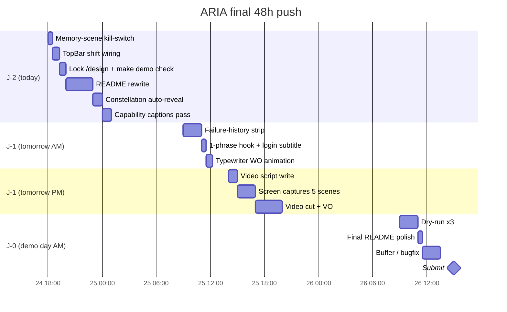

# ARIA Win Plan — J-2 Strategic Audit & Battle Plan

> [!IMPORTANT]
> Written 2026-04-24 (J-2 before submission).
> Companion to [M9-frontend-pre-demo-audit.md](../../audits/M9-frontend-pre-demo-audit.md)
> and [competitive-analysis-vs-crossbeam.md](./competitive-analysis-vs-crossbeam.md).
>
**The pre-demo audit is now stale** on ~70% of its Tier 1 items. This document is
> the ground-truth replacement: what the frontend actually ships today, where the
> real remaining gaps are, and where the last 48h of effort needs to land to beat
> CrossBeam's format on the 4 Anthropic scoring criteria.
> 
---

## 0. TL;DR — if you read one paragraph

You are **not** feature-behind CrossBeam. You are *pitch-legibility-behind*. The
artifact bundle shipped, the onboarding wizard shipped, the Agent Constellation
shipped and is better than anything CrossBeam has. What's missing is the stuff
CrossBeam obsessed over in its last 72h: a **signature visual identity**, a
**README/landing page that pitches the tech to a judge in 90 seconds**, a
**1-phrase hook**, a **reliable demo-trigger kill-switch for the memory scene**,
and a **video narrative** that makes the multi-agent story readable at 1× speed.
The 48-hour plan below is built around that diagnosis.

[!TIP]
> If only one thing ships from this plan, ship the **README rewrite + memory-scene
> kill-switch + 1-phrase hook**. Those three items are individually small and
> collectively move the needle on *Demo* (25%) and *Opus 4.7 Use* (25%) more
> than any remaining UI feature work.
> 
---

## 1. Ground-truth state — what the pre-demo audit got wrong

The [M9-frontend-pre-demo-audit](../../audits/M9-frontend-pre-demo-audit.md) was
written against a ~J-5 snapshot. Between then and now the frontend has shipped:

| Audit item                           | Audit status  | **Reality at J-2**                                                                                                                                                        | Quality |
|--------------------------------------|---------------|---------------------------------------------------------------------------------------------------------------------------------------------------------------------------|---------|
| Artifact bundle (6 "placeholders")   | P0 blocking   | **Shipped.** All 6 are real — `AlertBanner` 73 LOC, `BarChart` 105, `DiagnosticCard` 142, `KbProgress` 109, `PatternMatch` 97, `WorkOrderCard` 116.                       | 4.5/5   |
| Onboarding multi-turn wizard (M8.6)  | P0 blocking   | **Shipped.** `OnboardingWizard.tsx` + `MultiTurnDialog.tsx`: upload → parsing → 4-turn Q&A → calibrated KB reveal. End-to-end wired to `/kb/equipment/{id}/onboarding/*`. | 5/5     |
| Anomaly banner real-time             | Tier 1 — open | **Shipped** (was stale in audit too).                                                                                                                                     | 4/5     |
| Activity Feed (M8.4)                 | Tier 2        | **Shipped** — 312 LOC, filters, handoff sweep.                                                                                                                            | 4/5     |
| Quick-prompt chips                   | Tier 2 — open | **Shipped** — equipment-scoped in `QuickPrompts.tsx`.                                                                                                                     | 4/5     |
| Inline handoff cards in chat         | Tier 2 — open | **Shipped** — `HandoffRow` in `Message.tsx`.                                                                                                                              | 4/5     |
| "ARIA is investigating…" hint        | Tier 2 — open | **Shipped** — under user bubbles.                                                                                                                                         | 4/5     |
| Agent Constellation (wow-factor #1)  | Not in audit  | **Shipped and excellent** — `AgentConstellation.tsx`, 877 LOC, SVG orbital layout, handoff particles, tool-call rail, focus-agent thinking trail. Hotkey `A`.             | 5/5     |
| PrintableWorkOrder hardened          | Tier 3        | **Shipped** — React Portal, multi-page print CSS, dedup logic.                                                                                                            | 4/5     |
| TopBar `/shifts/current` integration | Tier 1 — open | **Still broken.** Local `Date.getHours()` in `TopBar.tsx`.                                                                                                                | 1/5     |
| Memory-scene kill-switch             | Tier 1 — open | **Partial/wrong.** `DemoReplayButton` replays Investigator on an existing WO; it does **not** call `POST /demo/trigger-memory-scene`.                                     | 2/5     |
| Failure-history strip on WO detail   | Tier 2 — open | **Missing.** `WorkOrderDetail.tsx` renders RCA/actions/parts but never surfaces "3 similar incidents".                                                                    | 0/5     |

### Net read

- **Demo-blocking gaps: zero.** You can run the 5-scene narrative end-to-end in the UI today.
- **Judge-visible gaps: three small** (TopBar shift, memory-scene trigger, failure-history strip).
- **Pitch-legibility gaps: large.** This is where you actually lose against CrossBeam — see §3.

[!NOTE]
> **`AgentConstellation` deserves its own callout.** It is the single most
> distinctive piece of UI in the project and has no equivalent in CrossBeam.
> It renders 5 Managed Agents as an orbital constellation with live handoff
> particles, per-agent pulse on activity, a tool-call rail, a handoff rail,
> and a focus-agent live-thinking trail — all sourced from the existing
> activity feed and agent stream stores (zero new plumbing). It is mounted
> in `AppShell.tsx` as a modal triggered by hotkey `A` or a TopBar button.
> **This is your Magic Dirt. Everything else in the demo should be staged to
> lead *to* or *from* the constellation.**
> 
---

## 2. Where you actually stand on each Anthropic criterion

Updated from the competitive analysis, incorporating the ground-truth state.

### Impact — 30%

Unchanged from the previous analysis. *Match nul* vs CrossBeam. CrossBeam wins
on "exec demain", ARIA wins on "taille de marché". Judge-dependent. **Leverage
available: low — don't spend effort here.**

### Demo — 25%

Previous analysis: "CrossBeam mène aujourd'hui. Plan 48h rend la course serrée."
**Reality at J-2: the course is serré.** Constellation + real artifacts + wired
onboarding flow is now better than CrossBeam's demo surface in pure technical
amplitude. But CrossBeam still wins on:

- **Signature visual identity** (sky→earth gradient hero, isometric ADU buildings,
  topographic contour lines, Playfair Display typography)
- **3-minute video** (Mayor Connor on camera, real contractor Cameron, music,
  narrative pacing, Remotion compositions, B-roll)
- **1-phrase pitch** ("Upload corrections letter, get response package")
- **Pre-loaded demo paths** (Showcase mode = instant, Run Live = full pipeline —
  solves the "demo timeout" problem)

**Leverage available: high.** §4 and §5 target exactly these items.

### Opus 4.7 Use — 25% — THE MOST EXPLOITABLE CRITERION

You dominate this in capability. You lose it in **visibility**. Capabilities
that ARIA ships but are invisible to a judge in 3 minutes:

| Capability                                                   | Judge-visible today?                                                         |
|--------------------------------------------------------------|------------------------------------------------------------------------------|
| 5 Managed Agents (Sentinel/Investigator/KB-Builder/WO/QA)    | **Yes** — Constellation. But caption never says "Managed Agents".            |
| MCP server with 17 tools                                     | **No.** Tool calls render in Inspector/Constellation but MCP is never named. |
| `thinking_delta` streaming (Opus 4.7 extended thinking)      | **Yes** — Inspector. But not called out as "extended thinking budget".       |
| 1M context window for full manuals + KB history              | **No.** Never mentioned.                                                     |
| Session persistence via `work_order.investigator_session_id` | **No.** No "Continue Investigation" button.                                  |
| Generative UI `ui_render` contract                           | **Partial.** Cards render; the "LLM *wrote* this card" story is invisible.   |
| Failure-history memory injection                             | **Partial.** Scene exists; no trigger button; never rendered on WO detail.   |
| Breach windowing (240× token compression)                    | **No.** Never surfaced.                                                      |

**Leverage available: very high.** Most of these are caption-level fixes
(30-90 min each) — add a sur-titled chip, a tooltip, a README line. §5 covers this.

### Depth & Execution — 20%

You already win this. 86 routes, 13 modules, 200+ tests, 5 ADRs, 5 audit docs.
What's missing is **making the depth visible at the repo-entry point**. A judge
who opens GitHub must see the numbers in the first 30 seconds.

**Leverage available: medium.** One README rewrite closes it.

---

## 3. The real diagnosis — why you feel you can't win

Your intuition is correct but the diagnosis is wrong. You are not behind on
features. You are behind on **the three layers CrossBeam obsessed over in its
last 72h**:

### Layer 1 — Signature visual identity

CrossBeam has a DESIGN-BIBLE document specifying HSL channels, shadow stacks,
easing curves, and font pairings. It has a sky→earth gradient hero. It has 16
keyed isometric ADU buildings randomized per session. It has topographic
contour lines at 15% opacity in the background. It is *recognizable in a
screenshot*.

ARIA has operator-calm — correct for the product, but **nothing that makes a
thumbnail pop**. The Constellation is the candidate signature, but it's behind
a hotkey.

### Layer 2 — Pitch legibility in 30 seconds

CrossBeam's README opens with a one-line pitch and a numbered "28 Files, Not
One Prompt" architecture section. A judge scrolling GitHub gets the tech story
in 30 seconds.

ARIA's frontend audit is deep and honest but buried in `docs/audits/`. The
root README doesn't headline "5 Managed Agents, MCP server, 1M context,
extended thinking visible live." A judge opening the repo has to guess what's
impressive.

### Layer 3 — Narrative / video

CrossBeam shot Mayor Connor + contractor Cameron, cut them with Remotion, scored
with beach reggae. The video is the pitch.

ARIA has no video assets, no 1-phrase hook, no B-roll. The demo is "trust the
product walk-through." That's the biggest risk — *a judge who misses a scene
loses the whole story*.

---

## 4. 48-hour battle plan — ranked by impact-per-hour

[!IMPORTANT]
> Tier 0 is non-negotiable. Tier 1 is what separates 3rd place from 1st.
> Tier 2 is polish. Tier 3 is stretch.
> 
### Tier 0 — Must ship (≤ 4 hours total)

Small, high-leverage closers for the remaining judge-visible gaps.

| #   | Item                                                                                                                                                                                          | Effort | Why it matters                                                                                                                                                                 |
|-----|-----------------------------------------------------------------------------------------------------------------------------------------------------------------------------------------------|--------|--------------------------------------------------------------------------------------------------------------------------------------------------------------------------------|
| 0.1 | **Memory-scene kill-switch.** Clone `DemoReplayButton` → call `POST /demo/trigger-memory-scene`. Mount next to constellation button or in TopBar. Label it "Trigger recurring-failure scene". | 30 min | Guarantees Scene 5 fires during the live demo even if the natural anomaly doesn't match. This is the strongest *Opus 4.7 Use* beat ("ARIA recognised this from 3 months ago"). |
| 0.2 | **TopBar `/shifts/current` wiring.** Fetch on mount, display operator name + actual shift.                                                                                                    | 45 min | Removes the "fake data above the brand" smell. Cheap credibility signal.                                                                                                       |
| 0.3 | **Lock or delete `/design` route.** Audit flagged: publicly accessible design playground.                                                                                                     | 10 min | Removes an embarrassment risk.                                                                                                                                                 |
| 0.4 | **Failure-history strip on `WorkOrderDetail`.** Fetch from WO payload or `/kb/failures?cell_id=X`, render 2-3 mini-cards "Similar incidents (similarity %, date, RCA excerpt)".               | 2-3 h  | Makes the memory claim tangible on a permanent surface, not just during Scene 5. Repeat-viewable.                                                                              |
| 0.5 | **`make demo` single-command.** Verify `docker-compose up` + seed + auto-open URL works from a clean checkout in under 60s. Document in README.                                               | 30 min | Matches CrossBeam's `bash setup-demo.sh` reproducibility signal. Also a pre-demo safety net if the laptop dies.                                                                |

### Tier 1 — Decides whether you win (6-10 h total)

This is the layer the user currently feels they're losing on. These items do
not add features — they make the features you already have **legible**.

#### 1.1 — Root README rewrite (2-3 h)

Today the top of the repo does not pitch the project. CrossBeam's does. Target
structure:

```markdown
# ARIA — Maintenance copilot for industrial operators

Onboard a pump in 2 minutes, get a maintenance copilot for life.
> 
[hero GIF of Agent Constellation with 2 handoffs firing]

## What this is
One paragraph: pain point (calibration 6-18 months, $500k-$2M),
user (operator in Guedila), outcome (live monitoring after 2 min).

## How it works — 5 Managed Agents + MCP
- Sentinel watches live signals and spawns investigations
- Investigator runs extended thinking on anomalies (Opus 4.7, 10k token budget)
- KB Builder extracts equipment profiles from manuals (vision, 1M context)
- Work Order Generator writes printable work orders from RCAs
- QA answers operator questions with KB-grounded citations

[architecture diagram — backend module map]

## Opus 4.7 capabilities on display
- Extended thinking streamed live (Inspector panel, `thinking_delta`)
- Managed Agents with session persistence (`investigator_session_id`)
- 1M context window (full PDF manuals + KB history)
- MCP server — 17 tools (signals, KB, logbook, shifts, KPIs)
- Generative UI — 9 artifact types rendered from `ui_render` frames

## Run it locally
make demo

## Numbers
86 REST routes • 13 backend modules • 200+ tests • 5 ADRs • 5 agents

## Docs
- [Architecture](docs/architecture/)
- [Audit trail](docs/audits/)  ← include M5.5 / M9 as craft signal
- [Demo script](docs/planning/M9-polish-e2e/)
```

Two rules:
- Exhibit the 5 agents + MCP the way CrossBeam exhibits its 4 skills.
- Link the audits — the fact that you audit your own work is a depth signal.

#### 1.2 — Constellation as the first thing a judge sees (1-2 h)

Right now the Constellation is hidden behind hotkey `A`. Options:

- **Option A** (preferred) — on the `/control-room` page, open the constellation
  automatically for 4 seconds on first mount, then collapse into a badge in the
  TopBar. A judge arriving at the control room *sees* the signature visual
  before they do anything else.
- **Option B** — mount a live constellation preview (small, read-only) in the
  TopBar always. Click to expand.
- **Option C** — sur-title the constellation: "5 Managed Agents, 3 handoffs in
  the last 10 minutes, 42 tool calls this session." Say the words "Managed
  Agents" and "MCP" in the UI itself.

All three are compatible. Ship A + C.

#### 1.3 — 1-phrase hook validated + placed (30 min)

Candidates from the competitive analysis + extrapolation:

- "Onboard a pump in 2 minutes, get a maintenance copilot for life."
- "From PDF manual to live monitoring in 2 minutes."
- "Predictive maintenance for the 95% of plants that can't afford a data team."

Pick one. Place it in:
- Root README H1/H2
- Login page subtitle
- Video thumbnail

#### 1.4 — Caption the capabilities in-UI (1-2 h)

Cheap, enormous payoff on Opus 4.7 Use:

| Surface                  | Current caption            | Change to                                                         |
|--------------------------|----------------------------|-------------------------------------------------------------------|
| Agent Inspector          | "Agent reasoning trace"    | "Extended thinking — Opus 4.7, streamed via `thinking_delta`"     |
| Constellation sur-title  | (none)                     | "5 Managed Agents • MCP server • 17 tools"                        |
| `EquipmentKbCard` header | "Equipment knowledge base" | "KB built from PDF manual in [X]s • Opus 4.7 vision + 1M context" |
| Work Order card          | "Work order"               | "Work order — generated by Opus 4.7 from investigator RCA"        |
| Pattern Match card       | "Pattern match"            | "Memory hit — recognised from failure on [past date]"             |

None of these are "hype" — they're true statements of what the backend does,
previously hidden.

#### 1.5 — 3-minute demo video scaffold (3-4 h)

You don't need Remotion or interviews. You need:
- **Scripted voice-over** (write it, don't wing it).
- **Screen capture of the 5 scenes**, stitched in order.
- **One cinematic moment**: the Constellation zoom at 0:30.
- **Printable work order at 2:45** as the output-tangible climax (CrossBeam's PDF equivalent).
- **Title cards** between scenes.
- **A soft background track** (no beach reggae required — something ambient).

Tools: OBS for capture, DaVinci Resolve (free) for cut, Auphonic or Whisper for
voice cleanup. One evening = one usable video.

[!WARNING]
> Do not shoot Mayor-Connor-style interviews unless you already have access.
> Faking authenticity is worse than not attempting it.
> 
### Tier 2 — Polish that lifts score without risk (2-4 h)

| #   | Item                                                                                                                                                                                          | Effort | Criterion leverage |
|-----|-----------------------------------------------------------------------------------------------------------------------------------------------------------------------------------------------|--------|--------------------|
| 2.1 | **Typewriter animation on Work Order generation.** Stream the actions list char-by-char for 2s. Cheap "generative UI made visible".                                                           | 45 min | Opus 4.7 Use       |
| 2.2 | **"Continue Investigation" button** on a past WO detail that calls the persisted `investigator_session_id`. Demonstrates Managed Agents session depth.                                        | 1-2 h  | Opus 4.7 Use       |
| 2.3 | **Equipment-scope chip on user chat bubbles.** Small — shows ARIA knows what the user is asking *about*.                                                                                      | 30 min | Demo               |
| 2.4 | **KB confidence score visualisation** (0.40 → 0.85 arc on reveal). Visual proof of onboarding impact.                                                                                         | 1 h    | Demo               |
| 2.5 | **Constellation screenshot as GitHub social image.** Render once, set as the repo's OG image.                                                                                                 | 20 min | First-impression   |
| 2.6 | **Typography + visual signature pass.** Not a full redesign — one accent (e.g. an SVG topographic layer at 8% opacity on the control-room background, signature font on the "ARIA" wordmark). | 2 h    | Demo               |

### Tier 3 — Stretch (only if Tier 0-2 complete)

- 3-4 B-roll plates of Guedila station (stock, or AI-generated, labelled honestly)
- Dark↔light theme switch mid-demo
- Sound: single anomaly chime + WO-ready chime
- Repo "numbers" dashboard (LOC, tests, routes, etc.) rendered from a script

### Tier 4 — Skip

All still valid from the original audit: hierarchy/mapping CRUD, logbook console, production-stats, KPI history, auth refresh.

---

## 5. Execution timeline



Total Tier 0+1 effort: ~16-20h. Fits comfortably in 48h with buffer for the
inevitable Docker/WebSocket/Supabase regression.

---

## 6. What *not* to do in the next 48h

[!CAUTION]
> Each of these is tempting and each of them is a trap given the time left.
> 
1. **Do not redesign the control-room layout.** It works. Touching grid breakpoints
   at J-2 guarantees a regression.
2. **Do not add a new agent / new MCP tool / new scene.** Five agents is already
   one more than judges can hold in their head. More is worse.
3. **Do not chase mobile/responsive.** CrossBeam didn't. Demo is desktop.
4. **Do not rewrite the chat panel.** It's good enough. Captions > redesign.
5. **Do not try to shoot "authentic" interview footage you don't already have.**
   Judges can tell. A confident solo voice-over beats a rushed interview.
6. **Do not over-automate the video.** A screen capture + clean voice-over + 3
   title cards is strictly better than a half-finished Remotion pipeline.
7. **Do not delete the audit trail.** `docs/audits/M9-frontend-pre-demo-audit.md`
   being stale is *a feature* — it proves you ship faster than you can
   re-document.

---

## 7. Risk register — J-2

| Risk                                               | Probability | Mitigation                                                              |
|----------------------------------------------------|-------------|-------------------------------------------------------------------------|
| WebSocket reconnect flakes during live demo        | Medium      | Pre-loaded "replay" paths + memory-scene kill-switch (Tier 0.1).        |
| Constellation hotkey missed by judge               | High        | Auto-reveal on control-room mount (Tier 1.2).                           |
| Judge doesn't notice "Managed Agents" / "MCP" used | High        | Caption pass (Tier 1.4) + README headline (Tier 1.1).                   |
| Video not ready by J-0                             | Medium      | Script first, record second, cut third — abandonable at any stage.      |
| Docker-compose fails on reviewer's laptop          | Low-Medium  | `make demo` verification (Tier 0.5) + fallback hosted demo URL.         |
| Operator name / shift shown as fake                | Certain     | Tier 0.2.                                                               |
| `/design` playground publicly accessible           | Certain     | Tier 0.3.                                                               |
| "Why is this better than CrossBeam?" question live | Medium      | Memorised 30-sec answer: *live streaming, managed agents, MCP, memory*. |

---

## 8. The 30-second self-pitch (memorise)

ARIA is a maintenance copilot for industrial operators. You upload the PDF
> manual of a pump, answer three questions, and in two minutes you have a live
> monitoring agent on that pump — with extended thinking, a memory of past
> failures, and printable work orders. Under the hood it's five Managed Agents
> talking over an MCP server with 17 tools, using Opus 4.7's 1M context window
> to hold the full manual and the equipment's history. The agents are visible
> in real time as a constellation on screen — every handoff, every tool call,
> every thinking step.
> 
If you can say this in 30 seconds in front of a camera, you have the pitch.

---

## 9. Success criteria for this plan

By end of J-1 you should be able to say **yes** to all of the following:

- [ ] A judge opening the GitHub repo sees "5 Managed Agents + MCP + 1M context" in the first screen of the README.
- [ ] A judge running `make demo` sees the product working end-to-end in under 60 seconds.
- [ ] A judge who watches only the first 30 seconds of the video sees the Constellation.
- [ ] A judge who watches only the last 30 seconds of the video sees the printable work order.
- [ ] Every Opus 4.7 capability the backend uses is named in at least one caption in the UI.
- [ ] The memory-scene demo beat can be triggered by a single button click.
- [ ] There is nothing in the UI that says "Shift B" on a fake local clock.
- [ ] The `/design` playground is not publicly accessible.
- [ ] There is a 1-phrase hook appearing in at least three surfaces (README, login, video thumbnail).

---

## 10. References

- [Pre-demo frontend audit (stale on ~70% of Tier 1)](../../audits/M9-frontend-pre-demo-audit.md)
- [Competitive analysis vs CrossBeam](./competitive-analysis-vs-crossbeam.md)
- [Wow-factor ideas](./wow-factor-ideas.md)
- [Backend architecture docs](../../architecture/)
- [Hackathon rules](../../hackathon/rules.md)
- [CrossBeam winner repo (local clone)](../../../../cc-crossbeam/)

---

[!TIP]
> The pre-demo audit ended with "if only one item ships, make it the artifact
> bundle". That advice was correct then and it has been followed — the bundle
> is shipped.
> **This plan's single-item version is: ship the README rewrite.** It is the
>
difference between a judge who sees "another hackathon project" and a judge
> who sees "Opus 4.7 used in every way the platform supports". You already
> built the second one. Now name it on the door.
