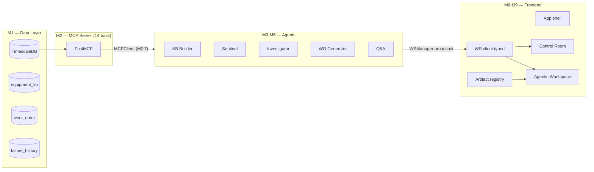
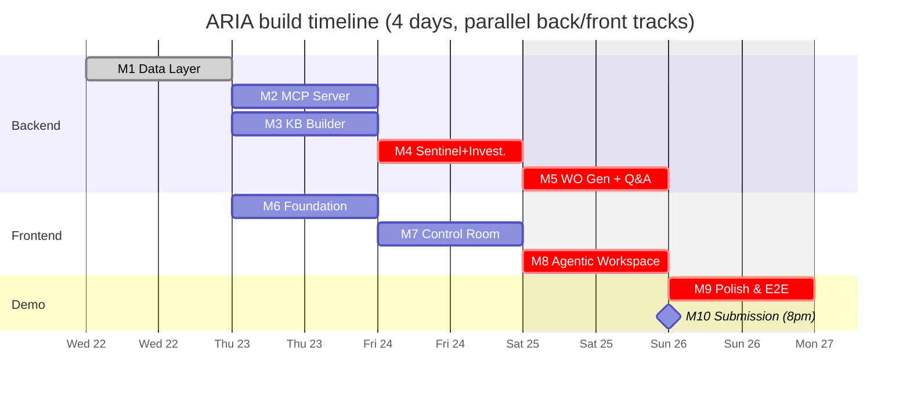
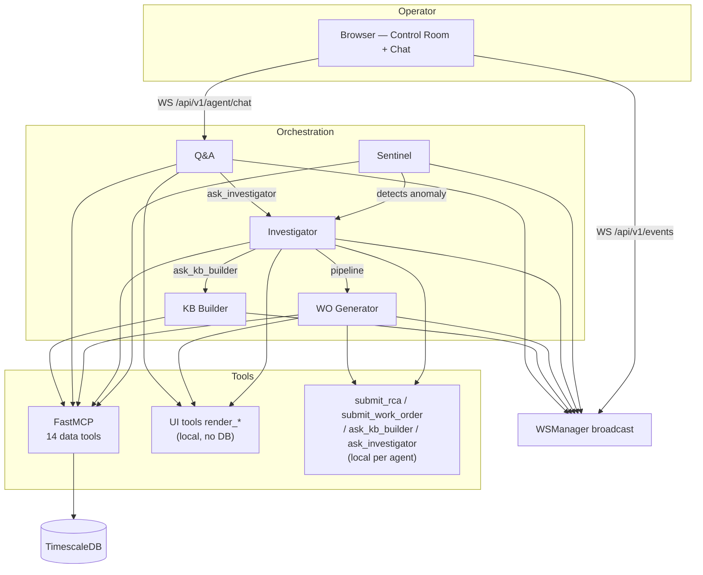
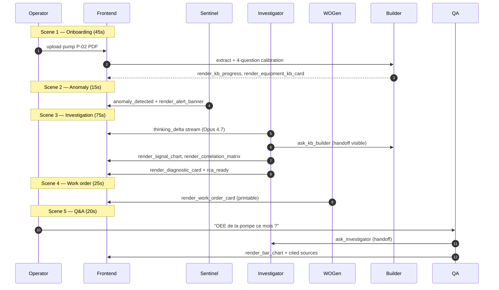

# ARIA — Roadmap

> [!IMPORTANT]
> **Hackathon: Built with Opus 4.7** — Apr 21–28, 2026
> **Submission deadline: Sunday Apr 26, 8pm EST**
> **Today: Wed Apr 22 (Day 2)** — ~4.5 build days remaining
> **Project board:** [zestones/projects/28](https://github.com/users/zestones/projects/28)
> **Planning sources:** [`docs/planning/`](./docs/planning/)

ARIA is an agentic predictive‑maintenance platform for industrial operators. A multi‑agent system (KB Builder, Sentinel, Investigator, Work Order Generator, Q&A) consumes time‑series signals + a structured equipment knowledge base, detects anomalies, runs Root Cause Analysis with extended thinking on Opus 4.7, and emits generative‑UI artifacts (charts, diagnostic cards, work orders) directly into the operator's chat.

---

## Big picture

---

## Timeline

> [!WARNING]
> Critical path runs M4 → M5 → M9. If M4 (Investigator loop) slips, demo Scene 3
> breaks. Frontend track (M6-M8) can absorb a half-day delay using the chat WS
> mock from M6.5.

---

## Milestones

| #   | Milestone                                                                     | Issues                                                   | Target      | Critical |
|-----|-------------------------------------------------------------------------------|----------------------------------------------------------|-------------|----------|
| M1  | [Data Layer](./docs/planning/M1-data-layer/issues.md)                         | [#2-#7](https://github.com/zestones/ARIA/milestone/1)    | Wed Apr 22  | yes      |
| M2  | [MCP Server](./docs/planning/M2-mcp-server/issues.md)                         | [#8-#16](https://github.com/zestones/ARIA/milestone/2)   | Thu Apr 23  | yes      |
| M3  | [KB Builder Agent](./docs/planning/M3-kb-builder/issues.md)                   | [#17-#22](https://github.com/zestones/ARIA/milestone/3)  | Thu Apr 23  | —        |
| M4  | [Sentinel + Investigator](./docs/planning/M4-sentinel-investigator/issues.md) | [#23-#29](https://github.com/zestones/ARIA/milestone/4)  | Fri Apr 24  | yes      |
| M5  | [WO Generator + Q&A](./docs/planning/M5-workorder-qa/issues.md)               | [#30-#33](https://github.com/zestones/ARIA/milestone/5)  | Sat Apr 25  | yes      |
| M6  | [Frontend Foundation](./docs/planning/M6-frontend-foundation/issues.md)       | [#34-#39](https://github.com/zestones/ARIA/milestone/6)  | Thu Apr 23  | yes      |
| M7  | [Control Room](./docs/planning/M7-control-room/issues.md)                     | [#40-#44](https://github.com/zestones/ARIA/milestone/7)  | Fri Apr 24  | —        |
| M8  | [Agentic Workspace](./docs/planning/M8-agentic-workspace/issues.md)           | [#45-#50](https://github.com/zestones/ARIA/milestone/8)  | Sat Apr 25  | yes      |
| M9  | [Polish & E2E](./docs/planning/M9-polish-e2e/issues.md)                       | [#51-#54](https://github.com/zestones/ARIA/milestone/9)  | Sun Apr 26  | yes      |
| M10 | [Submission](./docs/planning/M10-submission/issues.md)                        | [#55-#57](https://github.com/zestones/ARIA/milestone/10) | Sun 8pm EST | yes      |

---

## Scope per milestone

### M1 — Data Layer (Wed)
Migration `007` adds the columns the agents need (`equipment_kb.structured_data`,
`work_order.recommended_actions`, `failure_history.signal_patterns`). Pydantic
schemas mirror the JSON columns. **Blocks everything.**

### M2 — MCP Server (Thu)
`FastMCP("aria-tools")` mounted in‑process at `/mcp` exposes 14 data tools
(KPI, signals, human context, KB, production). `MCPClient` singleton is the
only caller agents talk to. M2.9 adds 9 `render_*` UI tools (no DB hit, just a
schema the LLM can emit → broadcast via WS).

### M3 — KB Builder Agent (Thu)
Opus 4.7 vision extracts a structured KB JSON from a manufacturer PDF, then a
4‑question onboarding session calibrates per‑signal thresholds with the
operator. Also exposed as a callable agent via `ask_kb_builder` (M4.6).

### M4 — Sentinel + Investigator (Fri) — **critical**
- Sentinel: 30‑second loop, queries DB, opens a `work_order(status='detected')`
  on threshold breach.
- Investigator: free agent loop with all MCP tools + `submit_rca`
  + `ask_kb_builder` + UI tools, **extended thinking enabled** (Opus 4.7 wow
  factor). Persists RCA + `failure_history`.

### M5 — WO Generator + Q&A (Sat) — **critical**
- WO Generator: takes RCA → produces `recommended_actions[]` + `parts_required[]`
  + a printable Work Order Card.
- Q&A: WS endpoint with same tool set + `ask_investigator`. M5.4 swaps the
  Messages‑API loop for **Claude Managed Agents** (prize‑eligible path,
  feature‑flagged so we can fall back instantly).

### M6 — Frontend Foundation (Thu) — parallel track
React/Vite app shell, design system tokens, **typed WS client** with
`EventBusMap` + `ChatMap` (factory + reconnect), chat shell wired to a WS mock,
PDF upload shell.

### M7 — Control Room (Fri)
Animated SVG P&ID, live KPI bar (OEE/MTBF/MTTR/anomalies 24h), real‑time
anomaly banner, ChatPanel wired to the real `WS /api/v1/agent/chat`,
**Artifact Registry + Dispatcher** (the Generative‑UI seam).

### M8 — Agentic Workspace (Sat) — **critical**
React components for every `render_*` tool: `SignalChart` (line + anomaly
marker), `EquipmentKbCard` with inline‑editable thresholds, the
WorkOrderCard / DiagnosticCard / CorrelationMatrix / PatternMatch / BarChart
/ AlertBanner / KbProgress bundle, Agent Activity Feed, **Agent Inspector**
with live `thinking_delta` stream, Onboarding Wizard.

### M9 — Polish & E2E (Sun morning)
Work Orders console (list + detail + printable), motion polish pass, memory
flex scene UI, **scripted P‑02 demo rehearsal** (5 scenes, 3 min).

### M10 — Submission (Sun 8pm EST)
README + DEMO.md final polish, 3‑minute demo video, submission package on
the CV platform.

---

## Agent topology

---

## Demo flow (P‑02 scenario, 5 scenes / 3 min)

---

## Prize alignment

> [!NOTE]
> **Best Use of Opus 4.7** — Investigator runs with `thinking={budget:10000}`,
> visible live in the Agent Inspector (M8.5). No other model can do this.

> [!NOTE]
> **Best Use of Managed Agents** — Q&A built on Claude Managed Agents (M5.4).
> Dynamic handoffs via `ask_*` tools (M4.6) prove agentic delegation isn't a
> Python `if` chain.

> [!TIP]
> **Wow factor** — every agent can render its own UI inline (`render_*` tools,
> M2.9 + M7.5 + M8). Pattern is Generative UI / Claude artifacts inside the chat.

---

## Project board fields

The [GitHub project](https://github.com/users/zestones/projects/28) tracks each
issue with **Status**, **Priority**, **Size**, and **Target Date**. Critical
foundations (M1, M2.1/2.5/2.7/2.9, M4 entirely, M5.1/5.2, M6.4, M7.4/7.5,
M8.1, M9.4, all of M10) are flagged **Urgent**.
