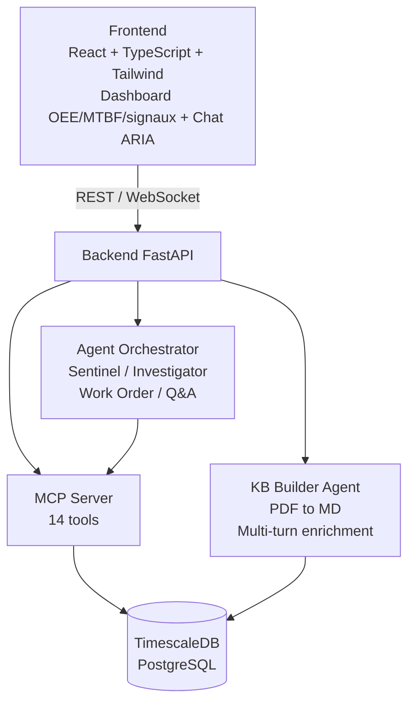
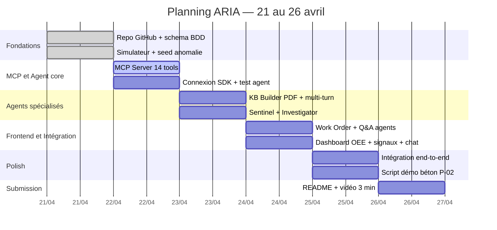

# ARIA — Adaptive Runtime Intelligence for Industrial Assets

**Hackathon "Built with Opus 4.7" — Project Specification**
Auteur : Zestones | Date : 21 avril 2026 | Deadline : 26 avril 2026 20h EST

---

## 1. Le Problème Réel

Le marché de la maintenance prédictive industrielle existe depuis 10 ans. Augury, SparkCognition, IBM Maximo Watson — ils font tous "anomalie → RCA → work order". Alors pourquoi 95% des sites industriels dans le monde ne l'utilisent pas ?

**Parce que le vrai problème n'est pas la détection. C'est la configuration.**

Déployer un système prédictif classique coûte $500k–$2M et nécessite 6 à 18 mois de data scientists pour calibrer les seuils machine par machine. Pour une station de traitement d'eau en Algérie, c'est inaccessible.

Il y a un deuxième problème, invisible et non adressé : **la connaissance opérationnelle est dans les têtes des techniciens seniors.** Les seuils réels d'une pompe Grundfos CR 32-120 dans une installation à 40°C ambiante ne sont pas dans le manuel constructeur — ils sont dans la mémoire du technicien qui la surveille depuis 12 ans. Quand il part à la retraite, cette connaissance disparaît.

> [!IMPORTANT]
> L'angle innovant d'ARIA n'est pas "faire du prédictif" — c'est **supprimer la barrière d'entrée** qui empêche 95% des sites industriels d'y accéder. Au lieu d'un projet de 18 mois, ARIA onboarde un équipement en 2 heures via un PDF et une conversation.

**Chiffres réels (secteur eau/utilités Algérie, client Guedila) :**

- Coût moyen d'un arrêt non planifié : 2 à 8 heures de production perdue
- 70% des pannes sont précédées de signaux détectables 48 à 72 heures avant
- Les techniciens seniors passent 40% de leur temps à transmettre leur connaissance oralement

---

## 2. La Solution : ARIA

> [!NOTE]
> **ARIA est un agent industriel qui construit sa propre base de connaissance à runtime, adaptée à chaque équipement, calibrée par les opérateurs eux-mêmes — sans data scientists, sans projet de déploiement.**

ARIA fusionne en continu deux types de connaissance qu'aucun système n'avait combinés :

1. **Connaissance documentaire** — extraite des manuels constructeurs via Opus 4.7 (vision haute résolution, 1M context)
2. **Connaissance opérationnelle** — capturée par dialogue multi-turn avec les techniciens, enrichie en permanence par les données temps réel

---

## 3. L'Innovation Core : Zero-Config Onboarding via Dynamic Knowledge Base

### Pourquoi les systèmes statiques ne fonctionnent pas dans l'industrie

Les systèmes RAG classiques encodent une base de connaissance fixe, universelle, invariante. Ça fonctionne quand la connaissance est la même pour tout le monde — le droit californien est identique pour tous.

Dans l'industrie, c'est l'inverse. Les seuils de vibration d'une pompe Grundfos CR 32-120 dans une station d'eau à 40°C ambiante ne sont pas les mêmes que la même pompe dans une usine agro-alimentaire à 15°C. Il n'existe pas de "seuil universel".

### Comment ARIA construit la Knowledge Base

**Étape 1 — Ingestion documentaire (Opus 4.7 Vision + 1M context)**

L'opérateur upload le manuel constructeur (PDF, jusqu'à 200 pages). Opus 4.7 lit l'intégralité du document en haute résolution — y compris les schémas techniques, courbes de performance, tableaux de tolérances — et génère une fiche équipement structurée.

**Étape 2 — Calibration par dialogue multi-turn**

```
ARIA : "J'ai lu le manuel de votre pompe Grundfos CR 32-120.
        Le constructeur donne un seuil vibration de 4.5 mm/s.
        Quelle est la valeur que vous observez normalement
        en régime nominal sur votre installation ?"

Opérateur : "En général on est autour de 2.1-2.4 mm/s"

ARIA : "Je note 2.8 mm/s comme seuil d'alerte (vs 4.5 constructeur).
        Avez-vous des pannes récurrentes sur cet équipement ?"

Opérateur : "Oui, 3 remplacements de roulement côté refoulement en 18 mois."

ARIA : "Intéressant. À quelle fréquence faites-vous les graissages préventifs ?"
```

**Étape 3 — Enrichissement continu par les données opérationnelles**

Une fois l'équipement "connu", la KB est enrichie en permanence par :
- Les signaux process temps réel (vibration, température, débit, pression)
- Les KPIs calculés (OEE, MTBF, MTTR, downtime)
- Les entrées logbook des opérateurs
- Les assignations de shift
- L'historique des work orders et pannes passées

La fiche équipement est persistée en base. Chaque nouvelle analyse la recharge comme contexte. **ARIA devient plus précis à chaque interaction.**

---

## 4. Architecture Système



---

## 5. Les Agents Spécialisés

### Agent 1 — KB Builder (Onboarding)

**Rôle :** Construit la connaissance d'un nouvel équipement à partir de zéro.
**Input :** PDF manuel constructeur + dialogue multi-turn avec l'opérateur.
**Output :** Fiche équipement structurée, seuils calibrés, procédures extraites, sauvegardés en base.
**Opus 4.7 :** Vision haute résolution pour lire les schémas techniques et courbes de performance. Fenêtre 1M tokens pour ingérer des manuels complets sans découpage.

### Agent 2 — Sentinel (Surveillance continue)

**Rôle :** Surveille les signaux process en continu, détecte les déviations par rapport aux seuils KB.
**Input :** Flux `process_signal_data` + seuils calibrés de la KB équipement.
**Output :** Événements d'anomalie avec score de confiance et contexte.
**Opus 4.7 :** Raisonnement sur séries temporelles longues pour distinguer dérive progressive vs spike ponctuel.

### Agent 3 — Investigator (Root Cause Analysis)

**Rôle :** Analyse une anomalie détectée et produit un diagnostic multi-source.
**Input :** Anomalie + KB équipement + historique `machine_status` + logbook + shifts + work orders passés.
**Output :** Diagnostic structuré avec causes probables classées par probabilité, pattern matching sur pannes similaires.
**Opus 4.7 :** Corrélation causale multi-source — raisonnement que seul un LLM avec large contexte peut faire en quelques secondes.

### Agent 4 — Work Order Generator

**Rôle :** Génère un work order actionnable et imprimable depuis le diagnostic de l'Investigator.
**Input :** RCA de l'Investigator + procédures de maintenance extraites de la KB.
**Output :** Work order structuré (équipement, priorité, actions étape par étape, références pièces, fenêtre d'intervention suggérée).
**Opus 4.7 :** Génère un document professionnel utilisable directement sur le terrain.

### Agent 5 — Q&A (Interface opérateur)

**Rôle :** Répond aux questions en langage naturel sur les données opérationnelles.
**Input :** Question utilisateur + accès aux 14 MCP tools + KB.
**Output :** Réponse contextualisée avec références aux données sources.

Exemples :
- "Quelle machine a causé le plus de downtime ce mois ?"
- "Est-ce que la qualité est corrélée avec la température du four ?"
- "Montre moi les patterns de signal avant les 3 dernières pannes de P-02."
- "Est-ce que les pannes arrivent plus souvent en shift de nuit ?"

---

## 6. MCP Server — 14 Tools

```python
# KPIs
get_oee(cell_ids, window_start, window_end)
get_mtbf(cell_ids, window_start, window_end)
get_mttr(cell_ids, window_start, window_end)
get_downtime_events(cell_ids, window_start, window_end, categories)

# Signaux process
get_signal_trends(signal_def_id, window, aggregation)
get_signal_anomalies(cell_id, window)        # déviation vs seuils KB

# Contexte humain
get_logbook_entries(cell_id, window)
get_shift_assignments(cell_id, date_range)
get_work_orders(cell_id, status, date_range)

# Knowledge Base
get_equipment_kb(cell_id)                   # fiche équipement complète
get_failure_history(cell_id)                # historique pannes + RCA passés
update_equipment_kb(cell_id, data)          # enrichissement par l'agent

# Production
get_quality_metrics(cell_ids, window)
get_production_stats(cell_ids, date_range)
```

---

## 7. Schéma BDD

```sql
-- Shifts
CREATE TABLE shift (
    id          serial PRIMARY KEY,
    name        varchar(50)  NOT NULL,   -- 'Matin', 'Après-midi', 'Nuit'
    start_hour  integer      NOT NULL,
    end_hour    integer      NOT NULL,
    site_id     integer REFERENCES site(id)
);

CREATE TABLE shift_assignment (
    id          serial PRIMARY KEY,
    shift_id    integer REFERENCES shift(id),
    operator_id integer REFERENCES users(id),
    cell_id     integer REFERENCES cell(id),
    date        date NOT NULL
);

-- Logbook opérateur
CREATE TABLE logbook_entry (
    id                   serial PRIMARY KEY,
    cell_id              integer REFERENCES cell(id),
    operator_id          integer REFERENCES users(id),
    time                 timestamptz NOT NULL DEFAULT NOW(),
    shift_id             integer REFERENCES shift(id),
    category             varchar(30) NOT NULL,  -- 'observation'|'incident'|'intervention'
    message              text NOT NULL,
    linked_status_event  timestamptz
);

-- Work Orders
CREATE TABLE work_order (
    id                    serial PRIMARY KEY,
    cell_id               integer REFERENCES cell(id),
    created_at            timestamptz NOT NULL DEFAULT NOW(),
    closed_at             timestamptz,
    priority              varchar(10) NOT NULL,  -- 'critical'|'high'|'medium'|'low'
    type                  varchar(20) NOT NULL,  -- 'corrective'|'preventive'
    title                 text NOT NULL,
    description           text,
    recommended_actions   jsonb,
    parts_required        jsonb,
    technician_id         integer REFERENCES users(id),
    generated_by_agent    boolean DEFAULT FALSE,
    trigger_anomaly_time  timestamptz,
    rca_summary           text
);

-- Knowledge Base équipements (générée dynamiquement par ARIA)
CREATE TABLE equipment_kb (
    id               serial PRIMARY KEY,
    cell_id          integer NOT NULL REFERENCES cell(id) UNIQUE,
    source_documents jsonb,
    structured_data  jsonb NOT NULL,
    raw_markdown     text,
    confidence_score float,
    last_enriched_at timestamptz,
    created_at       timestamptz DEFAULT NOW(),
    updated_at       timestamptz
);

-- Historique pannes et RCA
CREATE TABLE failure_history (
    id                   serial PRIMARY KEY,
    cell_id              integer REFERENCES cell(id),
    occurred_at          timestamptz NOT NULL,
    resolved_at          timestamptz,
    failure_type         text,
    root_cause           text,
    contributing_factors jsonb,
    work_order_id        integer REFERENCES work_order(id),
    signal_patterns      jsonb,
    created_at           timestamptz DEFAULT NOW()
);
```

---

## 8. Flow Démo (3 minutes)

### Scène 1 — Onboarding d'un équipement (45s)

> [!NOTE]
> "Voici ARIA. Je vais lui apprendre ma pompe en 2 minutes."

- Upload manuel Grundfos CR 32-120 (PDF)
- ARIA lit le manuel, extrait les specs et seuils constructeur
- ARIA pose 3 questions : régime nominal observé, historique pannes, fréquence maintenance
- L'opérateur répond en langage naturel
- Fiche équipement générée et affichée avec seuils calibrés

### Scène 2 — Détection anomalie en temps réel (45s)

> [!NOTE]
> "3 jours plus tard..."

- Dashboard live : OEE 74%, signaux normaux
- Vibration pompe P-02 monte de 2.2 mm/s à 3.4 mm/s
- Sentinel détecte le dépassement du seuil KB (2.8 mm/s vs 4.5 mm/s constructeur — la différence que seul l'opérateur connaissait)
- Alerte apparaît sur le dashboard

### Scène 3 — Investigation et RCA (45s)

- Investigator se déclenche automatiquement
- Corrèle : vibration anormale + logbook "bruit inhabituel" (shift nuit) + MTBF historique (dernier roulement remplacé il y a 1900h) + température palier +8°C vs normale
- Diagnostic : "Probable usure roulement côté refoulement — Confiance 87% — Pattern identique à la panne du 15 mars 2025"

### Scène 4 — Work Order généré (30s)

> [!TIP]
> Work order généré automatiquement, prêt à imprimer.

- Priorité : HIGH
- Action : Inspection roulement + remplacement préventif
- Pièce : 1x roulement 6205-2RS (référence extraite du manuel constructeur par ARIA)
- Fenêtre suggérée : prochain arrêt planifié dans 18h

### Scène 5 — Q&A (15s)

> "Est-ce que les pannes de P-02 arrivent plus souvent en shift de nuit ?"

"Oui. Sur les 8 derniers incidents, 6 ont débuté entre 22h et 06h. Le shift nuit a 2 opérateurs vs 4 en journée — je recommande une vérification de la procédure de surveillance nocturne."

---

## 9. Positionnement par critère de notation

| Critère               | Poids | Angle ARIA                                                                                                                                                                                                                    |
|-----------------------|-------|-------------------------------------------------------------------------------------------------------------------------------------------------------------------------------------------------------------------------------|
| **Impact**            | 30%   | Client réel (Guedila, eau/utilités Algérie). L'angle "barrière d'entrée" touche 95% des sites industriels mondiaux qui n'ont pas accès au prédictif faute de budget et de data scientists. Problème chiffrable immédiatement. |
| **Demo**              | 25%   | Flow end-to-end visuel et narratif : upload PDF → dialogue → anomalie live → RCA → work order imprimable. Chaque scène montre une capacité différente d'Opus 4.7. Pas un dashboard statique.                                  |
| **Opus 4.7 Use**      | 25%   | Vision haute résolution pour lire les schémas PDF. 1M context pour ingérer des manuels complets. Multi-turn pour capturer la connaissance opérationnelle. Raisonnement causal multi-source pour le RCA.                       |
| **Depth & Execution** | 20%   | Schéma ISA-95 étendu, MCP server 14 tools, 5 agents spécialisés orchestrés, KB persistante enrichie en continu. Architecture pensée de bout en bout.                                                                          |

> [!TIP]
> **"Keep Thinking" $5k** — *"real-world problem nobody thought to point Claude at"* : supprimer la barrière d'entrée du prédictif industriel via zero-config onboarding. Le marché existe depuis 10 ans, le problème d'accessibilité n'a jamais été adressé avec cette approche.

> [!NOTE]
> **"Best use of Managed Agents" $5k** — 5 agents spécialisés orchestrés avec handoff structuré : KB Builder → Sentinel → Investigator → Work Order Generator → Q&A.

---

## 10. Stack Technique

| Layer        | Tech                          | Justification                   |
|--------------|-------------------------------|---------------------------------|
| Frontend     | React + TypeScript + Tailwind | Connu, rapide                   |
| Backend      | FastAPI (Python)              | Connu, async natif              |
| Agent        | Anthropic SDK                 | Critère hackathon               |
| MCP          | `mcp` Python SDK              | Critère hackathon               |
| BDD          | TimescaleDB (PostgreSQL)      | Maîtrisé, time-series natif     |
| Data simulée | Script Python                 | Scénarios réalistes injectables |
| Infra        | Docker Compose                | Simple, reproductible           |

---

## 11. Plan Semaine



---

## 12. Written Summary (100-200 mots)

**ARIA — Adaptive Runtime Intelligence for Industrial Assets**

Predictive maintenance has existed for a decade. The technology works. Yet 95% of industrial sites worldwide don't use it — because deploying it costs $500k–$2M and requires 18 months of data scientists calibrating thresholds machine by machine. That's the real problem nobody solved.

ARIA removes that barrier entirely. Upload a manufacturer manual — Opus 4.7 reads it using high-resolution vision, extracts thresholds, failure patterns, and maintenance procedures. Then ARIA dialogues with the operator to calibrate those thresholds to the actual installation: the real vibration baseline of a pump running at 40°C in an Algerian water treatment plant, not the generic constructor spec.

From there, ARIA fuses everything continuously: real-time process signals, calculated KPIs (OEE, MTBF, MTTR), operator logbook entries, shift assignments, and maintenance history. When an anomaly emerges, the Investigator agent correlates across all sources to produce a root cause analysis — and generates a ready-to-print work order for the field technician.

Zero configuration. No data scientists. Two hours from manual upload to first prediction.

Built for a real water utility client in Algeria. The knowledge doesn't retire when the senior technician does.

---

*Document — 21 avril 2026 — Built with Opus 4.7 Hackathon*
